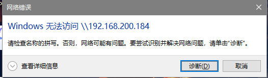

# samba 服务器的搭建和使用

https://blog.51cto.com/13866567/2296457
https://www.cnblogs.com/kevingrace/p/8662088.html

## 1.yum安装

yum是一个集与查找，安装，更新和删除程序的Linux软件。它运行在RPM包兼容的Linux发行版本上，如：RedHat、Fedora、SUSE、CentOS、Mandriva。

```
yum install -y samba
```

## 2.创建samba用户和组

```
groupadd -r team
useradd -s /sbin/mologin -G team dio
smbpasswd -a dio
useradd -s /sbin/nologin jojoo
smbpasswd -a jojoo
```
## 3.创建samba共享目录，并设置SElinux

```
mkdir /app
mkdir /app/smbtest   
```
创建共享文件目录
```
chgrp team /app/smbtest
setfacl -m g:team:rwx /app/smbtest/
setfacl -m u:jojoo:rwx /app/smbtest/
```
设置文件权限并且共享到组
```
chcon -Rt samba_share_t  /app/smbtest
```
设置samba 共享目录。

## 配置时注意！

>1、将SELinux设置成disabled或者permissive

```
setenforce 0   
```
>2、关闭防火墙服务
```
systemctl stop firewalld.service 
```
若SElinux啟用中，在Windows檔案總管無法連到 Samba 所分享出來的目錄時.

在Linux 中，可執行下列指令：
```
setsebool -P samba_enable_home_dirs on
```

## 4.配置samba文件


### ！备份已有配置！以免后面写错了不好改

>先取消[homes]、[printers]的项目，添加[temp]项目如下


```
mv /etc/samba/smb.conf /etc/samba/smb.conf.bkp
cp /etc/samba/smb.conf.bkp /etc/samba/smb.conf
```

修改 workgroup中 组的名称

workgroup = WORKGROUP   (WINDOWS默认组)

添加一个共享目录
```
[Public]   # 自定义共享名
```

```
      comment = Home Directories                 # 描述符，是给系统管理员看的
      path = /home/kevin                         # 共享的路径
      public = yes                               # 是否公开，也就是是否能在网上邻居看到该共享
      browseable = yes                           # 共享的目录是否让所有人可见
      writable = yes                             # 是否可写
      guest ok = no                              # 是否拒绝匿名访问，仅当安全级别为 share 时才生效
      workgroup = WORKGROUP                      # 工作组，要设置成跟 Windows 的工作组一致
      server string = Samba Server Version %v    # 其他 Linux 主机查看共享时的提示符
      netbios name = MYSERVER                    # 用于在 Windows 网上邻居上显示的主机名
      hosts allow = 127. 192.168.12. 192.168.13. EXCEPT 192.168.13.13       # 指定允许访问 samba 服务器的主机   
      security = share                           # 定义安全级别
      log file = /var/log/samba/log.%m           # 定义日志文件，每个访问的主机会产生独立的日志文件，%m 是客户端主机名
      max log size = 50                          # 定义单个日志的最大容量（KB）
      passdb backend = tdbsam                    # Samba 用户的存储方式，smbpasswd 表示明文存储，tdbsam 表示密文存储
      deadtime = 10                              # 客户端在10分钟内没有打开任何 Samba 资源，服务器将自动关闭会话，在大量的并发访问环境中，这样的设置可以提高服务器性能
      display charset = UTF8                     # 设置显示的字符集
      max connections = 0                        # 设置最大连接数，0表示无限制，如果超过最大连接数则拒绝连接
      guest account = nobody                     # 设置匿名账户为nobody
      load printers = yes                        # 是否在启动 Samba 时就共享打印机   
      cups options = raw                         # 设置打印机使用的方式
      valid users = user1 user2    user3         # 指定哪些用户可以访问，如果不指定则所有用户都可访问
      invalid users = user1 user2                # 指定哪些用户不可以访问
      create mask = 0775                         # 客户端上传文件的默认权限
      directory mask = 0775                      # 客户端创建目录的默认权限
      write list = user1 user2 user3             # 设置可对文件进行写操作的用户
      admin users = user1                        # 设置共享目录的管理员，具有完全权限
```

注意：在samba4中 share 和 server已经被禁用，需要用 security = user 和map to guest =Bad User来实现无密码访问目录

配置启动服务 重启相关服务
```
mkdir -p /data/share/public

systemctl enable smb.service

systemctl enable nmb.service

systemctl restart smb.service

systemctl restart nmb.service
```


## 设置防火墙

```
firewall-cmd -–permanent -–zone=public –-add-service=samba
```

## 登陆

>在windows中 win键+r 输入

```
\\ 目标ip
```


## 注意！

1. windows设置方面问题

问题：window能连接部分服务器的samba共享，一部分无法连接。报错如截图。



解决：前提---其他人连接都没有问题，发现有问题的连接服务器的电脑是win10，而win10可以连接到的服务器系统比较新，而不能连接的比较老。

服务器samba版本不一样，windows版本不同。

通过查阅win10默认关闭了 SMB 1.0/CIFS File Sharing Support 的功能。打开后有可能解决问题。


