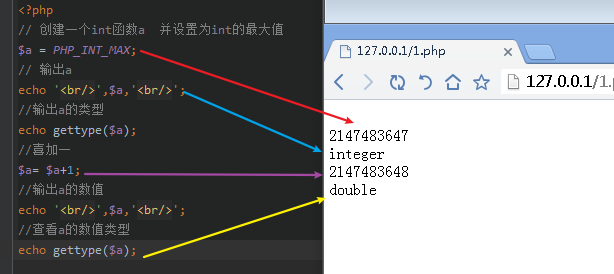
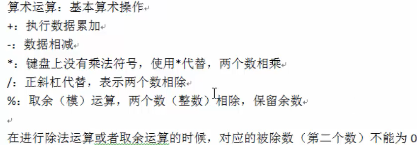
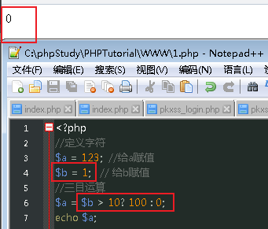
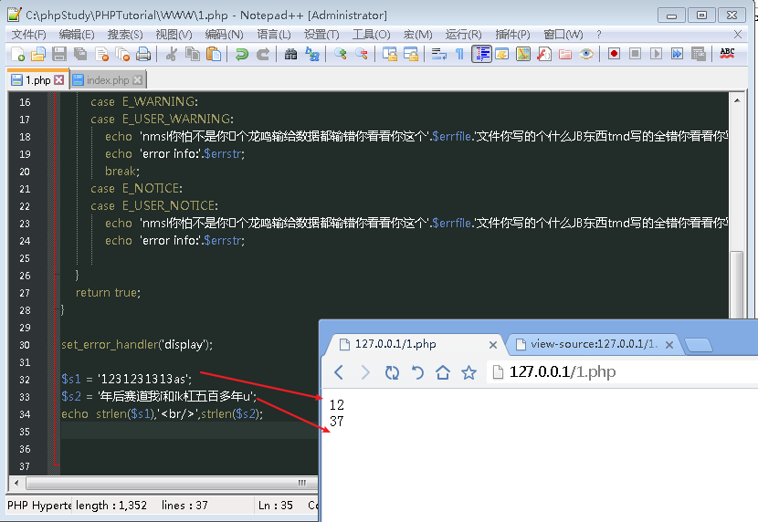
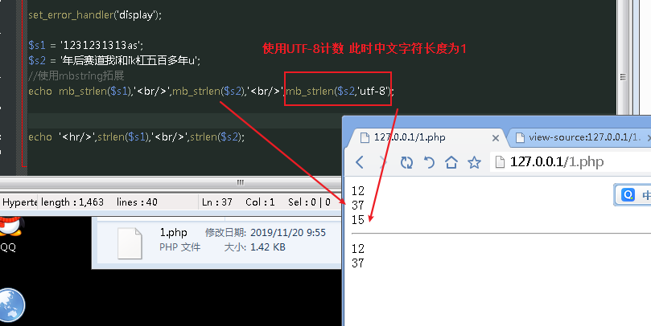

# **php**
- 别问，问就是最好的语言  -- php官网


php会更具用户要求和选择而动态的进行更新改变和相应。

服务器：能提供服务的机器就是服务器，类型取决于机器上安装的软件。

> 头代码加入：header('Content-type:text/html;charset=utf-8');
让浏览器解析utf-8代码。

## **PHP代码执行流程**
1. **读取PHP代码文件** (PHP程序)。

2. **编译**：将PHP代码转换成字节码。(生成opcode)

3. zend engine 来解析OPcode，按照字节码去进行逻辑运算

4. 生成对应的`HTML代码`


如果PHP文件在编译的过程中出现了语法错误,那么就不会执行。
（`BUT`A君：在执行文件包含的时候，先顺序执行，在执行到包含文件的时候再报错。）


## **php代码标记**

在php历史发展中，可以使用多种标记来区分php脚本。
asp标记：<% php 代码 %>
短标记： <? php代码 ?>

> 以上已被神遗弃！

脚本标记： `<script language="php">PHP代码</script>`
标准标记(常见)：<?php php代码?>

如
```html
<html>
<body>
<b>
<?php
hellow world;
?>
</b>
</body>
</html>
```


## ** php注释**
养成习惯:所有的代码在写的过程中都必须进行注释，是个人学习和写代码的思路说明。

php注释分为两种：
行注释： 
     //：后面的内容都是注释
    #：与//一样
块注释;
/*xxx*/:注释所有语句。


## **语句分隔符**
在php中，代码是以行为单位运行的，系统需要通过判断行的结束，该结束通常都通过一个符号:分号";"(英文状态下的分号).

定义内容：
```
$a =5;
echo $a;
```

如果不加就会产生解析错误:
`parse error`

回车：`'<br/>'`


# **变量**

PHP是一种动态网页，所以用户与服务的交互就会有数据的传递。PHP作为中间人，需要进行数据的传递，传递的前提就是自己能临时存储数据。

也就是可以`存储计算结果`
  1. 存储数据；
  2. 存在名字；
  3. 通过命名来访问；
  4. 变量中数据可变。


## **变量的使用**

变量符号："$"

1.定义： 系统中变量的名字；
$a;


2.赋值： 可以将数据赋值给变量名。
$a=123;


3.可以通过变量名访问存储的数据。
echo $a;


4.可以将变量从内存中删除
unset($a);


## **变量命名规则**

1.在php中变量名字必须以"$"符号开始；
2.名字由字母，下划线“_”构成，但是不能以数字开头。


## **预定义变量**
提前定义的变量，`系统定义`的变量，存储许多需要用到的数据。

$_GET:`所有表单以get方式提交的数据`

$_POST:`所有以post方式提交的数据都会保存在此`

$_REQUEST:`GET和POST提交的都会保存`

$GLOBALS: `PHP中所有的全局变量`

$_SERVER: `服务器信息`

$_SESSION: `session会话数据`

$_COOKIE:`cookie会话数据`

$_ENV:`环境信息`

$_FILES:`用户上传的文件信息`


## **可变变量**
可变变量：如果一个变量(a)保存的值刚好是另外一个变量(b)的名字，那么可以直接通过访问一个变量(a)得到另外一个变量(b)的值:`在变量前再加一个$符号。`

$a = 'b111';
$b111 = 'bb';
echo $$a;

则输出的值为bb


原理为：

echo先找到$,然后解析，得到b111,然后再把"$"和"b111"组合，得到`$b111`然后输出"b111"的值为bb


## **变量传值**
`将一个变量赋值给另外一个变量：变量传值。`

变量传值一共有两种方式：值传递，引用传递。

值传递：将变量保存的值赋值一份，然后把新的值保存给另外一个变量并保存。(两个值没有关系)。


引用传递：将变量值所存在的内存地址赋值给另外一个变量：两个变量指向同一块内存空间。
```php
<?php
$a = 1;
$b = &$a;    //引用传递。 &值表示引用$a的内存地址。


$b = 2;
echo 
```


在内存中，通常有以下几个分区。

**栈区**：程序可以操作内存的代码部分不含数据存储.
> 特点：少，但是快！。


**代码段**: 存储程序的内存·部分的(不执行)。
> 存储普通数据.


# **常量**

常量于变量一样，都是用来保存数据的。

常量名称：const/constant 在程序运行当中，不可改变的量（数据）

> 常量一旦定义，通常数据不可改变。

一般为用户级别。


函数定义变量:define

```php
// 使用函数定义常量:define

define('PI',3.14)

// 使用const关键字定义:
const PII = 3;

//定义特殊常量
define('-_-','smile');

//使用常量：
echo PI

//在访问系统无法识别的常量名的时候如特殊符号，可以使用constant。

echo constant('-_-')

```
说明：常量和变量的使用
1. 凡是数据可能会变化的，那么肯定用变量
2. 数据不一定会变的，可以使用常量或变量（变量居多）
3. 数据不允许被修改，或不能更改的，使用`常量`


## **系统常量**

系统帮助用户定义的量，用户可以直接使用的量。叫常量。


常用的几个系统常量：

`PHP_VERSION`:PHP的版本号

`PHP_INT_SIZE`:整型的大小

`PHP_INT_MAX`:整型能表示的最大值(PHP中整型是可以出现负数的：带符号)

在PHP中还有一些特殊的常量，他们有双下划线开始+常量名+双下划线结束。


# **数据类型**

## PHP中数据的八种数据类型

数据类型：`data type` :在php中指的是存储的数据本身的类型，而不是变量的类型。

PHP是一种`弱类型语言`，变量本身没有数据类型。


## **类型转换**

在很多的条件瞎，需要指定的数据类型。或当前php取得的数据，转换成目标数据类型。


## **在php中有两种数据类型转换方式：**

1. 自动转换。系统更具要求自己判定，自己转换（使用较多，效率偏低。）
2. 强制（手动）转换。人为更具需要的类型对目标进行转换。

强制转换的规则：在变量之前增加一个括号，在里面写上对于的类型：int/integer......

其中NULL类型用到 `unset()`

算数类型运算先转换成数值类型(整型和浮点型)


## **强制转换的写法**

```
echo (float)$a; (float)$b;
```


## **判断类型**

```php
var_dump(is_int($a))
调用函数  确定数组类型   判断是否为int  返回值为 `bool(false)`或者`bool(true)`
```
判定数组类型可以确定数据类型是否安全来存入数据库。


##  **-> 访问对象中的方法**

`->` : 访问对象中的方法或属性
```php
 $object -> action();  // 访问对象 object 中的 action 方法
```

  
##  **=> 定义数组键对值**
  
```php
 $ary = [
     'name' => 'Jack',  
     'addr' => 'Beijing'
 ];
```


**获取类型**

有一组函数可以用来获取以及`设定数据``的类型`

- Gettype(变量名) ：获取类型，得到的是该类型对应的字符串。

- settype(变量名,类型):用于设定数据类型，与强制转换不同。

设定数据类型和强制转换的区别为：
1:前置转换:  (类型)变量名，是对数据值复制的内容进行处理，而不会对实际存储的内容变更其函数值。

- _*打个比方 a向b临时借了个✈杯，b强制爽了之后发现，原来里面还是a的形状，他只是临时变成了b的形状，但是他本质上还是a的形状。*_*


# **基本数据类型**

> 整数类型(整型)

**整数类型**：保存整数数值（范围限制） ,使用4个字节存贮数据，最大为32位(`二进制最大为42亿多`)

> 但是在PHP中默认是有符号类型的，也就是区分正负数(所以一般为21亿多)


**整型的定义**

在PHP中有4种不同的整型的定义方式：

1. 二进制定义         $a = 0b110;   //2进制
                          0b代表 2进制 后面跟2进制数

2. 八进制定义         $a = 0123;    //8进制
                          0代表8进制  后面更近8进制数

3. 十进制定义         $a = 123;     //10进制


4. 十六进制定义       $a = 0x123;   //16进制
                          0x代表16进制数


>在PHP中输出的数值都会默认转换成10进制输出。(你输出个1010100101谁看的懂咯你的意思是要我亲自编译一下咯？)


**PHP是一种弱数据类型的语言**

```php
$a1 = "1a23";
$a2 = 'a123';
$a3 = 12a3;

$a4 = $a1 * $a2 -$a3;
echo  $a4;
```
在PHP中，若字符串中有数字参与加减乘除运算，会把字母前的所有数字识别成一个数
列: $a1 转换后为 1， $a2 转换成0 ,$a3 会直接报错，因为如果不加` '',或""`会识别成数字。


## **PHP的数据类型**

PHP有8种数据类型：

|标准数据类型: |字符串型| 整型 |浮点型 |布尔型|
|-------------|-------|------|-------|-----|
|复合数据类型: |数组|对象|

|特殊数据类型: |资源    | NULL|          |    
|--------------|-------|-----|---------|-----|


其中，`标准数据类型和数组` 的传递格式都是"值传递" -- 单纯传输一个整数或字符串。
其中，对象、资源，默认都是"引用传递"。


什么是"值传递"？  将一个变量的值 复制一份，传递给另一个变量;俩个变量之间没有任何关系。修改其中一个变量值后另外一个不改变。毫无 `瓜` 系.


**浮点型  --一个不够精确但是的确挺有用的数**

> 大约为15位 ，在PHP中 如果超过了PHP的int函数的最大值，就会变成浮点型。

```php
<?php
// 创建一个int函数a  并设置为int的最大值
$a = PHP_INT_MAX;
// 输出a
echo '<br/>',$a,'<br/>';
//输出a的类型
echo gettype($a);
//喜加一
$a= $a+1;
//输出a的数值
echo '<br/>',$a,'<br/>';
//查看a的数值类型
echo gettype($a);
```



**布尔值** 

布尔类型：两个值，一个`true`，一个`false`,通常用于判断比较。
```php
<?php
//布尔值
$a = true;
$b = false;
var_dump($a,$b);
```
在进行某些数据类型判断的时候，需要注意数据类型的`转换`。
(A君：你写个false给鬼看啊？)

**这时候就需要特定函数对数据进行判断：**

**empty()**:

> 判断数据的值是否为`空`,这个空不是`NULL`,而是空值，或0。如果为空，返回`true`，不为空，则返回`false`.


**lsset()**:

> 判断数据存储的变量，本身是否存在，如果存在则返回`true`,不存在则返回`false`.


# **运算符**

运算符：operator,是一种将数据进行运算的符号，在PHP中一共有十多种运算符。


## - **赋值运算符**
```
=
```


## - **算数运算符**




## - **比较运算符**


在其中的等于或不等于 ，比较的是值的大小，而不是类型。
举个`栗子`
```php
<?php
//定义字符
$a = '123';  //字符串
$b = 123;   // 整型
//判断是否相等
var_dump($a == $b); 
```


## - **(逻辑)短路运算符**

```
&&

||

！
```
何为短路运算符 ：
即第一个表达式结果已经满足条件，`那么就不会运行逻辑运算符后面的表达式`,因为优先级最高。

> 所以在书写代码的时候，尽量将出现概率最高的(能直接判断出结果的)表达式放到第一位


## - **连接运算符**

> 是PHP中将多个字符串拼接的一种符号。
```php
. //将两个字符串连接到一起
如：git $id = '"'.$id.'"'

.=  复合运算 // 将左边的内容与右边的内容连接起来，任何重新赋值给左边变量。

A .= b    ========  A=A.b   //意思就是把a的值和b的值组合起来再赋值给a  
```


## -**错误抑制符**

```php
@($a % 0 );

```


## - **三目运算符**

> 三目运算：有三个表达式参与运算的运算符(简单的分支结构的缩写)。

语法格式为：

表达式1？表达式2：表达式3；

`$a = $b > 10? 100 : 0;`

运算为：`如果表达式1成立，那么执行表达式2，否则执行表达式3`；


**列**：

> 如果b大于10，则把100赋值给a


> 如果b不大于10，则把0赋值给a


也可以使用三目套三目运算
列：
```
表达式1?(表达式2？表达式4：表达式5)：（表达式3？表达式6：表达式7);
```

## - **自操作运算符**

(a君：我操我自己？)

++：在原值上+1
--: 在原值上-1

衍生符号：类似自操作
（A君:咋了自操还能衍生 有·东西哦）

+= ：左边的结果于右边相加然后赋值给左边
-= ： 左边的值减去右边的值然后赋值给左边。
*= ：乘法
/= ：除法
%= ：模运算


系统中存在两个0： +0 和 -0
+0 ： 00000000
-0 ： 10000000  
取反: 11111111
补码: 00000000


```
>> 为运算 向右移2位数 除2的操作（有余+1）
<< 为运算 向左移2为数 乘2的操作
```

# **流程控制**

流程控制：`代码执行的方向`


## **控制分类**

**顺序结构**：代码从上到下，顺序执行。(代码的基本结构)。


**分支结构**：给定一个条件，同时有多个多种可执行代码（代码块），然后会更具条件执行某行特定一块代码。
在PHP中分支结构一般有2种：(if分支和switch分支)

**if**：给定一个条件，同时为该条件设置多种(两种)情况，然后通过条件判断来实现具体的执行段。

注意：

1. 如果判断条件比较单一，通常使用`elseif`的符合方式
2. 如果判断条件不一致，建议使用嵌套格式。


**switch**：

> 有一组情形存在，通过一个条件，通常有多个值，反回每个值会有对应不同的代码要执行。

判断方式：是将条件放到分支结构内部判断

**switch基本语法**

switch(条件表达式){

case 值1：
  要执行的代码段；
case 值2：
 要执行的代码段；
 ...
 )

}


**循环结构**：在某个条件控制范围内，指定的代码（块）可以重复利用。

for循环结构：代码段在一定的控制下，可以多次执行。
在php中循环结构有以下几种：

1. for循环 通过条件判断，终止判断执行

2. while循环 ： 通过判断条件终止

3. Do-while循环 跟while差不多

4. foreach循环： 专门针对数组


# **PHP书写到HTML中的代码**

在PHP书写到HTML中的这些大括弧非常不美观<br>
（A君 ：你就是懒得打，你下贱），所以PHP提供了一种替代机制，让其可以不用书写大括号：

for(a;b;c)  ===== for(a;b;c):
}           ===== endfor;


# **常用系统函数**

- 1. **有关输出的函数**
  - print():输出
  - 

- 2. **有关时间的函数**
  - data():
  - time():
  - microtime():

- 3. **数学函数**
  - 


# **文件加载的原理**

(a君：在？文件包含？ 你包你🐎呢)

`include`或者`require`

- 文件加载的原理：
1. **嵌入中**： 在文件加载中的时候，系统会自动请求文件中的代码并嵌入到当前文件中。

2. **加载中**：在哪里加载。就会把相应的文件中的代码嵌入的相应的文件位置，这个位置就是include的文件包含的位置。


## **文件包含中Include和require区别**

### `**include**`和`**include_once**`的区别：

> include和include_once的区别
include:在系统遇到一次就会执行一次。但是遇到多次就会检测是否包含过了，当再次包含就不会执行。

include_once:不管系统遇到几次都只会加载一次。


## **Include和require区别**

（A君：啊！他来了他来了！！）


## **require和include的本质区别就是**<h2>报错信息的不同</h2>

（A君：.....你是不是演我？wdnmd）

准确来讲就是 在于包含文件找不到的时候，报错的类别形式不同。
> include ：的错误级别比较轻：只是警告而已？，后续代码还会执行。

> require：要求级别较高，如果包含出错代码将不再执行后续代码。


　　`include` 引入文件的时候，如果碰到错误，`会给出提示`，并继续运行下边的代码。
我码农一般都不看`warning`这玩意


　　`require` 引入文件的时候，如果碰到错误，会给出提示，并停止运行下边的代码。
按照程序员的想法一般都会使用`include`,使用比较重要文件的才会使用
`require`

### 条件引用区别

include()是有条件包含函数    --当变量$a为真，则会执行包含。
```php
if($a == 1){

　　include 'phpinfo.php';

}
```


request()是无条件包含函数    --当变量不管是否为真，都会执行包含。
```php
if($a == 1){

　　require 'phpinfo.php';

}
```

## **文件加载路径**

在文件加载的时候需要指定文件路径才能保证文件正确的找到相应的文件。
1. 绝对路径
2. 相对路径


## **文件嵌套包含**

可以理解为套中套，如果是a套b，b套a就是永动机！
（A君：刹车，你tm别把门焊死了wdnmd快让我下车！lz要跳车。）


# **函数**

> function,是一种语法结构，将实现某一个功能的代码块（多行代码，封装到一个结构中，从而实现代码的重复利用）。


## **函数定义的语法**

函数对应的几个关键点：function关键字，函数名，参数（形参和实参）。函数体和返回值。

基本语法如下：

function 函数名([参数]){
//函数体
//返回值：return 结果；

}

定义函数的目的：是为了实现代码的重复利用，一个功能一个函数(要求简单明了不要太复杂)
(A君：复杂我也不会啊。)

**函数的使用**:通过访问函数的名字+()；

如果函数在定义的过程中有参数，那么在调用的时候就必须转入对应的参数。

**函数的运行**：
 函数不会自动运行，必须在调用的时候才会执行。也就是遇到函数名的时候才会调用，而不是在一开始的编译阶段。
`(A君:你这个函数是真tm像JavaScript)`

> 函数是独立于php外部代码的也就是里面的值都要重新定义。


**函数调用的特点**：
只要系统在内存中能够找到对应的函数，就可以执行(函数的调用可以在函数定义之前)

主要思路 <h2>-- **先编译后执行** --</h2>
(A君：那你嗦你🐎呢一句就能概括非说这么多我看你是皮炎欠打)。


# **参数的详解**

函数的参数分为两种：

**1. 形参**
**2. 实参**

## **形参和实参**

形参：形式参数，不具有实际意义的参数，是在函数`定义`的时候使用的参数。

实参：具有实际数据意义的参数，通常是需要传入到函数内部参与实际运算的参数。需要实际调用的时候，将数据以实参形式传递给形参，使函数内部可以用到外部数据。

类似于
```php
function add($arg1,$arg2){ //形参可以定义很多 a1 ，a2 等等，使用逗号隔开即可。

echo $arg1 + $arg2;   //函数体可以直接调用，并传入参数。

//但是形参并没有实际参数
}

$a1 = 10；//实参有实际数据的参数。

add($a1,29);

```
`所以实参不能少于形参。`


## **默认值**

类似于输入的时候的`非必填项目`就那种即使值为空也不会影响运算的实参，系统默认给他赋的值。

默认值：default value，指的是形参的默认值。在函数定义的时候系统就给定了一个初始值，如果实际调用的参数没有提供，也就是 没有提供`a=1,a2=12`这种数的时候，那么形参就会使用定义时的值。


## **参数的传递**

> 实参在调用的时候会将值赋值给形参实际上就是一种普通的值传递。

(A君：就nm一句 a=1；就过去了你跟我整这么长一玩意儿你不是在搞我？我怀疑你谋杀我发根)

在调用函数的时候给函数赋值，就可以把实参的值带入到函数形参中。


## **取地址符号**

> `&`
> 在传参的时候加上`&`符号就可以进行跳出函数的传参。


函数在定义的时候 因为b用的是取地址符号所以实参传入后系统取到了b外部变量的内存地址，这样b本身的值也发生了改变。

**注意**：在传入实参的时候`必须传入数据变量`.
`如果错误，则错误很重。`


## **函数体**


什么是函数体?(A君：你反手给我一个问题打的我真是措手不及！)

函数体就是函数内部的所有代码，带个比方：

```php
funcation display{

  //这些都是函数体。
}

```

> 函数体：基本上所有的代码都可以实现
 1. 定义变量
 2. 定义常量
 3. 使用流程控制(分支、循环)
 4. 可以调用函数。


## **函数返回值**

**返回值**:return，值的是将函数实现的结果，通过return关键字，返回给函数外部(函数调用出)。
> 在PHP中所有的函数都有返回值（如果没有明确return使用,那么系统默认返回NULL。）
当函数体中，return直接函数，所以后面的内容都不再执行。
可以理解为，函数终止于return。


# **作用域**

定义的变量:
 1. 全局变量    -- 函数外部定义的变量
    所属全局空间： 再PHP中只允许在全局空间中使用：理论上函数内部不可访问。
    脚本周期：直到脚本结束(最后一行代码执行完)


 2. 局部变量    --就在函数内部定义变量
    所属当前函数的空间：在PHP中只允许在当前函数自己内部使用。
    函数周期：函数执行结束（函数是在栈区内部独立内存空间运行的）


 3. 超全局变量  --系统变量 （预设变量，如$_service、$_POST等）
    所属超全局空间：没有访问限制(函数内外都可以访问。)
但是超全局变量可以使全局变量自动纳入到局部变量从而使局部变量和全局变量互相调用。但是必须使用数组的方式。


基本语法：
Global 变量名；
变量名 = 值；


## **静态变量**

静态变量：`static`，是在函数内部定义的变量，使用static关键字修饰，用来实现跨函数共享数据共享数据的变量:函数运行结束所以局部变量都会清空。

**BUT**如果进行下次函数运算，所有的局部变量都会重新初始化。


静态变量的作用是为了跨函数共享数据（同一个函数被多次调用）。
 


# **可变函数**

当前函数：当前有一个变量所保存到值，刚好是一个函数的名字，那么就可以使用变量+()来充当函数名使用！

`(B君：这样访问方式就发生了改变，从访问函数名变成了访问变量！)`

```php
$变量= 'dispalay';
Funchion display(){
  xxx
  xxx

}

//可变函数
$变量();

```


# **闭包**

**闭包**： closure，要执行的代码块和为自由变量提供绑定的计算环境(作用域)


简单理解：当函数内部有一些局部变量(要执行的代码块)在函数执行之后没有被释放，是因为还有对应的函数被引用！

可以理解为函数内部还有`匿名函数在被调用`.

如何证明是闭包:

1. 使用内部匿名函数。
2. 匿名函数使用句变量：USE
3. 匿名函数被返回给外部使用；


# **字符串长度问题**

1. 基本函数strlen():得到字符串的长度 **字节为单位**



> 在 中文字符长度为3

2. 多字节的字符串长度问题！包含中文的长度


3. 多字节字符串扩展模块：mbstring扩展(mb:Multi Bytes)
首先加载

（A君：那么请问在哪里可以买到呢？）


> 补充 如果你需要使用UTF-8技术 使用
'mb_strlen($str2,'utf-8')'




可以看到 在utf-8计数中这个中文字符为1.


# 字符串相关函数


**1）** **转换函数**： implode(),explode(),str_split();
implode():将数组中的元素按照某个规则连接成一个字符串。

Explode():将字符串按照某个格式进行分割，变成数组。

2) 截取函数： trim()，ltrim(),rtrmi();
3) 截取函数： substr(),strstr();
4) 大小转换函数：strtolower(),strtoupper(),ucfirst();
strtolower($str),强制转换成大写字母


5) 查找函数：strpos()，strrpos();
6) 替换函数：str_replace()；

字符串替换：echo str_replace('a','b',$str);


7) 格式化函数： printf(),sprintf();

printf/sprintf(输出字符串有占位符，顺序占位内容：)
通常用`%加字符`


8) 其他： str_repeat(),str_shuffle();


Str_repeat():重复某个字符串N次。
str_shuffle()：随机打乱字符串。


# **数组**


> 数组的概念
数组：array，数组组合，指将一组数据存储到一个指定的容器中。将变量指向该容器，然后可以通过变量一次性得到该容器中的所有数据。


## 数组定义语法


PHP在系统中提供了多种定义数组的方式：

1. $变量 = array(元素1，元素2，元素3);

2. $变量 = [元素 1，元素2...];

3. 隐形定义数组：给变量增加一个中括号，系统会自动变成数组，$变量[]=值1；

4. $变量[下标] = 值1

5. $变量[下标] = 值;   //中括号里面的内容称之为下标。Key 该下标可以是字母(单词)或者数字。

 


## **PHP数组特点**


1） 可以整数下标或者字符串下标。
2） 不同下标可以混合存在：混合数组。
3） 数组元素的顺序以放入顺序为准，跟下标无关。

4） 数字下标的自增特性。
5） 特殊值下标的自带转换。
布尔值：true 和 false
空：null

6） PHP中数组元素没有限制


# Foreach遍历语法


基本语法如下：
Foreach($数组变量 as [$下标 =>] $值){
//$下标可以不要通过$;可以通过$的值访问元素的值


}
通常：如果是关联数组(字母下标)，就需要下标，如果是数字下标就需要直接访问值

## Foreach循环

```php
foreach($arr as $v ){   //v随意命名
echo $v,'<br/>';
echo 'key：',$k,' == value ', $v,'<br/>';

}

$arr = array(
  0=>array('name' => 'Tom','age'=>30);
  1=> array('name' => 'jim','age'=>28);

);
foreach($arr as $value){
echo 'name is:',$valuw['name'],'and age is:',$value['age'],'<br/>';

}
```

## foreach遍历原理

1. foreach 会重置指针：让指针指向第一个元素。


## mysql
 
### 一. 创建用户

命令: `CREATE USER 'username'@'host' IDENTIFIED BY 'password';`


说明：
username：你将创建的用户名
host：指定该用户在哪个主机上可以登陆，如果是本地用户可用localhost，如果想让该用户可以从任意远程主机登陆，可以使用通配符%
password：该用户的登陆密码，密码可以为空，如果为空则该用户可以不需要密码登陆服务器
例子：
```mysql
CREATE USER 'dog'@'localhost' IDENTIFIED BY '123456';
CREATE USER 'pig'@'192.168.1.101_' IDENDIFIED BY '123456';
CREATE USER 'pig'@'%' IDENTIFIED BY '123456';
CREATE USER 'pig'@'%' IDENTIFIED BY '';
CREATE USER 'pig'@'%';
```

### 二. 授权:

命令:GRANT privileges ON databasename.tablename TO 'username'@'host'


说明:
privileges：用户的操作权限，如SELECT，INSERT，UPDATE等，如果要授予所的权限则使用ALL
databasename：数据库名
tablename：表名，如果要授予该用户对所有数据库和表的相应操作权限则可用*表示，如*.*
例子:

```mysql
GRANT SELECT, INSERT ON test.user TO 'pig'@'%';
GRANT ALL ON *.* TO 'pig'@'%';
GRANT ALL ON maindataplus.* TO 'pig'@'%';
注意:
用以上命令授权的用户不能给其它用户授权，如果想让该用户可以授权，用以下命令:
GRANT privileges ON databasename.tablename TO 'username'@'host' WITH GRANT OPTION;
```


