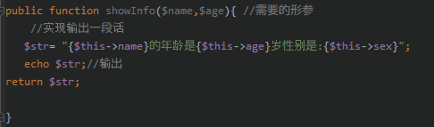

# 类和对象的关系

1. **类的概念**

类就是  **分类、类别、概念、理论。**

在PHP中，类应该有相同的特征。

类的特性： `封装性、继承性、多态性、抽象性`

2. **对象的概念**

对象就是一个一个的实体.有形的、看得见的、摸得着、实体存在的。

而对象也是属性(特征)和方法(行为)的构成。

在现实中：先有对象，后有类。

**但是在计算机中：先有类，后有对象。**
(A君:🤔我就是有类也没**对象**啊)


## 类的定义

class classname{
    对象1；
    对象2；
    对象3；
}

语法格式说明：
```
(1)class是声明类的关键字，`不区分大小写`。
(2)类名、函数名、关键字，都不区分大小写;
(3)ClassName是类的名称，类名的命名规则与变量一样，但不带 `$` 符号。
(4)类名不能以数字开头，但是可以以字母或下划线开头。
(5)类名可以由字母、数字、下划线构成。
(6)类名尽量使用“驼峰式”命名：`每个单词首字母大写`
(7)类名后不跟下括号();
(8)大括号中{}定义的是类的成员和属性和成员方法。
```


## 在类中，对对象的数值引用

如果在 函数 `echo` 中输出时需要 在 `""`中加入

```php
{$this->xxx(所使用的对象名)}
```

 **类的定义实列**

```php
<?php
header('Content-type:text/html;charset=utf-8');

//声明类的语法格式
class Student{
    //定义成员属性
public $name = "a1";
    public $sex = "a1"; //定义对象的权限
    public $age = "a1";
    //成员的使用方法
public function showInfo(){
    echo "{$this->name}的年龄是{$this->age}岁性别是:{$this->sex}";

}
}
```


## **定义类的成员属性**

1. 成员的属性介绍

在PHP类中只有两个属性：

1. **对象的值(属性)**

2. **对象的方法**


(1)定义的成员属性一定要有前提：”谁的对象“，普通变量 `一般` 都是全局变量。
(2)成员属性一定要加权限控制符，但是普通变量不需要。


## **成员的定义格式**

```
  public    $a1    =    1;
权限控制符  变量名   =   变量值;
```


## **权限控制符**

作用：`用于保护数据的安全。`

1. public(公共权限)：在任何地方都可以访问。
2. protected(收保护的权限)：之内在本类和子类中可以访问。
3. private(私有的权限)：之内在本类中访问，类外和子类都不行。


示例：
**定义  类的成员方法**

1. **成员方法的介绍**

成员方法，就是普通函数
成员方法和普通函数的区别：

成员方法： 一定是那个对象的方法，不能单独存在
            成员方法前一定要加权限控制，普通函数不需要加；
            成员方法前也可以省略，但是默认为 `public` 建议不要使用。

成员方法和普通函数其他大致一样，都有返回值和参数。


## **成员方法的定义格式：**

```php
权限控制符 function funcName(形参1，形参2......){
    //该方法的功能
    [return 参数]
} 
```

示例：




## 实例对象含义


类可以产生N多个对象
类几乎不占内存，但每个对象都要占用内存空间。
平时工作的只有对象可以。
在js中，创建类的对象的方法：列如：var obj = new Date();
在PHP中，创建类的对象的方法：列如: $obj = new Date();
使用new关键字来创建类的对象。

对象会直接获取类中方法的所有属性，不管是否调用或使用


`注意： 对象不能单独存在，对象必须归属于某个类`


```php
<?php
header('Content-type:text/html;charset=utf-8');

//声明类的语法格式
class Student{
public $name = "a1";
    protected $sex = "a1";
    private $age = "a1";
public function showInfo($name,$age){ //需要的形参
    //实现输出一段话
   $str= "{$this->name}的年龄是{$this->age}岁性别是:{$this->sex}";
   echo $str;//输出
return $str;

}
}
//定义一个类的对象
$obj1 = new student;
//$obj2 = new student();     //一会儿的对比项
var_dump($obj1);
echo '</hr>';
```


##  **-> 访问对象中的方法**

`->` : 访问对象中的方法或属性
```php
 $object -> action();  // 访问对象 object 中的 action 方法
 使用
```

实列：`使用对象对类的方法的属性进行修改`

(A君：你给我好好翻译翻译这句话，什么tmd叫惊喜？ B君：`传参`)

1.修改对象属性：对已存在的属性进行重新赋值。


当你创建一个新的对象的时候原模板还是不变。


**删除属性**

```php
unset($obj1->name1);
函数   对象名 属性名
```

!注意 你删除的只能是对象，但是变量值还是会保存在内存中，在下次清理内存时会被一起清除。


## **对象的操作方法**

(A君：你甚至可以用于xss靶场测试！)


实例：
```php
<?php
header('Content-type:text/html;charset=utf-8');

//声明类的语法格式
class Student{

    //成员方法
public function showInfo($name,$age,$sex){ //需要的形参
    //实现输出一段话
   $str= "{$name}的年龄是{$age}岁性别是:{$sex}";
return $str;

}
}
//获取post提交的值
$n1 = $_POST["n1"];
$a1 = $_POST['a1'];
$s1 = $_POST['s1'];


//定义一个类的对象
$obj1 = new student;
echo $obj1->showInfo("$n1","$a1","$s1"); //传值并输出

//var_dump($obj1);
?>
新建表单
<form method="POST"  action="1.php">
    <input type= "text" name="n1" value="">名字
    <input type= "text" name="a1" value="">年龄
    <input type= "checkbox" name="s1" value="男">男
   // <input type= "checkbox" name="s1" value="女">女
    <input type= "submit" name="btn" value="ctrl男孩">

</form>
```


## **伪变量$this**

**1. $this变量的含义。**

1. js中关键字this代表当前对象
2. PHP中使用$this 变量代表当前对象。
3. $this 代表当前对象，用来调用对象的属性方式。
4. $this 能在成员方法中存在。

5. $this 对象是怎么来的？当使用 $obj 对象调用成员方法时，自动将当前对象的 $obj 传递到成员方法中，在成员方法中，使用 $this 变量来代替传递过来的 $obj 变量。


**2. 举例说明**

可以理解为将数据传输到类中然后对类对象的属性进行更改


```php
<?php
header('Content-type:text/html;charset=utf-8');

//声明类的语法格式
class Student{
public $name = 'abc';
    public $age  = 123 ;
    public $sex = 'man';
    //成员方法
public function showInfo(){ //需要的形参
    //实现输出一段话
   $str= "{$this->name}的年龄是{$this->age}岁性别是:{$this->sex}";
return $str;

}
}

//定义一个类的对象
$obj1 = new student;
echo $obj1->showInfo(); //传值并输出

//var_dump($obj1);
?>
```

PHP中 `$this` 只可以调用类的成员属性和成员方法。


## **如何定义类的常量**

**1. 类的常量介绍**

**常量**

> 就是值永远不会变量常量不能修改，也不能删除。**(A君：一般老师会说是：常常不变的量，当然意思相同。)**

比方：`在一次HTTP请求过程中，常量不能修改。`

类常量定义使用 `Const` 关键字。Define()定义的常量为全局常量。

类常量，仅仅只是类的常量，`和对象无关.`

类常量，之内通过类名来调用,书写格式为：


```php
$a :: 123
类名::常量
```
如何访问常量：是通过范围解析符(::)来访问常量.列：  `student::TITLE`
类常量在内存中只有一份，不会随着对象的增加而增加。类常量可以被所有对象共享。

好处:`节省内存` 列：公司名(百度)。ICP备案号等。


**2.常量的定义格式**

const 常量名 = 常量值

语法说明：

1. 常量没有权限访问符。

2. const定义的常量，一般认为是局部常量。

3. 常量名一般不加 `$` 符号.

4. 常量的值，必须是个固定的值。

`可以直接访问类的常量`


```php
<?php
header('Content-type:text/html;charset=utf-8');
//定义一个类
class Student{
    //类的常量
 const Root1 = 123;
 const root2 = 1234;
 const toor='1q231';
 //定义公共的类
 public function ShowFile(){
     echo Student::Root1;
     echo '<hr>';
     echo Student::Root1 * Student::root2;
     echo '<hr>';
$str = "root1:".Student::root2;
$str .= "root2:".Student::root2;
$str .= "toor:".Student::toor;
echo $str."<hr>";
 }
    }
    //直接访问类的常量
/*
$str = "root1:".Student::root2;
$str .= "root2:".Student::root2;
$str .= "toor:".Student::toor;
echo $str;
*/

$obj = new Student();
$obj ->ShowFile();

```


## **静态属性和静态方法**

### 1. 概述

static 关键字修饰的属性，就是静态属性；

static 关键字修饰的方法，就是静态方法；

静态属性，就是类的属性，与类相关，与对象无关。

静态方法，就是类的方法，与类相关，与对象无关。

静态属性和静态方法：是通过 `类名::$静态属性或静态方法` 方式来实现访问的。

静态属性和静态方法：`在内存中只有一份，不会随着对象的增加而增加。`

好处：节省内存.可以被所有对象去共享。

**静态的属性的值是可以改变的，可以被所有对象共享。**


### 2. **如何区分类的常量和静态常量**

不会改变的值 使用`常量`

但是会改变的使用 `静态属性` 


*实列：*


```php
<?php
header('Content-type:text/html;charset=utf-8');
//定义一个类
class Student{
    //类的常量
public static $title ="静态常量 实例 在你面前的是：";
 //定义公共的类
 public function ShowFile($name,$age){
     $str = Student::$title;
     $str .= "{$name}的年龄是{$age}岁";
     echo $str;
 }
    }
    

$obj = new Student();
echo $obj ->ShowFile("xyz","20");

```


---


## 代替当前`类名`

当你定义的类名称如果改变，那么你写的`类中名称都得改变`
这时可以使用  `self` 关键字 代替当前类名。

和 $this 有异曲同工之妙 $this 代表当前对象，self代表当前类；

$this 用于调用对象的东西:如成员属性、成员方法；

$this 使用箭头(->) 来调用成员属性、成员方法。

$self 使用(::)来调用类的常量、静态属性、静态方法。

$this 只能用于成员方法中；而 $self 可以用于成员方法，静态方法中。
 

实列：
```php
<?php
header('Content-type:text/html;charset=utf-8');
//定义一个类
class Student{
    //类的常量
public static $title ="静态常量 实例 在你面前的是：";
 //定义公共的类
 public function ShowFile($name,$age){
     $str = self::$title;
     $str .= "{$name}的年龄是{$age}岁";
     echo $str;
 }
    }
```


## **构造方法**

1. 什么是构造方法

使用  `NEW` 关键字 ，创建一个类的定义对象时，第一个自动调用的方法就是构造方法。

构造方法 的名称是固定的： `__construct()`。(__是两个下划线)

构造方法可以有参数，也可以没有参数；

当 NEW 一个类的时候，类名后面跟的小括号的参数，就是传递给构造方法的。列如： New Student('张三','34');

构造方法的作用: 对象初始化。 列如：给私有的属性赋值、数据库对象初始化(连通数据库，选择数据库)

> 注意！ ：构造方法只能定义一个；构造方法可有可无。
> 构造方法必须是成员方法。
> 构造方法一定没有返回值。


## **析构方法**

1. **什么是析构方法？**

- 当销毁一个对象前，自动调用的方法，就是析构方法。

- 析构方法的名称是固定的: __destruct();

析构方法一定没有参数，析构方法一定是成员中的方法。

析构方法的作用:  垃圾回收。例如：`可以断开数据库的连接`、同时在线人数等。

语法格式、举例说明：对象什么时候销毁、实例:统计在线人数。


2. **语法格式**

书写·格式：
```php
权限控制符 function __destruct(){
    垃圾回收的功能代码;
}
```

3. **举例说明：对象什么时候销毁**

网页执行完毕，所有变量自动销毁，包含对象变量;

函数 `unset(变量名)`

 `unset — 释放给定的变量` 

```php
<?php
header('Content-type:text/html;charset=utf-8');
class Student{
    public function __destruct(){
        echo "对象结束";
}
}
$obj = new Student;
//unset($obj);
echo "这是网页的xx代码";
```
若不加入删除对象代码 则输出为：


 `因为当网页执行完毕后才会到析构对象` 因为析构函数的执行时间，是当网页全部执行结束后才执行。

当输入销毁对象函数之后


销毁函数会早于网页执行完毕 对象都没了对吧。

## OOP中内存的分配情况


## 传递的区别

**值传递**

其中，`标准数据类型和数组` 的传递格式都是"值传递" -- 单纯传输一个整数或字符串。
其中，对象、资源，默认都是"引用传递"。


什么是"值传递"？  将一个变量的值 复制一份，传递给另一个变量;俩个变量之间没有任何关系。修改其中一个变量值后另外一个不改变。毫无 `瓜` 系.


**引用传递**

引用传递 将一个变量的 "数据地址" 复制一份，传递给另外一个变量;两个变量指向同一个数据；修改其中一个变量的数据，另一个变量也会一起变。


## **类的封装性**

1. 什么是类的封装性

`类的封装性:将敏感数据保护起来，不被外界访问。`

类的封装性再次提醒: 将一个功能的方方面面,封装成一个类。 

例如： 数据库工具类，把数据库操作的所有的方面全部封装到类中，因此，在该类外，不能再使用 "`mysql_*`" 开头的函数。

**`类的封装性实现，就是通过权限控制符来实现。`**

在项目中，所有成员属性，一般都是private 、 protected 权限。


2. 访问权限控制符介绍

public(公共权限):在任何地方都可以被访问，主要是:类内、类外、子类中。
protected(受保护的权限): 只能在本类，子类中被访问.在类外禁止访问。
private(私有权限)：只能在本类中被访问。
成员属性、静态方法必须要加权限控制符，不能省略。
成员方法、静态方法可以不加权限控制符，默认未public.建议都要加权限。


3. 举例说明(类的封装性)

实例 数据库封装类


