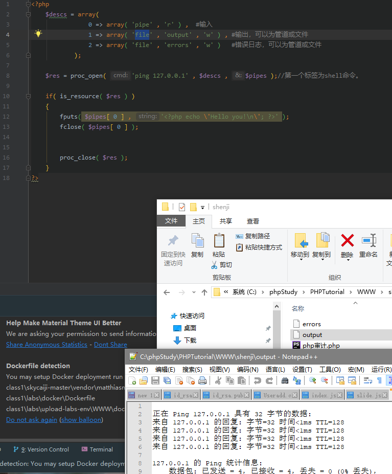

# PHP代码审计之基础篇

- 👴这几年一半的苦难都是™ PHP给👴带来的。

代码审计是一种经验的对抗和压制：如果我知道的东西比你多，经验就能压制你，写出你看的头皮发麻的代码。如果你的功能没有考虑全面，那么就可能会存在漏洞。


## 准备阶段

1. 安装相关软件 工欲善其事必先利其器 一个好的工具可以事半功倍。在阅读和编写PHP建议使用：phpstorm

2. 为了方便环境部署推荐使用集成工具面板：phpstudy(强烈推荐、真的神器。配个PHP和apache/nginx环境真的要老命)、宝塔。

## 代码结构

常见的代码结构有两种

1. MVC架构 

吧代码拆分成 Model、View、Controller 三部分、是一种软件设计的典范，用一种业务逻辑、数据、界面显示分离的方式组织代码，将业务逻辑聚集到一个部件里。
模型一般是数据库操作的相关代码。例如：jsp中的JavaBean来设计数据的属性、提供获取属性的设置属性和 get/set的方法。再传输给处理数据的模型、再由试图页面输出。


这样开发大项目时可以极大缩短时间、让PHP后端设计程序员可以有更长时间去设计逻辑、前端更长时间去设计页面和视图。只要前后端做好接口沟通顺畅即可。MVC的常见表现形式是通常有一个入口文件，这个入口一般是index.php


2. HTML和PHP代码混编，特征就是一个URL对映一个PHP页面，例如 [WorldPress](https://zh-cn.wordpress.com/)。


## 目录架构

- 放引用库的一般叫`librarie，lib，plugin`。
- 中大型PHP项目中还有一个`vendor`文件夹，是PHP的包管理器安装的依赖代码的存放路径。
- 视图代码文件夹名称一般叫`layout，theme，view，template`等等。
- 控制文件一般叫`controller`。
- 公用的一些代码文件夹一般 `common`
- 一些工具函数可能放在 `helper，util，tool`文件夹里
- 配置文件放在`config`文件夹里。
  
## 项目介绍

电商项目：

-  [FecMall](https://github.com/fecshop/yii2_fecshop)

-  [PrestaShop](https://github.com/xidaner/PrestaShop)

-  [OpenCart](https://github.com/opencart/opencart)

-  [joomla-cms](https://github.com/joomla/joomla-cms)


# 审计思考

像面向过程写法的程序，可以找下它的公共函数文件、那些 `include` 多就可以看看。看看有啥可以利用的不，然后就是丢seay审计系统。

而对于基于mvc写法的程序来说，跟读他的index(入口)文件，了解整个程序的运行流程跟目录结构，之后再深入去了解它的核心类库，如果核心类库存在漏洞的话，那在这套程序中找出个漏洞的希望就很大啊！了解了整个框架运行流程后，也没从核心类库中发现什么可利用的点的话，这时就可以从功能点入手了(这时可以把源码丢进seay源代码审计系统了)。

一套组合拳打下了后还是没找到漏洞咋办？没事，换套程序继续。如果换了n套程序都找不出来，那就换个人吧……

---

# PHP代码审计中需注意的特殊函数

## 1. 常见需要注意的特殊函数

1. PHP代码执行函数

    1. `eval函数`   `mixed eval(string $code)`  该函数是把字符串当作PHP代码来执行。(已被列入黑名单)。

    ```php
    <?php @eval($_POST['pass']);?>
    ```
    2. `assert`函数 `(mixed $assertion[,$string $description])` 由于大多数杀软吧 `eval` 列入黑名单了，所以用 `assert` 来代替 `eval` 函数来执行操作。

    ```php
    <?php $_GET[a]($_GET[b]);?>
    ```

    3. preg_replace($pattern,$replacement,$subject[])
    /e 修正符使`preg_replace()`将replacement 参数作为PHP代码
    ```php
    preg_replace("/test/e"，$_GET["h"],"just test");
    ```
    如果我们提交 `?h=phpinfo()`  , `phpinfo`就会被执行。


    4. string create_function($args,$code)
    创建一个匿名函数，并返回独一无二的函数名
    ```php
    $newfunc=create_function('$v','return system($v);');
    ```   
    `$newfunc('whomai');` 就相当于 `systeam('whoami');`

    5. 回调函数 `call_user_func($callback)` 调用，把参数数组做(param_arr)为回调函数的参数传入。

---

## 2. shell命令执行函数

|函数|作用|示例(此处command由shell代替)|
|---|---|---|
|exec() | 执行一个外部程序|exec("shell")|
|passthru() |执行外部程序并且显示其原始输出 , 此函数由来替代 exec() 或 system() 函数|passthru("shell")|
|proc_open()|执行一个命令，并且打开用来输入或输出的文件。此函数默认被禁用，需更改PHP.ini|proc_open("shell", $descs,"$pipes")详情见下[1]|
|shell_exec()&``|通过shell环境执行命令，并且将完整的输出以字符串的方式返回。|echo shell_exec("shell");
|system()|执行外部程序，并且无需`echo`可显示执行输出结果|system("shell")|
|popen()|通过popen()的参数传递一条命令，并对popen()所打开的文件进行执行文件执行。|$file = popen("shell","r"); pclose($file); 路径要写全。|

[1] 对passthru()函数的解析

```php
<?php
    $descs = array(
                0 => array( 'pipe' , 'r' ) ,  #输入
                1 => array( 'file' , 'output' , 'w' ) , #输出，可以为管道或任意文件
                2 => array( 'file' , 'errors' , 'w' )   #错误日志，可以为管道或任意文件
            );

    $res = proc_open( 'ping 127.0.0.1' , $descs , $pipes );//第一个标签为shell命令。

    if( is_resource( $res ) )
    {
        fputs( $pipes[ 0 ] , '<?php  \'shell \n\'; ?>' );//可以执行文件写入内容
        fclose( $pipes[ 0 ] );


        proc_close( $res );
    }
?>
```


可见 命令执行后 将命令输入至output文件。并写一个PHP文件。在CMS中多见。

---

## 3. 文件操作函数(可能存在文件包含的函数)

|函数|作用|示例|
|---|---|---|
|copy()|拷贝文件|copy('file','newfile')|
|file_get_contents()| 将整个文件读入一个字符串|$h = file_get_contents('http://www.xx.com/'); echo $h|
|file_put_contents()|将一个字符串写入文件|file_put_contents($file, 内容);|
|file|将一整个文件读入一个数组中|$test = file('http://xx.xxx/'); 可以输出web 页面。|
|fopen()|打开文件或者 URL|fopen("文件路径", "r");|
|move_uploaded_file|将上传的文件移动到新位置| move_uploaded_file($tmp_name, "路径/新名称");|


## 4. 特殊函数

**信息泄露**

 `phpinfo()` 大量信息，略。


**软连接- 读取文件内容**

 `symlink($target,$link)` 对于已有的target建立一个name = link的符合连接。

`readlink($path)` 读取并返回连接内容。

**环境变量**

`putenv()`设置环境变量的值。
`getenv()`读取环境变量的值。

示例
```php
var_dump(getenv('test'));//查看test的环境变量的值
putenv('test=123');//设置环境变量
echo "\r\ntest=".getenv('test');//输出环境变量
//此时test的环境变量从 false 变成了 test=123.
```

**数字判断**

`is_numeric($var)` 判断是数字还是数字字符串。是为TRUE 否为FALSE

---

**以下为不常见函数**


