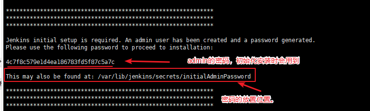
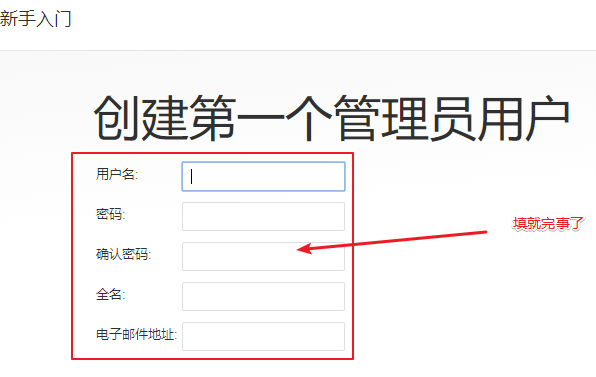
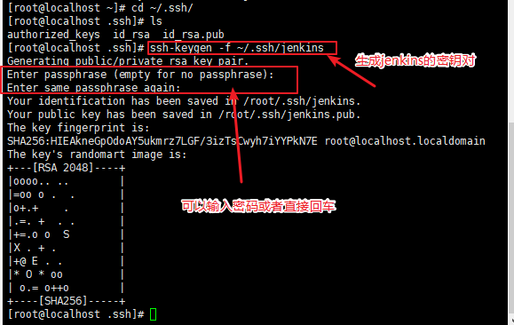

# Jenkins的搭建和java环境安装

https://blog.csdn.net/miss1181248983/article/details/82840006

## 1.下载地址

         http://www.oracle.com/technetwork/java/javase/downloads/jdk8-downloads-2133151.html


把安装包复制到Linux的目录下，具体工具可以使用xshell，这里不再赘述。

## 2 通过Xshell连接到虚拟机，执行如下命令，解压文件：

```
cd (文件目录)
 tar zxvf 安装的java压缩包名称
```


## 3 使用Vi编辑器，设置环境变量


    sudo vi /etc/profile

>在文件最后，添加如下内容：       
```
#Java Env
export JAVA_HOME=/usr/jdk1.8.0_221
export CLASSPATH=.:$JAVA_HOME/lib/dt.jar:$JAVA_HOME/lib/tools.jar
export PATH=$PATH:$JAVA_HOME/bin
```
## 然后退出vi编辑器，使环境变量设置立即生效

       source /etc/profile

## 查看jdk是否安装成功，安装了什么版本

        java -version


# Jenkins安装 ！JDK版本>=8（openjdk也可以）！

## 安装jenkins：

```  yum install -y java-1.8.0-openjdk       //安装openjdk，因为jenkins基于java开发
```
         wget -O /etc/yum.repos.d/jenkins.repo https://pkg.jenkins.io/redhat/jenkins.repo      //wget -O 下载文件并以指定的文件名保存

```
cat /etc/yum.repos.d/jenkins.repo 
[jenkins]
name=Jenkins
baseurl=http://pkg.jenkins.io/redhat
gpgcheck=1      //这里会检测key
```

>安装jenkins软件
```
  rpm --import https://pkg.jenkins.io/redhat/jenkins.io.key         //安装jenkins key
  yum install -y jenkins

```


## 启动jenkins

    systemctl start jenkins  \\启动服务
    ps aux |grep jenkins     \\查看启动jenkins

## 查看日志文件

    less /var/log/jenkins/jenkins.log        //查看jenkins日志，截取下面部分



## 关闭防火墙服务

```
systemctl stop firewalld.service 
```


# 访问安装

打开浏览器，访问ip：8080进行安装，ip为linux机器ip


>在管理员密码输入上文中的密码继续下一步 点击继续，会初始化一小段时间


## 啥是Jenkins

>上面等插件安装完后，就进入到下面界面，提示要创建第一个admin用户，并设置用户名密码



>点击保存并继续 保持默认直到装完


>到这里安装就算完成了

## 查看jenkins的配置文件

    cat /etc/sysconfig/jenkins   //查看jenkins的配置文件，定义了home、JAVA_CMD、user、port等基础配置

    ls /var/lib/jenkins/      //查看程序主目录


### 目录存放的位置

```
jobs    浏览器上面创建的任务都会存放在这里

logs    存放jenkins相关的日志

nodes    多节点时用到

plugins    插件所在目录

secrets    密码秘钥所在目录         //jobs和plugins目录比较重要
```

> jenkins存放数据不依靠数据库，所以在移植时只需要拷贝整个程序主目录即可。

## 查看插件：

`系统管理–>插件管理`，`“可选插件”`是未安装的插件，“已安装”是已经安装的插件，其中勾选为灰色的是不可卸载的插件。

检查是否有“`Git plugin`”和“`Publish over SSH`”两个插件，如果没有，在“可选插件”中安装。`发现“Publish over SSH”没有，安装它`


## 重启jenkins服务

>安装完插件后，直接在linux机器上重启jenkins服务，而不是勾选空闲时重启

     systemctl restart jenkins

>重新在浏览器上登录jenkins


## 生成密钥对

```
  cd ~/.ssh/
 ls         //如果之前有生成过密钥对，那可以直接用，不需要再生成
authorized_keys  known_hosts
 ssh-keygen -f ~/.ssh/jenkins         //生成密钥对

```


## 设置Publish over ssh 插件

系统管理–>系统设置，找到之前安装的“Publish over SSH”插件，“`Passphrase`”填写之前生成秘钥时设置的密码，没有则留空，`“Path to key”留空`，`“Key”粘贴

    /root/.ssh/jenkins文件内容。`


输入密钥：


 搭建ssh 直接登陆远程主机ip

 ## SSH 的配置步骤：

ssh 协议在加密传输数据时， 主要是通过公钥（public key）和私钥(private key)来加密和解密的

 1) 启动ssh服务 ： /etc/init.d/sshd restart  （一般服务器都是默认已经启动了ssh服务的）

 2） 查看ssh服务是否已经启动： netstat -tlnp | grep ssh

 3) 直接登陆远程主机指令： ssh  远程主机ip

点击检测 查看一下有没有毛病


这就说明我们前面的配置是没问题的。点击应用，出现“已保存”

## 开始搭建

点击Add Server可以增加更多台服务器，在生产环境下通常也是多台服务器一起发布代码。点击保存


加入一个网站文件就做好了！


