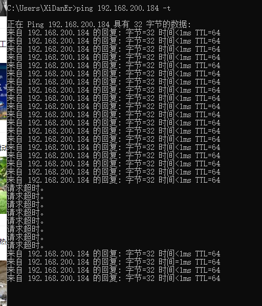

# Linux服务器禁止ping

## 1.短期

短期为直到重启或关机后配置无效

0，代表允许；1，代表禁止
```
echo 0 >/proc/sys/net/ipv4/icmp_echo_ignore_all
```

## 2.永久

永久允许或禁止ping
编辑
```
/etc/sysctl.conf文件
```
```
net.ipv4.icmp_echo_ignore_all=1
1
```
1代表禁止，0代表允许 修改完成后保存退出

执行`sysctl -p`使配置生效




如图，配置生效后再次ping命令已经无法ping通该IP，如果想要永久允许ping命令，只需要把配置文件1改为0即可.
