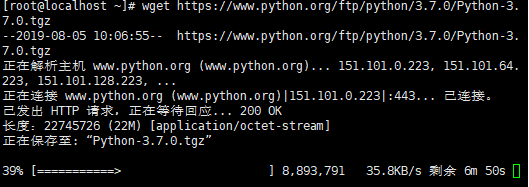

# PY的安装

## 1. 安装 Python3 编译环境

        sudo yum-builddep python

## 2. 下载 Python3 的源码包

```
yum install wget   \\下载wget
wget https://www.python.org/ftp/python/3.7.0/Python-3.7.0.tgz
```
>等待安装（过程过于漫长你甚至可以看一集jojo！）



## 编辑并安装python3

```
 tar xf Python-3.7.0.tgz   \\解压文件
 cd Python-3.7.0        \\cd查看目录
 ./configure        
make
make install
```
```
详细解释

　　1、configure命令

　　这一步一般用来生成 Makefile，为下一步的编译做准备，你可以通过在 configure 后加上参数来对安装进行控制，比如代码:./configure –prefix=/usr 意思是将该软件安装在 /usr 下面，执行文件就会安装在 /usr/bin （而不是默认的 /usr/local/bin),资源文件就会安装在 /usr/share（而不是默认的/usr/local/share）。同时一些软件的配置文件你可以通过指定 –sys-config= 参数进行设定。有一些软件还可以加上 –with、–enable、–without、–disable 等等参数对编译加以控制，你可以通过允许 ./configure –help 察看详细的说明帮助。


　　2、make

　　这一步就是编译，大多数的源代码包都经过这一步进行编译（当然有些perl或python编写的软件需要调用perl或python来进行编译）。如果 在 make 过程中出现 error ，你就要记下错误代码（注意不仅仅是最后一行），然后你可以向开发者提交 bugreport（一般在 INSTALL 里有提交地址），或者你的系统少了一些依赖库等，这些需要自己仔细研究错误代码。

　　可能遇到的错误：make *** 没有指明目标并且找不到 makefile。 停止。问题很明了，没有Makefile，怎么办，原来是要先./configure 一下，再make。

　　3、make insatll

　　这条命令来进行安装（当然有些软件需要先运行 make check 或 make test 来进行一些测试），这一步一般需要你有 root 权限（因为要向系统写入文件）。
```

至此，python3以及pip3已经被安装在/usr/local/bin目录下，通过如下命令可以检验安装


## 4. 修改默认的python版本

```
vi /etc/profile.d/python.sh         \\# 在文本中输入下面的内容并保存
```
```
alias python='/usr/local/bin/python3.7'
alias pip='/usr/local/bin/pip3.7'
```

如果非root用户创建的文件需要注意设置权限$ chmod 755 /etc/profile.d/python.sh。

执行命令使修改生效$ source /etc/profile.d/python.sh。

## 5. 测试 

执行`$ python -V`可以看到目前输出变成了 Python 3.7.0，并且并不影响yum的使用。


