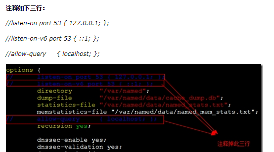

# DNS搭建

https://www.cnblogs.com/davidshen/p/8145948.html

### 通过yum安装bind:

```
yum install -y bind
```

### 自己创建或修改主配置文件

默认路径：(/etc/named.conf)  

```
cat /etc/named.conf
```


### 启动named服务

```
systemclt start named
```

让协议通过53端口

ro
改成 DNS即可

嫌麻烦也关闭防火墙 这里不推荐：
```
 systemctl stop firewalld.service
```

### 配置named服务文件

输入
```"
vim /etc/named.conf
```

配置named服务的配置文件，
> 将第11行改为
```
"listen-on port 53 { any; };"
```
> 这是`将所有网络的53号端口`打开。<br>

将第17行改为
```
"allow-query     { any; };"
```
这是允许所有人询问.


### DNS正向解析配置


  DNS的正向解析是询问域名，然后解析出IP。在做正向解析时，需要注释掉之前配置的"/etc/named.conf"下的第18行。


 DNS的正向解析的配置如下所示：

a、
```
"vim /etc/named.rfc1912.zones"
```
。在这个配置文件的第24行后，输入以下内容：
```
zone "xx.com"  IN{

type master;
file"xx.com.zone";

allow-update { none; };
};
```

>其中，`"xx.com"`为需要解析的域名，可以自己编写，`"xx.com.zone"`为记录域名解析IP的文件，名字可以自己编写

编写格式：
https://blog.51cto.com/13767783/2149216
https://blog.51cto.com/sweetpotato/1596973


>模板：
```

    $TTL 1D

    @       IN SOA  root. (

                                        0       ; serial

                                        1D      ; refresh

                                        1H      ; retry

                                        1W      ; expire

                                        3H )    ; minimum

          NS      dns.jay.com.

 www   IN  A      1.1.1.1

ftp   IN   A       2.2.2.2
```

## 重启DNS 服务

```
systemctl restart named
```
## 修改网卡中的配置文件，吧dns改成本机

```
vim /etc/sysconfig/network-scripts/ifcfg-ens33
```

>更改DNS1='`本机ip`'
然后重启网卡：

```
systemctl restart network
```

### 测试：

```
nslookup
```
输入网址看看能不能解析

                                                                                                                                                                                                                                                                                                                                                                                                                                                                                                                                                                                                                                                                                                                                                                                                                                                                                                                                                                                                                                                                                                                                                                                                                                                                                                                                                                                                                                                                                                                                                                                                                                                                                                                                                                                                                                                                                                                                                                                                                                                                                                                                                                                                                                                                                                                                                                                                                                                                                                                                                                                                                                                                                                                                                                                                                                                                                                                                                                                                                                                                                                                                                                                                                                                                                                                                                                                                                                                                                                                                                                                                                                                                                                                                                                                                                                                                                                                                                                                                                                                                                                                                                                                                                                                                                                                                                                                                                                                          
