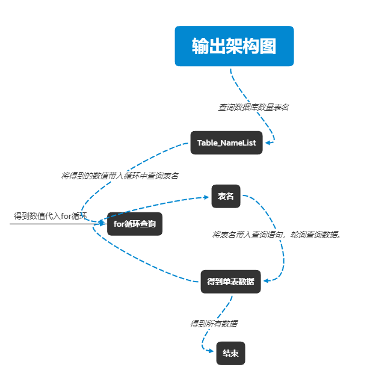

# 开发文档


- 1. index主页 
/路径/index.php

- 2. gettime接口
/路径/gettime.php

- 3. sql查询数据库时间最新的一条记录

> sql查询数据库时间最新的一条记录

```sql
select top 1 * from tablename order by 时间 desc;
```


## 网站框架

主要应用 `CodeIngiter` 框架 改版而来，减少更多函数加快速度。

但是代码更加偏向于组件式，拼凑而成。看懂关键代码即可进行维护更改。


## 网页获取数据库信息逻辑：




## 网站代理访问网页

```
https://wx.nantongsec.com/EArcBusOfQtVcQADnxFRCEro/Abcd123123/proxy.php
```


