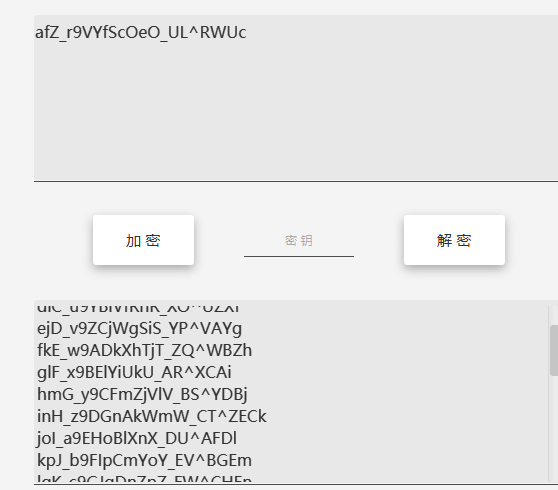
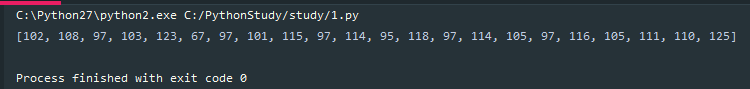
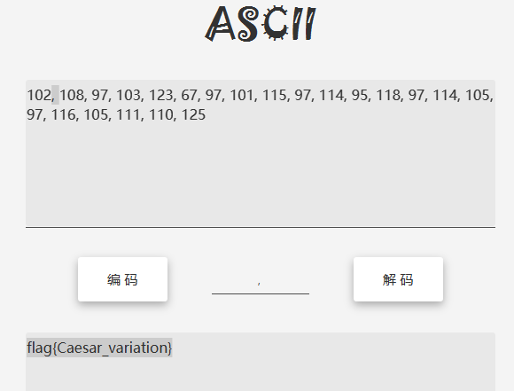
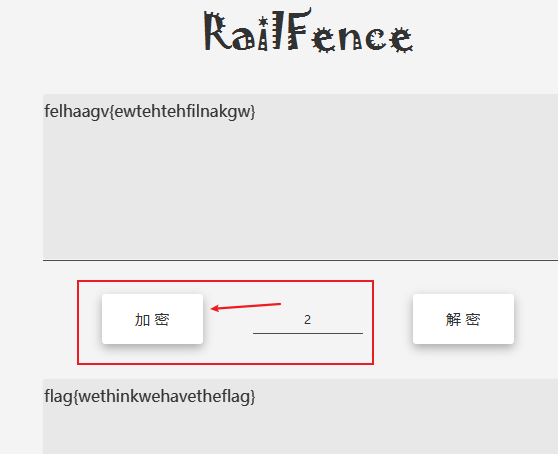
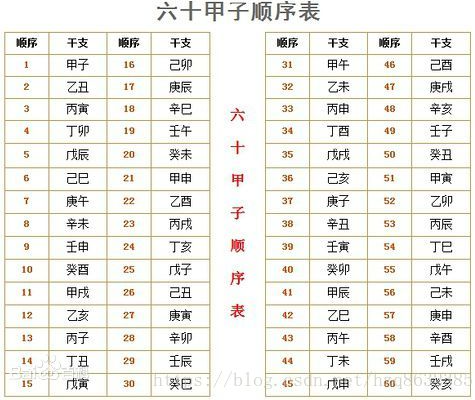
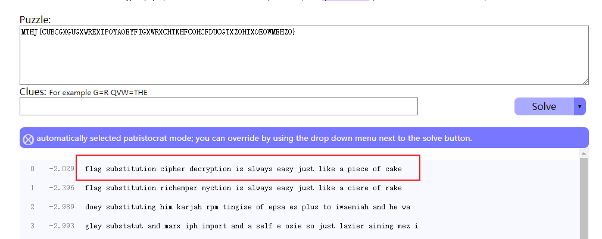

# Crypto

- [Crypto](#crypto)
  - [RSA](#rsa)
    - [已知 e、n、密文 c，求明文 m](#已知-en密文-c求明文-m)
  - [实战题目](#实战题目)
    - [1. RSA](#1-rsa)
    - [2. buuctf-rsarsa](#2-buuctf-rsarsa)
    - [3. buuctf-RSA3 共模攻击](#3-buuctf-rsa3-共模攻击)
    - [变异凯撒](#变异凯撒)
    - [Rabbit](#rabbit)
    - [BUUCTF-Crypto-篱笆墙的影子](#buuctf-crypto-篱笆墙的影子)
    - [BUUCTF-Crypto-信息化时代的步伐](#buuctf-crypto-信息化时代的步伐)
    - [BUUCTF-Crypto-传统知识+古典密码](#buuctf-crypto-传统知识古典密码)
    - [BUUCTF-Crypto-凯撒？替换？呵呵!](#buuctf-crypto-凯撒替换呵呵)
    - [BUUCTF-Crypto-萌萌哒的八戒](#buuctf-crypto-萌萌哒的八戒)
    - [BUUCTF-Crypto-old-fashion](#buuctf-crypto-old-fashion)


## RSA

RSA加密算法是一种非对称加密算法，在公开密钥加密和电子商业中被广泛使用。RSA是由罗纳德·李维斯特（Ron Rivest）、阿迪·萨莫尔（Adi Shamir）和伦纳德·阿德曼（Leonard Adleman）在1977年一起提出的。

RSA 算法涉及三个参数, n,e,d，其中分为私钥和公钥，私钥是 n,d，公钥是 n,e。n 是两个素数的乘积，一般这两个素数在 RSA 中用字母 p,q 表示。e 是一个素数。d 是 e 模 phi(n) 的逆元，d 是由 e,p,q 可以求解出的。明文表示为 m。然后通过 RSA 加密，得到密文 C。

一般来说，n，e 是公开的，但是由于 n 一般是两个大素数的乘积，所以我们很难求解出 d，所以 RSA 加密就是利用现代无法快速实现大素数的分解，所存在的一种安全的非对称加密。

### 已知 e、n、密文 c，求明文 m

给出 n、e、密文 c

```
e = 65537
n = 1455925529734358105461406532259911790807347616464991065301847
c = 69380371057914246192606760686152233225659503366319332065009
```


```py
import gmpy2
import binascii

e = 65537
n = 1455925529734358105461406532259911790807347616464991065301847
c = 69380371057914246192606760686152233225659503366319332065009
#1.将n分解为p和q
p = 1201147059438530786835365194567
q = 1212112637077862917192191913841

phi = (p-1)*(q-1)
#2.求d
d = gmpy2.invert(e,phi)
#3.m=pow(c,d,n)
m = gmpy2.powmod(c,d,n)
print(binascii.unhexlify(hex(m)[2:]))
#binascii.unhexlify(hexstr):从十六进制字符串hexstr返回二进制数据
```


## 实战题目

### 1. RSA

**题目**

```
在一次RSA密钥对生成中，假设p=473398607161，q=4511491，e=17
求解出d作为flga提交
```

直接通过脚本得出

```py
import gmpy2
p = 473398607161
q = 4511491
e = 17
d = gmpy2.invert(e,(p-1)*(q-1))
print(d)


结果:125631357777427553
```

### 2. buuctf-rsarsa

**题目**

> 题目类型: n+e+c+p+q= m

```
p =  9648423029010515676590551740010426534945737639235739800643989352039852507298491399561035009163427050370107570733633350911691280297777160200625281665378483
q =  11874843837980297032092405848653656852760910154543380907650040190704283358909208578251063047732443992230647903887510065547947313543299303261986053486569407
e =  65537
c =  83208298995174604174773590298203639360540024871256126892889661345742403314929861939100492666605647316646576486526217457006376842280869728581726746401583705899941768214138742259689334840735633553053887641847651173776251820293087212885670180367406807406765923638973161375817392737747832762751690104423869019034

Use RSA to find the secret message

```


解题思路：

```py
e = 65537
p = 9648423029010515676590551740010426534945737639235739800643989352039852507298491399561035009163427050370107570733633350911691280297777160200625281665378483
q = 11874843837980297032092405848653656852760910154543380907650040190704283358909208578251063047732443992230647903887510065547947313543299303261986053486569407
n = p*q
#密文
C = 83208298995174604174773590298203639360540024871256126892889661345742403314929861939100492666605647316646576486526217457006376842280869728581726746401583705899941768214138742259689334840735633553053887641847651173776251820293087212885670180367406807406765923638973161375817392737747832762751690104423869019034

d = 56632047571190660567520341028861194862411428416862507034762587229995138605649836960220619903456392752115943299335385163216233744624623848874235303309636393446736347238627793022725260986466957974753004129210680401432377444984195145009801967391196615524488853620232925992387563270746297909112117451398527453977

#求明文
M = pow(C,d,n)    #快速求幂取模运算
print(M)

得出flag:flag{5577446633554466577768879988}
```

### 3. buuctf-RSA3 共模攻击

**题目**

> 已知 n+c1+e1+c2+e2
> https://img-blog.csdnimg.cn/20200615204647490.png?x-oss-process=image/watermark,type_ZmFuZ3poZW5naGVpdGk,shadow_10,text_aHR0cHM6Ly9ibG9nLmNzZG4ubmV0L3dlaXhpbl80NDExMDUzNw==,size_16,color_FFFFFF,t_70

```
c1=22322035275663237041646893770451933509324701913484303338076210603542612758956262869640822486470121149424485571361007421293675516338822195280313794991136048140918842471219840263536338886250492682739436410013436651161720725855484866690084788721349555662019879081501113222996123305533009325964377798892703161521852805956811219563883312896330156298621674684353919547558127920925706842808914762199011054955816534977675267395009575347820387073483928425066536361482774892370969520740304287456555508933372782327506569010772537497541764311429052216291198932092617792645253901478910801592878203564861118912045464959832566051361
n=22708078815885011462462049064339185898712439277226831073457888403129378547350292420267016551819052430779004755846649044001024141485283286483130702616057274698473611149508798869706347501931583117632710700787228016480127677393649929530416598686027354216422565934459015161927613607902831542857977859612596282353679327773303727004407262197231586324599181983572622404590354084541788062262164510140605868122410388090174420147752408554129789760902300898046273909007852818474030770699647647363015102118956737673941354217692696044969695308506436573142565573487583507037356944848039864382339216266670673567488871508925311154801
e1=11187289
c2=18702010045187015556548691642394982835669262147230212731309938675226458555210425972429418449273410535387985931036711854265623905066805665751803269106880746769003478900791099590239513925449748814075904017471585572848473556490565450062664706449128415834787961947266259789785962922238701134079720414228414066193071495304612341052987455615930023536823801499269773357186087452747500840640419365011554421183037505653461286732740983702740822671148045619497667184586123657285604061875653909567822328914065337797733444640351518775487649819978262363617265797982843179630888729407238496650987720428708217115257989007867331698397
e2=9647291
```


### 变异凯撒

附件题，内容如下：

```
加密密文：afZ_r9VYfScOeO_UL^RWUc
格式：flag{ }
```

凯撒加密法，或称恺撒加密、恺撒变换、变换加密，是一种最简单且最广为人知的加密技术。它是一种替换加密的技术，明文中的所有`字母`都在字母表上向后（或向前）按照一个固定数目进行偏移后被替换成密文。



>这都啥啊？😂

凯撒加密与移动位数相关，那么变异可能就变在移动上了。而密文中有“_”,这个符号在字母表中是没有的，所以想到，可能是ASCII码值得变动。

密文：`afZ_r9VYfScOeO_UL^RWUc`，看看能否与ctf 或者flag 对应上，

此时发现规律

```
a:97    f:102    Z:106     _:95
```

以此类推
```
c:99    t:116     f:102      {:123
f:102   l:108   a:97      g:103
```

a→f： 移动了5   f→l：移动了6， 后面依次移动了7、8。
此时按照这种移动规律，去写脚本

```py
#!/usr/bin/env python2
# coding:utf-8

def b_kaisa(mstr):
    j = 5
    i = 0
    lmstr = []
    for i in range(len(mstr)):
        m = ord(mstr[i])          # 将密文的第i个字母变为其ascii码值
        m = m + j                 # ascii值+j
        lmstr.append(m)           # 将递进后的ascii值存入列表lmstr[]
        i = i+1
        j = j+1
    return lmstr


if __name__ == '__main__':
    m_str = 'afZ_r9VYfScOeO_UL^RWUc'    # 密文
    lstr = []
    lstr = b_kaisa(m_str)
    print lstr
```



将结果放入Ascii转换器得到



```
flag{Caesar_variation}
```

### Rabbit

```bash
# 题目内容
U2FsdGVkX1/+ydnDPowGbjjJXhZxm2MP2AgI3

# 解密结果
Cute_Rabbit
```

在线Rabbit算法加密解密工具

在线解密：http://www.jsons.cn/rabbitencrypt/

### BUUCTF-Crypto-篱笆墙的影子

```bash
# 题目
felhaagv{ewtehtehfilnakgw}
解为flag{}的形式

所以felhaagv解密为flag的形式，所以可以看出该栅栏密码为两行

f l a g
e h a v
```

位移间隔为2



> 文章:http://www.practicalcryptography.com/ciphers/classical-era/rail-fence/


### BUUCTF-Crypto-信息化时代的步伐

也许中国可以早早进入信息化时代，但是被清政府拒绝了。附件中是数十年后一位伟人说的话的密文。请翻译出明文(答案为一串中文！) 注意：得到的 flag 请包上 flag{} 提交。


在线解码：http://code.mcdvisa.com/

```bash
题目附件：606046152623600817831216121621196386

# 解密内容
6060：计
4615：算
2623：机
6008：要
1783：从
1216：娃
1216：娃
2119：抓
6386：起
```

### BUUCTF-Crypto-传统知识+古典密码

```bash
# 传统知识题目
小明某一天收到一封密信，信中写了几个不同的年份
          辛卯，癸巳，丙戌，辛未，庚辰，癸酉，己卯，癸巳。
          信的背面还写有“+甲子”，请解出这段密文。

key值：CTF{XXX}

# 古典密码题目
5555555595555A65556AA696AA6666666955
这是某压力传感器无线数据包解调后但未解码的报文(hex)

已知其ID为0xFED31F，请继续将报文完整解码，提交hex。

提示1：曼联
```



此时通过顺序表进行转换

```
辛卯 28    ，癸巳  30，丙戌  23，辛未 8，庚辰 17，癸酉 10，己卯 16 ，癸巳30

然后是加一甲子 60，即

88 90 83 68 77 70 76 90，得到八个数字，尝试用ASCII码解密，得到
```


 将题目中的内容一一对应，得出一数字字符：28 30 23 8 17 10 16 30，但题目中还提到  “信的背面还写有“+甲子”，”，然后各加六十（一甲子代表60年），变成  88 90 83 68 77 70 76 90；与ASII码一一对应得

```
XZSDMFLZ
```


   这传统知识就算解完了，接下来是古典密码：

经过查询，古典密码最常见的是栅栏密码和凯撒密码，先用栅栏密码解得  `XMZFSLDZ`，再用凯撒解

### BUUCTF-Crypto-凯撒？替换？呵呵!

```bash
# 题目
MTHJ{CUBCGXGUGXWREXIPOYAOEYFIGXWRXCHTKHFCOHCFDUCGTXZOHIXOEOWMEHZO}
```

好家伙我直接百度，发现该密钥是报纸上常见的简单替换密码。
在线解码：https://quipqiup.com/



最后去掉中间的空格即可

```
flag{substitutioncipherdecryptionisalwayseasyjustlikeapieceofcake}
```

### BUUCTF-Crypto-萌萌哒的八戒

下方有小字，是猪圈密码.

在线对照:http://www.hiencode.com/pigpen.html

### BUUCTF-Crypto-old-fashion


