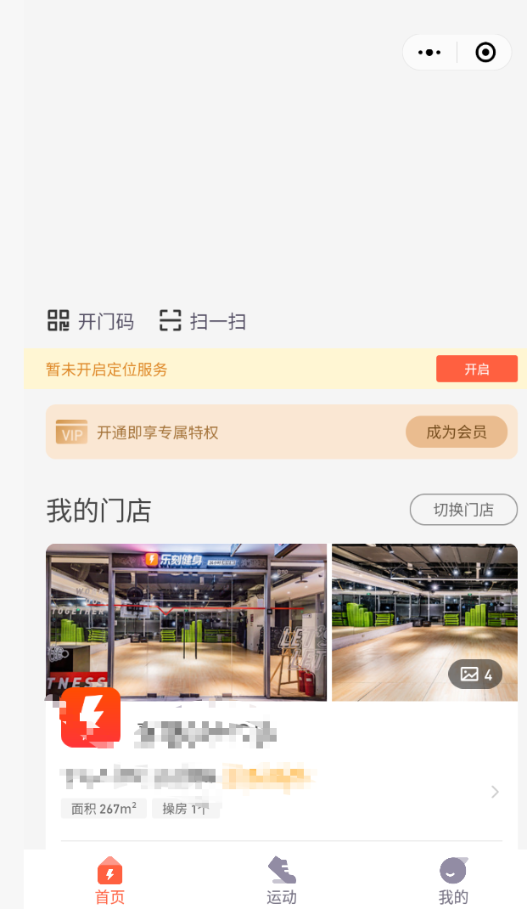
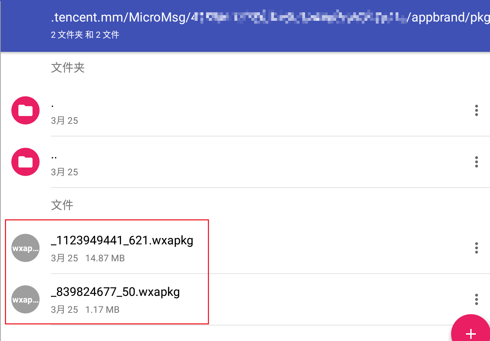
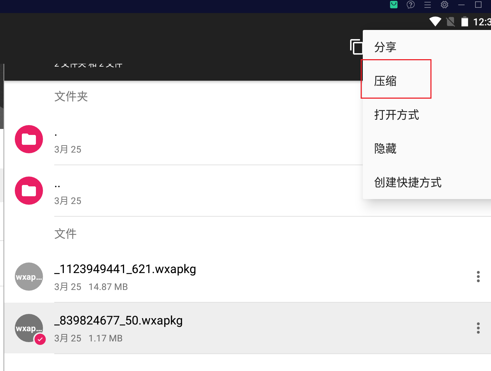
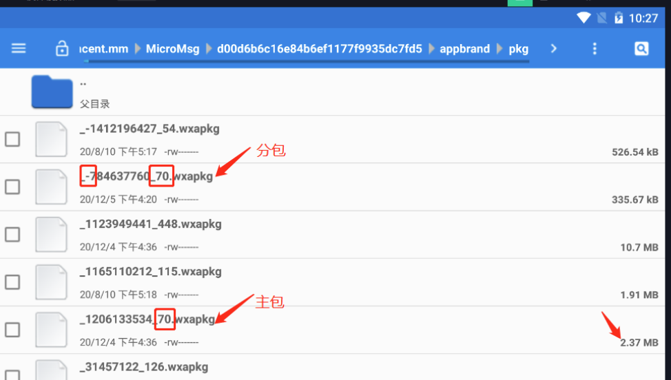
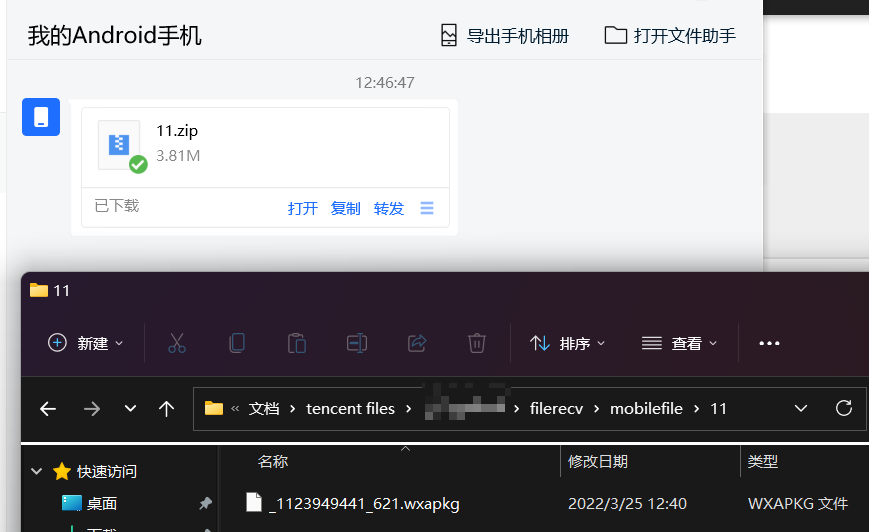
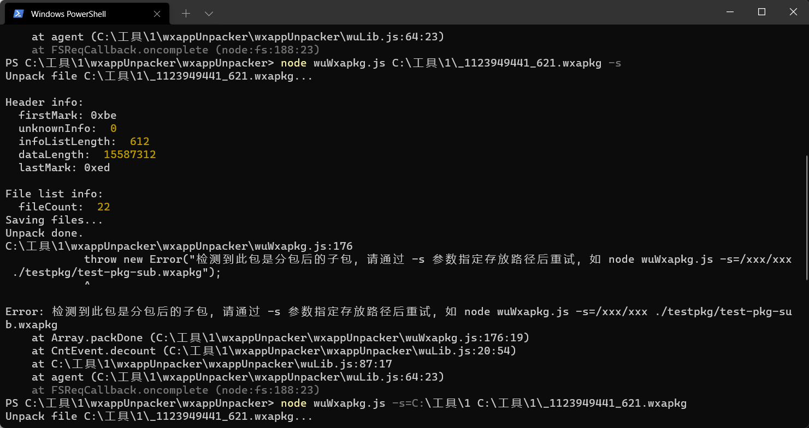
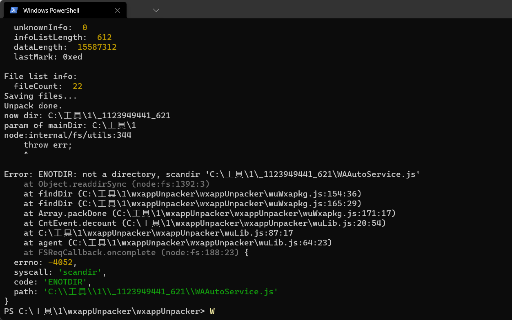
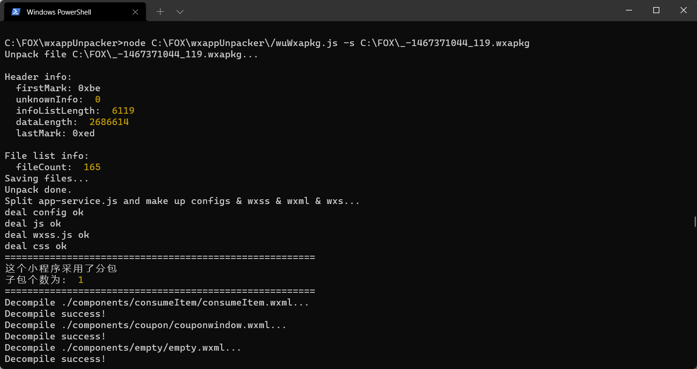
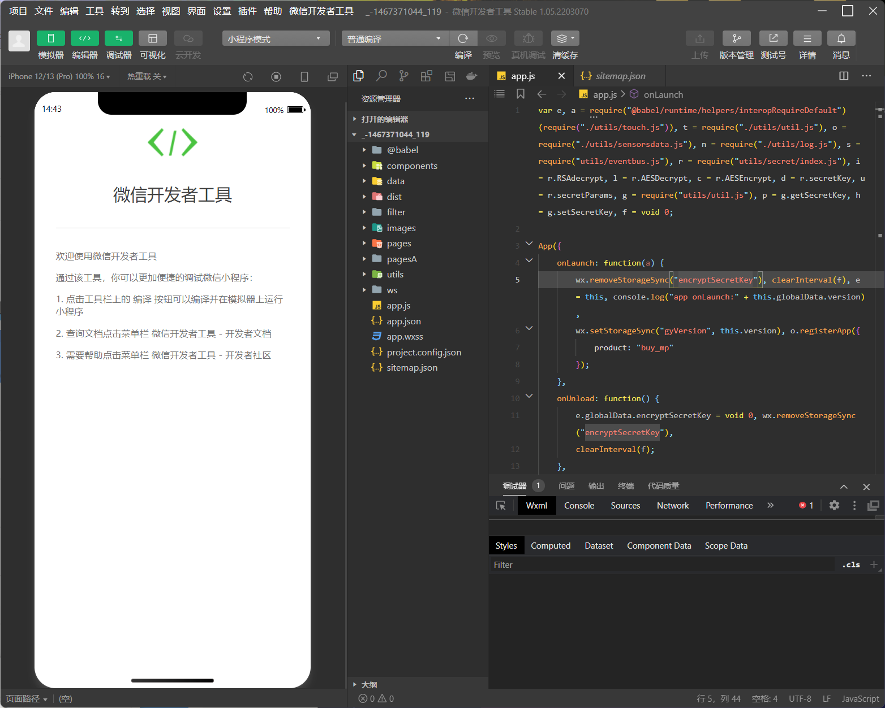

# 漏洞挖掘之小程序反编译接口获取

## 工具

nodejs下载链接：https://nodejs.org/zh-cn/download/

依赖包：
```bash
npm install esprima
npm install css-tree
npm install cssbeautify
npm install vm2
npm install uglify-es
npm install js-beautify
```

反编译脚本wxappUnpacker
    https://github.com/GxBSXUKing/wxappUnpacker.git

wxapp脚本版:
    aHR0cHM6Ly91a20wMjhrenlyLmZlaXNodS5jbi9kb2NzL2RvY2NuVzF3M3Z3cGNualRlVFlLY2RFcmp0Sw==

微信开发者工具
    https://developers.weixin.qq.com/miniprogram/dev/devtools/download.html


2、小程序抓取

这里我使用夜神模拟器安装微信对小程序进行操作,这里随便抓一个 我喜欢健身 所以抓个乐刻的

点击进去后:




打开安卓模拟器的RE文件管理器
路径：`/data/data/com.tencent.mm/MicroMsg/xxx/appbrand/pkg/`

如果是单个文件 对一下下载时间。



咱也不懂是那个 咱都下载下来看看，复制到其他文件夹后，长嗯数据包后



注意区别主包和副包




点击右上角压缩为压缩包，然后TIM传给电脑



解压刚刚下载好的反编译工具，并且打开cmd命令窗口输入命令

```
node wuWxapkg.js XXX\XXX\XXX\_1111.wxapkg
```






**脚本**

```
解主包：./bingo.bat testpkg/_-1641294689_339.wxapkg


 解分包命令格式：./bingo.bat 分包.wxapkg -s=主包目录

./bingo.bat testpkg/_-1152625023_339.wxapkg -s=_-1641294689_339
```



导入小程序开发即可看到源码。这里挺可惜的主包没有找到但是过程就是这样。




最后合并分包文件夹内容，成功获取小程序前端源码。


**学习**

- https://www.52pojie.cn/forum.php?mod=viewthread&tid=1200554

