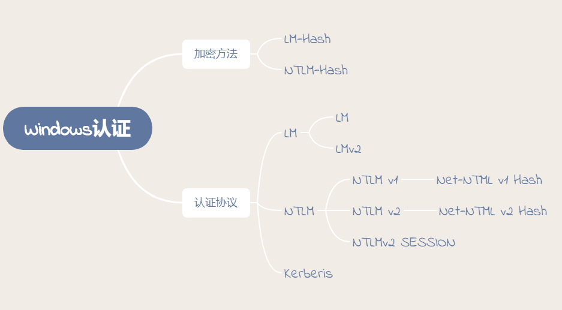
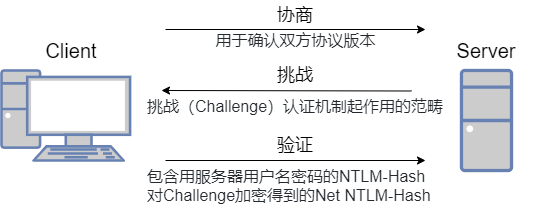

# Windows协议-NTLM

## 网络认证

### LM

LM 与 NTLM 协议的认证机制相同，但是加密算法不同。

目前大多数的 Windows 都采用 NTLM 协议认证，LM 协议已经基本淘汰了。

---

### NTLM

#### NTLM Hash

为了解决`LM`加密和身份验证方案中固有的安全弱点，Microsoft 于1993年在Windows NT 3.1中引入了NTLM协议。下面是各个版本对LM和NTLM的支持。

|       | 2000  | XP | 2003 | Vista | Win7 | 2008 | Win8 | 2012 |
| -     | -     | -  |  -   |   -   |  -   |  -   |  -   |  -   |
| LM    | ✔     | ✔  |  ✔  |       |      |      |      |      |
| NTLM  | ✖ | ✖ | ✖ |   ✔   |  ✔  |   ✔  |   ✔  |   ✔  |

---

| ✔ | 系统默认使用的加密方式         |
| -  | -                          |
| ✖ | **当密码超过14位时使用的加密方式** |

也就是说从Windows Vista 和 Windows Server 2008开始，默认情况下只存储NTLM Hash，LM Hash将不再存在。

**接下来讲下NTLM Hash的计算**

1. 先将用户密码转换为十六进制格式。

2. 将十六进制格式的密码进行Unicode编码。

3. 使用MD4摘要算法对Unicode编码数据进行Hash计算

#### NTLM 认证

NTLM 使用在 Windows NT 和 Windows 2000 Server(or later)`工作组环境中`(Kerberos 用在域模 式下)。

在 AD 域环境中，如果需要认证 Windows NT 系统，也必须采用 NTLM。相比 Kerberos，基于 NTLM 的认证过程要简单很多。

[利用PDF文件获取Net-NTLM hash](https://3gstudent.github.io/%E6%B8%97%E9%80%8F%E6%8A%80%E5%B7%A7-%E5%88%A9%E7%94%A8PDF%E6%96%87%E4%BB%B6%E8%8E%B7%E5%8F%96Net-NTLM-hash)

**NTLM身份验证**

NTLM验证是一种 `Challenge/Response` 验证机制，由三种消息组成。

1. 客户端需要访问服务器的某个服务(前提是他得知道服务器的用户名和密码)，所以得进行身份认证。于是，客户端输入服务器的用户名和密码进行验证，客户端会缓存服务器密码的 NTLM-Hash 值。客户端发送 TYPE 1 Negotiate 协商消息去协商需要认证的主体，用户(服务器端的用户名)，机器以及需要使用的安全服务等等信息。

2. 服务端接收到客户端发送过来的 TYPE 1 消息，会读取其中的内容，并从中选择出自己所能接受的服务内容，加密等级，安全服务等等。然后传入 NTLM SSP，得到 NTLM_CHALLENGE 消息（被称为 TYPE 2 消息，Challenge 挑战消息），并将此 TYPE 2 消息发回给客户端。此TYPE 2消息中包含了一个由服务端生成的 16 位随机值，此随机值被称为 Challenge，服务器将该 Challenge 保存起来。

3. 客户端收到服务端返回的 TYPE 2 消息， 读取出服务端所支持的内容，并取出其中的随机值 Challenge，用缓存的服务器端密码的哈希值 NTLM-Hash 对其进行加密，得到 Net NTLM-Hash(加密后的 Challenge)，并且将 Net NTLM-Hash 封装到 NTLM_AUTH 消息中（被称为 TYPE 3 消息， Authenticate 认证消息），发往服务端。

4. 服务器在收到 Type3 的消息之后，用自己的密码的 NTLM-Hash 对 Challenge 进行加密，并比较自己计算出的 Net NTLM-Hash 认证消息和客户端发送的认证消息是否匹配。如果匹配，则证明客户端掌握了正确的密码，认证成功，否则认证失败。

**详细过程**

**1. type 1** 协商

这个过程是客户端向服务器发送type 1(协商)消息,它主要包含客户端支持和服务器请求的功能列表。

主要包含以下结构

-+

- 质询：就是挑战（Chalenge）/响应（Response）认证机制起作用的范畴。

- 验证：验证主要是在质询完成后，验证结果，是认证的最后一步。

