# 内网知识1-3

> 本文作者:[XiDanEr](https://github.com/xidaner) 更新日期 2021年8月2日

---

## 前言

本章主要介绍NTLM协议

* NTLM
  * NTLM Hash
  * NTLM 认证
  * NTLMv2
  * Net-NTLM Hash
  * NTLM 认证方式(域环境中)

---

### NTLM


#### NTLM Hash

为了解决`LM`加密和身份验证方案中固有的安全弱点，Microsoft 于1993年在Windows NT 3.1中引入了NTLM协议。下面是各个版本对LM和NTLM的支持。

|       | 2000  | XP | 2003 | Vista | Win7 | 2008 | Win8 | 2012 |
| -     | -     | -  |  -   |   -   |  -   |  -   |  -   |  -   |
| LM    | ✔     | ✔  |  ✔  |       |      |      |      |      |
| NTLM  | ✖ | ✖ | ✖ |   ✔   |  ✔  |   ✔  |   ✔  |   ✔  |

---

| ✔ | 系统默认使用的加密方式         |
| -  | -                          |
| ✖ | **当密码超过14位时使用的加密方式** |

也就是说从Windows Vista 和 Windows Server 2008开始，默认情况下只存储NTLM Hash，LM Hash将不再存在。

**接下来讲下NTLM Hash的计算**

1. 先将用户密码转换为十六进制格式。

2. 将十六进制格式的密码进行Unicode编码。

3. 使用MD4摘要算法对Unicode编码数据进行Hash计算


#### NTLM 认证

NTLM 使用在 Windows NT 和 Windows 2000 Server(or later)`工作组环境中`(Kerberos 用在域模 式下)。

在 AD 域环境中，如果需要认证 Windows NT 系统，也必须采用 NTLM。相比 Kerberos，基于 NTLM 的认证过程要简单很多。

[利用PDF文件获取Net-NTLM hash](https://3gstudent.github.io/%E6%B8%97%E9%80%8F%E6%8A%80%E5%B7%A7-%E5%88%A9%E7%94%A8PDF%E6%96%87%E4%BB%B6%E8%8E%B7%E5%8F%96Net-NTLM-hash)


**NTLM身份验证**

NTLM验证是一种 `Challenge/Response` 验证机制，由三种消息组成。

1. 客户端需要访问服务器的某个服务(前提是他得知道服务器的用户名和密码)，所以得进行身份认证。于是，客户端输入服务器的用户名和密码进行验证，客户端会缓存服务器密码的 NTLM-Hash 值。客户端发送 TYPE 1 Negotiate 协商消息去协商需要认证的主体，用户(服务器端的用户名)，机器以及需要使用的安全服务等等信息。

2. 服务端接收到客户端发送过来的 TYPE 1 消息，会读取其中的内容，并从中选择出自己所能接受的服务内容，加密等级，安全服务等等。然后传入 NTLM SSP，得到 NTLM_CHALLENGE 消息（被称为 TYPE 2 消息，Challenge 挑战消息），并将此 TYPE 2 消息发回给客户端。此TYPE 2消息中包含了一个由服务端生成的 16 位随机值，此随机值被称为 Challenge，服务器将该 Challenge 保存起来。

3. 客户端收到服务端返回的 TYPE 2 消息， 读取出服务端所支持的内容，并取出其中的随机值 Challenge，用缓存的服务器端密码的哈希值 NTLM-Hash 对其进行加密，得到 Net NTLM-Hash(加密后的 Challenge)，并且将 Net NTLM-Hash 封装到 NTLM_AUTH 消息中（被称为 TYPE 3 消息， Authenticate 认证消息），发往服务端。

4. 服务器在收到 Type3 的消息之后，用自己的密码的 NTLM-Hash 对 Challenge 进行加密，并比较自己计算出的 Net NTLM-Hash 认证消息和客户端发送的认证消息是否匹配。如果匹配，则证明客户端掌握了正确的密码，认证成功，否则认证失败。

**详细过程**

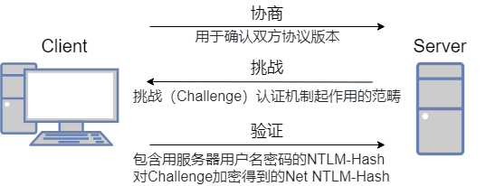

**1. type 1** 协商

这个过程是客户端向服务器发送type 1(协商)消息,它主要包含客户端支持和服务器请求的功能列表。

主要包含以下结构


抓包查看对应的信息如下

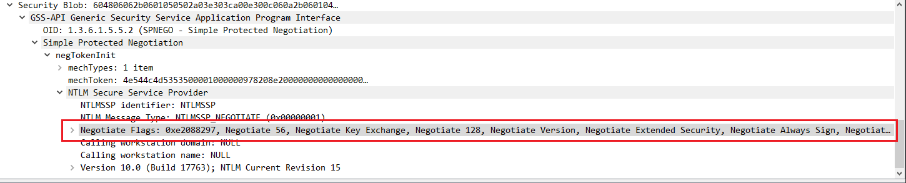

如果想仔细理解每个字段的值请阅读官方文档[NEGOTIATE_MESSAGE](https://docs.microsoft.com/en-us/openspecs/windows_protocols/ms-nlmp/b34032e5-3aae-4bc6-84c3-c6d80eadf7f2)


**2. type 2** 质询
就是挑战（Chalenge）/响应（Response）认证机制起作用的范畴。

主要 包含以下结构

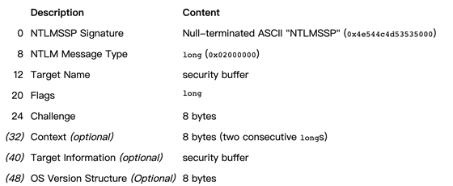

其中最主要的信息是 challenge。后面加密验证依赖于 challenge

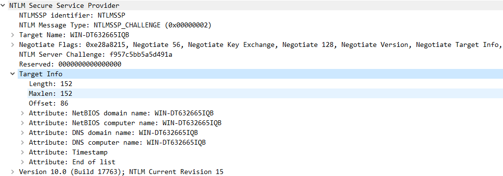

如果想仔细理解每个字段的值请阅读官方文档[CHALLENGE_MESSAGE](https://docs.microsoft.com/en-us/openspecs/windows_protocols/ms-nlmp/801a4681-8809-4be9-ab0d-61dcfe762786)

**3. type 3** 验证
验证主要是在质询完成后，验证结果，是认证的最后一步。消息中的 response 是最关键的部分，因为它向服务器证明客户端用户已经知道帐户密码。

主要包含以下结构

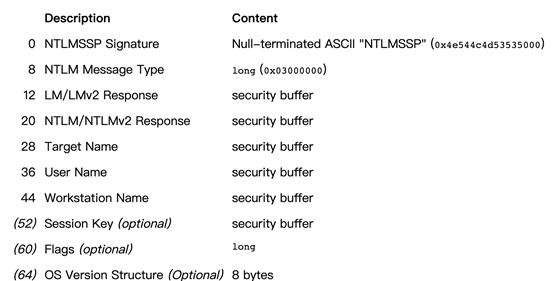

这里的 Challeng 不同于 type2 的 Challenge，这里的 Challenge 是一个随机的客户端 nonce。

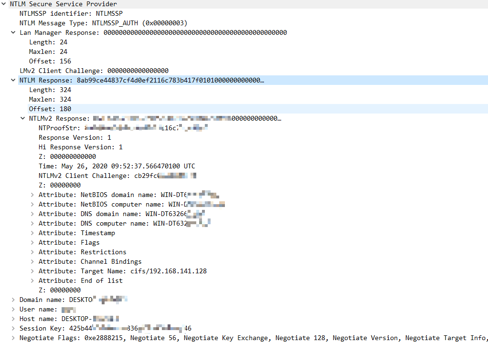

sessionkey 是在要求进行签名的时候用的，用来进行协商加密密钥，可能有些文章会说 sessionkey 就是加密密钥，需要拥有用户 hash 才能计算出来，因此攻击者算不出来，就无法加解密包。但是想想就不可能，这个 session_key 已经在流量里面明文传输，那攻击者拿到之后不就可以直接加解密包了。

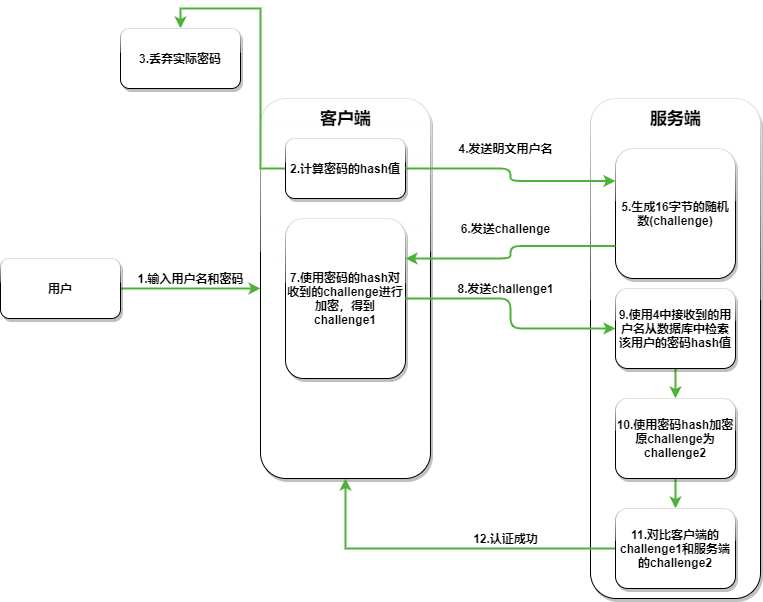

如果想仔细理解每个字段的值请阅读官方文档[AUTHENTICATE_MESSAGE](https://docs.microsoft.com/en-us/openspecs/windows_protocols/ms-nlmp/033d32cc-88f9-4483-9bf2-b273055038ce)

**注意**

1. Chanllenge 是 Server 产生的一个 16 字节的随机数，每次认证都不同
2. Response 的表现形式是 Net-NTLM Hash，它是由客户端提供的密码 Hash 加密 Server 返回的 Chanllenge 产生的结果。


#### NTLMv2

`NTLMv1` 和 `NTLMv2` 的加密因素都是 `NTLM Hash`，而最显著的区别就是 Challenge 和加密算法不同,共同点就是加密的原料都是 `NTLM Hash`。

- Challage： NTLMv1 的 Challenge 有 8 位，NTLMv2 的 Challenge 为 16 位。
- Net-NTLM Hash：NTLMv1 的主要加密算法是 DES，NTLMv2 的主要加密算法是 HMAC-MD5。

设置系统使用 LM 还是 NTLM 还是 NTLMv2，需要修改 `Local Security Policy` 中的 `LmCompatibilityLevel` 选项。

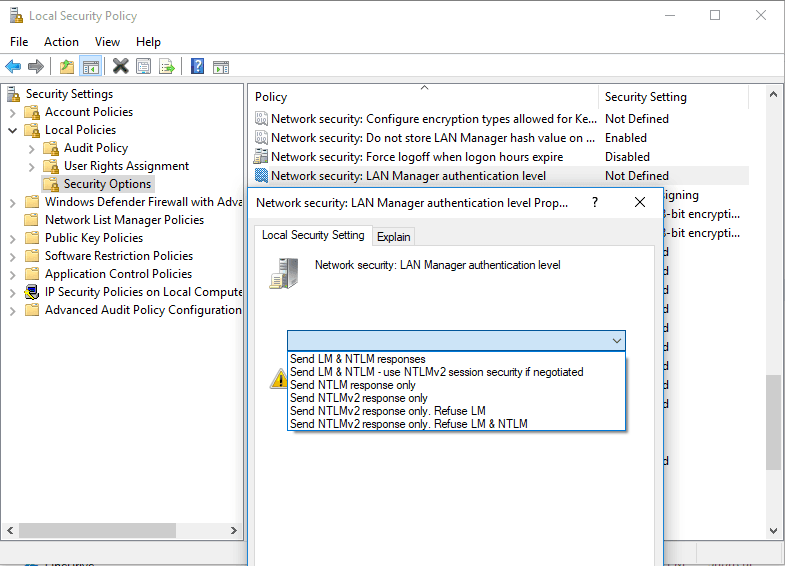

- 发送 LM NTLM 响应: 客户端使用 LM 和 NTLM 身份验证，而决不会使用 NTLMv2 会话安全；域控制器接受 LM、NTLM 和 NTLMv2 身份验证。
- 发送 LM & NTLM – 如果协商一致，则使用 NTLMv2 会话安全: 客户端使用 LM 和 NTLM 身份验证，并且在服务器支持时使用 NTLMv2 会话安全；域控制器接受 LM、NTLM 和 NTLMv2 身份验证。
- 仅发送 NTLM 响应: 客户端仅使用 NTLM 身份验证，并且在服务器支持时使用 NTLMv2 会话安全；域控制器接受 LM、NTLM 和 NTLMv2 身份验证。
- 仅发送 NTLMv2 响应: 客户端仅使用 NTLMv2 身份验证，并且在服务器支持时使用 NTLMv2 会话安全；域控制器接受 LM、NTLM 和 NTLMv2 身份验证。
- 仅发送 NTLMv2 响应\拒绝 LM: 客户端仅使用 NTLMv2 身份验证，并且在服务器支持时使用 NTLMv2 会话安全；域控制器拒绝 LM (仅接受 NTLM 和 NTLMv2 身份验证)。
- 仅发送 NTLMv2 响应\拒绝 LM & NTLM: 客户端仅使用 NTLMv2 身份验证，并且在服务器支持时使用 NTLMv2 会话安全；域控制器拒绝 LM 和 NTLM (仅接受 NTLMv2 身份验证)。

默认下

- Windows 2000 以及 Windows XP: 发送 LM & NTLM 响应
- Windows Server 2003: 仅发送 NTLM 响应
- Windows Vista、Windows Server 2008、Windows 7 以及 Windows Server 2008 R2及以上: 仅发送 NTLMv2 响应


---

#### Net-NTLM(v2) 认证流程

1. 客户端向服务器发送登录请求，密码在客户端被 hash 一次
2. 客户端向服务器发送 username
3. 服务器返回一个 16 字节的挑战码（Challenge），并将已存储的用户密码 hash 加密这个 Challenge，生成 Challenge1
4. 客户端将第一步 hash 的密码与 Challenge 再进行 hash 一次，生成 response 即 Challenge2
5. 客户端将 response 发送给服务器
6. 服务器比较 Challenge1 和 response，相同则认证成功

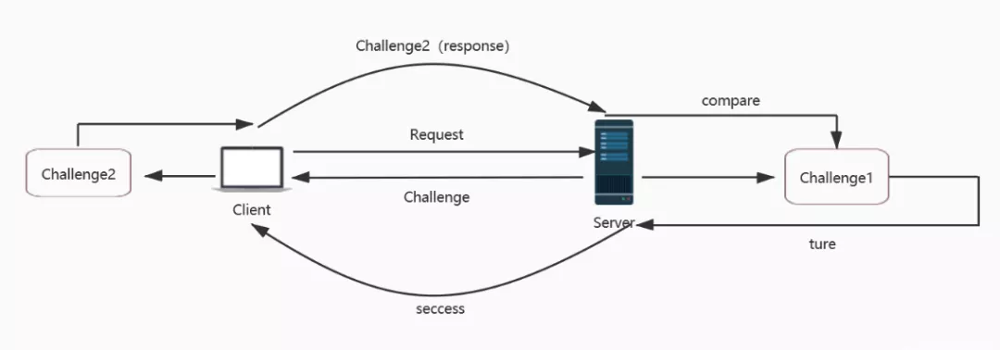

这六种使用的加密流程一样，都是前面我们说的 `Challenge/Response` 验证机制,区别在 `Challenge` 和加密算法不同。

这里我们侧重讲下 `NTLMv1` 和 `NTLMv2` 的区别

---

**Net-NTLM v1 hash**

v1 是将 16字节的 NTLM hash 空填充为 21 个字节，然后分成三组，每组7比特，作为 3DES 加密算法的三组密钥，加密 Server 发来的 Challenge。 将这三个密文值连接起来得到 response。

**Net-NTLM v2 hash**

v2 将 Unicode 后的大写用户名与 Unicode 后的身份验证目标（在 Type 3 消息的”TargetName”字段中指定的域或服务器名称）拼在一起。请注意，用户名将转换为大写，而身份验证目标区分大小写，并且必须与“TargetName”字段中显示的大小写匹配。使用 16 字节 NTLM 哈希作为密钥，得到一个值。

回顾一下流程

1. 客户端向服务器发送一个请求
2. 服务器接收到请求后，生成一个 16 位的 Challenge，发送回客户端
3. 客户端接收到 Challenge 后，使用登录用户的密码 hash 对 Challenge 加密，作为 response 发送给服务器
4. 服务器校验 response

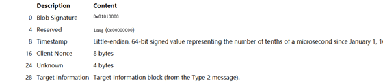


使用 16 字节 NTLMv2 哈希作为密钥，将 HMAC-MD5 消息认证代码算法加密一个值(来自 type 2 的 Challenge 与 Blob 拼接在一起)。得到一个 16 字节的 NTProofStr。

将 NTProofStr 与 Blob 拼接起来形成得到 response。至于选择哪个版本的响应由 LmCompatibilityLevel 决定。

Challenge/Response 验证机制里面 type3 response 里面包含 `Net-ntlm hash`，`NTLM v1` 响应和 NTLMv2 响应对应的就是 `Net-ntlm hash` 分为 `Net-ntlm hash v1 `和 `Net-ntlm hash v2`。

Net-ntlm hash v1 的格式为：
> username::hostname:LM response:NTLM response:challenge

Net-ntlm hash v2 的格式为：
> username::domain:challenge:HMAC-MD5:blob

下面演示从 response 里面提取 NTLMv2

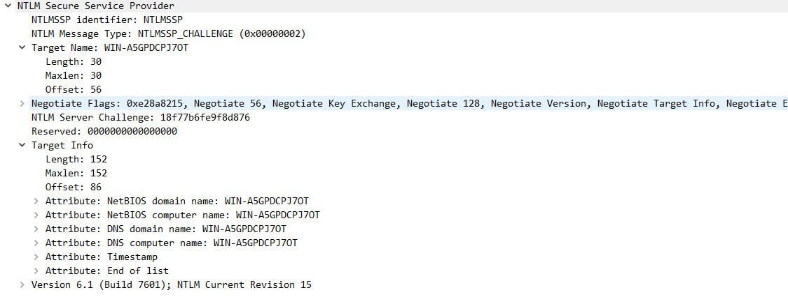

这里的 challenge 是 type2 服务器返回的 challenge 不是 type3 流量包里面的 client Challenge

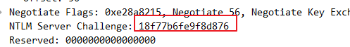

就是 18f77b6fe9f8d876

HMAC-MD5 对应数据包中的 NTProofSt : 0ecfccd87d3bdb81713dc8c07e6705b6

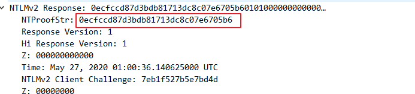

blob 就是 response 减去 NTProofStr。(因为在计算 response 的时候，response 就是由 NTProofStr 加上 blob)

- username（要访问服务器的用户名）：Administrator
- domain（访问者主机名或者 ip）：DESKTOP-QKM4NK7
- challenge（数据包 2 中服务器返回的 challenge 值）：18f77b6fe9f8d876
- HMAC-MD5（数据包 3 中的 NTProofStr）: 0ecfccd87d3bdb81713dc8c07e6705b6
- blob（blob 对应数据为 NTLMv2 Response 开头去掉 NTProofStr 的后半部分）：`01010000000000002a470d3bc233d6017eb1f527b5e7bd4d0000000002001e00570049004e002d0041003500470050004400430050004a0037004f00540001001e00570049004e002d0041003500470050004400430050004a0037004f00540004001e00570049004e002d0041003500470050004400430050004a0037004f00540003001e00570049004e002d0041003500470050004400430050004a0037004f005400070008002a470d3bc233d601060004000200000008003000300000000000000001000000002000003737fbe7dbcbd2c8e5d7a030f44586c91423d9c5202f827f3f6cf26f69adbfe80a001000000000000000000000000000000000000900280063006900660073002f003100390032002e003100360038002e003100340031002e003100330039000000000000000000`

所以最后，Net-NTLM v2 Hash 值为：
```
Administrator::DESKTOP-QKM4NK7:18f77b6fe9f8d876:0ecfccd87d3bdb81713dc8c07e6705b6:01010000000000002a470d3bc233d6017eb1f527b5e7bd4d0000000002001e00570049004e002d0041003500470050004400430050004a0037004f00540001001e00570049004e002d0041003500470050004400430050004a0037004f00540004001e00570049004e002d0041003500470050004400430050004a0037004f00540003001e00570049004e002d0041003500470050004400430050004a0037004f005400070008002a470d3bc233d601060004000200000008003000300000000000000001000000002000003737fbe7dbcbd2c8e5d7a030f44586c91423d9c5202f827f3f6cf26f69adbfe80a001000000000000000000000000000000000000900280063006900660073002f003100390032002e003100360038002e003100340031002e003100330039000000000000000000
```

上面的 Net-NTLM v2 Hash 值若使用 hashcat 爆破应为 Abcd1234

---

#### NTLM 认证方式(域环境中)

1. 用户通过输入Windows帐号和密码登录客户端主机，客户端会缓存密码的哈希值NTLM-Hash。成功登录客户端的用户如果试图访问服务器资源，需要向对方发送一个请求，该请求利用 NTLM SSP 生成 NTLM_NEGOTIATE 消息 （被称为 TYPE 1 消息，Negotiate 协商消息），并将 TYPE 1 消息发送给服务端中，该TYPE 1消息中包含一个以明文表示的用户名以及其他的一些协商信息(认证的主体，机器以及需要使用的安全服务等等信息)

2. 服务端接收到客户端发送过来的 TYPE 1 消息，会读取其中的内容，并从中选择出自己所能接受的服务内容，加密等级，安全服务等等。然后传入 NTLM SSP，得到 NTLM_CHALLENGE 消息（被称为 TYPE 2 消息，Challenge 挑战消息），并将此TYPE 2消息发回给客户端。此TYPE 2消息中包含了一个由服务端生成的16位随机值，此随机值被称为 Challenge，服务器将该Challenge保存起来。

3. 客户端收到服务端返回的 TYPE 2 消息， 读取出服务端所支持的内容，并取出其中的随机值Challenge，用缓存的密码的哈希值NTLM-Hash对其进行加密，得到 Net NTLM-Hash(加密后的Challenge)，并且将Net NTLM-Hash封装到 NTLM_AUTH 消息中（被称为 TYPE 3 消息， Authenticate认证消息），发往服务端。

4. 服务器接收到客户端发送来的 NTLM_AUTH 的 TYPE 3 消息后，取出其中的Net NTLM-Hash值，并向DC域控（Domain Control）发送针对客户端的验证请求。该请求主要包含以下三方面的内容：客户端用户名、原始的Challenge 和 加密后的Challenge(也就是Net NTLM-Hash)。

5. DC根据用户名获取该帐号的密码哈希值 NTLM-Hash，用密码哈希值 NTLM-Hash 对原始的Challenge进行加密得到Net NTLM-Hash。如果加密后的Challenge和服务器发送的一致，则意味着用户拥有正确的密码，验证通过，否则验证失败。DC将验证结果发给服务器。

6. 服务器根据DC返回的结果，对客户端进行回复。

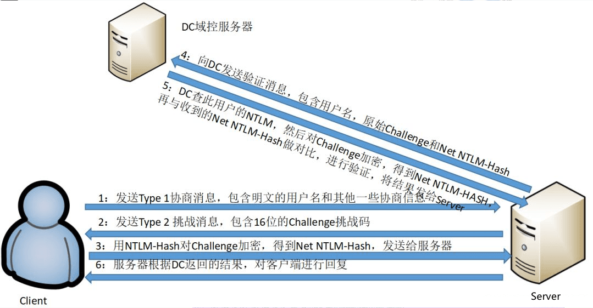

---

## 总结

本次我们学习了以下知识点

* NTLM Hash 计算算法
* NTLM 身份验证过程
* `NTLMv1` 和 `NTLMv2` 的区别
* Net-NTLM Hash
* 域环境中 NTLM 认证方式

---

## 扩展阅读

* https://www.anquanke.com/post/id/193149
* https://en.hackndo.com/ntlm-relay/
* https://www.anquanke.com/post/id/193149#h2-4
* https://3gstudent.github.io/%E6%B8%97%E9%80%8F%E6%8A%80%E5%B7%A7-%E5%88%A9%E7%94%A8PDF%E6%96%87%E4%BB%B6%E8%8E%B7%E5%8F%96Net-NTLM-hash