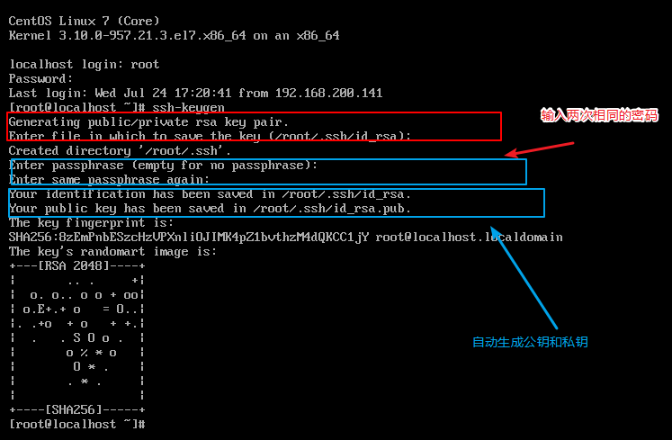
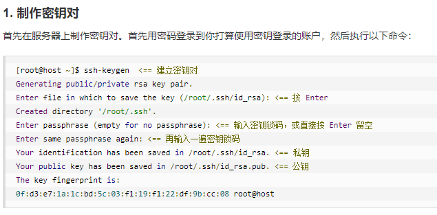
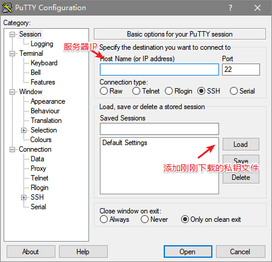
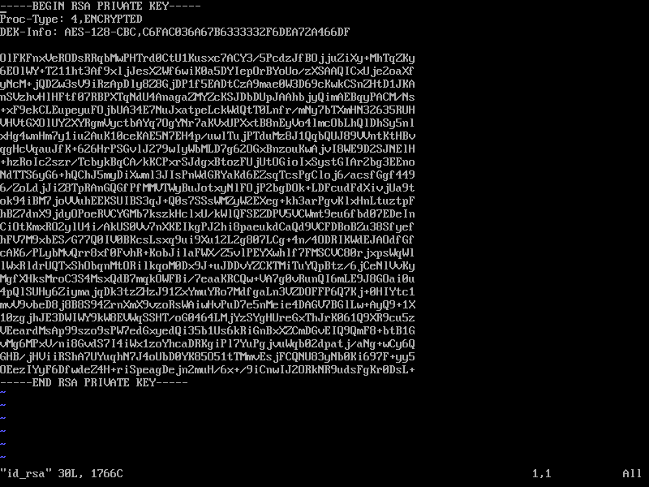

# 设置 SSH 通过密钥登录

## SSH公钥和私钥加密的目的

> 我们一般使用 PuTTY 等 SSH 客户端来远程管理 Linux 服务器。但是，一般的密码方式登录，容易有密码被暴力破解的问题。所以，一般我们会将 SSH 的端口设置为默认的 22 以外的端口，或者禁用 root 账户登录。其实，有一个更好的办法来保证安全，而且让你可以放心地用 root 账户从远程登录——那就是通过密钥方式登录。

密钥形式登录的原理是：`利用密钥生成器制作一对密钥——``一只公钥和一只私钥`。将`公钥添加到服务器的某个账户上`，然后在客户端`利用私钥即可完成认证并登录`。这样一来，`没有私钥，任何人都无法通过 SSH 暴力破解你的密码来远程登录到系统。`此外`，如果将公钥复制到其他账户甚至主机，利用私钥也可以登录。`

下面来讲解如何在 Linux 服务器上制作密钥对，将公钥添加给账户，设置 SSH，最后通过客户端登录。

## 1.制作密钥

```
 ssh-keygen  <== 建立密钥对
Generating public/private rsa key pair.
Enter file in which to save the key (/root/.ssh/id_rsa): <== 按 Enter
Created directory '/root/.ssh'.
Enter passphrase (empty for no passphrase): <== 输入密钥锁码，或直接按 Enter 留空 (123123)
Enter same passphrase again: <== 再输入一遍密钥锁码(123123)
Your identification has been saved in /root/.ssh/id_rsa. <== 私钥
Your public key has been saved in /root/.ssh/id_rsa.pub. <== 公钥
The key fingerprint is:
0f:d3:e7:1a:1c:bd:5c:03:f1:19:f1:22:df:9b:cc:08 root@host
111
```
>如下图所示 出现这样就算安装完成了





>这里放两张帮助理解

## 2.在服务器上安装公钥

键入以下命令，在`服务器上安装公钥`：

```
[root@host ~]$ cd .ssh
[root@host .ssh]$ cat id_rsa.pub >> authorized_keys
```
如此便完成了公钥的安装。为了确保连接成功，请保证以下文件权限正确：
```
[root@host .ssh]$ chmod 600 authorized_keys
[root@host .ssh]$ chmod 700 ~/.ssh
```
查看权限
` ls -l`

## 3. 设置 SSH，打开密钥登录功能 

>以下设置中yes和no 都不能大写

编辑 
```
 vim/etc/ssh/sshd_config 
 ```
 文件，进行如下设置：
```
RSAAuthentication yes
PubkeyAuthentication yes
```
另外，请留意 root 用户能否通过 SSH 登录：
```
PermitRootLogin yes
```

重启SSH服务

```
systemctl restart sshd
```

## 4. 链接到SSH
使用xshell
http://www.downza.cn/soft/235505.html
等工具将私钥文件 
id_rsa 下载到客户端机器上

ssh链接到后
```
rz -be，
```
>会将windows的文件传到linux服务器

运行
```
sz filename
```
，会将文件下载到windows本地

rz -be file文件目录
输入

在linu文件位置输入：pwd,获取当前路径
 ```
sz  服务器的file路径。
```
例如
```
sz /home/linyimeng/game/liantong2018/data/result_xgbc_dummey2_fenxiang.csv
```
会自动弹出窗口，选中本地要存放的文件位置

当你完成全部设置，并以密钥方式登录成功后，再禁用密码登录：
```
vim /etc/ssh/sshd_config
```
寻找第14行 
```
PasswordAuthentication no
```
然后重启服务
```
systemctl restart sshd
```

## 5 链接

下载putty链接到服务器
http://www.onlinedown.net/soft/2186.htm

> 然后打开` PuTTYGen`，单击` Actions` 中的 `Load `按钮，载入你刚才下载到的私钥文件。如果你刚才设置了密钥锁码，这时则需要输入。<br>

<h2>Putty：


<h2>xshell


下图为私钥文件内容



载入成功后，PuTTYGen 会显示密钥相关的信息。在` Key comment` 中键入对密钥的说明信息，然后单击 `Save private key 按钮即可将私钥文件存放为 PuTTY 能使用的格式。`

