# 简介

感谢[RyuZU](https://github.com/RyuZUSUNC)提供的学习笔记。

AES，全称Advanced Encryption Standard(高级加密标准)，又称 Rijndael 加密法，是美国联邦政府采用的一种分组加密密标准。这个标准用来替代原先老旧并且不安全的DES，已经被多方分析且广为全世界所使用。现在，高级加密标准已然成为对称密钥加密中最流行的算法之一。

# 前置知识
在了解AES的原理之前，让我们对下文可能出现的一些关键词做一个基本的了解。这些关键词同样也适用于许多其他的加密方式中。

## 分组加密体制
所谓分组加密体制就是指将明文切成一段一段的来加密，然后再把一段一段的密文拼起来形成最终密文的加密方式。与之相对的还有流加密，在此不详细展开。

AES加密会首先把明文切成一段一段的，而且每段数据的长度要求非常严格，必须是AES规定的长度，然后分别对每段数据进行加密，最后再把每段加密数据拼起来形成最终的密文，AES的密钥长度可以是128位16个字节、192位或256位，通常采用需要初始向量IV的CBC模式，初始向量的长度通常和密钥的长度相等。

## 工作模式
工作模式描述了加密每一数据块的过程，并常常使用基于一个通常称为初始化向量的附加输入值以进行随机化，以保证安全。一般常见的工作模式由以下这5种

- ECB：Electronic CodeBook mode（电子密码模式）
- CBC：Cipher Block Chaining mode（密码分组链接模式）
- CFB：Cipher FeedBack mode（密文反馈模式）
- OFB：Output FeedBack mode（输出反馈模式）
- CTR：CounTeR mode（计数器模式）

我们在这里对最基本的ECB和CBC模式做一个解析：

### ECB（电子密码模式）
ECB模式是最基本的加密模式，即仅仅使用明文和密钥来加密数据，相同的明文块会被加密成相同的密文块，这样明文和密文的结构将是完全一样的，就会更容易被破解，相对来说不是那么安全，因此很少使用。

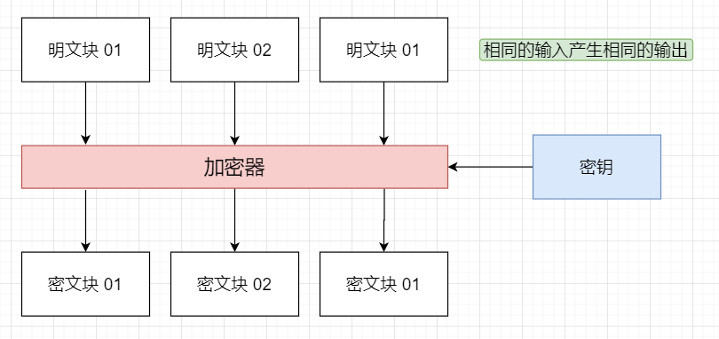

### CBC（密码分组链接模式）
而CBC模式则比ECB模式多了一个初始向量IV，加密的时候，第一个明文块会首先和初始向量IV做异或操作，然后再经过密钥加密，然后第一个密文块又会作为第二个明文块的加密向量来异或，依次类推下去，这样相同的明文块加密出的密文块就是不同的，明文的结构和密文的结构也将是不同的，因此更加安全，我们常用的就是CBC加密模式。

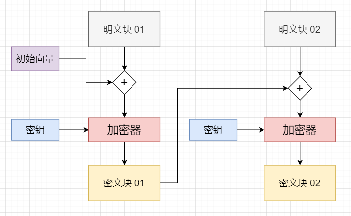

## 填充方式(Padding)
因为对称密钥加密设计的块密码工作模式要求输入明文长度必须是块长度的整数倍，因此信息必须填充至满足要求。我们接下来就简单举几个常用的填充方式理解下是如何填充的。

### PKCS5
分组数据缺少几个字节，就在数据的末尾填充几个字节的几，比如缺少5个字节，就在末尾填充5个字节的5。

### PKCS7
分组数据缺少几个字节，就在数据的末尾填充几个字节的0，比如缺少7个字节，就在末尾填充7个字节的0。

### NOPADDING
NoPadding是指不需要填充，也就是说数据的发送方必须保证最后一段数据也正好是一个分组的字节长度。

### 特殊情况
如果在PKCS5模式下，最后一段数据的内容刚好就是16个16怎么办？那解密端就不知道这一段数据到底是有效数据还是填充数据了，因此对于这种情况，PKCS5模式会自动帮我们在最后一段数据后再添加16个字节的数据，而且填充数据也是16个16，这样解密段就能知道谁是有效数据谁是填充数据了。PKCS7最后一段数据的内容是16个0，也是同样的道理。

## 初始向量
初始向量(英语：initialization vector，缩写为IV)，或译初向量，又称初始变量(starting variable，缩写为SV)，是一个固定长度的输入值。一般的使用上会要求它是随机数或拟随机数（pseudorandom）。使用随机数产生的初始向量才能达到语义安全（消息验证码也可能用到初始向量），并让攻击者难以对原文一致且使用同一把密钥生成的密文进行破解。

## 密钥
在密码学中，密钥(key)是指某个用来完成加密、解密、完整性验证等密码学应用的秘密信息。在对称密码学中，加密和解密用的是同一个钥匙，因此钥匙需要保密。

## S盒
在密码学中，一个S盒(Substitution-box，替换盒)是对称密钥加密算法执行替换计算的基本结构。在块密码中，它们通常用于模糊密钥与密文之间的关系。

通常，S-Box接受特定数量的输入比特m，并将其转换为特定数量的输出比特n，其中n 不一定等于m。一个m×n的S盒可以通过包含2m条目，每条目n比特的查找表实现。S盒通常是固定的(例如DES和AES加密算法), 也有一些加密算法的S盒是基于密钥动态生成的(例如Blowfish和双鱼算法加密算法)。

# AES原理
AES对密钥的长度与明文块分组的长度都有着严格的要求，根据密钥长度的不同与之相对应的每个明文区块的加密轮数也不同。具体可见下表。

AES   	|密钥长度(位)	|分组长度(位)	|加密轮数
-|-|-|-
AES-128	    |128	                  |128	                |10
AES-192	    |192	                  |128	                |12
AES-256	    |256	                  |128	                |14

AES的加密步骤如下图：

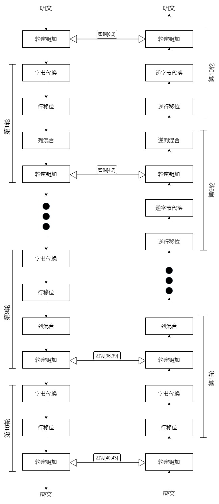

主要分为四个步骤
- 密钥扩展
- 初始加密
- 重复加密
- 最终加密

以下将以128位密钥的AES为例讲解这四个步骤。

## 密钥扩展
这一步是对密钥做操作，由于AES加密的10轮中每轮需要的密钥各不相同，所以这一步就是将我们输入的密钥扩展为11个用于对每轮的加密。

AES首先将初始密钥输入到一个44的状态矩阵中，如下图所示。

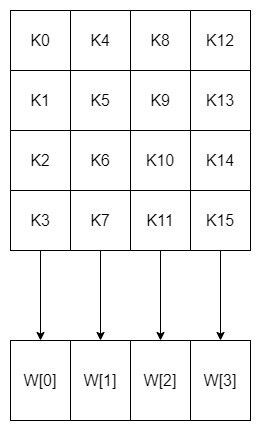

这个44矩阵的每一列的4个字节组成一个字，矩阵4列的4个字依次命名为W[0]、W[1]、W[2]和W[3]，它们构成一个以字为单位的数组W。

例如，设密钥K为"abcdefghijklmnop",则K0 = ‘a’,K1 = ‘b’, K2 = ‘c’,K3 = ‘d’,W[0] = “abcd”。

接着，对W数组扩充40个新列，构成总共44列的扩展密钥数组。新列以如下的递归方式产生：

1. 如果i不是4的倍数，那么第i列由如下等式确定：
- W[i]=W[i-4]⨁W[i-1]
2. 如果i是4的倍数，那么第i列由如下等式确定：
- W[i]=W[i-4]⨁T(W[i-1])

其中，T是一个有点复杂的函数。

函数T由3部分组成：字循环、字节代换和轮常量异或，这3部分的作用分别如下。

- 字循环：将1个字中的4个字节循环左移1个字节。即将输入字[b0, b1, b2, b3]变换成[b1,b2,b3,b0]。
- 字节代换：对字循环的结果使用S盒进行字节代换。
- 轮常量异或：将前两步的结果同轮常量Rcon[j]进行异或，其中j表示轮数。

轮常量Rcon[j]是一个字，其值见下表。

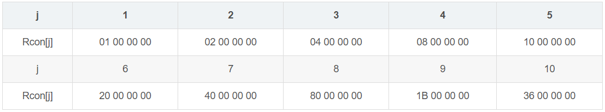

下面举个例子

设初始的128位密钥为：

```
3C A1 0B 21 57 F0 19 16 90 2E 13 80 AC C1 07 BD
```

那么4个初始值为：

```
W[0] = 3C A1 0B 21
W[1] = 57 F0 19 16
W[2] = 90 2E 13 80
W[3] = AC C1 07 BD
```

下面求扩展的第1轮的子密钥(W[4],W[5],W[6],W[7])。
由于4是4的倍数，所以：
W[4] = W[0] ⨁ T(W[3])

T(W[3])的计算步骤如下：

循环地将W[3]的元素移位：AC C1 07 BD变成C1 07 BD AC;

将 C1 07 BD AC 作为S盒的输入，输出为78 C5 7A 91;

将78 C5 7A 91与第一轮轮常量Rcon[1]进行异或运算，将得到79 C5 7A 91，因此，T(W[3])=79 C5 7A 91，故
W[4] = 3C A1 0B 21 ⨁ 79 C5 7A 91 = 45 64 71 B0

其余的3个子密钥段的计算如下：

```
W[5] = W[1] ⨁ W[4] = 57 F0 19 16 ⨁ 45 64 71 B0 = 12 94 68 A6
W[6] = W[2] ⨁ W[5] =90 2E 13 80 ⨁ 12 94 68 A6 = 82 BA 7B 26
W[7] = W[3] ⨁ W[6] = AC C1 07 BD ⨁ 82 BA 7B 26 = 2E 7B 7C 9B
```

所以，第一轮的密钥为 45 64 71 B0 12 94 68 A6 82 BA 7B 26 2E 7B 7C 9B。后面轮次的密钥也同理依次计算。

## 初始加密
初始轮就是将128位的明文数据与128位的初始密钥进行异或操作。

## 重复加密(9轮)
重复加密中有4个顺序操作，分别为

- 字节代换
- 行移位
- 列混合
- 轮密钥加

下面对这四步操作做一个详细解释:

### 字节代换
AES的字节代换其实就是一个简单的查表操作。AES定义了一个S盒和一个逆S盒。

- S盒
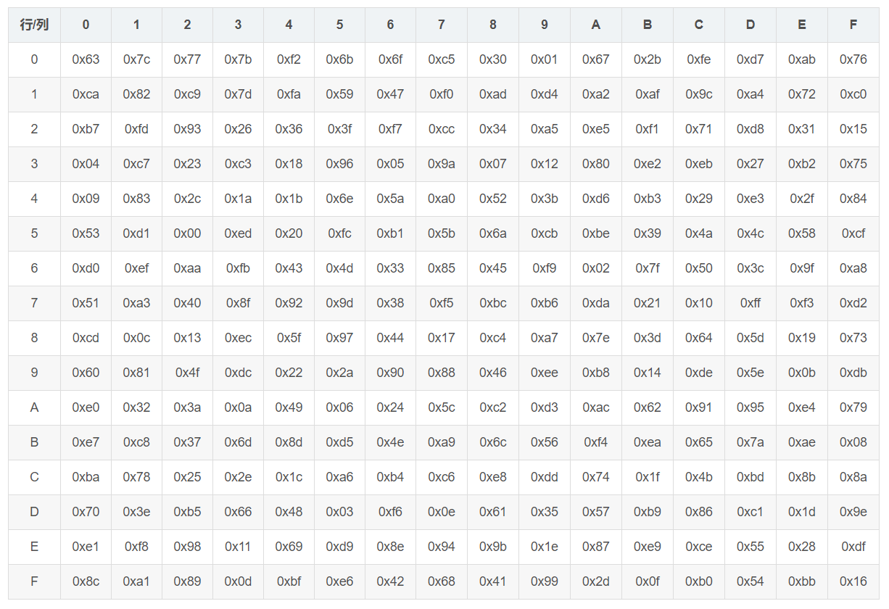

状态矩阵中的元素按照下面的方式映射为一个新的字节：把该字节的高4位作为行值，低4位作为列值，取出S盒或者逆S盒中对应的行的元素作为输出。

例如，加密时，输出的字节S1为0x11,则查S盒的第0x01行和0x01列，得到值0x82,然后替换S1原有的0x11为0x82。

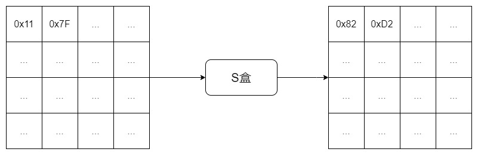

- 逆S盒


加密时使用S盒，解密时自然使用逆S盒。

### 行移位

行移位是一个简单的左循环移位操作。当密钥长度为128比特时，状态矩阵的第0行左移0字节，第1行左移1字节，第2行左移2字节，第3行左移3字节，如下图所示：

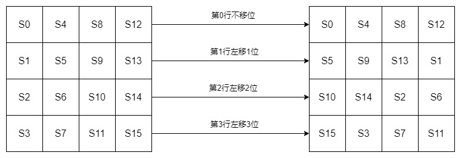

在解密时使用行移位的逆变换，我们称之为逆行移位。

逆行移位是将状态矩阵中的每一行执行相反的移位操作，例如AES-128中，状态矩阵的第0行右移0字节，第1行右移1字节，第2行右移2字节，第3行右移3字节。

### 列混合

列混合变换是通过矩阵相乘来实现的，经行移位后的状态矩阵与固定的矩阵相乘，得到混淆后的状态矩阵，如下图的公式所示：

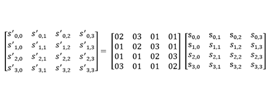

状态矩阵中的第j列(0 ≤j≤3)的列混合可以表示为下图所示：

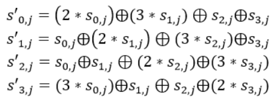

下面举个具体的例子,输入的状态矩阵如下：

```
C9	E5	FD	2B
7A	F2	78	6E
63	9C	26	67
B0	A7	82	E5
```
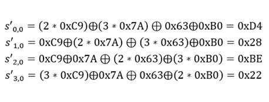

其它列的计算就不列举了，列混合后生成的新状态矩阵如下：

```
D4	E7	CD	66
28	02	E5	BB
BE	C6	D6	BF
22	0F	DF	A5
```

解密时使用列混合逆运算

逆向列混合变换可由下图的矩阵乘法定义：

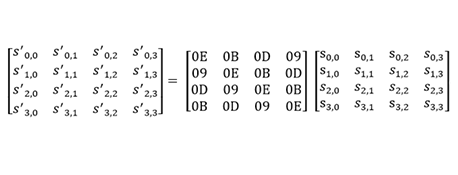

可以验证，逆变换矩阵同正变换矩阵的乘积恰好为单位矩阵。

#### 轮密钥加
轮密钥加是将128位轮密钥Ki同状态矩阵中的数据进行逐位异或操作，如下图所示。

其中，密钥Ki中每个字W[4i],W[4i+1],W[4i+2],W[4i+3]为32位比特字，包含4个字节，他们的生成算法下面在下面介绍。轮密钥加过程可以看成是字逐位异或的结果，也可以看成字节级别或者位级别的操作。也就是说，可以看成S0 S1 S2 S3 组成的32位字与W[4i]的异或运算。


轮密钥加的逆运算同正向的轮密钥加运算完全一致，这是因为异或的逆操作是其自身。轮密钥加非常简单，但却能够影响S数组中的每一位。

## 最终加密(第10轮)
最终加密轮与重复轮基本一致，只是这一轮的加密不执行列混合操作。

最后把每一块加密后的密文拼接起来就能得到AES加密后的信息了。解密同理

# JAVA实现
## 所需jar包介绍
我们使用jdk自带的实现类去快速实现一个AES加密是十分简单的，在这里我们使用javax.crypto包加java.security包的组合，主要是使用crypto包下的Cipher类来实现AES算法。

在许多情况下，密钥的表示形式为HEX编码或者Base64编码的字符串，这时我们将会使用
commons-codec包来对其进行解码，恢复成二进制的状态。

## 具体实现
首先我们来定义一些常量字符串用于之后的初始化与运算

```java
// 密钥算法
private static final String KEY_ALGORITHM = "AES";

// 加解密算法/工作模式/填充方式
private static final String CIPHER_ALGORITHM = "AES/ECB/PKCS5Padding";

// key,128bit
private static final String KEY = "MTIzNDVsYnluYjEyMzQ1MA==";
```

### 密钥生成与初始化
使用javax.crypto.KeyGenerator来随机生成一个密钥
```java
// 实例化密钥生成器
KeyGenerator kg = KeyGenerator.getInstance(KEY_ALGORITHM);

// 初始化密钥生成器，长度为128位
kg.init(128);

// 生成密钥
SecretKey secretKey = kg.generateKey();

// 获取二进制密钥编码形式
String Key = Base64.encodeBase64String(secretKey.getEncoded());

//生成Key对象
Key k = SecretKeySpec(key,KEY_ALGORITHM);
```

### 加密
假设我们需要加密的一串明文为 Message

```java
// 实例化Cipher对象用于完成加密操作
Cipher cipher = Cipher.getInstance(CIPHER_ALGORITHM);

// 初始化Cipher对象，设置为加密模式
cipher.init(Cipher.ENCRYPT_MODE, k);

// 执行加密操作。加密后的结果通常都会用Base64编码或HEX编码进行传输，以下采用Base64
String secretMessage  = Base64.encodeBase64String(cipher.doFinal(message.getBytes()));
```

### 解密
假设我们手上有一串密文 SecretMessage 并且同时有它的密钥 k
```java
//实例化Cipher对象
Cipher cipher = Cipher.getInstance(CIPHER_ALGORITHM);

// 初始化Cipher对象，设置为解密模式
cipher.init(Cipher.DECRYPT_MODE, k);

// 执行解密操作
String message = new String(cipher.doFinal(Base64.decodeBase64(data)));
```

# 结尾
AES加密是非常典型的对称加密，在设计结构及密钥的长度上都已到达保护机密信息的标准。对其高密钥位情况的破解非常困难，使其在至今的加密算法中也依旧是比较优秀的选择。