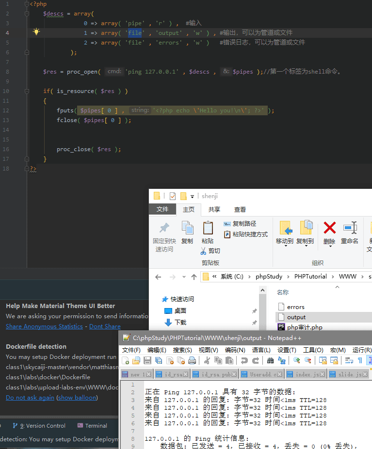

# PHP代码审计中需注意的特殊函数

[常见特殊函数](#常见需要注意的特殊函数)
[命令执行](#shell命令执行函数)
[文件操作函数](#文件操作函数)
[特殊函数](#特殊函数)

## 常见需要注意的特殊函数

1. PHP代码执行函数

    1. `eval函数`   `mixed eval(string $code)`  该函数是把字符串当作PHP代码来执行。(已被列入黑名单)。

    ```php
    <?php @eval($_POST['pass']);?>
    ```
    > 在一个php文件中，eval执行完就会结束，所以当同一个php文件中有多个eval的时候，只会执行第一个。


    2. `assert`函数 `(mixed $assertion[,$string $description])` 由于大多数杀软吧 `eval` 列入黑名单了，所以用 `assert` 来代替 `eval` 函数来执行操作。

    ```php
    <?php $_GET[a]($_GET[b]);?>
    ```

    3. preg_replace($pattern,$replacement,$subject[])
    使用`/e` 修正符使`preg_replace()`将`replacement` 参数作为PHP代码
    ```php
    preg_replace("/test/e"，$_GET["h"],"just test");
    ```
    如果我们提交 `?h=phpinfo()`  , `phpinfo`就会被执行。


    4. string create_function($args,$code)
    创建一个匿名函数，并返回独一无二的函数名
    ```php
    $newfunc=create_function('$v','return system($v);');
    ```   
    `$newfunc('whomai');` 就相当于 `systeam('whoami');`

    5. 回调函数 `call_user_func($callback)` 调用，把参数数组做(param_arr)为回调函数的参数传入。

---

##  shell命令执行函数

|函数|作用|示例(此处command由shell代替)|
|---|---|---|
|exec() | 执行一个外部程序|exec("shell")|
|passthru() |执行外部程序并且显示其原始输出 , 此函数由来替代 exec() 或 system() 函数|passthru("shell")|
|proc_open()|执行一个命令，并且打开用来输入或输出的文件。此函数默认被禁用，需更改PHP.ini|proc_open("shell", $descs,"$pipes")详情见下[1]|
|shell_exec()&``|通过shell环境执行命令，并且将完整的输出以字符串的方式返回。|echo shell_exec("shell");
|system()|执行外部程序，并且无需`echo`可显示执行输出结果|system("shell")|
|popen()|通过popen()的参数传递一条命令，并对popen()所打开的文件进行执行文件执行。|$file = popen("shell","r"); pclose($file); 路径要写全。|
|$_REQUEST|HTTP Request 变量,默认情况下包含了 `$_GET`，`$_POST` 和 `$_COOKIE` 的数组。|$_REQUEST['']|


[1] 对passthru()函数的解析

```php
<?php
    $descs = array(
                0 => array( 'pipe' , 'r' ) ,  #输入
                1 => array( 'file' , 'output' , 'w' ) , #输出，可以为管道或任意文件
                2 => array( 'file' , 'errors' , 'w' )   #错误日志，可以为管道或任意文件
            );

    $res = proc_open( 'ping 127.0.0.1' , $descs , $pipes );//第一个标签为shell命令。

    if( is_resource( $res ) )
    {
        fputs( $pipes[ 0 ] , '<?php  \'shell \n\'; ?>' );//可以执行文件写入内容
        fclose( $pipes[ 0 ] );


        proc_close( $res );
    }
?>
```


可见 命令执行后 将命令输入至output文件。并写一个PHP文件。在CMS中多见。

---

## 文件操作函数

> 可能存在文件包含的函数

|函数|作用|示例|
|---|---|---|
|copy()|拷贝文件|copy('file','newfile')|
|file_get_contents()| 将整个文件读入一个字符串|$h = file_get_contents('http://www.xx.com/'); echo $h|
|file_put_contents()|将一个字符串写入文件|file_put_contents($file, 内容);|
|file|将一整个文件读入一个数组中|$test = file('http://xx.xxx/'); 可以输出web 页面。|
|fopen()|打开文件或者 URL|fopen("文件路径", "r");|
|move_uploaded_file|将上传的文件移动到新位置| move_uploaded_file($tmp_name, "路径/新名称");|


##  特殊函数

**信息泄露**

 `phpinfo()` 大量信息，略。


**软连接- 读取文件内容**

 `symlink($target,$link)` 对于已有的target建立一个name = link的符合连接。

`readlink($path)` 读取并返回连接内容。

**环境变量**

`putenv()`设置环境变量的值。
`getenv()`读取环境变量的值。

示例
```php
var_dump(getenv('test'));//查看test的环境变量的值
putenv('test=123');//设置环境变量
echo "\r\ntest=".getenv('test');//输出环境变量
//此时test的环境变量从 false 变成了 test=123.
```

**数字判断**

`is_numeric($var)` 判断是数字还是数字字符串。是为TRUE 否为FALSE


**列出目录**

`glob()`寻找与模式匹配的文件路径(find)

列：`print_r(glob("*.php"));`查找当前目录下的所有php文件并打印。


**登录等功能**

必定会打开 `session_start()` 函数。


**PHP项目软件**

当项目安装时，头文件会判断是否已经安装过。如果跳转页面不加 `exit` 就有可能存在重装的风险。

```php
if(file_exists($_SERVER["DOCUMENT_ROOT"].'/sys/install.lock')){
    header("Location: ../index.php");
    exit;
}
```
查看是否有信息是不做过滤或者是未作过滤写入配置文件中。


