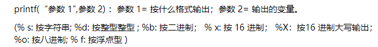

# PHP代码审计之基础篇

- 👴这几年一半的苦难都是™ PHP给👴带来的。

代码审计是一种经验的对抗和压制：如果我知道的东西比你多，经验就能压制你，写出你看的头皮发麻的代码。如果你的功能没有考虑全面，那么就可能会存在漏洞。


## 准备阶段

1. 安装相关软件 工欲善其事必先利其器 一个好的工具可以事半功倍。在阅读和编写PHP建议使用：phpstor、msqlmap、burp等

2. 为了方便环境部署推荐使用集成工具面板：phpstudy(强烈推荐、真的神器。配个PHP和apache/nginx环境真的要老命)、宝塔。

## 代码结构

常见的代码结构有两种

1. MVC架构 

吧代码拆分成 Model、View、Controller 三部分、是一种软件设计的典范，用一种业务逻辑、数据、界面显示分离的方式组织代码，将业务逻辑聚集到一个部件里。
模型一般是数据库操作的相关代码。例如：jsp中的JavaBean来设计数据的属性、提供获取属性的设置属性和 get/set的方法。再传输给处理数据的模型、再由试图页面输出。


这样开发大项目时可以极大缩短时间、让PHP后端设计程序员可以有更长时间去设计逻辑、前端更长时间去设计页面和视图。只要前后端做好接口沟通顺畅即可。MVC的常见表现形式是通常有一个入口文件，这个入口一般是index.php


2. HTML和PHP代码混编，特征就是一个URL对映一个PHP页面，例如 [WorldPress](https://zh-cn.wordpress.com/)。


## 目录架构

- 放引用库的一般叫`librarie，lib，plugin`。
- 中大型PHP项目中还有一个`vendor`文件夹，是PHP的包管理器安装的依赖代码的存放路径。
- 视图代码文件夹名称一般叫`layout，theme，view，template`等等。
- 控制文件一般叫`controller`。
- 公用的一些代码文件夹一般 `common`
- 一些工具函数可能放在 `helper，util，tool`文件夹里
- 配置文件放在`config`文件夹里。
  
## 项目介绍

电商项目：

-  [FecMall](https://github.com/fecshop/yii2_fecshop)

-  [PrestaShop](https://github.com/xidaner/PrestaShop)

-  [OpenCart](https://github.com/opencart/opencart)

-  [joomla-cms](https://github.com/joomla/joomla-cms)


# 审计思考

像面向过程写法的程序，可以找下它的公共函数文件、那些 `include` 多就可以看看。看看有啥可以利用的不，然后就是丢seay审计系统。

而对于基于mvc写法的程序来说，跟读他的index(入口)文件，了解整个程序的运行流程跟目录结构，之后再深入去了解它的核心类库，如果核心类库存在漏洞的话，那在这套程序中找出个漏洞的希望就很大啊！了解了整个框架运行流程后，也没从核心类库中发现什么可利用的点的话，这时就可以从功能点入手了(这时可以把源码丢进seay源代码审计系统了)。

一套组合拳打下了后还是没找到漏洞咋办？没事，那就换个程序继续。如果换了n套程序都找不出来，那就换个人吧……


需要掌握的语言/框架：
1. 前端： HTML JavaScript dom 等。挖掘有没有XSS或 csrf。

2. 后端：常见的语法。例如：不同语言中的 变量、常量、数组、对象、类的调用、引用等。 (例如 在python中就是 列表、元组、字典等)。 

3. 框架： 常见的编写收发有两种，混编和MVC框架。 审计中MVV设计模式要熟练。以为大多数的CMS或集群式网站都是通过MVC框架编写的。包括 `PHP、java、python、C`等。需要知道该语言的功能点会以什么方法去写。可能出现的漏洞。如文件上传的方法中可能存在绕过上传马、在数据库链接和查询模块中看看有没有未作过滤或者过滤不全面导致的SQL注入等。


---

在常规CTF中。代码审计的占比约是2题 PHP一题或两题.其他语言的一题。

审计过程

### 1. 一般拿到题目先在网页中打开。使用目录爆破或者扫描先看看能不能先搜索到有用的路径

### 2. 如果能爆破出目录则先从已爆破出的文件中入手。常见需要注意的接口文件名有: 
 ```
config       //配置文件
access.log   //访问日志
Dbclass      //数据库连接
common       //CMS中常见的公共函数
upload       //文件上传
```


### 3. 如果没有爆破出接口，则直接阅读主页 `index.php` 在MVC框架中 `index.php` 为网站的入口。


### 4. 如果是题目固定分配的几页 `PHP` 网站。则全文阅读。在粗略看完一遍后确定其类型。是网站的主页还是网站的某个模块。如果是主页，直接丢入 `Seay代码审计`工具。按照提示查看模块分类


### 5. 如果是接口丢进`Seay代码审计`工具那就是自讨苦吃。你能看到`满江红` 如果是单个接口就建议。先看其大致实现的功能。粗略从[特殊函数](PHP中的特殊函数)中获得判断：

强烈推荐使用软件 [Sublime Text](http://www.sublimetext.com/) 使用快捷键 `ctrl+shift+f`。然后输入函数值。


点击find后会进行全局搜索并追踪函数。可以清晰查看到该函数的运行,如果打不开全局搜索那就是和微软输入法的简繁体切换冲突了，关闭输入法的简繁体切换快捷键就好了！切换成英文输入法也行。


### 系统对文件操作函数 `$_FILES`  (多见于编辑文件和文件上传)

|函数|含义|举例|
|---|---|---|
|`$_FILES['File']['name']`|客户端文件的原名称|一般会通过该名称来实现获取后该文件名操作|
|`$_FILES['File']['type']`|文件的 MIME 类型|例如图片文件的`image/png`，进行文件类型的判断，查看是否为图片。|
| `MAX_FILE_SIZE`|选项指定的文件的大小|以k为单位。如：`$maxsize =30720;MAX_FILE_SIZE<=$maxsize`|


### 系统对于数据库的操作函数 `mysql`(PHP版本<5.5.0)

|函数|含义|举例|
|---|---|---|
|mysql_connect |打开一个到 MySQL 服务器的连接|`mysql_connect('ip', 'user', 'pwd');`|


在`PHP版本>5.5.0后被mysqli代替`
现在常用数据库链接为 `PDO`。

代码如下:
```php
$dsn = 'mysql:dbname=testdb;host=127.0.0.1';
$user = 'dbuser';
$password = 'dbpass';

try {
    $dbh = new PDO($dsn, $user, $password);
} catch (PDOException $e) {
    echo '连接失败' . $e->getMessage();
}

```


### 6. 在区分出拿到的网页是干什么的之后。丢进本地运行环境 ，打开[Xedbug](https://segmentfault.com/a/1190000018725922).

php.ini配置上班后补充

在打开Xdebug的报告文件后。打开他查询需要的函数即可。或者在其中直接做PHP审计也行 [案例](https://www.bilibili.com/video/BV1K4411X7aS?p=5)


### 7. 构造 `payload` 或者发现其中可能存在的类，d但是由于环境依赖关系，或者是特殊环境的构造要求，这就可能导致我们在测试环境下做验证是很困难的。只能进行单元的 `mock` 测试.

常见输出函数如下:

|函数|含义|实例|
|---|---|---|
|`echo`|输出多个字符串，参数，不需要括号 ，无返回值。|`echo $a;`|
|`print()`|同时输出一个字符串，一个参数， 需要圆括号，有返回值， 当其执行失败时返回 `flase`。|`print('test')`|
|`die()`|先输出内容再退出程序，常用在链接服务器，数据库|`mysqli_connect(xxx) or die(”连接服务器失败！“);`|
| `printf()`|f 指 format 格式化,即是以什么格式输出什么数|`printf ("%x"[1], 1);`(则输出的是16进制的1)|
| `sprintf()`|此函数不能直接输出，需要将值赋值给一个变量后输出变量|`$a=sprintf("%x","1");echo $a;`|
| `print_r()`|只由于输出数组|`$a = array (1, 2, array ("a", "b", "c"));print_r ($a);`|
|`var_dump()`|输出变量的容，类型或字符串的内容，类型，长度。常用来调试。|`var_dump($a)`|
|`var_export()`|输出或返回一个变量的字符串|`$v = var_export($b, TRUE);echo $v;`|

返回：|


[1]printf的输出格式有:




### 8. (CTF中)涉及到反序列化和逆向的后续补充

在审计完类后坐下总结


### 9. 编辑 payload 测试。GLHF！


