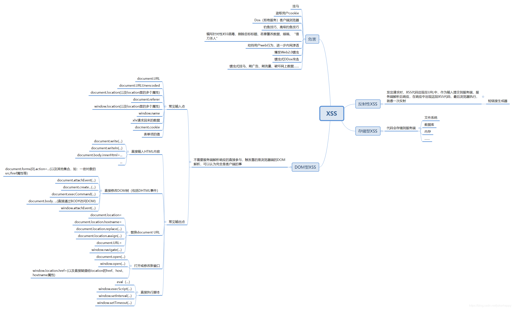
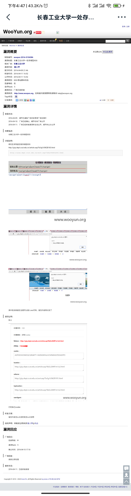

# PHP审计中的XSS后台敏感操作

<p align="center">
    
</p>

<p align="center">👴Speaking words of wisdom, let it be！</p>
<p align="center"><a href="http://music.163.com/song?id=1821591&userid=262256866"><font>《Let It Be》</font></a> </p>
<p align="center">专辑：Back in the World</p>
<p align="center">歌手：Paul McCartney</p>


- https://portswigger.net/web-security/cross-site-scripting/cheat-sheet
- https://web.archive.org/web/20120910161811/http://ha.ckers.org/xss.html
Burp官网的XSS备忘录

### 什么是跨站脚本

- 跨站脚本是一种经常出现在web应用程序中的计算机安全漏洞，是由于Web应用程序- - 对用户的输入过滤不足而产生的。后端接收参数时未经过滤，导致参数改变了HTML的结构。
- 为了区分css，所以简称为xss


**简单介绍XSS**



XSS的漏洞类型：
- 存储型XSS：
 反射型跨站脚本也称为非持久型，参数型跨站脚本。将恶意脚本附加到URL地址的参数中。说白了就是暂时的
  
- 反射性XSS
  持久性xss也就是存储型xss，简单的来说就是当用户访问存在存储型xss漏洞的时候可以直接触发。

- DOM型XSS
  不需要服务器端解析相应，而是靠浏览器端的DOM解析，完全是浏览器的事。


XSS形成的原因：
- 接受参数时未经过滤，导致参数改变了HTML的结构，将可攻击的代码放入原网站中，这份代码被浏览器执行后，将执行alert事件。


#### 反射型XSS挖掘

反射型XSS基本上都是通过URL传播的，那么就需要思考那些地方会存在反射型XSS，一般如搜索框，信息查询中，有些网站会将搜索的关键字在前台展示。


在可以控制输入变量的地方输入测试 `PayLoad`

```php
<?
1<b>1
>
```

```
<script>alert(1)</script>
```

此时网页的URL已经改变，使用靶场举例，URL的地址如下：


```
http://demo.testfire.net/search.jsp？query=%3Cscript%3Ealert%28%2Fxss%2F%29%3C%2Fscript%3E
```

此时XSS已经被触发，这种漏洞相对初级，浏览器开始自带XSS过滤器后，这种漏洞也越来越少。教难利用。


#### 存储型XSS挖掘

所谓存储型XSS就是将攻击代码存储在服务器中，因此只要找到对应的将信息存储在对应服务器上的接口即可。可以使用burp抓包绕过前端或者使用多代码拼接的方式进行攻击。

最常见的比如，留言板，个人信息修改邓，这些功能正是需要将参数存储起来并展示的地方。如果配合越权修改个人信息加存储型XSS还能打套组合拳。

- 案例：http://wy.zone.ci/bug_detail.php?wybug_id=wooyun-2016-0194386



进入留言板处，在内容和姓名中输入XSS代码。

案例中为最常见的方法，配合[XSS平台](https://xsshs.cn/xss.php?do=login)可以获取访问用户的Cookie等关键信息。

---

#### 审计中

**修复建议**
过滤，就嗯过滤。


**参考**
- https://segmentfault.com/a/1190000016095198
  
