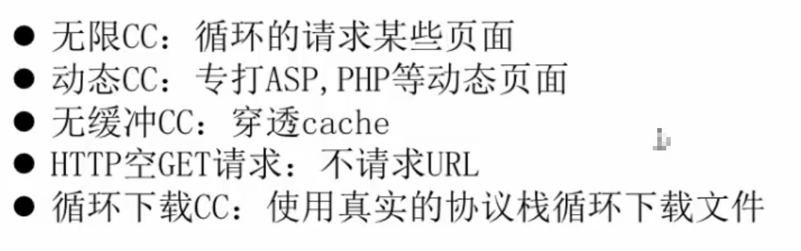
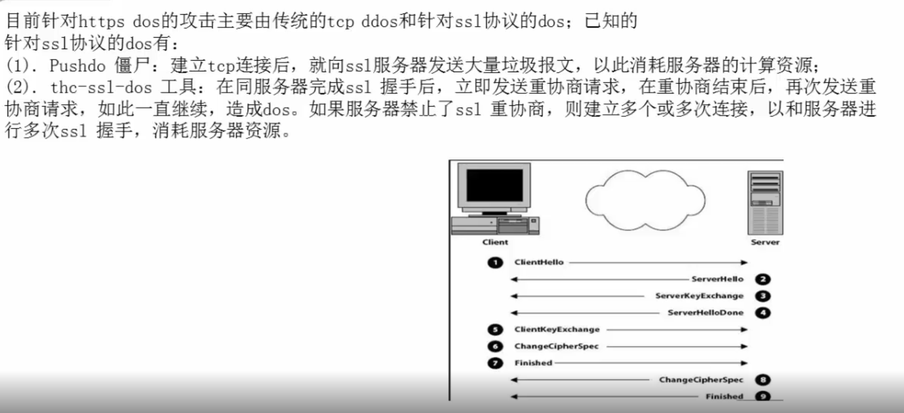

# DDoS

## ！防范

防范
1.    在Memcached服务器或者其上联的网络设备上配置防火墙策略，仅允许授权的业务IP地址访问Memcached服务器，拦截非法的访问。
2.    更改Memcached服务的监听端口为11211之外的其他大端口，避免针对默认端口的恶意利用。

3.    除非特殊必要，不开启Memcached UDP服务，最新版本的Memcached已经默认不开启UDP服务。

4.    升级到最新的Memcached软件版本，配置启用SASL认证等权限控制策略（在编译安装Memcached程序时添加-enable-sasl选项，并且在启动Memcached服务程序时添加-S参数，启用SASL认证机制以提升Memcached的安全性）。


## 什么是DDoS

>DDoS分两类 

## 带宽消耗型攻击

吧带宽消耗殆尽，然后让DNS服务器拒绝服务


## 资源消耗型攻击

后台资源，服务资源消耗干净

## 种类有：

><h2>SYN flood,UDP flood, ICMP flood.HTTP flood ,CC攻击</h2>


  
## Syn Flood攻击

  通过一个机器向服务器发送请求包，指向另外很多肉机IP,但是肉鸡IP不会相应，服务器会继续发确认包，这样会占用名额达到正常用户无法访问的结果

## DNS Flood

通过大量的缓存dns去请求一个ip地址使那个ip地址的服务或者服务器宕机停止服务

## HTTP flood





# DDoS攻击的手法和趋势分析

# SlowHTTPTest-慢速DoS攻击

## Slowhttptest是一个依赖于实际HTTP协议的Slow HTTP DoS攻击工具，

它的设计原理是要求服务器所有请求被完全接收后再进行处理。

SlowHTTPTest是一款对服务器进行慢攻击的测试软件，所谓的慢攻击就是相对于cc或者DDoS的快而言的，并不是只有量大速度快才能把服务器搞挂，使用慢攻击有时候也能到达同一效果。slowhttptest包含了之前几种慢攻击的攻击方式，包括slowloris, Slow HTTP POST, Slow Read attack等。那么这些慢攻击工具的原理就是想办法让服务器等待，当服务器在保持连接等待时，自然就消耗了资源。


## 防御 细说DDoS攻击

下面进入正题，说一下我遇到的各种DDoS攻击类型和一些缓解手段，还有防止李鬼，骗子，垃圾高防服务商的一些经验，以及教大家如何分辨高防服务的   

以便 真假和水分。

SYN Flood攻击和防御方式

老生常谈的一种DDoS攻击类型，`从早期的利用TCP三次握手原理，伪造的IP源`，以小博大，难以追踪，堪称经典的攻击类型。

大量的伪造源的`SYN攻击包进入服务器后`，系统会产生大量的SYN_RECV状态，最后    耗尽系统的SYN Backlog，导致服务器无法处理后续的TCP请求，导致服务器瘫痪。


就和上面的图片一样，服务器资源被耗尽，用户无法和服务器建立连接，攻击者目的达到。

那如何防御SYN Flood攻击呢(其实是缓解，提高一下系统的处理能力，但是只限于小攻击)？

## 方法1

软件防火墙和系统参数优化 (`适用于SYN Flood攻击流量小于服务器接入带宽，并且服务器性能足够`)

##【Windows系统: 可以修改注册表来提高SYN数据包的处理能力】

进入注册表的[HKEY_LOCAL_MACHINE\SYSTEM\CurrentControlSet\Services\Tcpip\Parameters]项目


1. 启用syn攻击防护模式 （可以显著提高Windows的SYN处理能力）

`SynAttackProtect=2 [dword]`

2. 加大TCP半开连接数的队列数量

`TcpMaxHalfOpen=10000 [dword]`

3. 启用动态Backlog队列长度

`EnableDynamicBacklog=1 [dword]`

通过修改这三处注册表信息可以防止一些小规模并且较为简单的SYN Flood攻击

## 【Linux系统: 修改sysctl内核参数提高SYN数据包的处理能力】

1. 开启SYN Cookies，当出现SYN等待队列溢出时，启用cookies来处理

`net.ipv4.tcp_syncookies = 1`

2. 增加SYN Backlog队列长度

`net.ipv4.tcp_max_syn_backlog = 65535`

3. iptables限制SYN频率，每秒钟只允许每个源IP发起2个SYN数据包，超出则丢弃
```
iptables -N syn-flood

iptables -A INPUT -p tcp –syn -j syn-flood

iptables -A syn-flood -p tcp -m limit –limit 2/s –limit-burst 50 -j RETURN

iptables -A syn-flood -j DROP
```

http://www.myh0st.cn/index.php/archives/152/

## 第一次握手：建立连接。

> 客户端发送连接请求报文段，将SYN位置为1，Sequence Number为x；然后，客户端进入SYN_SEND状态，等待服务器的确认；

>  第二次握手：服务器收到SYN报文段。服务器收到客户端的SYN报文段，需要对这个SYN报文段进行确认，设置Acknowledgment Number为x+1(Sequence Number+1)；同时，自己自己还要发送SYN请求信息，将SYN位置为1，Sequence Number为y；服务器端将上述所有信息放到一个报文段（即SYN+ACK报文段）中，一并发送给客户端，此时服务器进入SYN_RECV状态；

> 第三次握手：客户端收到服务器的SYN+ACK报文段。然后将Acknowledgment Number设置为y+1，向服务器发送ACK报文段，这个报文段发送完毕以后，客户端和服务器端都进入ESTABLISHED状态，完成TCP三次握手。 完成了三次握手，客户端和服务器端就可以开始传送数据。

想要了解更多关于tcp关于三次握手的技术细节，可以参看我朋友的公众号，有想学习java的也可以关注一下，传送门点我。
```

如果攻击者发送足够的SYN数据包，因为服务器的并发TCP连接数量有限所以会导致服务器没有更多的资源可用。 如果服务器达到限制，在现有的处于SYN-RCVD状态的连接超时之前则不能在建立新的连接，这就造成了拒绝服务攻击。
```
SYN洪水攻击测试工具，我们可以用hping3，下载地址：http://www.hping.org/hping3.html

命令：

1 简单例子： hping3 -S --flood -V -p TARGET_PORT TARGET_SITE

2 随机源IP： hping3 -c 20000 -d 120 -S -w 64 -p TARGET_PORT --flood --rand-source TARGET_SITE

UDP floods
UDP协议是无连接的传输层协议，提供面向事务的简单不可靠信息传送服务。

由于UDP协议是无连接性的，所以只要开了一个UDP的端口提供相关服务的话，那么就可针对相关的服务进行攻击。这种攻击的原理是通过伪造的IP向目标服务器发送大量的UDP数据包，服务器在接收到数据包后无法处理每一条请求，并且通过向服务器发送ICMP "destination unreachable"来消耗其带宽。

测试工具：

1 hping3 命令：hping3 --flood --rand-source --udp -p TARGET_PORT TARGET_IP

2 loic 下载地址： https://sourceforge.net/projects/loic/

TCP FIN Flood
这种FIM标志的数据包只有在TCP建立连接之后才会被接受，如果没有建立TCP连接，那么这个标志的数据包将会被简单的删除处理。

如果攻击者只是在没有建立TCP连接的情况下对服务器进行泛洪攻击，那么FIN数据包将会别丢弃，但是服务器还是会分配一些资源来查看数据包防止冗余。

这种攻击很容易被实现。

测试工具：hping3

命令：hping3 --flood --rand-source -F -p TARGET_PORT TARGET_IP

TCP RST Flood
TCP中的RST包的意思是立即断开连接，当连接出错需要停止掉的时候非常有用。

如果攻击者能够以某种方式查看从源到目的地的流量，则可以发送具有适当值的RST报文（源IP，目的IP，源端口，目的端口，序列号等），该报文将断开源和目的地之间的TCP连接。 这也是一种拒绝服务的方式。

RST泛洪的测试工具也是hping3

命令：hping3 --flood --rand-source -R -p TARGET_PORT TARGET_IP

PUSH and ACK Flood
通过大量的PUSH和ACK泛洪可以是服务器停止对正常用户的请求进行响应。

测试工具：hping3 和 LOIC

命令：hping3 --flood --rand-source -PA -p TARGET_PORT TARGET_IP

ICMP and IGMP Floods
ICMP（Internet Control Message Protocol--Internet控制消息协议）和IGMP（Internet Group Management Protocol--Internet组管理协议）是网络层的协议类似于UDP。ICMP递送状态消息，错误报告，回答某些请求，报告路由信息，并且常用于测试网络的连通性和排查问题。IGMP是IP网络上的系统和相邻路由用来建立和维护多播组成员关系的协议。

ICMP and IGMP Floods类似于UDP不需要任何漏洞，只需要发送大量的ICMP或IGMP数据包，在处理每一个数据包的时候资源消耗殆尽导致拒绝服务。

测试工具：hping3

命令：hping3 --flood --rand-source -1 -p TARGET_PORT TARGET_IP


