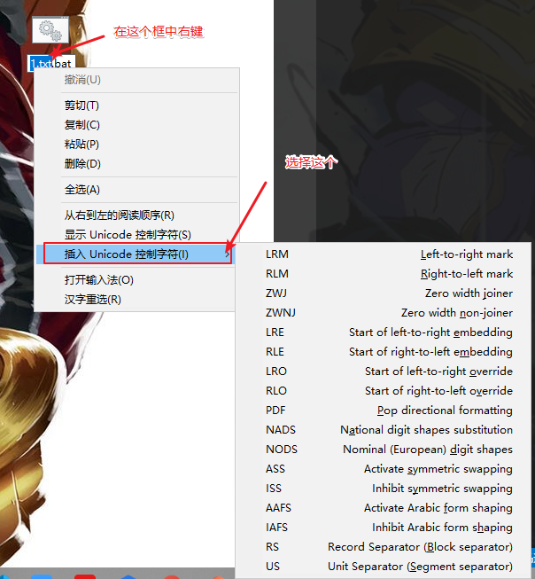

# 1.木马逆名欺骗：利用unicode控制符RLO

https://blog.csdn.net/kencaber/article/details/50649606

## 首先Windows系统在解析文件名时，当遇到`unicode控制符时`，`会改变文件名的显示方式。`

列如：

创建一个bat文件，`命名为txt.bat。`然后点击重命名，在文件名输入框中首先右键点击“`插入unicode控制字符`”，插入一个RLO（从右到左显示），然后输入txt.bat，回车，此时文件名已经显示为tab.txt。将这个文件发给其他用户，由于文件后缀为txt，一般用户会当做文本文件放心的打开，此时bat文件已经执行。

这个方法非常简单，但思路却相当巧妙，效果也相当实用。

然鹅这种方式只能骗骗用户，`骗不了杀毒软件。`

